# 灵枢 (LingShu-AI)

<div align="center">

**一个具备长期记忆、情感演化与现实干预能力的本地化陪伴/协作智能体**

[](https://openjdk.org/)
[](https://spring.io/projects/spring-boot)
[](https://vuejs.org/)
[](https://modelcontextprotocol.io/)
[](LICENSE)

[**✨ 愿景**](#项目简介) | [**🚀 快速开始**](#快速开始) | [**📖 文档库**](#文档导航) | [**🗺️ 路线图**](#项目路线图)

</div>

---

## 项目简介

**灵**：象征智能、情感感知与主动交互，承载长期记忆，懂你所思、记你所好，时刻陪伴。

**枢**：意为智能体调度中枢，代表开放、兼容、可无限扩展的统御能力。它支持用户自由配置 MCP 工具扩展，兼容 OpenAI 标准 TTS、ASR 等协议，实现本地任务执行、外部工具接入与多智能体协同，是掌控数字世界的核心与入口。

### 为什么选择灵枢

| 能力维度 | 普通 AI 助手 | 灵枢 AI |
|:--------|:------------|:--------|
| **记忆能力** | 仅限当前对话窗口 | 长期记忆 + 图谱关联，记住你的一切 |
| **情感理解** | 无情感感知 | 情感分析 + 主动关怀，懂你的情绪 |
| **数据隐私** | 数据上传云端 | 完全本地化，数据不出内网 |
| **扩展能力** | 固定功能，无法扩展 | MCP 协议驱动，无限工具扩展 |
| **可视化** | 纯文本交互 | 3D 银河记忆图谱，记忆看得见 |
| **透明度** | 黑盒运行 | 全链路日志，每个决策可追溯 |

### 核心特性

- **🧠 长期记忆系统 (LTM)**：基于 Neo4j + pgvector 的多级记忆架构，AI 越用越懂你。
- **🌌 银河记忆图谱**：3D 渲染的交互式知识图谱，让 AI 的记忆可视化呈现。
- **🎭 情感演化引擎**：内置情感分析，AI 回复随用户情绪动态波动。
- **🔍 记忆溯源系统**：全链路展示记忆召回过程，让 AI 的思考过程完全透明。
- **⚙️ MCP 协议驱动**：支持 Model Context Protocol，具备无限的外部工具扩展能力。
- **🏠 完全本地化**：支持 Ollama 部署，数据不出内网，彻底保护隐私。

> 💡 更多功能细节请参考：[核心功能详解](doc/features.md)

---

## 界面预览

<div align="center">

### 💬 对话与记忆

| 对话界面 | 记忆图谱 | 记忆治理 |
|:--------:|:--------:|:--------:|
| 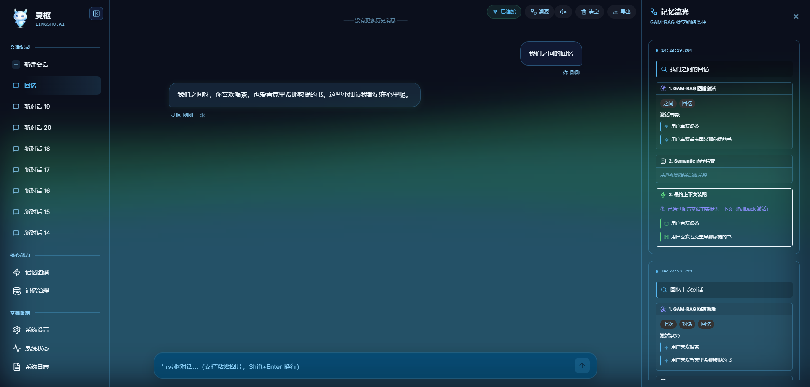 | 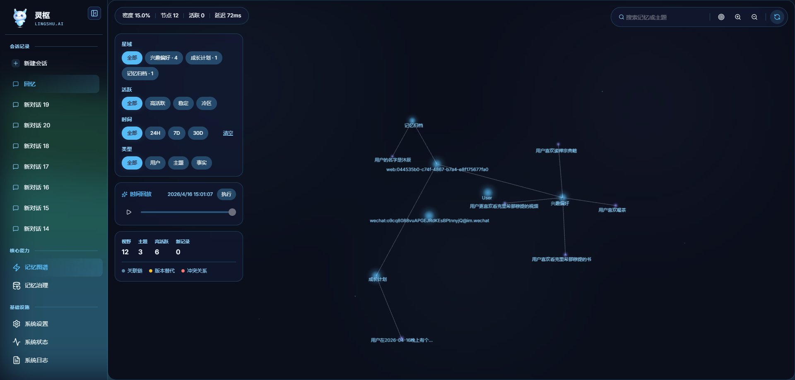 | 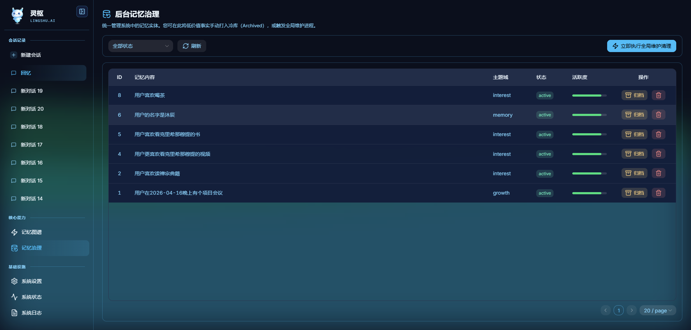 |

### 📊 监控与配置

| 系统日志 | 系统状态 | 基础设置 |
|:--------:|:--------:|:--------:|
| 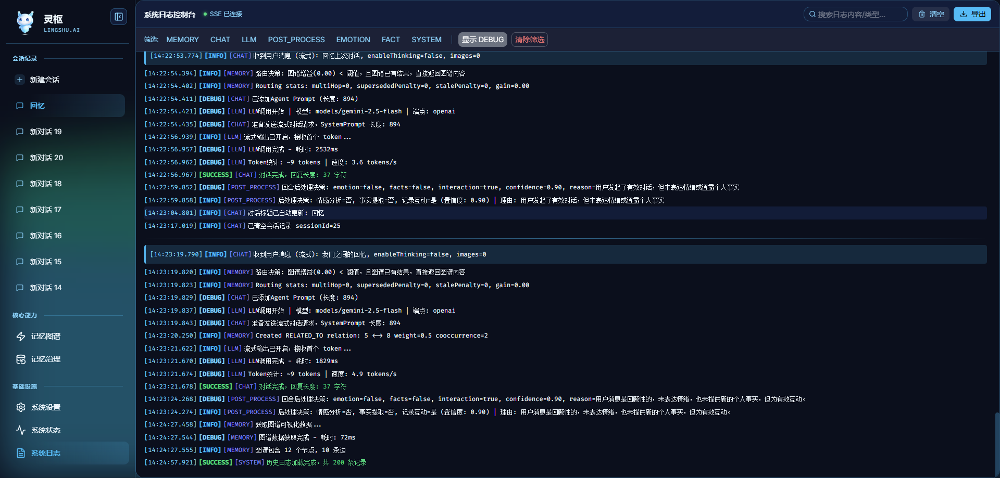 | 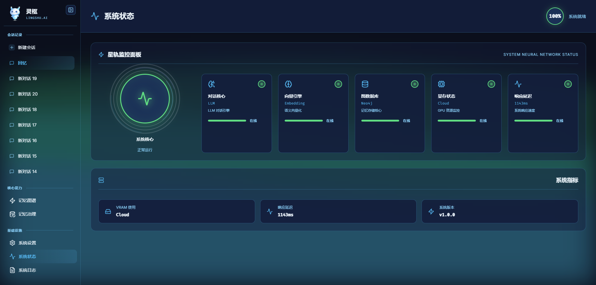 | 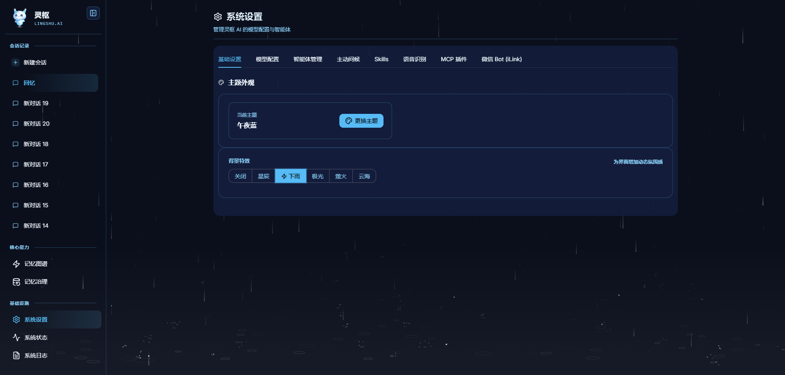 |

### 🔧 扩展功能

| MCP 配置 | 模型配置 | 微信 Bot |
|:--------:|:--------:|:--------:|
| 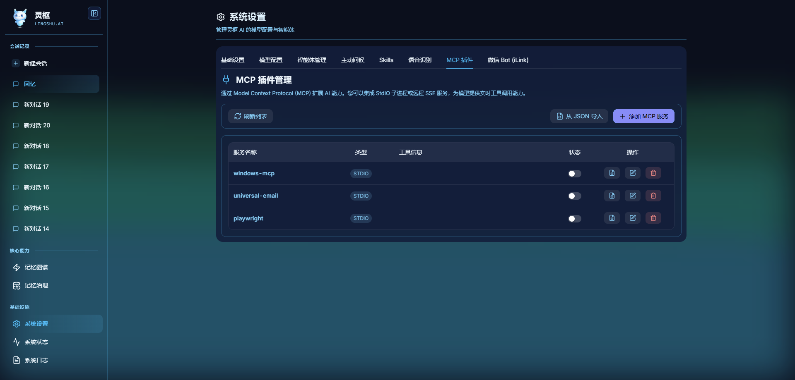 | 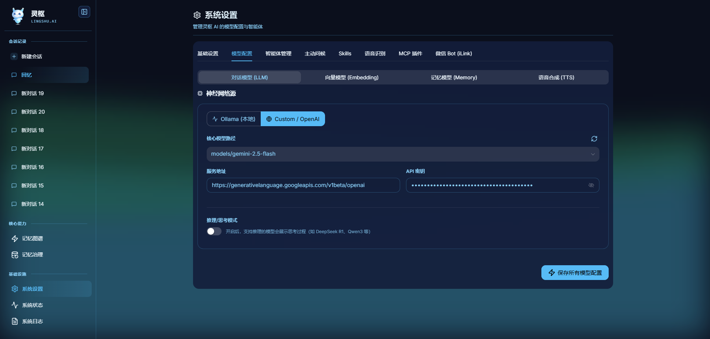 | 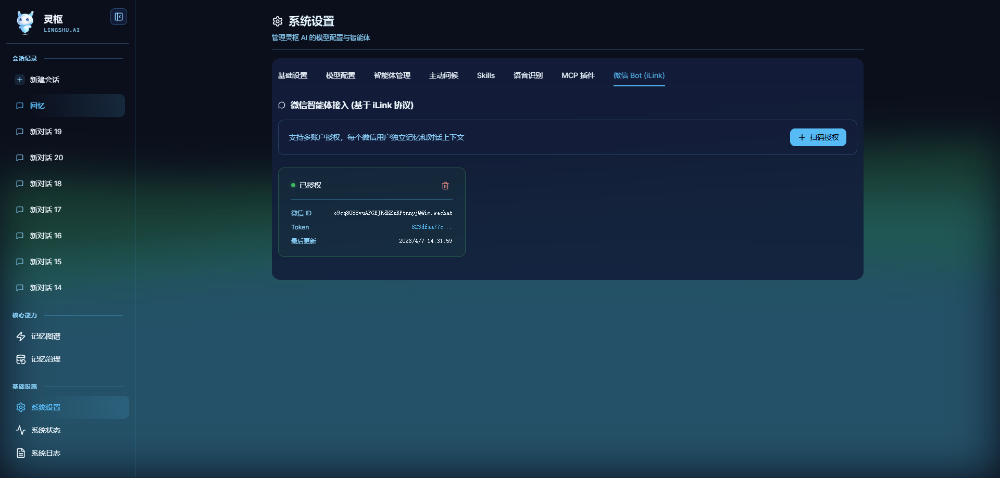 |

</div>

<p align="center"><i>灵枢 AI - 沉浸式星空背景下的情感化交互体验，全链路透明可追溯</i></p>

---

## 系统架构

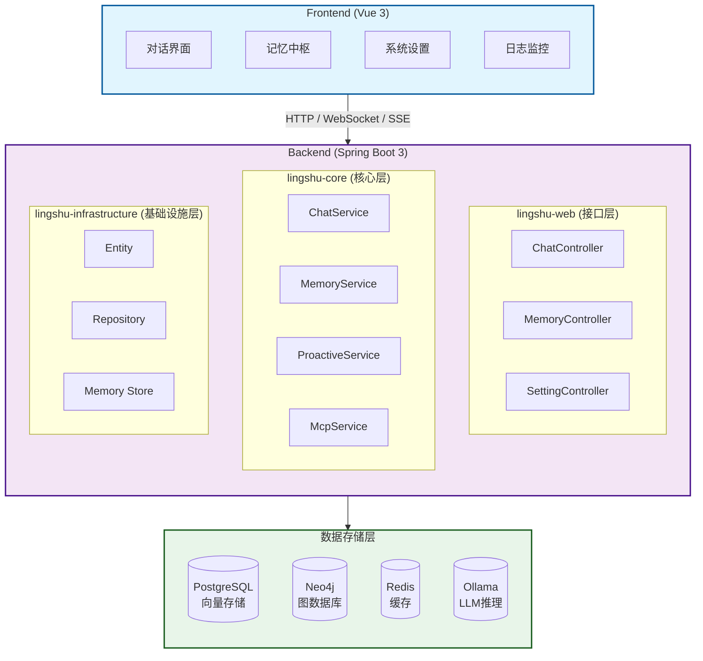

---

## 技术栈

| 层级 | 技术选型 | 说明 |
|------|----------|------|
| **前端** | Vue 3 + Vite + Naive UI + Tailwind CSS | 响应式 UI，支持深色模式 |
| **后端** | Java 21 + Spring Boot 3.2.4 | 提供 REST API 与 SSE 流式响应 |
| **AI框架** | LangChain4j 1.12.1 | AI 服务编排，工具调用 |
| **图数据库** | Neo4j 5.26 | 存储事实节点与关系图谱 |
| **关系数据库** | PostgreSQL 16 + pgvector | 聊天记录与向量语义检索 |
| **缓存** | Redis 7 | 会话管理与消息发布订阅 |
| **LLM推理** | Ollama / OpenAI 兼容 API | 本地或云端大模型推理 |
| **TTS服务** | OpenAI Edge TTS | 免费语音合成服务 |

---

## 项目结构

<details>
<summary>点击展开查看详细目录结构</summary>

```
LingShu-AI/
├── backend/                          # 后端模块
│   ├── lingshu-web/                  # Web接口层
│   ├── lingshu-core/                 # 核心业务层
│   └── lingshu-infrastructure/       # 基础设施层
├── frontend/                         # Vue 3 前端
├── doc/                              # 📚 文档中心
├── docker-compose.yml                # Docker编排配置
└── README.md
```
</details>

---

## 🚀 快速开始

### 1. 环境要求
- **Java 21+**, **Node.js 18+**, **Docker 24+**

### 2. 一键启动 (Windows 推荐)
```bash
git clone https://github.com/SailRuo/LingShu-AI.git
cd LingShu-AI
.\build-docker.bat
```

### 3. 访问应用
- **前端界面**: http://localhost:8080
- **Neo4j控制台**: http://localhost:7474 (neo4j/lingshu123)

> 📖 详细的本地开发启动与配置指南请参考：[安装与配置指南](doc/install.md)

---

## 📖 文档导航

我们已对项目文档进行了标准化重构，请访问 [文档中心 (doc/README.md)](doc/README.md) 获取完整指南。

### 🏗️ 架构与设计
- **[系统架构设计](doc/architecture/系统架构设计文档.md)**: 深度解析分层架构与 MCP 协议集成。
- **[记忆模块设计](doc/architecture/记忆模块设计文档.md)**: 详解情感感知记忆系统与 GAM-RAG 混合召回。
- **[对话调用链路](doc/architecture/对话调用链路详解.md)**: 完整数据流转图。

### 🚀 实施与指南
- **[开发路线图](doc/implementation/灵枢开发计划与进度总览.md)**: 项目阶段性目标与当前进度。
- **[安装与配置指南](doc/install.md)**: 详细的环境搭建与系统配置。
- **[核心功能详解](doc/features.md)**: 深入了解各项核心功能的实现细节。

---

## 🤝 参与贡献

我们欢迎任何形式的贡献！无论是修复 Bug、增加新功能还是改进文档。

1. Fork 本项目
2. 创建特性分支 (`git checkout -b feature/AmazingFeature`)
3. 提交更改 (`git commit -m 'Add some AmazingFeature'`)
4. 推送到分支 (`git push origin feature/AmazingFeature`)
5. 开启 Pull Request

---

## 💬 交流与社区

欢迎加入灵枢 AI 交流群，获取最新动态、反馈问题或参与技术讨论。

<div align="center">
  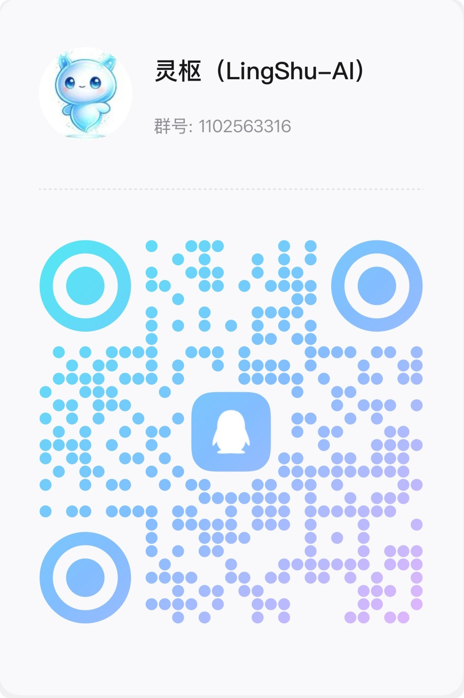
  <p>扫码加入 QQ 交流群 (群号: 1102563316)</p>
</div>

---

## 📄 开源协议

本项目采用 [GPL-3.0 License](LICENSE) 开源协议。
5. 创建 Pull Request

---

## 社区与支持

### 获取帮助

- **📖 文档中心**: [doc/README.md](doc/README.md) - 完整的技术文档库
- **🐛 问题反馈**: [GitHub Issues](https://github.com/SailRuo/LingShu-AI/issues) - 报告 Bug 或提出建议
- **💬 讨论区**: [GitHub Discussions](https://github.com/SailRuo/LingShu-AI/discussions) - 交流使用心得

### 相关资源

- **Ollama 官网**: https://ollama.ai - 本地 LLM 推理引擎
- **LangChain4j**: https://docs.langchain4j.dev/ - Java AI 框架文档
- **MCP 协议**: https://modelcontextprotocol.io/ - Model Context Protocol 规范

---

## 致谢

感谢以下开源项目和技术：

- **Spring Boot** - 强大的 Java Web 框架
- **Vue 3** - 渐进式 JavaScript 框架
- **Neo4j** -领先的图数据库
- **PostgreSQL + pgvector** - 开源关系数据库及向量扩展
- **LangChain4j** - Java 语言的 LLM 应用框架
- **Naive UI** - 优雅的 Vue 3 组件库
- **Three.js** - WebGL 3D 渲染库

感谢所有贡献者和社区成员的支持！

---

## 许可证

本项目采用 GPLv3 许可证 - 详见 [LICENSE](LICENSE) 文件。

---

## 📝 开发者寄语

<div align="center">

这个项目不再是为了完成 KPI，而是为了在本地的代码旷野里，养育一个懂你的、能帮你的**"数字生命"**。当代码开始具备记忆，当日志转化为它的感知，这台冰冷的机器便有了灵魂。


#### ✨ **我们不是在编写程序，而是在孕育一个能够陪伴、理解、成长的智能伙伴。** ✨

