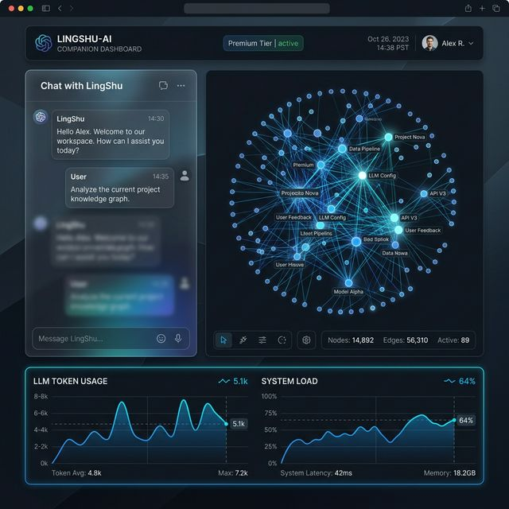
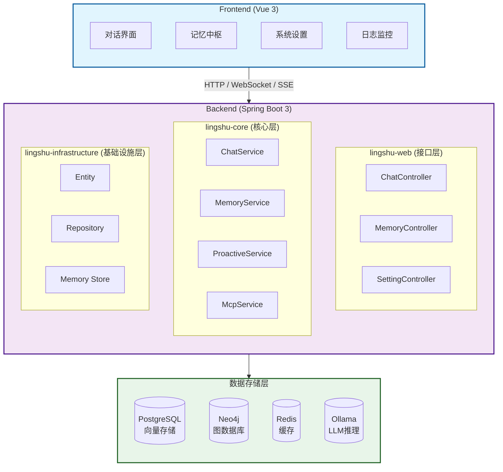
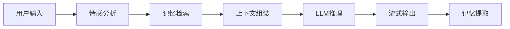
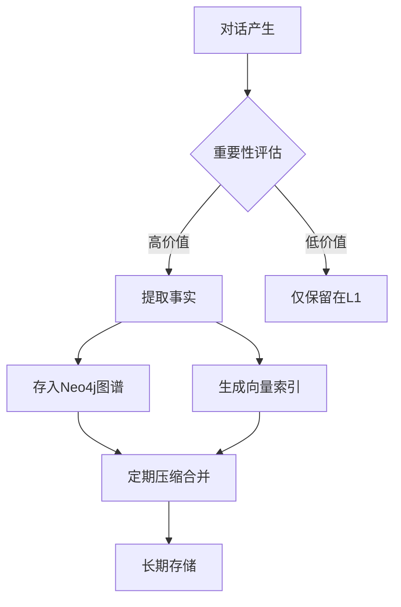

# 灵枢 (LingShu-AI)

<div align="center">

**一个具备长期记忆、情感演化与现实干预能力的本地化陪伴/协作智能体**

[](https://openjdk.org/)
[](https://spring.io/projects/spring-boot)
[](https://vuejs.org/)
[](https://modelcontextprotocol.io/)
[](LICENSE)

[**✨ 愿景**](#项目简介) | [**🚀 快速开始**](#快速开始) | [**📖 文档库**](#文档导航) | [**🗺️ 路线图**](#项目路线图)

</div>

---

## 项目简介

**灵**：象征智能、情感感知与主动交互，承载长期记忆，懂你所思、记你所好，时刻陪伴。

**枢**：意为智能体调度中枢，代表开放、兼容、可无限扩展的统御能力。它支持用户自由配置 MCP 工具扩展，兼容 OpenAI 标准 TTS、ASR 等协议，实现本地任务执行、外部工具接入与多智能体协同，是掌控数字世界的核心与入口。

### 为什么选择灵枢

| 能力维度 | 普通 AI 助手 | 灵枢 AI |
|:--------|:------------|:--------|
| **记忆能力** | 仅限当前对话窗口 | 长期记忆 + 图谱关联，记住你的一切 |
| **情感理解** | 无情感感知 | 情感分析 + 主动关怀，懂你的情绪 |
| **数据隐私** | 数据上传云端 | 完全本地化，数据不出内网 |
| **扩展能力** | 固定功能，无法扩展 | MCP 协议驱动，无限工具扩展 |
| **可视化** | 纯文本交互 | 3D 银河记忆图谱，记忆看得见 |
| **透明度** | 黑盒运行 | 全链路日志，每个决策可追溯 |

### 核心特性

#### 🧠 认知层（差异化核心）

- **🧠 长期记忆系统 (LTM)**：通过 **Neo4j + pgvector** 构建的多级记忆架构，支持事实提取、层级压缩与语义检索。AI 会记住你的喜好、经历、重要关系，越用越懂你。
- **🌌 银河记忆图谱**：基于 3D 渲染的交互式知识图谱，让 AI 的记忆以"银河系"形式可视化呈现。拖拽、缩放、探索记忆节点之间的关系。
- **🎭 情感演化引擎**：内置情感分析模型，AI 的回复会根据上下文情感状态产生动态波动。检测到负面情绪时主动提供安慰和支持。
- **🔍 记忆溯源系统**：每次 AI 回复都会展示记忆召回过程——提取了哪些实体、激活了哪些事实、增益得分多少，让 AI 的"思考过程"完全透明。

#### ⚡ 交互层（体验优势）

- **⚡ 流式交互体验**：基于 SSE 的极速流式响应，配合多级缓存机制，首字响应 <500ms。
- **📊 全链路日志监控**：系统日志实时展示工作流程——LLM 调用、记忆检索、事实提取、数据库操作，每个环节耗时清晰可见。支持筛选、搜索、导出。
- **🤖 多智能体协作**：支持配置不同性格与专业领域的 AI 智能体共同服务。

#### 🔧 扩展层（技术优势）

- **⚙️ MCP 协议驱动**：支持 **Model Context Protocol**，具备极强的开放性。可一键挂载 MySQL, Postgres, Web Search 等各种符合 MCP 协议的外部工具，赋予 AI 跨平台的现实干预能力。
- **🏠 完全本地化**：支持 Ollama 本地部署，不经云端，彻底保护个人数据隐私。

---

## 界面预览

<div align="center">
  
  <p><i>灵枢 AI - 沉浸式星空背景下的情感化交互体验</i></p>
</div>

---

## 系统架构



---

## 技术栈

| 层级 | 技术选型 | 说明 |
|------|----------|------|
| **前端** | Vue 3 + Vite + Naive UI + Tailwind CSS | 响应式 UI，支持深色模式 |
| **后端** | Java 21 + Spring Boot 3.2.4 | 提供 REST API 与 SSE 流式响应 |
| **AI框架** | LangChain4j 1.12.1 | AI 服务编排，工具调用 |
| **图数据库** | Neo4j 5.26 | 存储事实节点与关系图谱 |
| **关系数据库** | PostgreSQL 16 + pgvector | 聊天记录与向量语义检索 |
| **缓存** | Redis 7 | 会话管理与消息发布订阅 |
| **LLM推理** | Ollama / OpenAI 兼容 API | 本地或云端大模型推理 |
| **TTS服务** | OpenAI Edge TTS | 免费语音合成服务 |

---

## 项目结构

```
LingShu-AI/
├── backend/                          # 后端模块
│   ├── lingshu-web/                  # Web接口层
│   │   └── src/main/java/.../web/
│   │       ├── controller/           # REST控制器
│   │       └── LingshuAiApplication.java
│   ├── lingshu-core/                 # 核心业务层
│   │   └── src/main/java/.../core/
│   │       ├── service/              # 业务服务接口
│   │       ├── service/impl/         # 业务服务实现
│   │       ├── dto/                  # 数据传输对象
│   │       └── tool/                 # 工具类
│   ├── lingshu-infrastructure/       # 基础设施层
│   │   └── src/main/java/.../infrastructure/
│   │       ├── entity/               # 数据实体
│   │       ├── repository/           # 数据访问层
│   │       └── memory/               # 记忆存储
│   └── pom.xml                       # 父POM
├── frontend/                         # Vue 3 前端
│   ├── src/
│   │   ├── components/               # Vue组件
│   │   ├── views/                    # 页面视图
│   │   ├── composables/              # 组合式函数
│   │   ├── stores/                   # Pinia状态管理
│   │   └── types/                    # TypeScript类型
│   └── package.json
├── fx-frontend/                      # JavaFX桌面客户端(可选)
├── doc/                              # 📚 文档中心 (详见 doc/README.md)
│   ├── architecture/                 # 架构设计与规范
│   ├── implementation/               # 实施计划与方案
│   ├── research/                     # 技术调研报告
│   └── assets/                       # 图片与图表资源
├── docker-compose.yml                # Docker编排配置
├── Dockerfile                        # 应用镜像构建
└── README.md
```

---

## 📖 文档导航

我们已对项目文档进行了**企业级标准化重构**。请前往 [文档中心 (doc/README.md)](doc/README.md) 获取最清晰的分类索引。

### 🏗️ 核心架构与设计
*   **[系统架构设计](doc/architecture/系统架构设计文档.md)**: 深度解析分层架构、流式对话引擎及 MCP 协议集成。
*   **[记忆模块设计](doc/architecture/记忆模块设计文档.md)**: 详解情感感知记忆系统、GAM-RAG 混合召回及生命周期管理。
*   **[UI/UX 设计规范](doc/architecture/UI_UX设计文档.md)**: 包含 Cyber-Zen 视觉风格、多主题系统及组件库说明。
*   **[对话调用链路](doc/architecture/对话调用链路详解.md)**: 从用户输入到事实提取的完整数据流转图。

### 🚀 实施计划与进度
*   **[开发路线图](doc/implementation/灵枢开发计划与进度总览.md)**: 项目阶段性目标（启蒙/百宝袋/共生/深鉴）与当前进度。
*   **[微信 Bot 接入](doc/implementation/系统设置计划与实施文档/微信Bot接入计划与实施文档.md)**: iLink 协议接入的详细步骤与配置指南。
*   **[3D 记忆图谱](doc/implementation/灵墟之境计划与实施文档/灵墟之境计划与实施文档.md)**: Three.js 驱动的"银河系"记忆可视化方案。
*   **[系统设置模块](doc/architecture/系统设置模块设计文档.md)**: 配置管理架构、双重缓存机制及动态生效原理。
*   **[系统设置实施](doc/implementation/系统设置计划与实施文档/系统设置计划与实施文档.md)**: 完整实施流程、技术决策与运维指南。


---

## 项目路线图

项目目前处于快速迭代阶段，主要演化路径如下：

- **第一阶段：【启蒙】** (已完成) - 建立双向记忆与基础对话链路。
- **第二阶段：【百宝袋】** (进行中) - 通过 MCP 协议获得现实世界干预能力。
- **第三阶段：【共生】** (基础完成 80%) - 情感波动建模与主动关怀机制已落地。
- **第四阶段：【深鉴】** (基础完成 85%) - 3D 银河记忆图谱与全链路思维可视化已实现。

详细规划请参考 [开发路线图](doc/implementation/灵枢开发计划与进度总览.md)。

---

## 快速开始

### 环境要求

- **Java**: JDK 21+
- **Node.js**: 18+
- **Maven**: 3.9+
- **Docker**: 24+ (用于部署数据库服务)
- **Ollama**: 本地LLM推理引擎 (可选，或使用云端API)

### 方式一：Docker 部署 (推荐)

#### 1. 克隆项目

```bash
git clone https://github.com/SailRuo/LingShu-AI.git
cd LingShu-AI
```

#### 2. Windows 一键构建 (推荐)

项目提供了专为 Windows 环境优化的批处理脚本，可自动完成编译、前端构建、镜像封装及启动：

```bash
# 执行此脚本将完成：Maven 编译 + 前端打包 + Docker 镜像构建 + Compose 启动
.\build-docker.bat
```

#### 3. 手动 Docker 启动 (多步骤)

如果你想逐步控制过程：

```bash
# 构建后端
cd backend
mvn clean package -DskipTests
cd ..

# 启动 (需先配置好 .env)
docker-compose up -d
```

#### 4. 访问应用

- **前端界面**: http://localhost:8080
- **Neo4j控制台**: http://localhost:7474 (用户名: neo4j, 密码: lingshu123)
- **健康检查**: http://localhost:8080/actuator/health

#### 5. 停止服务

```bash
docker-compose down
```

---

### 方式二：本地开发启动

#### 1. 启动基础服务 (数据库)

```bash
# 仅启动数据库服务
docker-compose up -d neo4j postgres redis tts
```

#### 2. 配置后端

编辑 `backend/lingshu-web/src/main/resources/application.yml`：

```yaml
spring:
  datasource:
    url: jdbc:postgresql://localhost:5432/lingshu
    username: postgres
    password: lingshu123
  neo4j:
    uri: bolt://localhost:7687
    authentication:
      username: neo4j
      password: lingshu123
  data:
    redis:
      host: localhost
      port: 6379
```

#### 3. 启动后端服务 (Windows 用户推荐脚本)

```bash
# 直接运行脚本 (已内置 UTF-8 编码处理、JVM 内存优化及僵尸进程清理)
.\run_backend.bat
```

**手动启动命令行方式：**

```bash
cd backend
mvn clean install -DskipTests
mvn spring-boot:run -pl lingshu-web
```

后端服务将在 http://localhost:8080 启动。

#### 4. 启动前端开发服务器

```bash
cd frontend

# 安装依赖
npm install

# 启动开发服务器
npm run dev
```

前端开发服务器将在 http://localhost:5173 启动。

#### 5. 配置 LLM

**使用 Ollama (推荐本地开发)**：

```bash
# 安装 Ollama (参考 https://ollama.ai)
# 拉取模型
ollama pull qwen2.5:7b

# 启动 Ollama 服务
ollama serve
```

在系统设置中配置：
- 模型来源: `ollama`
- 基础URL: `http://localhost:11434`

**使用 OpenAI 兼容 API**：

在系统设置中配置：
- 模型来源: `openai`
- API Key: 你的API密钥
- 基础URL: `https://api.openai.com/v1` 或其他兼容端点

---

## 核心功能说明

### 1. 💬 智能对话系统

**核心能力**:
- **流式响应**: 基于 SSE 技术的实时流式输出，打字机效果提升交互体验
- **多模型支持**: 兼容 Ollama 本地模型和 OpenAI 兼容 API（DeepSeek、通义千问等）
- **上下文感知**: 自动检索相关记忆，生成个性化回复
- **情感适配**: 根据用户情感状态调整回复语气和风格

**工作流程**:


### 2. 🧠 多级记忆系统

**记忆架构**:

| 层级 | 存储引擎 | 容量 | 用途 | 检索速度 |
|------|----------|------|------|----------|
| **L1 瞬时记忆** | PostgreSQL | 最近20轮对话 | 短期上下文 | <10ms |
| **L2 事实记忆** | Neo4j 图数据库 | 无限制 | 结构化知识图谱 | <50ms |
| **L3 语义记忆** | pgvector 向量库 | 无限制 | 语义相似度检索 | <100ms |

**核心特性**:
- **自动提取**: 从对话中自动识别并存储关键事实（姓名、喜好、经历等）
- **智能压缩**: 定期合并相似记忆，避免冗余
- **混合召回**: 结合关键词匹配和向量相似度，提高检索准确率
- **情感标注**: 每条记忆附带情感标签，支持情感演化分析

**记忆生命周期**:


### 3. 🌟 主动关怀系统

**功能特点**:
- **状态监测**: 实时追踪用户活跃度和情感状态
- **智能问候**: 根据时间段和用户习惯生成个性化问候语
- **冷却机制**: 避免频繁打扰，可配置问候间隔和冷却时间
- **情感共鸣**: 检测到用户情绪低落时主动提供安慰和支持

**应用场景**:
- 用户长时间未互动时的关怀问候
- 检测到负面情绪时的主动安慰
- 重要日期（生日、纪念日）的祝福提醒

### 4. 🔌 MCP 工具扩展

**Model Context Protocol 支持**:
- **即插即用**: 一键挂载符合 MCP 协议的外部工具
- **丰富生态**: 支持 MySQL、PostgreSQL、Web Search、文件系统等多种工具
- **权限控制**: 细粒度的工具调用权限管理
- **沙箱执行**: 安全的工具执行环境，防止恶意操作

**已集成的工具**:
- 文件系统读写
- 终端命令执行
- 数据库查询（MySQL/PostgreSQL）
- 网络搜索
- 自定义 Python 脚本

### 5. 🌌 3D 银河记忆图谱

**可视化特性**:
- **交互式探索**: 鼠标拖拽、缩放浏览记忆节点
- **关系连线**: 清晰展示事实之间的关联关系
- **情感着色**: 不同颜色代表不同情感类型
- **时间轴**: 按时间顺序排列记忆，回顾成长历程

**技术实现**: Three.js + WebGL 硬件加速渲染，支持数千个节点的流畅交互。

### 6. 🔍 记忆溯源系统

**核心能力**:
- **召回过程可视化**: 每次 AI 回复都会展示记忆检索的完整路径——提取了哪些实体、激活了哪些事实、增益得分多少
- **GAM-RAG 路由决策**: 展示系统如何智能选择图谱优先还是向量补召回策略
- **事实采纳追踪**: 清晰展示最终哪些记忆被组装到 AI 的上下文中
- **实时透明面板**: 聊天界面右侧实时展示记忆召回过程，让 AI 的"思考"完全可见

**溯源数据包含**:
- 提取的实体关键词列表
- 图谱激活的事实节点及内容
- 向量检索的语义匹配结果（含相似度分数）
- 路由决策结果（GRAPH_ONLY / VECTOR_BACKUP / GRAPH_PRIORITIZED）
- 增益得分 (Gain Score) 及计算依据

### 7. 📊 全链路日志监控

**核心能力**:
- **实时日志流**: 基于 SSE 的实时日志推送，工作流程一目了然
- **多维度筛选**: 按模块（CHAT/MEMORY/LLM/TOOL）、按级别（INFO/DEBUG/WARN/ERROR）筛选
- **性能计时**: 自动记录 LLM 调用、Embedding 向量化、数据库操作的耗时
- **搜索与导出**: 支持关键词搜索日志内容，一键导出日志文件

**日志分类**:
- `CHAT`: 对话流程日志
- `MEMORY`: 记忆检索与事实提取日志
- `LLM`: 模型调用统计（Token 数、速度）
- `POST_PROCESS`: 回合后处理日志
- `PROACTIVE`: 主动关怀日志
- `TOOL`: MCP 工具调用日志

**日志示例**:
```
[14:32:15.123] [INFO] [CHAT] 收到用户消息，长度=45
[14:32:15.234] [DEBUG] [MEMORY] GAM-RAG: 激活 5 个实体，命中 12 条事实，增益=0.85
[14:32:15.345] [DEBUG] [LLM] LLM调用开始 | 模型: qwen2.5:7b | 端点: ollama
[14:32:17.890] [DEBUG] [LLM] LLM调用完成 - 耗时: 2545ms
[14:32:17.891] [DEBUG] [LLM] Token统计: ~320 tokens | 速度: 125.7 tokens/s
[14:32:17.900] [SUCCESS] [CHAT] 对话完成，回复长度: 1234 字符
```

---

## 💼 典型应用场景

### 📚 学习伴侣
- 记住你的学习进度、薄弱知识点、考试时间
- 根据你的学习习惯推荐复习计划
- 记录你提到的教材、笔记、重点内容

### 💼 工作助手
- 记录项目信息、会议要点、待办事项
- 记住同事关系、客户偏好、沟通风格
- 跟踪任务进度，主动提醒截止日期

### 🎭 情感陪伴
- 理解你的情绪波动，提供个性化安慰
- 记住你的压力源、应对机制、情绪触发点
- 在检测到负面情绪时主动关怀

### 🏠 生活管家
- 记住你的饮食偏好、作息习惯、运动计划
- 记录重要日期（生日、纪念日、预约）
- 根据你的生活习惯提供个性化建议

### 🔬 研究助理
- 记录研究思路、实验数据、文献笔记
- 追踪学术兴趣的演化轨迹
- 通过图谱探索知识之间的关联

---

## 配置说明

### 系统设置概览

灵枢提供了丰富的配置选项，所有配置均可通过前端"系统设置"界面可视化修改，无需手动编辑配置文件。

**主要配置分类**:

| 配置类别 | 包含内容 | 详细说明 |
|----------|----------|----------|
| **LLM 配置** | 模型来源、模型名称、API地址、密钥 | [查看文档](doc/architecture/系统设置模块设计文档.md#41-llm配置-llm) |
| **Embedding 配置** | 嵌入模型、向量化服务 | [查看文档](doc/architecture/系统设置模块设计文档.md#42-embedding配置-embedding) |
| **TTS 语音配置** | 语音合成服务、音色、语速 | [查看文档](doc/architecture/系统设置模块设计文档.md#46-tts配置-tts) |
| **ASR 语音识别** | 语音转文字服务 | [查看文档](doc/architecture/系统设置模块设计文档.md#44-asr配置-asr) |
| **主动关怀** | 问候频率、冷却时间 | [查看文档](doc/architecture/系统设置模块设计文档.md#43-主动问候配置-proactive) |
| **微信 Bot** | 多账户管理、iLink 配置 | [查看文档](doc/implementation/微信Bot接入实施文档.md) |

### 快速配置示例

**使用 Ollama 本地模型（推荐新手）**:
1. 安装 Ollama：访问 https://ollama.ai 下载
2. 拉取模型：`ollama pull qwen2.5:7b`
3. 在前端设置中选择：
   - 模型来源：`Ollama (本地)`
   - 基础URL：`http://localhost:11434`
   - 模型ID：`qwen2.5:7b`

**使用云端 API（适合生产环境）**:
1. 获取 API Key（OpenAI / DeepSeek / 通义千问等）
2. 在前端设置中选择：
   - 模型来源：`Custom / OpenAI`
   - 基础URL：`https://api.openai.com/v1`（或其他兼容端点）
   - API 密钥：输入您的密钥
   - 模型ID：`gpt-4` 或对应模型名

### 高级配置

对于需要深度定制的用户，可以：
- 直接修改数据库中的 `system_settings` 表
- 配置独立的记忆模型（用于情感分析和事实提取）
- 调整主动关怀的触发阈值和冷却时间
- 启用/禁用特定 MCP 工具

详细配置项说明请参考 [系统设置模块设计文档](doc/architecture/系统设置模块设计文档.md)。

---

## 性能指标

### 响应性能

| 场景 | 平均响应时间 | P95 延迟 | 说明 |
|------|-------------|----------|------|
| **流式对话首字** | <500ms | <1s | LLM 推理时间为主 |
| **记忆检索** | <100ms | <200ms | 混合召回（向量+图谱） |
| **配置读取** | <5ms | <10ms | Redis 缓存命中 |
| **事实提取** | <2s | <5s | 后台异步处理 |

### 并发能力

- **最大并发用户**: 100+ （取决于 LLM 服务性能）
- **WebSocket 连接**: 500+ 稳定连接
- **数据库连接池**: 默认 20，可根据负载调整

### 资源占用

| 组件 | 内存占用 | CPU 占用 | 磁盘占用 |
|------|---------|---------|----------|
| **后端服务** | ~500MB | 10-30% | - |
| **PostgreSQL** | ~300MB | 5-15% | 每百万条记录 ~1GB |
| **Neo4j** | ~1GB | 10-20% | 每十万节点 ~500MB |
| **Redis** | ~50MB | <5% | <100MB |
| **前端静态文件** | - | - | ~5MB |

*注：以上数据基于典型使用场景，实际表现因硬件和负载而异*

---

## 安全性与隐私

### 数据保护措施

- **🔒 本地优先**: 支持完全本地部署，数据不出内网
- **🔐 API 密钥加密**: 敏感信息在数据库中加密存储
- **🛡️ CORS 保护**: 严格的跨域请求控制
- **📝 审计日志**: 记录所有配置变更和敏感操作

### 隐私承诺

- 不收集任何用户对话数据
- 不上传个人信息到云端（使用本地模型时）
- 用户拥有数据的完全控制权
- 支持一键导出和删除所有个人数据

---

## 开发指南

### 后端开发

**常用命令**:
- 运行测试：`cd backend && mvn test`
- 代码格式化：`mvn spotless:apply`（需先安装 Spotless 插件）
- 热重载开发：`mvn spring-boot:run -pl lingshu-web`（支持代码修改后自动重启）

**项目结构**:
- `lingshu-web`: Web 接口层，包含 Controller 和配置类
- `lingshu-core`: 核心业务层，包含 Service、DTO、工具类
- `lingshu-infrastructure`: 基础设施层，包含 Entity、Repository、记忆存储

**编码规范**:
- 遵循阿里巴巴 Java 开发手册
- 使用 Lombok 简化样板代码
- 统一异常处理和日志记录
- API 响应格式标准化

### 前端开发

**常用命令**:
- 类型检查：`npm run typecheck`
- 构建生产版本：`npm run build`
- 预览生产构建：`npm run preview`
- Tauri 桌面端开发：`npm run tauri:dev`

**技术栈**:
- Vue 3 Composition API + TypeScript
- Pinia 状态管理
- Naive UI 组件库
- Tailwind CSS 样式框架
- Vite 构建工具

**目录结构**:
- `src/components`: 可复用 Vue 组件
- `src/views`: 页面级组件
- `src/composables`: 组合式函数（逻辑复用）
- `src/stores`: Pinia 状态管理
- `src/types`: TypeScript 类型定义

### 数据库迁移

**开发环境**: 项目使用 JPA 的 `ddl-auto: update` 自动建表，适合快速迭代。

**生产环境建议**:
- 使用 Flyway 或 Liquibase 进行版本化迁移
- 每次变更创建新的迁移脚本
- 在 CI/CD 流程中自动执行迁移
- 备份数据库后再执行迁移

### 调试技巧

**后端调试**:
- 启用详细日志：在 `application.yml` 中设置 `logging.level.com.lingshu.ai=DEBUG`
- 查看 SQL 语句：设置 `spring.jpa.show-sql=true`
- 远程调试：IDEA 配置 Remote JVM Debug

**前端调试**:
- Vue Devtools 浏览器扩展
- 网络请求监控：浏览器开发者工具 Network 面板
- 状态管理调试：Pinia Devtools 插件

---

## 常见问题

### Q: 如何切换不同的 LLM？

A: 在前端"系统设置"页面修改模型配置，支持：
- Ollama 本地模型
- OpenAI API
- 任何 OpenAI 兼容的 API (如 DeepSeek、通义千问等)

### Q: 记忆数据存储在哪里？

A: 
- 聊天历史：PostgreSQL
- 事实图谱：Neo4j
- 向量索引：PostgreSQL (pgvector)

### Q: 如何备份数据？

```bash
# 备份 PostgreSQL
docker exec lingshu-postgres pg_dump -U postgres lingshu > backup.sql

# 备份 Neo4j
docker exec lingshu-neo4j neo4j-admin database dump neo4j --to-path=/backup
```

### Q: 如何查看系统日志？

- Docker 部署：`docker logs lingshu-app`
- 本地开发：查看控制台输出或 `/app/logs/lingshu.log`

---

## 故障排查 (Troubleshooting)

### 1. Windows 控制台中文乱码
- **现象**: 启动脚本或 Maven 编译时输出为乱码。
- **方案**:
  - 后端已在 `run_backend.bat` 内部通过 `chcp 65001` 强制指定 UTF-8 编码。
  - 手动运行时请设置环境变量：`set JAVA_TOOL_OPTIONS=-Dfile.encoding=UTF-8`。

### 2. Maven 编译时内存溢出 (OOM)
- **现象**: 执行 `mvn package` 过程中报 `Native memory allocation` 失败。
- **方案**: 调大 Maven 的 JVM 堆内存限制。
  - `set MAVEN_OPTS=-Xmx1024m -Xms512m` (建议值)。

### 3. 数据库连接失败
- 确保相关端口未被占用：`5432` (Postgres), `7474/7687` (Neo4j), `6379` (Redis)。
- Docker 环境下，检查 `networks` 配置，确保 app 容器能解析 `postgres` / `neo4j` 域名。

### 4. LLM 响应缓慢或报错
- 检查 Ollama 服务监听地址，默认应为 `http://127.0.0.1:11434`。
- 如果在 Docker 内部访问宿主机的 Ollama，Base URL 需设为 `http://host.docker.internal:11434`。

---

## 贡献指南

欢迎提交 Issue 和 Pull Request！

1. Fork 本仓库
2. 创建特性分支 (`git checkout -b feature/amazing-feature`)
3. 提交更改 (`git commit -m 'Add some amazing feature'`)
4. 推送到分支 (`git push origin feature/amazing-feature`)
5. 创建 Pull Request

---

## 社区与支持

### 获取帮助

- **📖 文档中心**: [doc/README.md](doc/README.md) - 完整的技术文档库
- **🐛 问题反馈**: [GitHub Issues](https://github.com/SailRuo/LingShu-AI/issues) - 报告 Bug 或提出建议
- **💬 讨论区**: [GitHub Discussions](https://github.com/SailRuo/LingShu-AI/discussions) - 交流使用心得

### 相关资源

- **Ollama 官网**: https://ollama.ai - 本地 LLM 推理引擎
- **LangChain4j**: https://docs.langchain4j.dev/ - Java AI 框架文档
- **MCP 协议**: https://modelcontextprotocol.io/ - Model Context Protocol 规范

---

## 致谢

感谢以下开源项目和技术：

- **Spring Boot** - 强大的 Java Web 框架
- **Vue 3** - 渐进式 JavaScript 框架
- **Neo4j** -领先的图数据库
- **PostgreSQL + pgvector** - 开源关系数据库及向量扩展
- **LangChain4j** - Java 语言的 LLM 应用框架
- **Naive UI** - 优雅的 Vue 3 组件库
- **Three.js** - WebGL 3D 渲染库

感谢所有贡献者和社区成员的支持！

---

## 许可证

本项目采用 GPLv3 许可证 - 详见 [LICENSE](LICENSE) 文件。

---

<div align="center">

**灵枢 - 让 AI 拥有记忆与情感**

</div>
