# 灵枢 AI 对话调用链路详解

本文描述当前项目里"用户发送一条聊天消息，到 AI 流式回复，再到事实提取写入记忆"的完整链路。

重点覆盖：

- 前端通过 `ws://localhost:8080/ws/chat` 发消息后的路径
- 后端如何做**情感上下文预处理（保留实现）**、关系状态更新、长期记忆检索、System Prompt 构建
- LangChain4j 如何带着 `chatMemory + tools + system prompt` 调模型
- 模型流式输出如何回传给前端
- 对话结束后如何**智能决策**是否执行情感分析/事实提取

相关代码入口：

- [ChatWebSocketHandler.java](E:/Project/LingShu-AI/backend/lingshu-web/src/main/java/com/lingshu/ai/web/websocket/ChatWebSocketHandler.java)
- [ChatServiceImpl.java](E:/Project/LingShu-AI/backend/lingshu-core/src/main/java/com/lingshu/ai/core/service/impl/ChatServiceImpl.java)
- [EmotionPreAnalysisService.java](E:/Project/LingShu-AI/backend/lingshu-core/src/main/java/com/lingshu/ai/core/service/EmotionPreAnalysisService.java)
- [EmotionContextCache.java](E:/Project/LingShu-AI/backend/lingshu-core/src/main/java/com/lingshu/ai/core/service/EmotionContextCache.java)
- [TurnPostProcessingServiceImpl.java](E:/Project/LingShu-AI/backend/lingshu-core/src/main/java/com/lingshu/ai/core/service/impl/TurnPostProcessingServiceImpl.java)
- [MemoryServiceImpl.java](E:/Project/LingShu-AI/backend/lingshu-core/src/main/java/com/lingshu/ai/core/service/impl/MemoryServiceImpl.java)
- [PromptBuilderServiceImpl.java](E:/Project/LingShu-AI/backend/lingshu-core/src/main/java/com/lingshu/ai/core/service/impl/PromptBuilderServiceImpl.java)
- [DynamicChatModel.java](E:/Project/LingShu-AI/backend/lingshu-core/src/main/java/com/lingshu/ai/core/model/DynamicChatModel.java)
- [DatabaseChatMemoryStore.java](E:/Project/LingShu-AI/backend/lingshu-infrastructure/src/main/java/com/lingshu/ai/infrastructure/memory/DatabaseChatMemoryStore.java)

## 总览

```mermaid
flowchart TD
    U["用户在前端输入消息"] --> FE["前端 useWebSocket / ChatView"]
    FE --> WS["WebSocket: ws://localhost:8080/ws/chat"]
    WS --> WSH["ChatWebSocketHandler.handleChat()"]
    WSH --> CS["ChatServiceImpl.streamChat()"]
    
    subgraph 情感上下文预处理（可选，保留实现）
        CS -.-> EMO_PRE["EmotionPreAnalysisService.analyzeBeforeResponse()"]
        EMO_PRE --> EMO_CTX["EmotionContextCache 更新情感上下文"]
        EMO_CTX --> EMO_INJ["生成情感提示注入"]
    end
    
    CS --> MEM["MemoryService.retrieveContext()"]
    MEM --> PB["PromptBuilderService.buildMergedSystemPrompt()"]
    EMO_INJ --> PB
    PB --> AI["AiServices + RawStreamingAssistant"]
    AI --> DYN["DynamicChatModel"]
    DYN --> MODEL["Ollama 或 OpenAI Compatible 模型"]
    MODEL --> STREAM["流式 token 回调"]
    STREAM --> WSH2["ChatWebSocketHandler 发送 chatChunk"]
    WSH2 --> FE2["前端实时拼接回复"]
    STREAM --> DONE["onCompleteResponse"]
    DONE --> POST["TurnPostProcessingServiceImpl.processCompletedTurn()"]
    POST --> DECIDE["智能决策: 是否需要情感分析/事实提取"]
    DECIDE --> |需要| FACT["MemoryService.extractFacts()"]
    FACT --> NEO["Neo4j 持久化事实"]
    FACT --> VEC["pgvector 写入嵌入"]
```

## 1. 主时序图

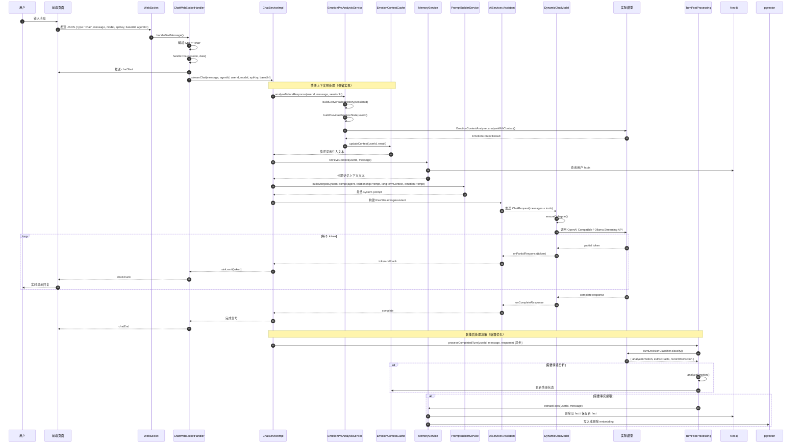

## 2. WebSocket 入口层

入口文件：[ChatWebSocketHandler.java](E:/Project/LingShu-AI/backend/lingshu-web/src/main/java/com/lingshu/ai/web/websocket/ChatWebSocketHandler.java)

当前聊天消息从这里进入，不走 REST `/api/chat/stream`。

### 2.1 收到消息后的分发

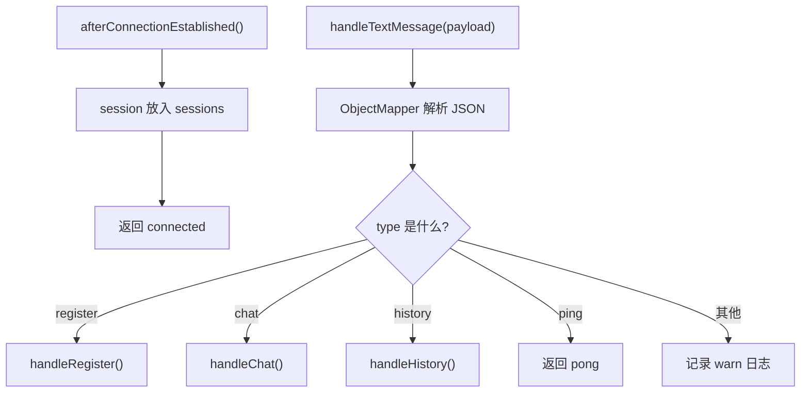

### 2.2 `chat` 消息格式

后端期待的 WebSocket 负载大致是：

```json
{
  "type": "chat",
  "message": "我是谁",
  "agentId": null,
  "model": "Qwen/Qwen3-8B",
  "apiKey": "xxx",
  "baseUrl": "http://xxx/v1"
}
```

处理逻辑：

- 从 `sessionUserMap` 里取 `userId`
- 先给前端发 `chatStart`
- 调用 `chatService.streamChat(...)`
- 对每个输出片段发 `chatChunk`
- 完成时发 `chatEnd`
- 出错时发 `error`

## 3. 情感上下文模块（保留实现）

核心文件：
- [EmotionPreAnalysisService.java](E:/Project/LingShu-AI/backend/lingshu-core/src/main/java/com/lingshu/ai/core/service/EmotionPreAnalysisService.java)
- [EmotionContextCache.java](E:/Project/LingShu-AI/backend/lingshu-core/src/main/java/com/lingshu/ai/core/service/EmotionContextCache.java)
- [EmotionContext.java](E:/Project/LingShu-AI/backend/lingshu-core/src/main/java/com/lingshu/ai/core/dto/EmotionContext.java)

### 3.1 设计理念

当前代码不再把前置情感分析当作默认主链路；这里保留的是一套可选实现，便于实验、回放或后续恢复。

> 在生成回复前，先分析用户当前消息的情感状态，并将分析结果注入到 System Prompt 中，让 AI 能够"感知"用户情绪并调整回应风格。

### 3.2 分析流程

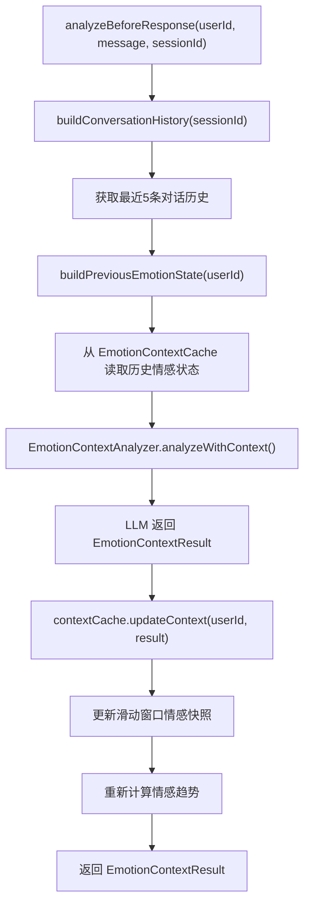

### 3.3 EmotionContextResult 结构

```java
public class EmotionContextResult {
    private String emotion;           // positive / negative / neutral
    private Double intensity;         // 0.0 ~ 1.0
    private String trend;             // improving / declining / stable
    private List<String> triggerKeywords;  // 情绪触发词
    private String suggestedResponseTone;  // 建议回应风格
    private Boolean needsComfort;     // 是否需要安慰
    private String analysis;          // 详细分析
}
```

### 3.4 EmotionContextCache 滑动窗口

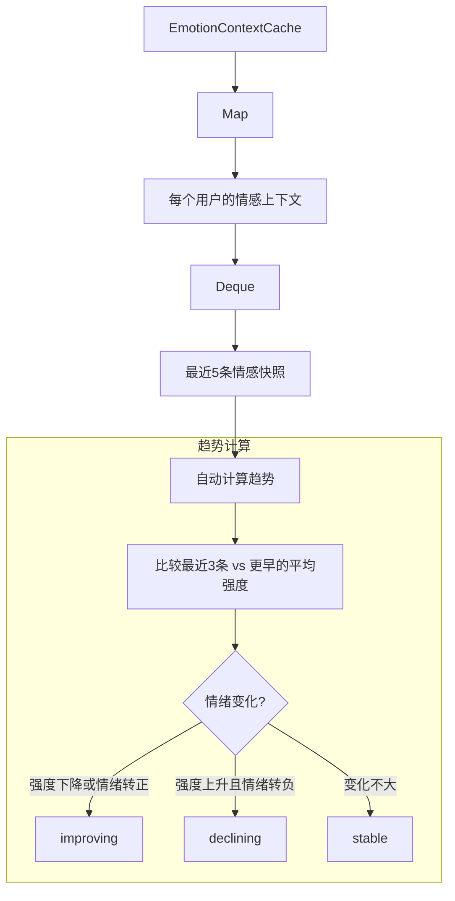

### 3.5 情感提示注入

`getEmotionPromptInjection(userId)` 生成的 Prompt 示例：

```
【当前情感状态感知】
用户当前情绪: 消极/低落 (强度: 0.7/1.0)
情绪趋势: 有所下降
情绪触发词: 累, 工作, 压力
用户状态提示: 用户可能需要关怀或安慰

【建议回应风格】
用户情绪较为低落，建议采用温柔关怀的语气，表达理解和支持。
```

### 3.6 30分钟过期机制

情感上下文会在 30 分钟无更新后自动过期，避免陈旧情感状态影响新对话。

## 4. ChatService 主链路

核心文件：[ChatServiceImpl.java](E:/Project/LingShu-AI/backend/lingshu-core/src/main/java/com/lingshu/ai/core/service/impl/ChatServiceImpl.java)

聊天主入口是：

- `streamChat(String message, Long agentId, String userId, String model, String apiKey, String baseUrl)`

### 4.1 内部执行顺序

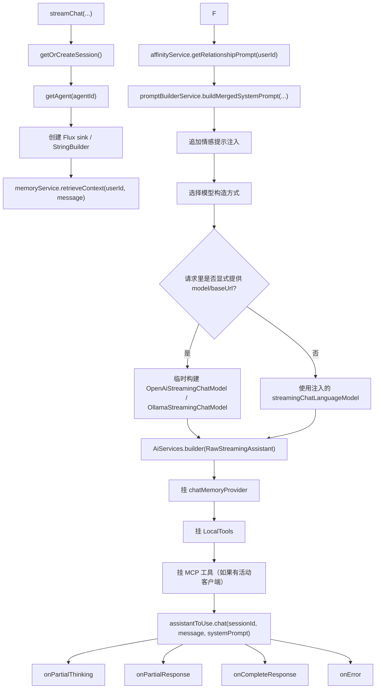

## 5. 长期记忆检索链路

核心文件：[MemoryServiceImpl.java](E:/Project/LingShu-AI/backend/lingshu-core/src/main/java/com/lingshu/ai/core/service/impl/MemoryServiceImpl.java)

### 5.1 `retrieveContext()` 细分

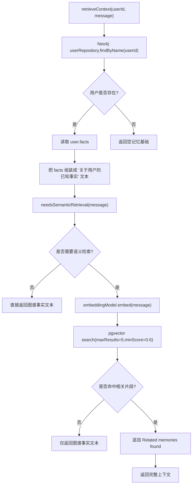

### 5.2 
eedsSemanticRetrieval()` 判断逻辑

它不是所有消息都查向量库，而是先做一层 GAM-RAG 风格的判断：

1. 从当前消息里抽取实体/关键词
2. 用这些词去 Neo4j facts 做关键词命中
3. 计算一个 `gain`
4. 只有 `gain >= 0.3` 才继续做语义检索

这样做的目的是减少无效的向量查询。

## 6. Prompt 构建链路

核心文件：[PromptBuilderServiceImpl.java](E:/Project/LingShu-AI/backend/lingshu-core/src/main/java/com/lingshu/ai/core/service/impl/PromptBuilderServiceImpl.java)

### 6.1 System Prompt 的组成

`buildMergedSystemPrompt()` 的最终结果由三部分组成：

1. `buildSystemPrompt(config)` 生成基础人格与规则
2. 追加运行时上下文（关系状态 + 长期事实）
3. **追加情感提示注入（新增）**

### 6.2 Prompt 结构图

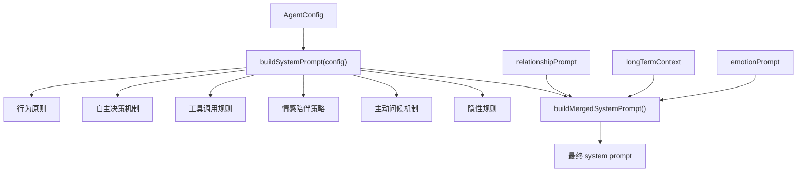

## 7. ChatMemory 与历史消息链路

核心文件：

- [AiConfig.java](E:/Project/LingShu-AI/backend/lingshu-core/src/main/java/com/lingshu/ai/core/config/AiConfig.java)
- [DatabaseChatMemoryStore.java](E:/Project/LingShu-AI/backend/lingshu-infrastructure/src/main/java/com/lingshu/ai/infrastructure/memory/DatabaseChatMemoryStore.java)

### 7.1 ChatMemoryProvider 是怎么创建的

`AiConfig.chatMemoryProvider()` 每次按 `sessionId` 创建：

- `MessageWindowChatMemory`
- `maxMessages = 10`
- 底层 store = `DatabaseChatMemoryStore`

### 7.2 当前消息列表是怎么来的

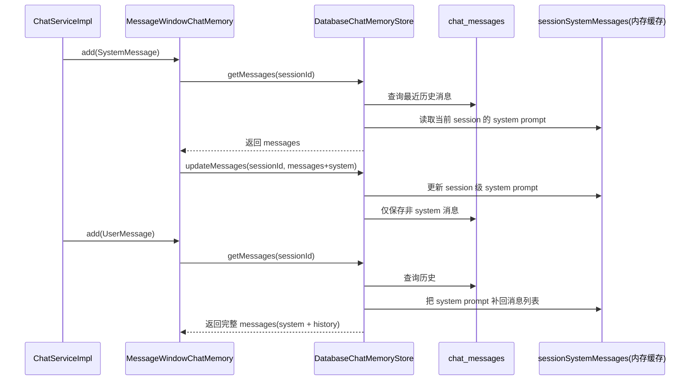

## 8. 模型选择与实际下发链路

核心文件：[DynamicChatModel.java](E:/Project/LingShu-AI/backend/lingshu-core/src/main/java/com/lingshu/ai/core/model/DynamicChatModel.java)

### 8.1 模型适配层

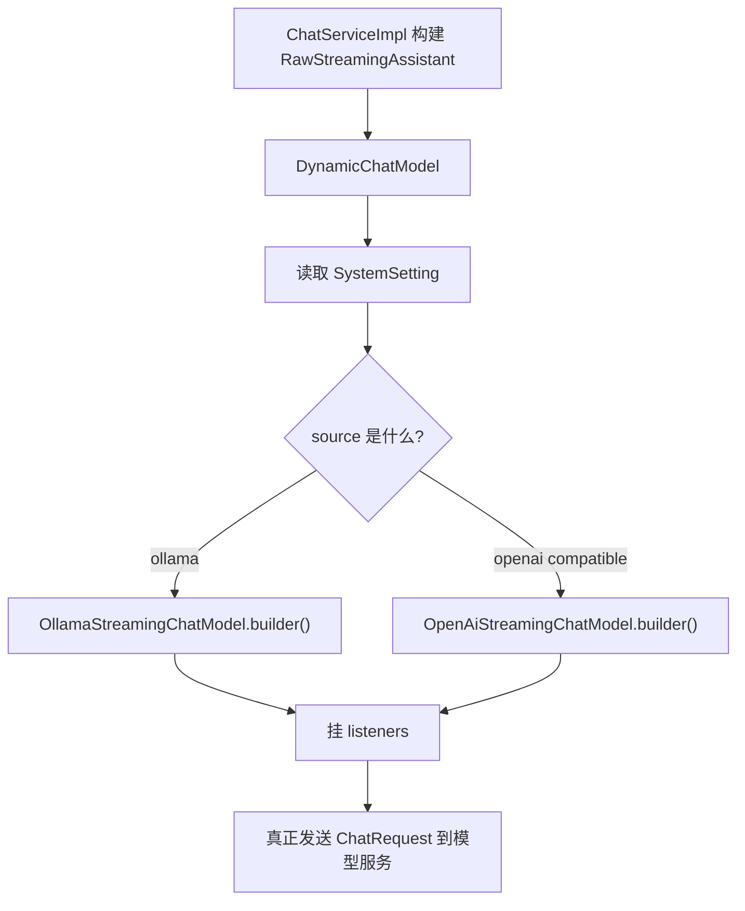

### 8.2 监听器做了什么

`AiConfig.chatModelListener()` 会在请求发出前记录：

- `LLM Request Messages (Count: n)`
- `LLM Request Role Summary => system/user/assistant/tool`
- 每条 message 的 role 和内容预览

这个日志就是排查 prompt 丢失最直接的观测点。

## 9. 流式回复回传链路

### 9.1 模型输出如何回前端

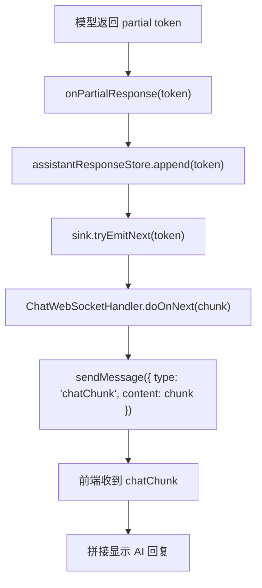

### 9.2 完成时会发生什么

- `onCompleteResponse` 被触发
- 统计 token 数
- 发 `chatEnd`
- 异步触发 `turnPostProcessingService.processCompletedTurn()`

## 10. 智能回合后处理（核心优化）

核心文件：[TurnPostProcessingServiceImpl.java](E:/Project/LingShu-AI/backend/lingshu-core/src/main/java/com/lingshu/ai/core/service/impl/TurnPostProcessingServiceImpl.java)

### 10.1 设计理念

传统方案是每轮对话结束后都执行情感分析和事实提取，但这样会导致：

- 大量无效的 LLM 调用（如简单的命令执行、工具调用）
- 浪费资源，降低响应速度
- 可能提取到无价值的"噪音"事实

**智能后处理决策**的核心思想是：

> 让 LLM 判断这一轮对话是否具有"状态更新价值"或"长期记忆价值"，只有值得的对话才触发相应处理。

### 10.2 决策流程

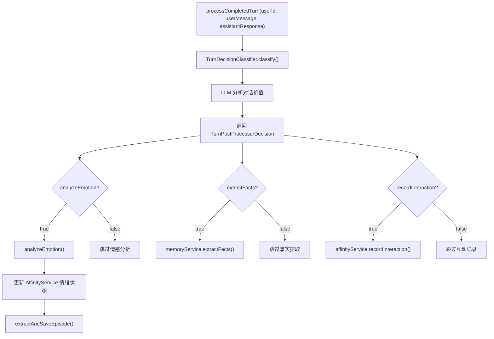

### 10.3 决策器 System Prompt

```
你是"回合后处理决策器"。
你的任务不是回复用户，而是在一轮对话已经完成后，
根据"用户原始消息"和"助手最终回复"判断：
1. 是否需要做情感分析
2. 是否需要做事实提取
3. 是否需要记录一次互动

关键原则：
- 你只负责"是否触发"的决策，不做真正的情感分析/事实提取。
- 如果这轮主要是后端工具执行、命令查询、文件读取、代码排查、环境检查，
  且没有明显暴露用户情绪或稳定个人事实，则不要触发情感分析/事实提取。
- 如果用户表达了情绪、态度、困扰、满意/失望、压力、偏好、身份、计划、经历、
  长期稳定习惯、关系信息、自我描述等，则应触发相应处理。
```

### 10.4 决策结果示例

```json
{
  "analyzeEmotion": true,
  "extractFacts": true,
  "recordInteraction": true,
  "confidence": 0.85,
  "reason": "用户表达了工作压力和疲惫感，透露了长期工作状态，值得记录情感和提取事实"
}
```

### 10.5 情感事件提取

当触发情感分析时，还会调用 `EmotionalEpisodeService.extractAndSaveEpisode()` 提取情感事件：

- 记录情感触发场景
- 关联对话上下文
- 持久化到 Neo4j

## 11. 事实提取异步尾链

### 11.1 主流程

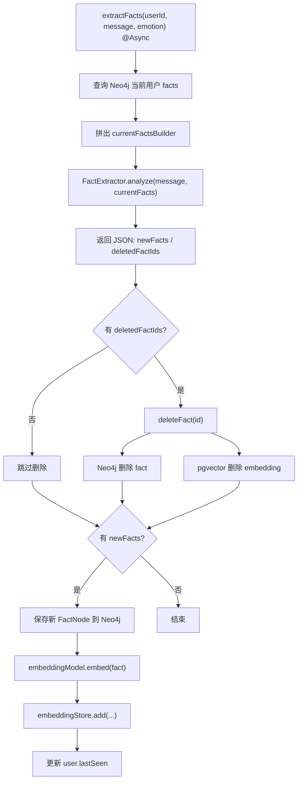

## 12. 一次完整对话里实际发生了什么

把所有步骤串起来，可以理解成下面这个"完整生命历程"：

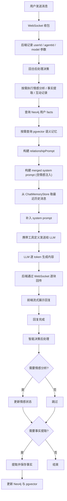

## 13. 图像处理链路

核心文件：[ImageCompressor.java](E:/Project/LingShu-AI/backend/lingshu-core/src/main/java/com/lingshu/ai/core/util/ImageCompressor.java)

### 13.1 图像压缩流程

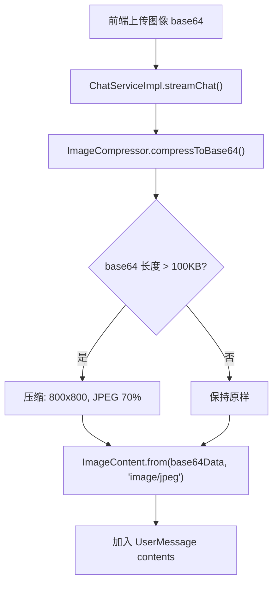

### 13.2 压缩参数

- 最大尺寸：800 x 800 像素
- 输出格式：JPEG
- 质量：70%
- 触发阈值：base64 数据超过 100KB

### 13.3 错误处理

当图像过大导致上下文超限时，会返回友好提示：

```
输入内容过长，超出模型上下文限制。请尝试：
1. 减少图片数量或使用更小的图片
2. 清除对话历史后重试
3. 切换到支持更长上下文的模型
```

## 14. 你现在排查这条链最该看哪几个点

如果以后再遇到问题，优先看这几个位置：

1. `ChatWebSocketHandler.handleChat()` 是否真的调用了 `chatService.streamChat(...)`
2. `EmotionPreAnalysisService.analyzeBeforeResponse()` 是否正确返回情感分析结果
3. `EmotionContextCache.getEmotionPromptInjection()` 是否生成了正确的情感提示
4. `AiConfig.chatModelListener()` 里 `LLM Request Role Summary` 的 `system` 计数
5. `TurnPostProcessingServiceImpl.processCompletedTurn()` 的决策日志
6. `DynamicChatModel` 最终走的是 Ollama 还是 OpenAI Compatible 路径

## 15. 结论

当前对话链路可以概括成一句话：

> WebSocket 聊天消息先经过"**情感上下文预处理（保留实现）** + 长期记忆检索 + prompt 合成"，再带着"历史消息 + system prompt + tools"发给动态模型适配层，模型流式返回 token，最后在回复完成后**智能决策**是否执行情感分析/事实提取并回写长期记忆。

这条链路的核心优化点：

1. **情感上下文预处理（保留实现）**：仅在保留实现或实验场景下使用，默认主链路不调用。
2. **情感上下文滑动窗口**：维护最近 5 条情感快照，自动计算趋势
3. **智能后处理决策**：通过 LLM 判断是否值得执行情感分析/事实提取
4. **图像自动压缩**：大图自动压缩以适应上下文限制

最容易出错的地方：

- `chatMemoryProvider` + `ChatMemoryStore` + `SystemMessage` 组合对 system 的保留
- `EmotionContextCache` 的过期和清理
- `TurnPostProcessingServiceImpl` 的异步执行和异常处理
