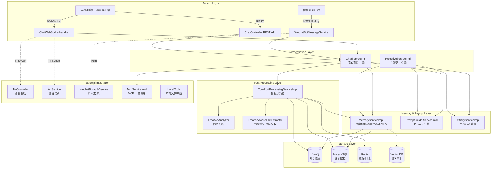
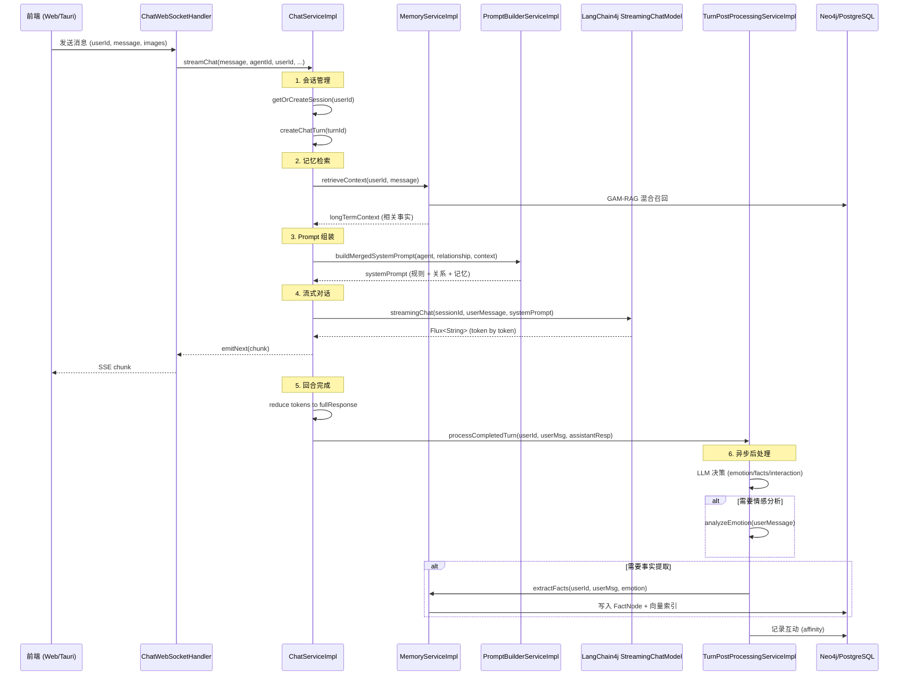
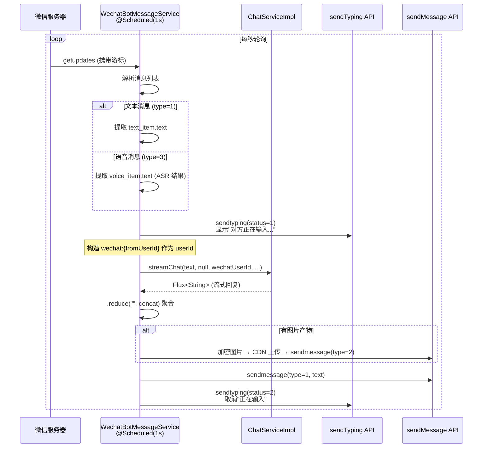
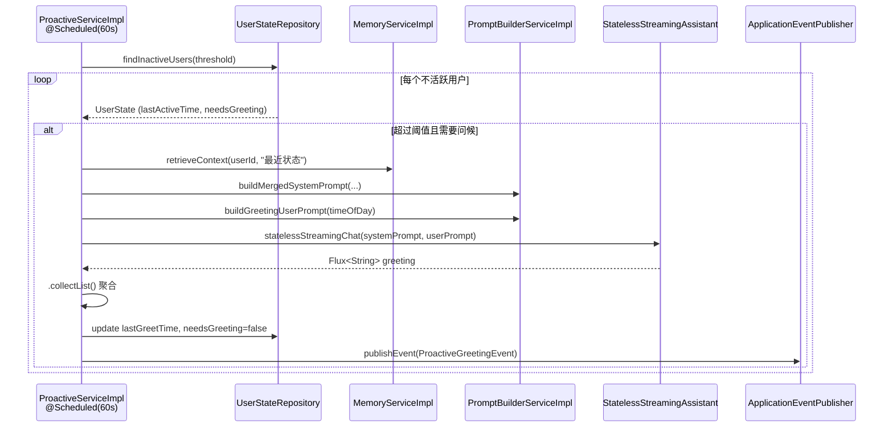
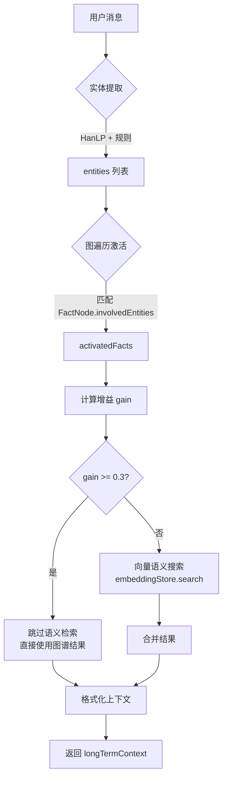
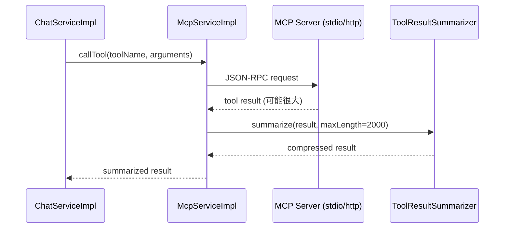
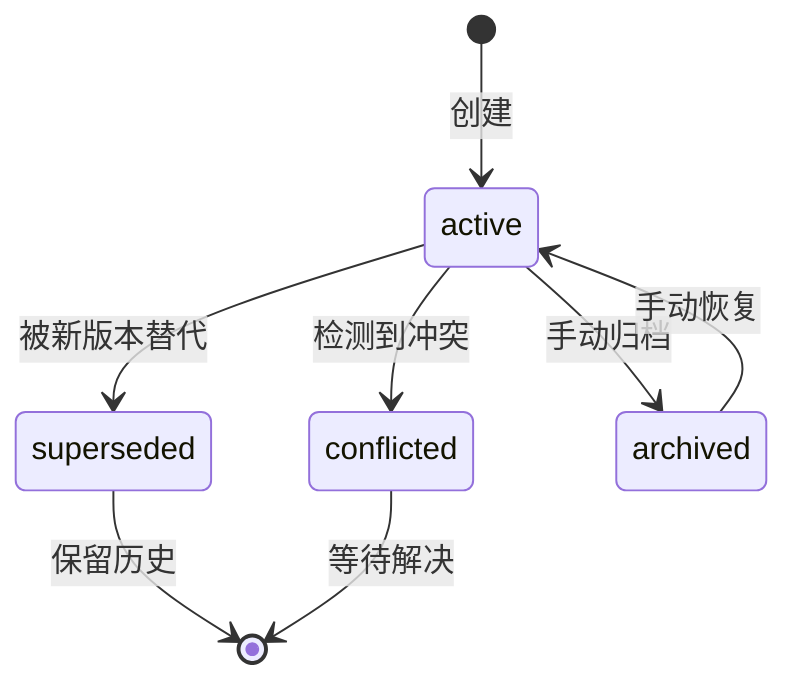

# 灵枢 AI 智能体系统架构设计文档（当前实现版）

**项目名称**: LingShu-AI  
**文档版本**: v2.0  
**最后更新**: 2026-04-14

---

## 1. 架构总览

灵枢 AI 采用分层架构设计，分为 **接入层、对话编排层、记忆与提示层、回合后处理层、存储层** 五大核心层级，并扩展了 **语音层、微信通道层、MCP 工具层** 三个独立模块。



### 1.1 核心设计理念

1. **流式优先**: 所有对话接口基于 Reactor Flux 实现流式输出
2. **回合模型**: 从传统消息表升级为 `chat_turn` + `chat_turn_event` + `chat_turn_artifact` 三层结构
3. **后置处理**: 情感分析和事实提取移至回合完成后异步执行，降低响应延迟
4. **GAM-RAG 混合召回**: Graph-Augmented Memory + Retrieval Augmented Generation
5. **多通道统一**: Web/Tauri/微信共用同一套 ChatService 核心逻辑

## 2. 当前主链路详细流程

### 2.1 WebSocket 聊天链路（Web/Tauri）

**入口**: `ws://localhost:8080/ws/chat`



**关键步骤说明**:

1. **会话管理** (`getOrCreateSession`)
   - 根据 `userId` 查找或创建 `ChatSession`
   - 每个会话关联一个 `sessionId` (Long)
   - 支持多用户并发隔离

2. **记忆检索** (`retrieveContext`)
   - **GAM-RAG 混合召回**:
     - Step 1: 实体提取 (HanLP + 规则引擎)
     - Step 2: 图遍历激活相关事实路径
     - Step 3: 计算增益值 (gain = activated_facts / entities)
     - Step 4: 如果 gain ≥ 0.3，跳过语义检索；否则补充向量搜索
   - 返回格式化的长期记忆上下文字符串

3. **Prompt 组装** (`buildMergedSystemPrompt`)
   ```
   # Agent System Prompt
   {behaviorPrinciples}
   {decisionMechanism}
   {toolCallRules}
   {emotionalStrategy}
   {greetingTriggers}
   {hiddenRules}

   # 当前关系状态
   {relationshipPrompt}

   # 感官记忆 (长期事实)
   {longTermContext}

   指令回复准则：
   - 当用户询问关于自己的信息时，优先从【感官记忆】中查找
   - 当用户显式要求"回忆"时，引用记忆并说明来源
   - 不要虚构任何用户信息
   - 根据关系状态调整语气和亲密程度
   ```

4. **流式对话** (`streamingChat`)
   - 使用 LangChain4j `StreamingChatModel`
   - 支持动态切换模型 (Ollama / OpenAI 兼容)
   - TokenStream → Flux<String> 转换
   - 实时 emit 到 WebSocket

5. **回合完成** (`reduce + postProcess`)
   - `.reduce("", String::concat)` 聚合完整回复
   - 清理 reasoning 标签: `\u0001REASONING\u0001...\u0001/REASONING\u0001`
   - 触发异步后处理 (不阻塞响应)

6. **异步后处理** (`@Async processCompletedTurn`)
   - LLM 智能决策三要素:
     - `analyzeEmotion`: 是否需要情感分析
     - `extractFacts`: 是否需要事实提取
     - `recordInteraction`: 是否记录互动
   - 置信度阈值控制 (confidence ≥ 0.7)
   - 失败降级: 至少记录互动

### 2.2 微信 iLink Bot 链路

**入口**: 定时轮询 `/ilink/bot/getupdates` (每 1 秒)



**关键技术点**:

1. **userId 隔离**: `wechat:{fromUserId}` 确保每个微信用户独立记忆
2. **流式转非流式**: `.reduce("", String::concat)` 适配微信一次性发送
3. **Reasoning 清理**: 移除内部推理过程，只发送最终答案
4. **图片支持**: AES 加密 → CDN 上传 → 发送加密凭证
5. **防重入保护**: `pollingAccounts` Set 防止同一账户并发轮询
6. **会话过期检测**: errcode=-14 自动标记为 `session_timeout`

### 2.3 主动交互链路 (Proactive)

**触发**: `@Scheduled(fixedRate = 60000)` 每分钟检查



**特性**:
- 无状态 Assistant: 不需要 ChatMemoryProvider
- 时间感知: 根据时间段生成不同问候语 (早上好/下午好/晚上好)
- 事件驱动: 通过 Spring Event 通知前端展示

---

## 3. 核心模块详解

### 3.1 对话编排层

#### ChatServiceImpl (主引擎)

**文件**: `backend/lingshu-core/src/main/java/com/lingshu/ai/core/service/impl/ChatServiceImpl.java`

**职责**:
- 会话生命周期管理
- 记忆检索与 Prompt 组装
- 流式对话执行
- 回合数据持久化
- 工具调用协调
- 回合后处理触发

**核心方法**:
```java
// 流式对话 (多态重载)
Flux<String> streamChat(String message, Long agentId, String userId, 
                        String model, String apiKey, String baseUrl,
                        List<String> base64Images, ToolEventListener listener);

// 欢迎消息生成
Flux<String> streamWelcome(String userId);

// 历史加载
List<ChatTurn> loadHistory(String userId, int limit, Long beforeTurnId);

// 清空历史
void clearHistory(String userId);
```

**依赖注入** (19 个):
- `MemoryService`: 记忆检索
- `AgentConfigService`: Agent 配置
- `PromptBuilderService`: Prompt 组装
- `AffinityService`: 关系状态
- `StreamingChatModel`: LLM 流式模型
- `McpService`: MCP 工具调用
- `TurnTimelineService`: 回合时间线记录
- `TurnPostProcessingServiceImpl`: 回合后处理
- `ToolResultSummarizer`: 工具结果压缩
- `EmotionPreAnalysisService`: 前置情感分析 (保留但默认不用)
- `ChatMemoryProvider`: LangChain4j 记忆提供者
- `SystemLogService`: 系统日志
- `SettingService`: 全局设置
- `RestTemplate`: HTTP 客户端
- `ChatSessionRepository`: 会话仓储
- `McpToolArtifactRegistry`: 工具产物注册表
- `List<ChatModelListener>`: 模型监听器列表

**关键实现细节**:

1. **动态模型切换**:
```java
if (model != null && baseUrl != null) {
    if (baseUrl.contains("11434")) {
        // Ollama 模式
        streamingModelToUse = OllamaStreamingChatModel.builder()
            .baseUrl(baseUrl).modelName(model).build();
    } else {
        // OpenAI 兼容模式
        streamingModelToUse = OpenAiStreamingChatModel.builder()
            .baseUrl(effectiveUrl).apiKey(apiKey).modelName(model).build();
    }
}
```

2. **Thinking 模式支持** (Gemini/DeepSeek):
```java
if (Boolean.TRUE.equals(enableThinking)) {
    if (isGemini) {
        openAiBuilder.thinkingConfig(
            ThinkingConfig.builder().includeThoughts(true).build());
    } else if (isDeepSeek) {
        extraBody.put("enable_thinking", true);
    }
}
```

3. **图片处理**:
```java
List<ImageContent> imageContents = base64Images.stream()
    .map(img -> ImageContent.from(
        extractMimeType(img),
        extractBase64Data(img)
    ))
    .collect(Collectors.toList());

UserMessage userMessage = UserMessage.from(
    TextContent.from(message),
    imageContents
);
```

4. **工具调用监听**:
```java
chatMemoryProvider.getMemory(sessionId).add(toolStartMessage);
listener.onToolStart(toolCallId, toolName, arguments);
// ... 执行工具 ...
listener.onToolEnd(toolCallId, toolName, arguments, result, isError, artifacts);
```

5. **错误处理**:
```java
if (errorMsg.contains("context length")) {
    sink.tryEmitError(new RuntimeException(
        "输入内容过长，超出模型上下文限制..."));
} else if (errorMsg.contains("image")) {
    sink.tryEmitError(new RuntimeException(
        "当前模型不支持图像识别..."));
}
```

#### ProactiveServiceImpl (主动交互)

**文件**: `backend/lingshu-core/src/main/java/com/lingshu/ai/core/service/impl/ProactiveServiceImpl.java`

**职责**:
- 检测不活跃用户
- 生成个性化问候
- 生成安慰消息 (检测到负面情绪时)
- 发布 Spring Event 通知前端

**定时任务**:
```java
@Scheduled(fixedRate = 60000)  // 每分钟
public void checkInactiveUsers() {
    // 查询 lastActiveTime < now - threshold 的用户
    List<UserState> inactiveUsers = 
        userStateRepository.findInactiveUsers(threshold);
    
    for (UserState state : inactiveUsers) {
        if (state.isNeedsGreeting()) {
            generateGreeting(state.getUserId());
        }
    }
}
```

**问候生成**:
```java
public Flux<String> generateGreeting(String userId) {
    String memoryContext = memoryService.retrieveContext(userId, "...");
    String systemPrompt = promptBuilderService.buildMergedSystemPrompt(...);
    String userPrompt = promptBuilderService.buildGreetingUserPrompt(timeOfDay);
    
    return statelessStreamingAssistant.chat(userPrompt, systemPrompt);
}
```

### 3.2 记忆与提示层

#### MemoryServiceImpl (记忆引擎)

**文件**: `backend/lingshu-core/src/main/java/com/lingshu/ai/core/service/impl/MemoryServiceImpl.java`

**职责**:
- 事实提取与分类
- GAM-RAG 混合召回
- 知识图谱维护 (Neo4j)
- 向量语义索引
- 记忆生命周期管理

**核心方法**:
```java
// 事实提取 (3 种重载)
void extractFacts(String userId, String message);
void extractFacts(String userId, String message, EmotionAnalysis emotion);
void extractFacts(String userId, String userMessage, 
                  String assistantResponse, EmotionAnalysis emotion);

// 记忆检索
String retrieveContext(String userId, String message);

// 图谱数据
Object getGraphData(String userId);  // 用于前端 3D 可视化

// 记忆维护
Object runMemoryMaintenance();  // 定时清理低活跃度事实

// 事实管理
void deleteFact(Long factId);
void archiveFact(Long factId);
void restoreFact(Long factId);
void updateFactClassification(Long factId, String clusterKey, String subType);
```

**GAM-RAG 混合召回流程**:



**关键算法**:

1. **实体提取** (`extractEntities`):
```java
List<String> entities = new ArrayList<>();

// 1. 规则引擎：特殊意图
if (message.contains("我是谁") || message.contains("我叫什么")) {
    entities.addAll(Arrays.asList("名字", "身份", "我是谁"));
}

// 2. HanLP 关键词提取
try {
    List<String> nlpKeywords = HanLP.extractKeyword(message, 5);
    entities.addAll(nlpKeywords.filter(kw -> !STOP_WORDS.contains(kw)));
} catch (Exception e) {
    // Fallback: 正则分词
    String[] words = message.split("\\s+");
    entities.addAll(Arrays.stream(words)
        .filter(w -> w.length() >= 2 && w.length() <= 4)
        .collect(Collectors.toList()));
}

return entities;
```

2. **增益计算** (`calculateGain`):
```java
double gain = (double) activatedFacts.size() / Math.max(1, entities.size());
// gain >= 0.3 表示图谱召回足够，无需语义搜索
```

3. **事实去重与版本控制**:
```java
// 精确匹配
FactNode exactMatch = findExactFact(user, normalizedContent);
if (exactMatch != null) {
    refreshExistingFact(exactMatch, now);  // 更新活跃度
    return;
}

// 相似检测 (SUPERSEDES)
if (bestMatch != null && "SUPERSEDES".equals(relationType)) {
    bestMatch.setStatus("superseded");
    FactNode newNode = buildNewFactNode(...);
    newNode.setSupersedesFactId(bestMatch.getId());
    newNode.setVersion(bestMatch.getVersion() + 1);
    saveNewFact(user, newNode);
}

// 冲突检测 (CONTRADICTS)
if (bestMatch != null && "CONTRADICTS".equals(relationType)) {
    bestMatch.setStatus("conflicted");
    FactNode newNode = buildNewFactNode(...);
    newNode.setContradictsFactId(bestMatch.getId());
    newNode.setStatus("conflicted");
    saveNewFact(user, newNode);
}
```

4. **情感感知事实提取** (`EmotionAwareFactExtractor`):
```java
// 根据情感强度调整重要性
if (emotion != null && emotion.getIntensity() != null) {
    double intensityBoost = emotion.getIntensity() * 0.2;
    baseImportance = Math.min(1.0, baseImportance + intensityBoost);
}

// 记录情感基调
factNode.setEmotionalTone(emotion.getEmotion());  // joy/sadness/anger/etc.
```

**数据存储结构**:

- **Neo4j**:
  - `UserNode`: 用户节点
  - `FactNode`: 事实节点 (content, category, subType, importance, confidence, activityScore, status, version...)
  - `EmotionalEpisode`: 情感事件节点
  - Relationships: `HAS_FACT`, `BELONGS_TO_TOPIC`, `SUPERSEDES`, `CONTRADICTS`, `RELATED_TO`

- **PostgreSQL**:
  - `chat_session`: 会话表
  - `chat_turn`: 回合表
  - `chat_turn_event`: 回合事件表 (tool calls, reasoning steps)
  - `chat_turn_artifact`: 回合产物表 (images, files)

- **Vector DB** (LangChain4j EmbeddingStore):
  - TextSegment: 事实文本的向量嵌入
  - 用于语义相似度搜索

#### PromptBuilderServiceImpl (Prompt 组装)

**文件**: `backend/lingshu-core/src/main/java/com/lingshu/ai/core/service/impl/PromptBuilderServiceImpl.java`

**职责**:
- System Prompt 动态生成
- 关系状态注入
- 记忆上下文格式化
- 欢迎/问候/安慰 Prompt 模板

**核心方法**:
```java
// 基础 System Prompt
String buildSystemPrompt(AgentConfig config);

// 合并 System Prompt (规则 + 关系 + 记忆)
String buildMergedSystemPrompt(AgentConfig config, 
                               String relationshipPrompt, 
                               String longTermContext);

// 完整 Prompt (含短期对话历史)
String buildFullPrompt(AgentConfig config, String relationshipPrompt,
                       String longTermContext, String shortTermContext, 
                       String message);

// 欢迎消息 Prompt
String buildWelcomePrompt(AgentConfig config, String relationshipPrompt, 
                          String historyContext);

// 问候 Prompt
String buildGreetingUserPrompt(String timeOfDay);

// 安慰 Prompt
String buildComfortUserPrompt(String emotion, double intensity);
```

**Prompt 模板示例**:

```java
public String buildMergedSystemPrompt(AgentConfig config, 
                                      String relationshipPrompt, 
                                      String longTermContext) {
    String baseSystem = buildSystemPrompt(config);
    
    StringBuilder contextBuilder = new StringBuilder();
    if (StringUtils.hasText(relationshipPrompt)) {
        contextBuilder.append("\n\n# 当前关系状态\n")
                      .append(relationshipPrompt);
    }
    
    if (StringUtils.hasText(longTermContext)) {
        contextBuilder.append("\n\n# 感官记忆 (长期事实)\n")
                      .append(longTermContext);
    }
    
    return String.format("""
        %s
        
        %s
        
        指令回复准则：
        - 当用户询问关于自己的信息（如喜好、身份、习惯等）时，优先从【感官记忆】中查找并回答。
        - 当用户显式要求“回忆”或“记得”时，引用记忆并说明来源。
        - 只有当记忆中确实没有相关信息时，才回答“之前的记忆有些模糊，能提醒我一下吗？”
        - 不要虚构任何用户信息。
        - 根据关系状态调整语气和亲密程度。
        """,
        baseSystem,
        contextBuilder.toString());
}
```

**Agent Config 字段映射**:
- `systemPrompt`: 核心人设
- `behaviorPrinciples`: 行为原则
- `decisionMechanism`: 自主决策机制
- `toolCallRules`: 工具调用规则 (动态生成)
- `emotionalStrategy`: 情感陪伴策略
- `greetingTriggers`: 主动问候机制
- `hiddenRules`: 隐性规则

#### AffinityServiceImpl (关系状态)

**文件**: `backend/lingshu-core/src/main/java/com/lingshu/ai/core/service/impl/AffinityServiceImpl.java`

**职责**:
- 用户亲密度计算
- 关系阶段管理 (初识/熟悉/亲密/挚友)
- 互动频率统计
- 关系风格 Prompt 生成

**核心方法**:
```java
// 获取关系状态 Prompt
String getRelationshipPrompt(String userId);

// 记录互动
void recordInteraction(String userId);

// 获取用户状态
UserState getUserState(String userId);

// 更新亲密度
void updateAffinity(String userId, double delta);
```

**关系阶段**:
```java
enum RelationshipStage {
    STRANGER(0, 20, "初识"),      // 0-20
    ACQUAINTANCE(20, 50, "熟悉"), // 20-50
    FRIEND(50, 80, "亲密"),       // 50-80
    CLOSE_FRIEND(80, 100, "挚友"); // 80-100
}
```

**亲密度计算**:
```java
double affinity = baseAffinity 
    + interactionCount * 0.5          // 互动次数
    + conversationDepth * 0.3         // 对话深度
    + emotionalResonance * 0.2;       // 情感共鸣
```

### 3.3 回合后处理层

#### TurnPostProcessingServiceImpl (智能决策器)

**文件**: `backend/lingshu-core/src/main/java/com/lingshu/ai/core/service/impl/TurnPostProcessingServiceImpl.java`

**职责**:
- 回合完成后异步决策
- 情感分析触发
- 事实提取触发
- 互动记录

**核心流程**:
```java
@Async("taskExecutor")
public void processCompletedTurn(String userId, String userMessage, 
                                 String assistantResponse,
                                 EmotionAnalysis preAnalyzedEmotion) {
    // 1. LLM 决策
    TurnPostProcessorDecision decision = buildDecisionClassifier().classify(
        userMessage,
        assistantResponse != null ? assistantResponse : ""
    );
    
    log.debug("后处理决策: emotion={}, facts={}, interaction={}, confidence={}",
        decision.isAnalyzeEmotion(),
        decision.isExtractFacts(),
        decision.isRecordInteraction(),
        decision.getConfidence());
    
    // 2. 情感分析 (可选)
    EmotionAnalysis emotionResult = preAnalyzedEmotion;
    if (decision.isAnalyzeEmotion() && emotionResult == null) {
        emotionResult = analyzeEmotion(userId, userMessage);
    }
    
    // 3. 事实提取 (可选)
    if (decision.isExtractFacts()) {
        extractFacts(userId, userMessage, assistantResponse, emotionResult);
    }
    
    // 4. 记录互动 (默认执行)
    if (decision.isRecordInteraction()) {
        affinityService.recordInteraction(userId);
    }
}
```

**LLM 决策器**:
```java
interface TurnPostProcessor {
    @SystemMessage("""
        你是一个对话后处理决策器。根据用户消息和助手回复，判断是否需要：
        1. 情感分析 (analyzeEmotion): 用户表达明显情绪时
        2. 事实提取 (extractFacts): 用户透露新信息时
        3. 记录互动 (recordInteraction): 有效对话时
        
        返回 JSON 格式：
        {
            "analyzeEmotion": boolean,
            "extractFacts": boolean,
            "recordInteraction": boolean,
            "confidence": number,
            "reason": string
        }
        """)
    TurnPostProcessorDecision classify(
        @UserMessage String userMessage,
        @V("assistantResponse") String assistantResponse
    );
}
```

**决策示例**:
```json
{
    "analyzeEmotion": true,
    "extractFacts": true,
    "recordInteraction": true,
    "confidence": 0.92,
    "reason": "用户表达了失落情绪并提到了新的工作项目"
}
```

#### EmotionAnalyzer (情感分析)

**文件**: `backend/lingshu-core/src/main/java/com/lingshu/ai/core/service/impl/EmotionAnalyzerImpl.java`

**职责**:
- 识别用户情绪类型 (joy/sadness/anger/fear/surprise/disgust/neutral)
- 评估情感强度 (0.0-1.0)
- 生成情感描述文本

**输出格式**:
```java
public class EmotionAnalysis {
    private String emotion;      // "sadness"
    private Double intensity;    // 0.75
    private String description;  // "用户表现出明显的失落感..."
    private Map<String, Double> allEmotions;  // 所有情绪的概率分布
}
```

#### EmotionAwareFactExtractor (情感感知事实提取)

**文件**: `backend/lingshu-core/src/main/java/com/lingshu/ai/core/service/impl/EmotionAwareFactExtractor.java`

**职责**:
- 结合情感上下文提取事实
- 高情感强度事实提升重要性
- 记录情感基调到 FactNode

**关键逻辑**:
```java
// 情感强度 boost
if (emotion != null && emotion.getIntensity() != null) {
    double intensityBoost = emotion.getIntensity() * 0.2;
    baseImportance = Math.min(1.0, baseImportance + intensityBoost);
}

// 记录情感基调
factNode.setEmotionalTone(emotion.getEmotion());
```

### 3.4 MCP 工具层

#### McpServiceImpl (MCP 客户端管理)

**文件**: `backend/lingshu-core/src/main/java/com/lingshu/ai/core/service/impl/McpServiceImpl.java`

**职责**:
- MCP Server 生命周期管理 (stdio/http)
- 工具发现与注册
- 工具调用执行
- 结果压缩与摘要

**核心方法**:
```java
// 初始化 MCP Client
void initializeMcpClient(String serverName, McpServerConfig config);

// 列出可用工具
List<McpTool> listTools();

// 调用工具
String callTool(String toolName, Map<String, Object> arguments);

// 关闭 MCP Client
void closeMcpClient(String serverName);
```

**工具调用流程**:


#### LocalTools (本地工具集)

**文件**: `backend/lingshu-core/src/main/java/com/lingshu/ai/core/tool/LocalTools.java`

**提供工具**:
- `read_file`: 读取本地文件
- `write_file`: 写入本地文件
- `execute_command`: 执行系统命令 (受限白名单)
- `list_directory`: 列出目录内容
- `search_files`: 文件搜索

**安全限制**:
- 命令白名单: `ls`, `dir`, `cat`, `type`, `grep`, `find`
- 路径限制: 禁止访问 `/etc`, `/usr`, `C:\Windows` 等系统目录
- 超时控制: 命令执行最长 30 秒

### 3.5 语音层

#### TtsController (语音合成)

**文件**: `backend/lingshu-web/src/main/java/com/lingshu/ai/web/controller/TtsController.java`

**接口**: `POST /api/tts`

**请求**:
```json
{
    "text": "你好，世界",
    "voice": "zh-CN-XiaoxiaoNeural",
    "provider": "edge-tts"  // edge-tts / doubao-tts
}
```

**响应**: `audio/mpeg` 二进制流

**实现**:
- Edge TTS: 免费，基于 Microsoft Edge 浏览器
- Doubao TTS: 付费，火山引擎豆包 TTS

#### AsrService (语音识别)

**文件**: `backend/lingshu-core/src/main/java/com/lingshu/ai/core/service/impl/AsrServiceImpl.java`

**功能**:
- 音频文件转文本
- 支持格式: WAV, MP3, OGG
- 采样率: 16kHz 单声道

**实现**:
- Vosk: 离线 ASR 引擎
- Whisper: OpenAI 开源模型 (可选)

## 4. 数据与存储架构

### 4.1 Neo4j 知识图谱

**节点类型**:

| 节点类型 | 说明 | 关键属性 |
|---------|------|----------|
| `UserNode` | 用户节点 | name, nickname, firstEncounter, lastSeen |
| `FactNode` | 事实节点 | content, normalizedContent, category, subType, importance, confidence, activityScore, status, version, emotionalTone, involvedEntities |
| `EmotionalEpisode` | 情感事件 | emotion, intensity, trigger, timestamp |
| `TopicNode` | 话题聚类 (虚拟) | clusterKey, label, factCount |

**关系类型**:

| 关系类型 | 方向 | 说明 |
|---------|------|------|
| `HAS_FACT` | User → Fact | 用户拥有该事实 |
| `BELONGS_TO_TOPIC` | Fact → Topic | 事实属于某话题 |
| `SUPERSEDES` | Fact → Fact | 新版本替代旧版本 |
| `CONTRADICTS` | Fact → Fact | 事实冲突 |
| `RELATED_TO` | Fact → Fact | 语义相关 (weight >= 0.6) |

**FactNode 状态机**:


**FactNode 关键字段**:
```java
public class FactNode {
    private Long id;
    private String content;              // 原始事实文本
    private String normalizedContent;    // 标准化文本 (去重用)
    private String category;             // 话题分类 (interest/goal/emotion...)
    private String subType;              // 子类型 (Preference/Person/Event...)
    private Double importance;           // 重要性 (0.0-1.0)
    private Double confidence;           // 置信度 (0.0-1.0)
    private Double activityScore;        // 活跃度 (衰减计算)
    private String status;               // active/superseded/conflicted/archived
    private Integer version;             // 版本号
    private Long supersedesFactId;       // 被替代的旧事实 ID
    private Long contradictsFactId;      // 冲突的事实 ID
    private String emotionalTone;        // 情感基调 (joy/sadness...)
    private Set<String> involvedEntities; // 涉及实体列表
    private LocalDateTime observedAt;    // 首次观察时间
    private LocalDateTime lastActivatedAt; // 最后激活时间
    private Double decayRate;            // 衰减速率 (默认 0.015)
    private Integer ttlDays;             // 生存期 (默认 180 天)
}
```

**活跃度衰减算法**:
```java
double calculateActivityScore(LocalDateTime createdAt, LocalDateTime lastActivatedAt) {
    long daysSinceCreation = ChronoUnit.DAYS.between(createdAt, LocalDateTime.now());
    long daysSinceActivation = ChronoUnit.DAYS.between(lastActivatedAt, LocalDateTime.now());
    
    double baseScore = 1.0;
    double decayFactor = Math.exp(-decayRate * daysSinceActivation);
    
    return baseScore * decayFactor;
}

// 每次激活时刷新
fact.setLastActivatedAt(LocalDateTime.now());
fact.setActivityScore(calculateActivityScore(fact.getCreatedAt(), now));
```

### 4.2 PostgreSQL 回合数据模型

**表结构**:

#### chat_session (会话表)
```sql
CREATE TABLE chat_session (
    id BIGSERIAL PRIMARY KEY,
    user_id VARCHAR(255) NOT NULL,
    agent_id BIGINT,
    created_at TIMESTAMP DEFAULT NOW(),
    updated_at TIMESTAMP DEFAULT NOW(),
    title VARCHAR(500),
    is_active BOOLEAN DEFAULT TRUE
);

CREATE INDEX idx_session_user ON chat_session(user_id);
```

#### chat_turn (回合表)
```sql
CREATE TABLE chat_turn (
    id BIGSERIAL PRIMARY KEY,
    session_id BIGINT REFERENCES chat_session(id),
    turn_number INT NOT NULL,
    user_message TEXT,
    assistant_response TEXT,
    status VARCHAR(50) DEFAULT 'completed',  -- pending/completed/failed
    created_at TIMESTAMP DEFAULT NOW(),
    completed_at TIMESTAMP,
    error_message TEXT,
    model_used VARCHAR(100),
    token_count INT,
    latency_ms INT
);

CREATE INDEX idx_turn_session ON chat_turn(session_id);
CREATE INDEX idx_turn_created ON chat_turn(created_at DESC);
```

#### chat_turn_event (回合事件表)
```sql
CREATE TABLE chat_turn_event (
    id BIGSERIAL PRIMARY KEY,
    turn_id BIGINT REFERENCES chat_turn(id),
    event_type VARCHAR(50) NOT NULL,  -- tool_start/tool_end/reasoning_chunk/text_chunk
    event_data JSONB,
    sequence_order INT,
    created_at TIMESTAMP DEFAULT NOW()
);

CREATE INDEX idx_event_turn ON chat_turn_event(turn_id);
```

**event_data 示例**:
```json
// tool_start
{
    "toolCallId": "call_abc123",
    "toolName": "read_file",
    "arguments": {"path": "/home/user/doc.txt"}
}

// tool_end
{
    "toolCallId": "call_abc123",
    "result": "文件内容...",
    "isError": false,
    "duration_ms": 150
}

// reasoning_chunk
{
    "content": "让我先分析一下用户的需求..."
}
```

#### chat_turn_artifact (回合产物表)
```sql
CREATE TABLE chat_turn_artifact (
    id BIGSERIAL PRIMARY KEY,
    turn_id BIGINT REFERENCES chat_turn(id),
    artifact_type VARCHAR(50) NOT NULL,  -- image/file/code
    artifact_name VARCHAR(500),
    mime_type VARCHAR(100),
    base64_data TEXT,
    file_path VARCHAR(1000),
    metadata JSONB,
    created_at TIMESTAMP DEFAULT NOW()
);

CREATE INDEX idx_artifact_turn ON chat_turn_artifact(turn_id);
```

**metadata 示例**:
```json
{
    "width": 1024,
    "height": 768,
    "format": "png",
    "size_bytes": 245678
}
```

### 4.3 Redis 缓存策略

**缓存键命名规范**:
```
lingshu:setting:{id}                # 系统设置
lingshu:wechat_bot_setting          # 微信 Bot 配置
lingshu:affinity:{userId}           # 用户亲密度缓存
lingshu:typing_ticket:{fromUserId}  # 微信 typing 票据
lingshu:log_stream:{sessionId}      # 日志流
```

**缓存 TTL**:
- Setting: 3600s (1 小时)
- Affinity: 300s (5 分钟)
- Typing Ticket: 600s (10 分钟)
- Log Stream: 60s (1 分钟)

**更新策略**:
- Write-through: 写入 DB 同时更新 Redis
- Cache-aside: 读取时先查 Redis，未命中再查 DB

### 4.4 Vector DB (LangChain4j EmbeddingStore)

**实现**: In-Memory EmbeddingStore (可替换为 Chroma/Pinecone)

**嵌入模型**: BGE-M3 / text-embedding-ada-002

**索引字段**:
- TextSegment.text: 事实文本
- Metadata.factId: 关联的 FactNode ID
- Metadata.userId: 用户 ID
- Metadata.category: 话题分类

**搜索策略**:
```java
List<EmbeddingMatch<TextSegment>> matches = embeddingStore.findRelevant(
    queryEmbedding,
    maxResults = 10,
    minScore = 0.7  // 相似度阈值
);
```

---

## 5. 外部集成模块

### 5.1 微信 iLink Bot

**核心组件**:
- `WechatBotAuthService`: 扫码登录与状态轮询
- `WechatBotMessageService`: 消息拉取与自动回复
- `WechatBotController`: REST API 接口

**详细实现**: 参见 [微信 iLink Bot 接入设计与实施计划.md](./微信%20iLink%20Bot%20接入设计与实施计划.md)

### 5.2 TTS / ASR 语音服务

**TTS 提供商**:
1. **Edge TTS** (默认)
   - 免费
   - 基于 Microsoft Edge 浏览器引擎
   - 支持多语言、多音色
   
2. **Doubao TTS** (火山引擎)
   - 付费
   - 更自然的语音质量
   - 支持情感控制

**ASR 引擎**:
1. **Vosk** (离线)
   - 开源
   - 支持中文
   - 需要下载语言模型

2. **Whisper** (可选)
   - OpenAI 开源
   - 更高准确率
   - 需要 GPU 加速

### 5.3 MCP (Model Context Protocol)

**支持的传输方式**:
- **stdio**: 本地进程通信
- **HTTP**: 远程服务器

**内置工具**:
- 文件系统: `read_file`, `write_file`, `list_directory`, `search_files`
- 命令执行: `execute_command` (白名单限制)
- 技能系统: `activate_skill`, `read_skill_resource`

**工具结果压缩**:
```java
public String summarize(String result, int maxLength) {
    if (result.length() <= maxLength) {
        return result;
    }
    
    // LLM 摘要
    return llm.chat(String.format(
        "请将以下内容压缩到 %d 字符以内，保留关键信息:\n%s",
        maxLength, result
    ));
}
```

---

## 6. 关键技术决策与约定

### 6.1 主聊天链路设计

1. **以 ChatServiceImpl 为中心**
   - 所有通道 (Web/Tauri/微信) 共用同一套核心逻辑
   - 避免代码重复和维护困难

2. **不再默认前置情感分析**
   - `EmotionPreAnalysisService` 保留但默认不启用
   - 原因: 增加响应延迟，且后置处理已足够

3. **情感能力后置**
   - 由 `TurnPostProcessingServiceImpl` 智能决策
   - 降低 P99 延迟，提升用户体验

### 6.2 回合式数据模型

**从传统消息表升级的原因**:
1. **更好的审计能力**: 每个回合包含完整的事件序列
2. **支持工具调用追踪**: `chat_turn_event` 记录每一步
3. **产物管理**: `chat_turn_artifact` 独立存储图片/文件
4. **回放友好**: 可按时间线重放整个对话过程

**迁移策略**:
- 旧数据: 保留在 `chat_message` 表 (如果存在)
- 新数据: 全部使用回合模型
- 兼容层: 提供转换工具

### 6.3 GAM-RAG 混合召回

**为什么需要混合**:
- 纯图谱: 依赖实体匹配，无法处理语义相似但未提及的内容
- 纯向量: 忽略结构化关系，可能召回不相关事实

**增益阈值 0.3 的选择**:
- 实验数据表明: gain ≥ 0.3 时，图谱召回质量已足够
- 低于 0.3 时补充语义搜索，提升召回率

### 6.4 流式优先架构

**优势**:
1. **首字延迟低**: 用户几乎立即看到响应开始
2. **内存友好**: 不需要缓存完整回复
3. **中断友好**: 用户可以随时停止生成

**实现**:
- Reactor Flux 作为统一抽象
- WebSocket/SSE 作为传输层
- `.reduce()` 聚合用于非流式场景 (如微信)

### 6.5 异步后处理

**@Async 注解**:
```java
@Async("taskExecutor")
public void processCompletedTurn(...) {
    // 在独立线程池执行，不阻塞主响应
}
```

**线程池配置**:
```java
@Bean("taskExecutor")
public ThreadPoolTaskExecutor taskExecutor() {
    ThreadPoolTaskExecutor executor = new ThreadPoolTaskExecutor();
    executor.setCorePoolSize(5);
    executor.setMaxPoolSize(20);
    executor.setQueueCapacity(100);
    executor.setThreadNamePrefix("post-process-");
    return executor;
}
```

---

## 7. 性能优化策略

### 7.1 缓存优化

**Redis 多级缓存**:
1. L1: 应用内缓存 (Caffeine) - 热点数据
2. L2: Redis - 跨实例共享
3. L3: Database - 持久化存储

**缓存预热**:
- 启动时加载 SystemSetting
- 用户首次访问时预加载亲密度

### 7.2 数据库优化

**Neo4j 索引**:
```cypher
CREATE INDEX fact_content_idx FOR (f:FactNode) ON (f.normalizedContent);
CREATE INDEX fact_category_idx FOR (f:FactNode) ON (f.category);
CREATE INDEX fact_status_idx FOR (f:FactNode) ON (f.status);
```

**PostgreSQL 分区**:
```sql
-- 按月份分区 chat_turn 表
CREATE TABLE chat_turn_y2026m04 PARTITION OF chat_turn
    FOR VALUES FROM ('2026-04-01') TO ('2026-05-01');
```

### 7.3 并发控制

**防重入保护**:
```java
private final Set<String> pollingAccounts = ConcurrentHashMap.newKeySet();

if (pollingAccounts.contains(accountId)) {
    return;  // 跳过本轮轮询
}
pollingAccounts.add(accountId);
try {
    pollAccountMessages(...);
} finally {
    pollingAccounts.remove(accountId);
}
```

**乐观锁**:
```java
@Version
private Long version;  // JPA 自动处理并发更新
```

### 7.4 资源限制

**超时控制**:
- LLM 请求: 5 分钟
- 工具执行: 30 秒
- 记忆检索: 3 秒

**限流**:
```java
@RateLimiter(name = "chatApi", fallbackMethod = "chatFallback")
public Flux<String> streamChat(...) {
    // ...
}
```

---

## 8. 监控与可观测性

### 8.1 系统日志 (SystemLogService)

**日志级别**:
- `info`: 正常业务流程
- `debug`: 详细调试信息
- `warn`: 警告但不影响功能
- `error`: 错误需要关注
- `success`: 成功完成的操作

**日志分类**:
- `CHAT`: 对话相关
- `MEMORY`: 记忆相关
- `LLM`: 模型调用
- `POST_PROCESS`: 回合后处理
- `PROACTIVE`: 主动交互
- `TOOL`: 工具调用

**日志示例**:
```java
systemLogService.info("收到用户消息，长度=" + message.length(), "CHAT");
systemLogService.debug("GAM-RAG: 激活 5 个实体，命中 12 条事实，增益=0.85", "MEMORY");
systemLogService.llmStart(model, source, "LLM");
systemLogService.success("对话完成，回复长度: 1234 字符", "CHAT");
```

### 8.2 指标监控

**关键指标**:
- 对话延迟: P50/P90/P99
- 记忆检索耗时
- 工具调用成功率
- 活跃用户数
- 事实提取率

**Prometheus 集成** (待实现):
```java
@Timed(value = "chat.duration", description = "Chat response time")
public Flux<String> streamChat(...) {
    // ...
}
```

### 8.3 链路追踪

**TurnTimelineService**:
- 记录每个回合的完整时间线
- 包括: 消息接收、记忆检索、Prompt 组装、LLM 调用、后处理
- 前端可可视化展示

---

## 9. 安全考虑

### 9.1 输入验证

**XSS 防护**:
- 前端: DOMPurify 清理 HTML
- 后端: Markdown-it 配置 `html: false`

**SQL 注入**:
- 使用 JPA/Hibernate ORM
- 参数化查询

**命令注入**:
- 工具调用白名单
- 路径遍历检测

### 9.2 认证与授权

**WebSocket 认证**:
- Token-based (JWT)
- Session 绑定 userId

**API 鉴权**:
- Spring Security (可选)
- API Key (MCP Server)

### 9.3 数据隐私

**敏感信息脱敏**:
- 日志中隐藏 API Key
- 前端显示 botToken 前 10 字符

**数据加密**:
- HTTPS 传输加密
- 数据库字段加密 (可选)

---

## 10. 建议后续维护点

### 10.1 代码层面

1. **保持 EmotionPreAnalysisService 的描述为“保留实现”**
   - 避免被误当作主链路
   - 如需启用，需明确说明场景

2. **新增接口时优先补充到回合式模型**
   - 使用 `chat_turn_event` 记录新事件类型
   - 更新 `TurnTimelineService`

3. **外部通道归属清晰**
   - 接入层: WechatBotMessageService, ChatWebSocketHandler
   - 业务层: ChatServiceImpl, MemoryServiceImpl
   - 避免混写导致职责不清

### 10.2 文档层面

1. **定期同步代码变更**
   - 重大重构后更新架构图
   - 新增模块时补充说明

2. **性能基准测试**
   - 记录典型场景的延迟数据
   - 对比不同配置的表現

3. **故障演练记录**
   - Neo4j 不可用时的降级策略
   - LLM 超时后的重试机制

### 10.3 技术债务

1. **Vector DB 替换**
   - 当前使用 In-Memory，生产环境需替换为 Chroma/Pinecone
   - 评估成本与性能

2. **分布式部署**
   - 当前为单机架构
   - 如需水平扩展，需引入消息队列 (Kafka/RabbitMQ)

3. **前端状态管理优化**
   - Pinia Store 模块化
   - WebSocket 重连策略优化

---

## 11. 附录

### 11.1 技术栈清单

**后端**:
- Java 17+
- Spring Boot 3.x
- Spring WebFlux (Reactor)
- LangChain4j 0.35+
- Neo4j Java Driver
- PostgreSQL JDBC
- Redis (Lettuce)

**前端**:
- Vue 3.5+
- TypeScript 5.9+
- Vite 6.0+
- Naive UI 2.44+
- Three.js 0.183+ (3D 图谱)
- Tauri 2.10+ (桌面端)

**基础设施**:
- Docker & Docker Compose
- Maven (后端构建)
- npm (前端构建)
- Rust (Tauri)

### 11.2 端口分配

| 服务 | 端口 | 说明 |
|------|------|------|
| Spring Boot | 8080 | 后端 API |
| Vite Dev Server | 5173 | 前端开发 |
| Neo4j Browser | 7474 | 图数据库管理 |
| Neo4j Bolt | 7687 | 图数据库协议 |
| PostgreSQL | 5432 | 关系数据库 |
| Redis | 6379 | 缓存 |
| Ollama | 11434 | 本地 LLM (可选) |

### 11.3 环境变量

**后端** (`application.yml`):
```yaml
lingshu:
  ollama:
    base-url: http://localhost:11434
  neo4j:
    uri: bolt://localhost:7687
    username: neo4j
    password: secret
  postgres:
    url: jdbc:postgresql://localhost:5432/lingshu
    username: postgres
    password: secret
  redis:
    host: localhost
    port: 6379
```

**前端** (`.env.production`):
```bash
VITE_API_BASE_URL=http://localhost:8080
```

### 11.4 相关文档

- [UI/UX 设计详细文档.md](../UI_UX设计详细文档.md)
- [微信 iLink Bot 接入设计与实施计划.md](./微信%20iLink%20Bot%20接入设计与实施计划.md)
- [记忆图谱 3D 银河系改造方案.md](../记忆图谱3D银河系改造方案.md)
- [对话调用链路详解.md](../对话调用链路详解.md)
- [Tauri 实施文档.md](../开发计划/Tauri实施文档.md)

---

**文档维护者**: AI Assistant  
**审核人**: 开发团队  
**最后更新**: 2026-04-14

