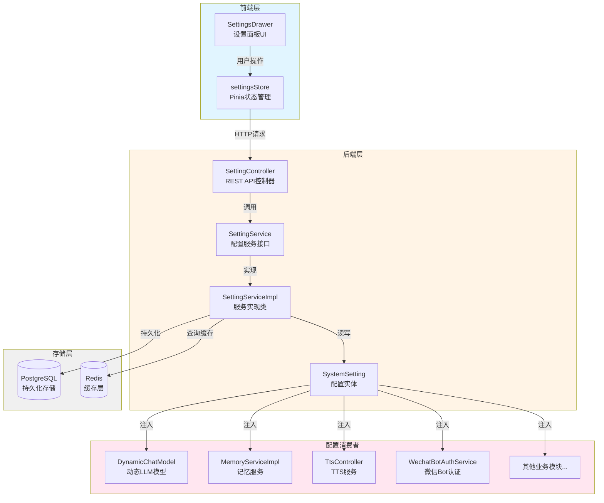
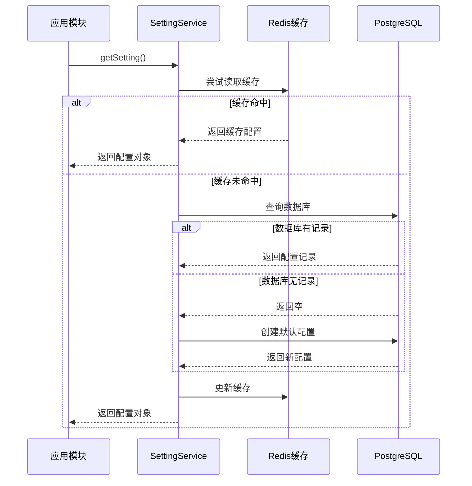
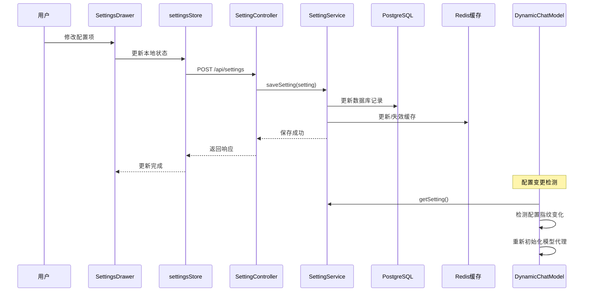
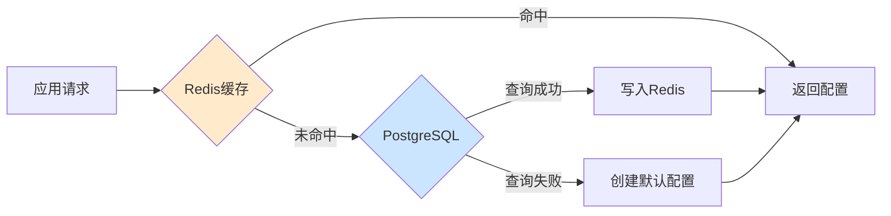
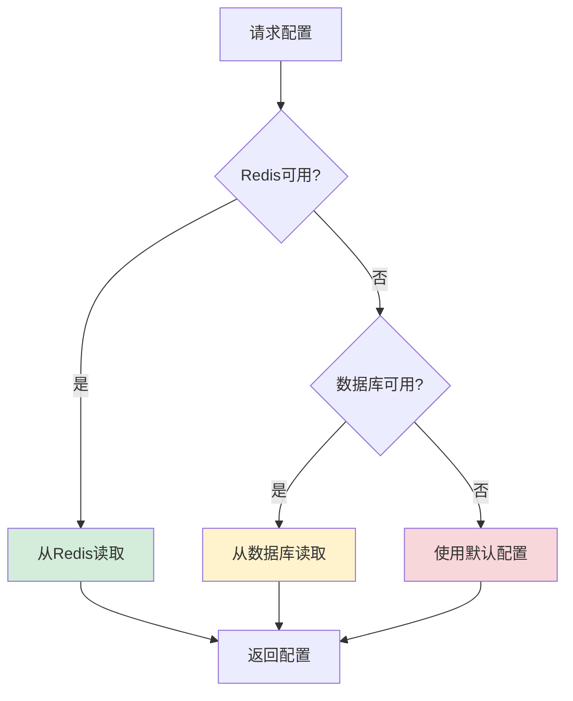

# 系统设置模块设计文档

## 1. 模块概述

系统设置模块是灵枢AI系统的核心配置管理组件,负责统一管理整个系统的各种配置参数。该模块采用集中化的方式管理系统各项配置,包括大语言模型(LLM)配置、向量嵌入(Embedding)配置、文本转语音(TTS)配置、自动语音识别(ASR)配置、主动问候配置、记忆模型配置以及微信机器人配置等。

### 1.1 主要功能
- **统一配置管理**: 所有系统配置集中在一个地方进行管理和维护
- **持久化存储**: 通过PostgreSQL数据库保证配置数据不丢失
- **高性能缓存**: 利用Redis缓存机制提高配置读取性能
- **动态更新**: 支持运行时动态修改配置而无需重启服务
- **RESTful API**: 提供标准化的API接口供前端和其他模块调用
- **实时生效**: 配置变更后能够被相关组件及时感知并应用

### 1.2 设计目标
- **集中化管理**: 避免配置分散在多个配置文件或环境变量中
- **高性能**: 通过多级缓存策略减少数据库访问压力
- **高可用**: 数据库作为最终存储保证数据可靠性,Redis故障时自动降级
- **易扩展**: 采用JSON格式存储配置,便于新增配置项而不需修改表结构
- **安全性**: 对敏感信息如API密钥等进行适当保护
- **灵活性**: 支持多种模型来源(Ollama/OpenAI等)的灵活切换

## 2. 架构设计

### 2.1 整体架构图

### 2.2 技术栈
- **后端框架**: Spring Boot + Spring Data JPA
- **数据库**: PostgreSQL (使用JSONB字段灵活存储配置)
- **缓存**: Redis (提供高性能读取)
- **前端框架**: Vue 3 + TypeScript + Naive UI组件库
- **状态管理**: Pinia (settingsStore管理全局配置状态)

## 3. 核心组件

### 3.1 数据模型设计

#### 3.1.1 SystemSetting实体
SystemSetting是配置管理的核心实体,采用单例模式设计,系统中只存在一条默认配置记录(ID为"DEFAULT")和一条微信Bot配置记录(ID为"WECHAT_BOT")。

**关键字段:**
- **id**: 主键标识,用于区分不同类型的配置(DEFAULT/WECHAT_BOT)
- **settings**: JSONB类型字段,以嵌套JSON结构存储所有配置项
- **updatedAt**: 最后更新时间戳,用于追踪配置变更历史

**设计优势:**
- 使用JSONB格式避免了频繁修改表结构
- 支持灵活的配置项扩展
- PostgreSQL的JSONB类型提供良好的查询性能

#### 3.1.2 配置数据结构
系统采用分层嵌套的JSON结构组织各类配置:

**顶层配置分类:**
- **llm**: 大语言模型相关配置
- **embedding**: 向量嵌入模型配置
- **proactive**: 主动问候功能配置
- **asr**: 语音识别服务配置
- **memoryModel**: 记忆模型专用配置
- **tts**: 文本转语音服务配置
- **wechatBotAccounts**: 微信机器人账户列表(数组)

这种结构设计使得不同类型的配置相互隔离,便于管理和维护。

### 3.2 服务层设计

#### 3.2.1 SettingService接口
SettingService定义了配置管理的核心能力,包含以下主要方法:

**基础配置管理:**
- `getSetting()`: 获取系统默认配置(DEFAULT)
- `saveSetting()`: 保存系统配置并同步到缓存和数据库

**微信Bot配置管理:**
- `getWechatBotSetting()`: 获取微信Bot专用配置
- `saveWechatBotSetting()`: 保存微信Bot配置
- `getWechatBotAccounts()`: 获取所有微信Bot账户列表
- `saveWechatBotAccount()`: 添加或更新单个Bot账户
- `removeWechatBotAccount()`: 删除指定Bot账户
- `getWechatBotAccount()`: 根据ID获取特定Bot账户

#### 3.2.2 SettingServiceImpl实现要点

**双重缓存策略:**
1. **一级缓存(Redis)**: 优先从Redis读取,提升性能
2. **二级存储(PostgreSQL)**: Redis不可用时降级到数据库
3. **写穿透**: 保存时同时更新数据库和Redis

**容错机制:**
- Redis连接失败时自动降级到数据库查询
- 数据库中无配置时自动创建默认配置
- 异常情况下记录详细日志便于排查

**初始化流程:**
- 应用启动时通过@PostConstruct注解触发init()方法
- 加载配置并记录关键信息到日志
- 确保系统在启动后即可正常使用配置

### 3.3 控制器层设计

#### 3.3.1 SettingController
提供RESTful API接口,处理前端的配置读写请求:

**主要端点:**
- `GET /api/settings`: 获取系统配置(扁平化返回,便于前端使用)
- `POST /api/settings`: 保存系统配置(接收扁平化DTO,转换为嵌套JSON存储)
- `GET /api/settings/asr`: 获取ASR语音识别配置
- `POST /api/settings/asr`: 保存ASR配置
- `GET /api/settings/skills`: 获取已加载的技能(Skills)列表

**数据转换:**
- 读取时: 将内部嵌套JSON结构转换为扁平化的DTO返回给前端
- 保存时: 将前端提交的扁平化DTO转换为嵌套JSON结构存入数据库

#### 3.3.2 SystemStatusController
- `GET /api/system/status`: 获取系统整体状态信息,包括各组件连通性检查

### 3.4 数据传输对象(DTO)

#### SystemSettingDTO
用于前后端数据交互的中间对象,特点:
- **扁平化结构**: 将所有配置项展开为单一层级,避免前端处理复杂嵌套
- **字段映射**: 每个字段对应具体的配置项(如chatModel、embedSource等)
- **可选字段**: 支持部分更新,未提供的字段保持原值不变

## 4. 配置项详解

### 4.1 LLM配置 (llm)
大语言模型相关配置,决定系统使用的AI模型及其连接方式。

| 字段 | 类型 | 默认值 | 说明 |
|------|------|--------|------|
| source | String | "ollama" | 模型来源,支持ollama/openai等 |
| model | String | "qwen2.5:latest" | 具体模型名称 |
| baseUrl | String | "http://localhost:11434" | 模型服务地址 |
| apiKey | String | "" | API密钥(OpenAI等需要) |
| enableThinking | Boolean | false | 是否启用思考模式(显示推理过程) |

### 4.2 Embedding配置 (embedding)
向量嵌入模型配置,用于文本向量化和语义搜索。

| 字段 | 类型 | 默认值 | 说明 |
|------|------|--------|------|
| source | String | "ollama" | 嵌入模型来源 |
| model | String | "nomic-embed-text" | 嵌入模型名称 |
| baseUrl | String | "http://localhost:11434" | 服务地址 |
| apiKey | String | "" | API密钥 |

### 4.3 主动问候配置 (proactive)
控制AI主动发起对话的行为策略。

| 字段 | 类型 | 默认值 | 说明 |
|------|------|--------|------|
| enabled | Boolean | true | 是否启用主动问候功能 |
| inactiveThresholdMinutes | Integer | 5 | 用户不活跃阈值(分钟),超过此时间视为不活跃 |
| greetingCooldownSeconds | Integer | 300 | 问候冷却时间(秒),避免频繁打扰 |
| inactiveCheckIntervalMs | Long | 3600000 | 不活跃状态检查间隔(毫秒) |

### 4.4 ASR配置 (asr)
自动语音识别服务配置。

| 字段 | 类型 | 默认值 | 说明 |
|------|------|--------|------|
| enabled | Boolean | false | 是否启用ASR功能 |
| url | String | "http://localhost:50001" | ASR服务地址 |

### 4.5 记忆模型配置 (memoryModel)
专用于记忆提取和处理的模型配置,可与对话模型分离以实现更优性能。

| 字段 | 类型 | 默认值 | 说明 |
|------|------|--------|------|
| source | String | "" | 记忆模型来源,为空时使用对话模型 |
| model | String | "" | 记忆模型名称 |
| baseUrl | String | "" | 服务地址 |
| apiKey | String | "" | API密钥 |

### 4.6 TTS配置 (tts)
文本转语音服务配置。

| 字段 | 类型 | 默认值 | 说明 |
|------|------|--------|------|
| enabled | Boolean | false | 是否启用TTS功能 |
| baseUrl | String | "http://localhost:5050" | TTS服务地址 |
| apiKey | String | "" | API密钥 |
| defaultVoice | String | "alloy" | 默认语音角色 |
| defaultSpeed | Double | 1.0 | 默认语速(1.0为标准速度) |
| defaultFormat | String | "mp3" | 默认音频格式 |

### 4.7 微信Bot配置 (wechatBotAccounts)
微信机器人账户配置列表,支持多账户管理。

**账户字段:**
| 字段 | 类型 | 默认值 | 说明 |
|------|------|--------|------|
| accountId | String | UUID自动生成 | 账户唯一标识符 |
| botToken | String | "" | Bot认证令牌 |
| baseUrl | String | "https://ilinkai.weixin.qq.com" | 微信API服务地址 |
| status | String | "wait" | 连接状态(wait/connected/disconnected) |
| lastLoginTime | String | "" | 最后登录时间 |
| nickname | String | "" | 微信昵称 |

## 5. 工作流程

### 5.1 配置读取流程

**流程说明:**
1. 应用模块调用SettingService获取配置
2. 服务层首先尝试从Redis缓存读取
3. 若缓存命中则直接返回,性能最优
4. 若缓存未命中则查询PostgreSQL数据库
5. 数据库中无记录时自动创建默认配置
6. 将读取到的配置写入Redis缓存供下次使用
7. 返回配置对象给调用方

### 5.2 配置保存流程

**流程说明:**
1. 用户在设置面板修改配置项
2. Pinia store更新本地响应式状态
3. 调用saveSettings()发送POST请求到后端
4. Controller接收扁平化DTO数据
5. Service将DTO转换为嵌套JSON结构
6. 同时更新PostgreSQL数据库和Redis缓存
7. 返回成功响应给前端
8. DynamicChatModel等组件检测到配置变化后重新初始化

### 5.3 动态配置生效机制

**配置指纹检测:**
- DynamicChatModel维护一个配置指纹字符串
- 每次使用前对比当前配置与上次记录的指纹
- 指纹由关键配置项(source/model/baseUrl/apiKey等)组合而成

**自动重载:**
- LLM配置变更时,DynamicChatModel自动重建模型代理
- 记忆模型配置变更时,DynamicMemoryModel自动切换模型
- 其他配置在下次使用时自动应用新值
- 整个过程无需重启服务,实现真正的热更新

## 6. 前端实现

### 6.1 状态管理 (settingsStore.ts)

使用Pinia进行全局状态管理,主要包含:

**数据结构定义:**
- `SystemSettings`接口: 定义系统配置的扁平化结构
- `AsrSettings`接口: 定义ASR语音识别配置结构

**核心方法:**
- `fetchSettings()`: 从后端获取最新配置
- `saveSettings()`: 将本地修改保存到后端
- `fetchAsrSettings()`: 获取ASR专项配置
- `saveAsrSettings()`: 保存ASR配置
- `toggleThinking()`: 快速切换思考模式开关

**状态特性:**
- 响应式数据绑定,UI自动更新
- 异步加载机制,避免阻塞页面渲染
- 错误处理完善,网络异常时给出提示

### 6.2 用户界面 (SettingsDrawer.vue)

基于Naive UI组件库构建的设置面板,特点:

**功能模块:**
- LLM模型配置区: 支持Ollama/OpenAI源切换
- Embedding模型配置区: 独立配置向量模型
- 主动问候配置区: 调整问候策略参数
- TTS语音配置区: 设置语音合成参数
- ASR语音识别配置区: 配置语音输入服务

**交互体验:**
- 实时保存: 配置修改后自动提交到后端
- 表单验证: 确保输入数据的合法性
- 视觉反馈: 保存成功/失败时给予明确提示
- 分组展示: 按功能模块分组,层次清晰

## 7. 安全考虑

### 7.1 敏感信息保护

**传输安全:**
- 生产环境应启用HTTPS加密传输
- API密钥等敏感信息不在URL中传递

**存储安全:**
- 数据库中敏感字段建议加密存储
- Redis缓存设置合理的过期时间
- 避免在日志中输出完整的API密钥

**访问控制:**
- 配置修改接口需要身份认证
- 仅授权用户可修改系统配置
- 敏感操作记录审计日志

### 7.2 最佳实践
- 定期轮换API密钥
- 使用环境变量管理极度敏感的凭据
- 实施最小权限原则,只暴露必要配置项

## 8. 性能优化

### 8.1 多级缓存策略

**缓存层级:**
1. **L1 - Redis缓存**: 毫秒级响应,减轻数据库压力
2. **L2 - PostgreSQL**: 持久化存储,保证数据可靠性
3. **内存缓存**: 应用内临时缓存,进一步加速高频访问

**缓存策略:**
- 读取时: 优先查Redis,未命中再查数据库并回填缓存
- 写入时: 同时更新数据库和Redis,保证一致性
- 失效时: 配置更新后立即失效旧缓存

### 8.2 异步处理
- 配置保存操作异步执行,不阻塞用户界面
- 批量更新相关配置减少数据库往返次数
- 后台定时任务异步清理过期缓存

### 8.3 连接池优化
- 数据库连接池合理配置最大/最小连接数
- Redis连接复用,避免频繁建立连接
- HTTP客户端连接池管理外部服务调用

## 9. 错误处理与容错

### 9.1 分级降级策略

**降级路径:**
1. **正常路径**: Redis → 返回配置
2. **一级降级**: Redis故障 → 查询数据库 → 返回配置
3. **二级降级**: 数据库也故障 → 使用内置默认配置

### 9.2 异常处理

**常见异常场景:**
- Redis连接超时或拒绝连接
- 数据库查询超时或连接池耗尽
- 网络请求外部服务超时
- JSON解析失败或数据格式错误

**处理策略:**
- 捕获异常并记录详细日志(含堆栈信息)
- 提供有意义的错误消息便于排查
- 必要时重试机制(如网络波动)
- 优雅降级保证系统基本可用

### 9.3 日志记录

**日志级别:**
- INFO: 配置加载、保存等正常操作
- WARN: 缓存失效、降级等非严重问题
- ERROR: 数据库连接失败等严重异常

**关键日志点:**
- 应用启动时配置初始化
- 配置变更历史记录
- 异常情况详细信息
- 性能瓶颈监控数据

## 10. 扩展性设计

### 10.1 新增配置项流程

当需要添加新的配置项时,按以下步骤操作:

**后端改造:**
1. 在SystemSetting实体中添加对应的getter/setter方法
2. 在SystemSettingDTO中添加相应字段
3. 在SettingController的saveSetting方法中添加字段映射逻辑
4. 在SettingController的getSetting方法中添加字段返回逻辑
5. 编写单元测试验证新功能

**前端改造:**
1. 在settingsStore.ts的SystemSettings接口中添加字段定义
2. 在SettingsDrawer.vue中添加对应的UI控件
3. 绑定双向数据流,确保修改能正确保存
4. 添加必要的表单验证规则

**优势:**
- JSONB存储无需修改数据库表结构
- 前后端解耦,可独立演进
- 向后兼容,旧版本不受影响

### 10.2 多租户支持潜力

当前架构已具备多租户扩展能力:
- SystemSetting的id字段可用于区分不同租户
- 只需扩展ID生成策略和权限控制逻辑
- 缓存键可增加租户前缀避免冲突
- 数据库查询增加租户过滤条件

### 10.3 配置版本管理

未来可扩展方向:
- 配置变更历史记录
- 配置回滚功能
- 配置模板管理
- 配置导入导出

## 11. 监控与维护

### 11.1 健康检查

**系统状态接口:**
- `GET /api/system/status` 提供全面的系统健康检查
- 检查LLM服务连通性
- 检查Embedding服务可用性
- 检查Neo4j图数据库连接状态
- 检查Redis缓存服务状态
- 检查PostgreSQL数据库连接

**监控指标:**
- 配置读取响应时间
- 缓存命中率统计
- 数据库查询耗时
- 配置变更频率

### 11.2 配置备份与恢复

**备份策略:**
- 定期导出配置快照
- 重大变更前手动备份
- 配置变更记录审计日志

**恢复机制:**
- 支持从备份文件导入配置
- 一键恢复到历史版本
- 紧急情况下使用默认配置

## 12. 最佳实践与建议

### 12.1 配置管理规范

**设计原则:**
- 遵循最小权限原则,只暴露必要的配置项给用户
- 提供合理的默认值,降低初次使用门槛
- 配置项命名清晰直观,避免歧义
- 重要配置变更要有审计追踪

**开发规范:**
- 保持前后端数据结构的一致性
- 添加充分的单元测试覆盖核心逻辑
- 文档与代码同步更新
- 敏感信息不在代码中硬编码

### 12.2 运维建议

**日常维护:**
- 定期检查Redis缓存命中率,优化缓存策略
- 监控数据库慢查询,优化索引
- 关注配置变更日志,及时发现异常操作
- 定期清理过期的缓存数据

**故障排查:**
- 配置加载失败时检查日志中的WARN/ERROR信息
- Redis故障时观察系统是否自动降级到数据库
- 配置不生效时检查配置指纹是否正确更新
- 网络问题时检查各服务地址配置是否正确

### 12.3 性能调优

**优化方向:**
- 根据实际负载调整Redis内存上限
- 优化数据库JSONB字段的查询性能
- 合理使用连接池参数
- 异步化处理耗时操作

---

*本文档最后更新于2026年4月14日,反映了当前系统设置模块的实际实现情况。*