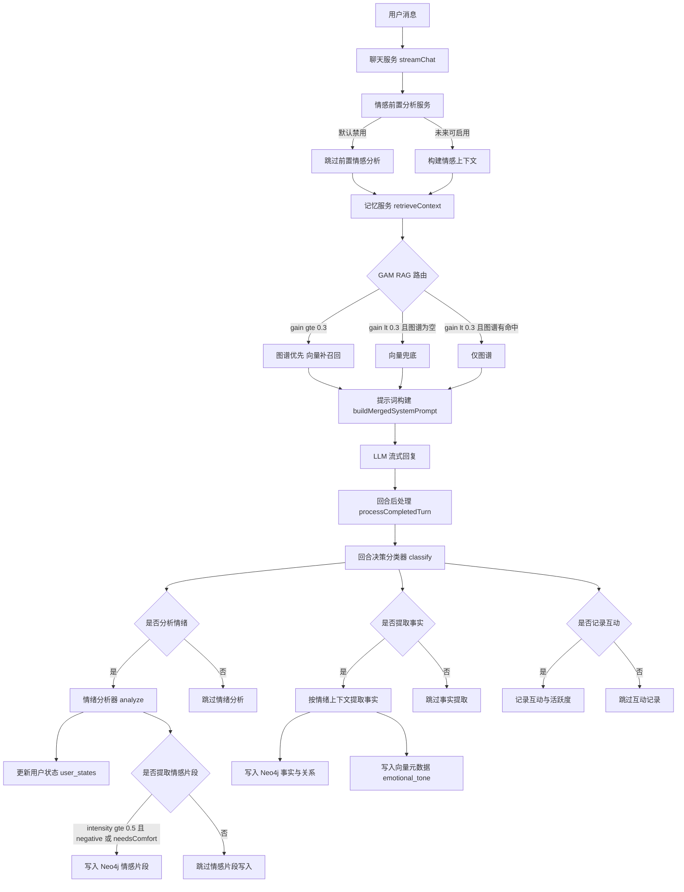

# 记忆系统设计文档

> 版本: v3.3  
> 日期: 2026-04-20  
> 状态: **已实施**  
> 更新说明: 补充GAM-RAG检索路由机制、修正情感分析架构描述、对齐实际实现细节

> 运行态说明（2026-04-20，与当前代码一致）:
> 1. `EmotionPreAnalysisService` 默认不在主聊天链路执行（保留实现，当前禁用）。
> 2. 回合内情感判定由 `TurnPostProcessingServiceImpl` 的 `TurnDecisionClassifier` 决策是否触发。
> 3. 实际执行情感分类的是 `EmotionAnalyzer`（LLM 接口），发生在回合后处理阶段。
> 4. `EmotionContextCache` / `EmotionContextAnalyzer` 为保留能力，主链路默认不注入前置情感 prompt。

---
## 零、核心链路图（Mermaid）



### 0.1 决策条件速查

| 判断点 | 条件 | 结果 |
|---|---|---|
| Emotion pre-analysis | 当前默认禁用 | 主链路不做前置情绪分析 |
| GAM-RAG 路由 | `gain >= 0.3` | 图谱优先 + 向量补召回 |
| GAM-RAG 路由 | `gain < 0.3` 且图谱空 | 向量兜底 |
| GAM-RAG 路由 | `gain < 0.3` 且图谱非空 | 仅图谱 |
| 是否情感分析 | `TurnDecisionClassifier.analyzeEmotion == true` | 调用 `EmotionAnalyzer` |
| 是否写 EmotionalEpisode | `intensity >= 0.5` 且 (`negative` 或 `needsComfort=true`) | 写 Neo4j `EmotionalEpisode` |
| 是否提取事实 | `TurnDecisionClassifier.extractFacts == true` | 走 `extractFacts` 并可能写 Fact/向量元数据 |
| 是否记互动 | `TurnDecisionClassifier.recordInteraction == true` | 更新互动计数/活跃度 |

## 一、优化目标

### 1.1 核心目标

1. **情感感知的事实提取**：根据情感状态调整提取策略和置信度
2. **场景记忆增强**：存储完整的情感场景，支持情感关联检索
3. **记忆生命周期管理**：实现记忆巩固与衰减机制，每小时自动执行
4. **富上下文提取 (Context-Rich Extraction)**：确保每个事实片段包含完整的地点、对象和前置条件，避免语义碎片化
5. **GAM-RAG 检索路由**：基于增益阈值(Graph Activation Memory - Retrieval Augmented Generation)的图谱优先+向量补召回策略

### 1.2 预期效果

| 场景 | 优化前 | 优化后 |
|------|--------|--------|
| 用户说"压力大" | AI 正常回复 | AI 检索到之前的应对方式，主动建议 |
| 用户情绪激动 | 极端表述被存储为事实 | 标记为 volatile，等待后续确认 |
| 用户多次提及同一事实 | 重复存储 | 巩固记忆，提升权重 |
| 长期未访问的事实 | 永久保留 | 逐渐衰减，自动归档/冷却 |
| 计划变更/取消 | 仅删除直接冲突的事实，产生“僵尸记忆” | 联级识别依存事实，同步更新关联状态 |

### 1.3 情感分析架构说明

**情感前置分析 (EmotionPreAnalysisService)**：

该服务实现了基于对话历史的情感上下文分析，但**当前默认禁用**。设计初衷是：如果主对话模型改用了情感微调后的大模型，就不需要前置情感分析，因为情感微调后的模型已具备不错的情感理解能力。

当前禁用的目的是**提升响应速度**，避免在同步对话流程中增加额外的 LLM 调用。该服务代码完整保留，未来可能根据模型能力重新启用。

```java
// ChatServiceImpl.java 第213-216行
// 情感前置分析已禁用，使用情感微调后的 LLM
// com.lingshu.ai.core.dto.EmotionContextResult emotionResult = emotionPreAnalysisService.analyzeBeforeResponse(userId, safeMessage, session.getId());
// com.lingshu.ai.core.dto.EmotionAnalysis preAnalyzedEmotion = emotionResult != null ? emotionResult.toEmotionAnalysis() : null;
com.lingshu.ai.core.dto.EmotionAnalysis preAnalyzedEmotion = null;
```

**当前情感分析流程**：

情感分析在**回合后处理阶段**（[TurnPostProcessingServiceImpl](file:///d:/Project/LingShu-AI/backend/lingshu-core/src/main/java/com/lingshu/ai/core/service/impl/TurnPostProcessingServiceImpl.java)）异步执行，用于：
- 事实提取时的情感感知策略调整
- 情感片段 (EmotionalEpisode) 的存储
- 用户亲密度 (Affinity) 的更新

**情感分析相关服务**：

| 服务 | 状态 | 用途 |
|------|------|------|
| `EmotionPreAnalysisService` | 保留但禁用 | 对话前情感分析，未来可能启用 |
| `EmotionAnalyzer` | 活跃使用 | 回合后处理阶段的情感分析 |
| `EmotionContextAnalyzer` | 活跃使用 | 基于对话历史的情感上下文分析 |
| `EmotionContextCache` | 活跃使用 | 内存级情感上下文缓存(30分钟过期) |

---

## 二、优化架构设计

### 2.1 整体架构

```
┌─────────────────────────────────────────────────────────────────────────────┐
│                        情感感知记忆系统架构                                   │
├─────────────────────────────────────────────────────────────────────────────┤
│                                                                              │
│    用户消息                                                                  │
│        │                                                                     │
│        ▼                                                                     │
│  ┌─────────────────────────────────────────────────────────────────────┐   │
│  │              Stage 1: 对话生成 (同步)                                │   │
│  │                                                                      │   │
│  │  • 记忆检索 (retrieveContext) - GAM-RAG 路由策略                     │   │
│  │  • 关系提示构建 (getRelationshipPrompt)                              │   │
│  │  • System Prompt 合并                                                │   │
│  │  • LLM 流式回复                                                      │   │
│  │                                                                      │   │
│  │  注意：情感前置分析已禁用，避免同步流程增加额外LLM调用                │   │
│  └─────────────────────────────────────────────────────────────────────┘   │
│        │                                                                     │
│        ▼ 异步后处理                                                          │
│  ┌─────────────────────────────────────────────────────────────────────┐   │
│  │              Stage 2: 回合后处理决策 (异步)                          │   │
│  │                                                                      │   │
│  │  TurnDecisionClassifier 判断是否触发：                               │   │
│  │  - analyzeEmotion: 是否需要情感分析                                  │   │
│  │  - extractFacts: 是否需要事实提取                                    │   │
│  │  - recordInteraction: 是否记录互动                                   │   │
│  └─────────────────────────────────────────────────────────────────────┘   │
│        │                                                                     │
│        ├──────────────────┬──────────────────┐                              │
│        ▼                  ▼                  ▼                              │
│  ┌──────────────┐  ┌──────────────┐  ┌──────────────┐                      │
│  │ 情感分析     │  │ 事实提取     │  │ 情感片段提取 │                      │
│  │ (可选)       │  │ (可选)       │  │ (可选)       │                      │
│  └──────────────┘  └──────────────┘  └──────────────┘                      │
│        │                  │                  │                              │
│        │                  ▼                  ▼                              │
│        │            ┌──────────────────────────────┐                       │
│        │            │ EmotionAwareFactExtractor    │                       │
│        │            │ - 基于情感状态调整提取策略    │                       │
│        │            │ - 时间转换（相对→绝对）       │                       │
│        │            │ - 置信度评估                  │                       │
│        │            └──────────────────────────────┘                       │
│        │                  │                                               │
│        │                  ▼                                               │
│        │            ┌──────────────────────────────┐                       │
│        │            │ EmotionalEpisodeExtractor    │                       │
│        │            │ - 提取完整情感事件            │                       │
│        │            │ - 包含触发事件、应对机制等    │                       │
│        │            └──────────────────────────────┘                       │
│        │                  │                                               │
│        ▼                  ▼                                               │
│  ┌──────────────────────────────────────────────────────────────────┐    │
│  │         Stage 3: 记忆存储 (Neo4j + pgvector)                     │    │
│  │                                                                   │    │
│  │  • FactNode: 事实节点（带情感标签、置信度、TTL）                   │    │
│  │  • EmotionalEpisode: 情感片段（Neo4j 独立节点）                   │    │
│  │  • 向量嵌入：pgvector episodic_memory_vectors 表                 │    │
│  │  • 关系维护：RELATED_TO, SUPERSEDES, CONTRADICTS                  │    │
│  └──────────────────────────────────────────────────────────────────┘    │
│                                                                              │
│    ══════════════════════════════════════════════════════════════════════   │
│                                                                              │
│    后台任务 (每小时执行 @Scheduled cron = "0 0 * * * *")                    │
│    ┌───────────────────────────────────────────────────────────────────┐   │
│    │ Stage 4: 记忆生命周期管理 (MemoryMaintenanceScheduler)             │   │
│    │                                                                    │   │
│    │ • 活跃度计算：指数衰减 (30天半衰期)                                 │   │
│    │ • 状态流转：active(>0.75) → stable(>0.3) → cool(<0.3) → archived   │   │
│    │ • 冲突管理：维护 superseded 和 conflicted 状态                      │   │
│    │ • 语义分类：自动识别 9 种 TopicKey 和 9 种 SubType                  │   │
│    │ • 重要性衰减：archived 事实重要性 × 0.85                           │   │
│    └───────────────────────────────────────────────────────────────────┘   │
│                                                                              │
│    ══════════════════════════════════════════════════════════════════════   │
│                                                                              │
│    前端表现与治理层 (Governance & Presentation Layer)                         │
│    ┌───────────────────────────────────────────────────────────────────┐   │
│    │ Stage 5: 记忆可视化与治理                                          │   │
│    │                                                                    │   │
│    │ • 3D 银河系图谱 (InsightView): 节点轨道布局 (User-Topic-Fact)       │   │
│    │ • 治理后台 (GovernanceView): 对全量记忆的分页审计、归档与恢复        │   │
│    │ • 实时脉冲 (StreamPanel): 对话过程中展示后端事实提取的实时 DTO       │   │
│    └───────────────────────────────────────────────────────────────────┘   │
│                                                                              │
└─────────────────────────────────────────────────────────────────────────────┘
```

### 2.2 记忆分层模型

```
┌─────────────────────────────────────────────────────────────────────┐
│                        记忆分层架构                                   │
├─────────────────────────────────────────────────────────────────────┤
│                                                                      │
│  ┌─────────────────────────────────────────────────────────────┐   │
│  │                    L1: 工作记忆 (Working Memory)             │   │
│  │                                                               │   │
│  │  存储: 内存 (会话级)                                          │   │
│  │  内容:                                                        │   │
│  │  • 当前对话上下文 (最近5轮)                                   │   │
│  │  • 实时情感状态                                               │   │
│  │  • 临时注意力焦点                                             │   │
│  │                                                               │   │
│  │  生命周期: 会话结束即清除                                      │   │
│  │  检索方式: 直接内存访问                                        │   │
│  └─────────────────────────────────────────────────────────────┘   │
│                              │                                       │
│                              ▼ 记忆巩固                              │
│  ┌─────────────────────────────────────────────────────────────┐   │
│  │                    L2: 情景记忆 (Episodic Memory)            │   │
│  │                                                               │   │
│  │  存储: Neo4j + pgvector (episodic_memory_vectors 表)         │   │
│  │  内容:                                                        │   │
│  │  • 带时间戳的事件片段                                         │   │
│  │  • 情感标签 + 强度                                            │   │
│  │  • 触发关键词                                                 │   │
│  │  • 应对机制 + 结果情绪                                        │   │
│  │                                                               │   │
│  │  生命周期: 短期→长期转化，带情感衰减                           │   │
│  │  检索方式: 语义相似度 + 情感上下文匹配                         │   │
│  └─────────────────────────────────────────────────────────────┘   │
│                              │                                       │
│                              ▼ 提取抽象                              │
│  ┌─────────────────────────────────────────────────────────────┐   │
│  │                    L3: 语义记忆 (Semantic Memory)            │   │
│  │                                                               │   │
│  │  存储: Neo4j + pgvector (memory_segments 表)                 │   │
│  │  内容:                                                        │   │
│  │  • 用户画像事实 (偏好、身份、关系)                             │   │
│  │  • 情感关联权重                                               │   │
│  │  • 置信度 + 来源追溯                                          │   │
│  │                                                               │   │
│  │  生命周期: 长期持久化，支持修正和遗忘                          │   │
│  │  检索方式: 图谱遍历 + 语义检索                                 │   │
│  └─────────────────────────────────────────────────────────────┘   │
│                                                                      │
└─────────────────────────────────────────────────────────────────────┘
```

---

## 三、核心模块设计

### 3.1 情感上下文窗口（已实现但未在前置阶段使用）

#### 数据结构

```java
public class EmotionContext {
    private String userId;
    private Deque<EmotionSnapshot> recentEmotions;  // 滑动窗口，保留最近5轮
    private Double cumulativeIntensity;              // 累积情绪强度
    private String emotionTrend;                     // improving/declining/stable
    private LocalDateTime lastUpdate;
    
    public static class EmotionSnapshot {
        private String emotion;           // positive/negative/neutral
        private Double intensity;         // 0.0-1.0
        private Boolean needsComfort;     // 是否需要安慰
        private List<String> keywords;    // 关键词列表
        private String triggerKeyword;    // 主要触发词（前3个关键词的拼接）
        private LocalDateTime timestamp;
    }
    
    public void addSnapshot(EmotionSnapshot snapshot) {
        if (recentEmotions.size() >= 5) {
            recentEmotions.removeFirst();
        }
        recentEmotions.addLast(snapshot);
        recalculateTrend();
    }
}
```

#### 实现文件

- [EmotionContext.java](../backend/lingshu-core/src/main/java/com/lingshu/ai/core/dto/EmotionContext.java)
- [EmotionContextCache.java](../backend/lingshu-core/src/main/java/com/lingshu/ai/core/service/EmotionContextCache.java)
- [EmotionContextAnalyzer.java](../backend/lingshu-core/src/main/java/com/lingshu/ai/core/service/EmotionContextAnalyzer.java)
- [EmotionContextResult.java](../backend/lingshu-core/src/main/java/com/lingshu/ai/core/dto/EmotionContextResult.java)

**注意**：虽然实现了情感上下文窗口和预分析服务（`EmotionPreAnalysisService`），但在实际对话流程中已被禁用。情感上下文目前主要用于回合后处理阶段的情感分析和事实提取。

### 3.2 情感分析与回合后处理决策

#### 核心逻辑

情感分析不再在对话前执行，而是在**回合后处理阶段**通过 `TurnDecisionClassifier` 智能决策是否触发：

```java
@Service
public class TurnPostProcessingServiceImpl implements TurnPostProcessingService {
    
    // 回合后处理决策器接口
    public interface TurnDecisionClassifier {
        @SystemMessage("""
                你是灵枢 (LingShu-AI) 的“回合后处理决策器”。
                你的唯一任务是在一轮对话结束后，判断是否触发以下三项：
                1. analyzeEmotion - 只要用户表达了明显情绪、态度、压力、满意/不满等主观状态
                2. extractFacts - 只要用户透露了“可被后续对话复用”的个人信息或阶段性状态
                3. recordInteraction - 绝大多数有效对话都应设为 true
                
                你必须依据整轮语义判断，并直接返回严格 JSON。
                """)
        TurnPostProcessorDecision classify(
            @V("userMessage") String userMessage,
            @V("assistantResponse") String assistantResponse
        );
    }
    
    public void processCompletedTurn(String userId, String userMessage, 
                                     String assistantResponse, 
                                     EmotionAnalysis preAnalyzedEmotion) {
        // 1. 决策是否执行各项后处理 (classify)
        TurnPostProcessorDecision decision = buildDecisionClassifier().classify(
            userMessage, assistantResponse
        );
        
        // 2. 如果需要情感分析
        EmotionAnalysis emotionResult = preAnalyzedEmotion;
        if (decision.isAnalyzeEmotion()) {
            if (emotionResult == null) {
                emotionResult = analyzeEmotion(userId, userMessage); // 包含 extractAndSaveEpisode
            } else {
                applyEmotionResult(userId, userMessage, emotionResult);
            }
        }
        
        // 3. 如果需要事实提取
        if (decision.isExtractFacts()) {
            memoryService.extractFacts(userId, userMessage, assistantResponse, emotionResult);
        }
        
        // 4. 记录互动
        if (decision.isRecordInteraction()) {
            affinityService.recordInteraction(userId);
        }
    }
}
```

#### 实现文件

- [TurnPostProcessingServiceImpl.java](../backend/lingshu-core/src/main/java/com/lingshu/ai/core/service/impl/TurnPostProcessingServiceImpl.java)
- [TurnPostProcessorDecision.java](../backend/lingshu-core/src/main/java/com/lingshu/ai/core/dto/TurnPostProcessorDecision.java)
- [EmotionPreAnalysisService.java](../backend/lingshu-core/src/main/java/com/lingshu/ai/core/service/EmotionPreAnalysisService.java) - 已实现但未在对话流程中使用

### 3.3 情感感知事实提取

#### 事实类型枚举（9种）

```java
public enum FactType {
    IDENTITY("身份事实", "用户的身份信息，如名字、职业、年龄等"),
    PREFERENCE("偏好事实", "用户的喜好、兴趣、习惯等"),
    EMOTIONAL_EPISODE("情感片段", "用户经历的情感事件，包含情绪状态和触发因素"),
    RELATIONSHIP("关系事实", "用户与他人或事物的关系信息"),
    GOAL("目标事实", "用户的目标、计划、愿望等"),
    EVENT("事件事实", "用户经历的重要事件，必须填写eventTime字段"),
    STATE("状态事实", "用户的当前状态，如正在做的事情"),
    TODO("待办事项", "用户需要完成的任务、提醒事项，必须填写eventTime作为截止时间"),
    VOLATILE("临时事实", "情绪激动时的极端表述，需要后续确认");
}
```

#### 置信度枚举

```java
public enum ConfidenceLevel {
    HIGH(0.9, "高置信度", "平静状态下的明确陈述"),
    MEDIUM(0.7, "中等置信度", "一般情况下的陈述"),
    LOW(0.5, "低置信度", "情绪激动或模糊的陈述"),
    VOLATILE(0.3, "待确认", "情绪激动时的极端表述，需要后续确认");
    
    // 根据情感状态自动推断置信度
    public static ConfidenceLevel fromEmotionState(String emotionType, Double intensity) {
        if (emotionType == null || "neutral".equalsIgnoreCase(emotionType)) {
            return HIGH;
        }
        if ("negative".equalsIgnoreCase(emotionType) && intensity != null && intensity > 0.7) {
            return VOLATILE;
        }
        if (intensity != null && intensity > 0.6) {
            return LOW;
        }
        return MEDIUM;
    }
}
```

#### 提取器接口

```java
public interface EmotionAwareFactExtractor {
    
    @SystemMessage("""
        你是灵枢的记忆系统核心组件：情感感知事实提取器。
        
        【当前时间上下文】
        当前日期时间: {{currentDateTime}}
        当前星期: {{currentDayOfWeek}}
        
        【当前情感上下文】
        情绪类型: {{emotionType}}
        情绪强度: {{emotionIntensity}}
        情绪趋势: {{emotionTrend}}
        触发关键词: {{triggerKeywords}}
        是否需要安慰: {{needsComfort}}
        
        【时间转换规则 - 极其重要】
        当用户消息中包含相对时间词时，你必须根据【当前时间上下文】将其转换为绝对日期时间：
        - "今天" → 转换为当前日期
        - "昨天" → 转换为当前日期减1天
        - "前天" → 转换为当前日期减2天
        - "明天" → 转换为当前日期加1天
        - "刚才/刚刚" → 转换为当前时间
        - "今天中午" → 转换为当前日期 12:00
        - "今天晚上" → 转换为当前日期 19:00
        
        【情感对提取策略的影响】
        1. 情绪强度 > 0.7 时:
           - 用户可能处于情绪激动状态
           - 提取的事实标记为 volatile: true
           - 优先提取情绪触发事件，而非一般偏好
        
        2. 负面情绪 + needsComfort = true 时:
           - 优先提取压力源、困扰事件
           - 标记为 EMOTIONAL_EPISODE 类型
           - 同时提取应对机制（如果有）
        
        3. 平静或正面情绪时:
           - 正常提取身份、偏好、关系事实
           - 标记为 IDENTITY、PREFERENCE、RELATIONSHIP 等类型
           - 置信度设为 HIGH
        
        【严格排除标准 - 绝对不能作为事实提取】
        1. 疑问句/查询指令（如："昨天我干嘛了吗"、"回忆上次对话"）
        2. 系统或工具控制指令（如："帮我查一下"、"打开设置"）
        3. 闲聊、寒暄、无意义填充词（如："好的"、"嗯嗯"、"哈哈"）
        4. 虚构、假设、条件语态的句子
        
        【富上下文要求 - 极其重要】
        1. 提取的事实必须是**自解释**的。不要假设系统记得之前的上下文。
        2. 如果用户说“我明天去上海参加展会”，不要只提取“去上海”，应提取为“用户计划在 2026-04-15 在上海参加展会”。
        3. 必须包含地点、参与者、持续时间等关键元数据到 content 文本中。
        
        【返回格式】
        {
          "newFacts": [
            {
              "content": "事实内容（包含绝对日期）",
              "type": "FACT_TYPE",
              "confidence": "CONFIDENCE_LEVEL",
              "volatile": true/false,
              "emotionalContext": "情感上下文描述",
              "triggerKeywords": ["关键词1", "关键词2"],
              "eventTime": "2026-04-06T12:00:00"  // 仅当事件有明确时间时填写
            }
          ],
          "deletedFactIds": [1, 2, 3],
          "analysis": "分析简述",
          "emotionGatePassed": true/false,
          "emotionGateReason": "情感门控判断原因"
        }
        """)
    ExtractionResult analyzeWithEmotion(
        @V("message") String message,
        @V("assistantResponse") String assistantResponse,
        @V("currentFacts") String currentFacts,
        @V("emotionType") String emotionType,
        @V("emotionIntensity") Double emotionIntensity,
        @V("emotionTrend") String emotionTrend,
        @V("triggerKeywords") String triggerKeywords,
        @V("needsComfort") Boolean needsComfort,
        @V("currentDateTime") String currentDateTime,
        @V("currentDayOfWeek") String currentDayOfWeek
    );
}
```

#### 实现文件

- [FactType.java](../backend/lingshu-core/src/main/java/com/lingshu/ai/core/dto/FactType.java)
- [ConfidenceLevel.java](../backend/lingshu-core/src/main/java/com/lingshu/ai/core/dto/ConfidenceLevel.java)
- [ExtractionResult.java](../backend/lingshu-core/src/main/java/com/lingshu/ai/core/dto/ExtractionResult.java)
- [EmotionAwareFactExtractor.java](../backend/lingshu-core/src/main/java/com/lingshu/ai/core/service/EmotionAwareFactExtractor.java)

### 3.4 情感片段模型

#### 数据结构

```java
@Node("EmotionalEpisode")
public class EmotionalEpisode {
    @Id @GeneratedValue
    private Long id;
    
    private String triggerEvent;        // 触发事件："工作压力大"
    private String emotionType;         // 情绪类型：positive/negative/neutral
    private Double emotionIntensity;    // 情绪强度：0.7
    private String emotionTrend;        // 情绪趋势：improving/declining/stable
    private Set<String> triggerKeywords; // 触发词：["压力", "累"]
    
    private String userResponse;        // 用户反应描述
    private String copingMechanism;     // 应对机制："念诗"
    
    private String outcomeEmotion;      // 结果情绪："安心"
    private Double outcomeIntensity;    // 结果情绪强度
    
    private String contextSummary;      // 上下文摘要
    
    private LocalDateTime occurredAt;   // 发生时间
    private LocalDateTime lastRecalledAt; // 最后回忆时间
    
    private double importance;          // 重要性：0.0-1.0
    private double recallCount;         // 回忆次数
    private String status;              // 状态：active/archived
    
    @Relationship(type = "EXPERIENCED_BY", direction = Relationship.Direction.OUTGOING)
    private UserNode user;              // 关联用户节点
    
    public void incrementRecallCount() {
        this.recallCount++;
        this.lastRecalledAt = LocalDateTime.now();
    }
}
```

#### 提取器接口

```java
public interface EmotionalEpisodeExtractor {
    
    @SystemMessage("""
        你是灵枢的情感片段提取模块。你的任务是从用户消息中提取完整的情感事件。
        
        【情感片段定义】
        情感片段是一个带有情感上下文的记忆单元，包含：
        1. 触发事件: 引发情绪的具体事件或情境
        2. 情绪类型: positive/negative/neutral
        3. 情绪强度: 0.0-1.0
        4. 触发关键词: 引发情绪的关键词
        5. 用户反应: 用户对事件的行为或心理反应
        6. 应对机制: 用户采取的应对方式（如果有）
        7. 结果情绪: 事件后的情绪状态变化
        
        【提取条件】
        只有在以下情况才提取情感片段：
        1. 用户明确表达了情绪体验
        2. 情绪强度 >= 0.5
        3. 存在明确的触发事件
        4. 用户需要安慰 = true
        
        【不需要提取的情况】
        1. 简单的事实陈述
        2. 情绪强度 < 0.5
        3. 没有明确的触发事件
        4. 一般性的偏好表达
        
        【返回格式】
        {
            "shouldExtract": true/false,
            "reason": "判断原因",
            "episode": {
                "triggerEvent": "触发事件描述",
                "emotionType": "positive/negative/neutral",
                "emotionIntensity": 0.0-1.0,
                "triggerKeywords": ["关键词1", "关键词2"],
                "userResponse": "用户反应描述",
                "copingMechanism": "应对机制描述",
                "outcomeEmotion": "结果情绪类型",
                "outcomeIntensity": 0.0-1.0,
                "contextSummary": "情境摘要"
            }
        }
        """)
    EmotionalEpisodeResult extract(
        @V("message") String message,
        @V("emotionType") String emotionType,
        @V("emotionIntensity") Double emotionIntensity,
        @V("triggerKeywords") String triggerKeywords,
        @V("needsComfort") Boolean needsComfort
    );
}
```

#### 提取服务

```java
@Service
public class EmotionalEpisodeService {
    
    public void extractAndSaveEpisode(String userId, String message, EmotionAnalysis emotion) {
        // 1. 判断是否应该尝试提取
        if (emotion == null || !shouldAttemptExtraction(emotion)) {
            return;
        }
        
        // 2. 调用提取器
        EmotionalEpisodeResult result = getExtractor().extract(
            message,
            emotion.getEmotion(),
            emotion.getIntensity(),
            triggerKeywords,
            emotion.getNeedsComfort()
        );
        
        // 3. 保存情感片段
        if (result != null && result.isShouldExtract() && result.getEpisode() != null) {
            saveEpisode(userId, result.getEpisode(), message);
        }
    }
    
    private boolean shouldAttemptExtraction(EmotionAnalysis emotion) {
        // 情绪强度 < 0.5 不提取
        if (emotion.getIntensity() != null && emotion.getIntensity() < 0.5) {
            return false;
        }
        // 负面情绪或需要安慰时才提取
        return emotion.isNegative() || Boolean.TRUE.equals(emotion.getNeedsComfort());
    }
}
```

#### 实现文件

- [EmotionalEpisode.java](../backend/lingshu-infrastructure/src/main/java/com/lingshu/ai/infrastructure/entity/EmotionalEpisode.java)
- [EmotionalEpisodeRepository.java](../backend/lingshu-infrastructure/src/main/java/com/lingshu/ai/infrastructure/repository/EmotionalEpisodeRepository.java)
- [EmotionalEpisodeService.java](../backend/lingshu-core/src/main/java/com/lingshu/ai/core/service/EmotionalEpisodeService.java)
- [EmotionalEpisodeExtractor.java](../backend/lingshu-core/src/main/java/com/lingshu/ai/core/service/EmotionalEpisodeExtractor.java)
- [EmotionalEpisodeResult.java](../backend/lingshu-core/src/main/java/com/lingshu/ai/core/dto/EmotionalEpisodeResult.java)

### 3.5 GAM-RAG 检索路由机制

**GAM-RAG** (Graph Activation Memory - Retrieval Augmented Generation) 是本系统核心的记忆检索策略，通过图谱激活和增益计算，智能决定何时使用图谱结果、何时补充向量检索。

#### 检索路由决策树

```
用户消息
    │
    ▼
实体提取 (Entity Extraction)
    │
    ▼
图谱激活 (Graph Activation)
    │ 通过实体匹配激活相关事实节点
    │ 支持一跳(直接匹配)和二跳(关系扩散)
    │
    ▼
计算 Gain 值 (增益计算)
    │
    ▼
┌─────────────────────────────────────────────────────────────┐
│                    Gain 路由决策                              │
├─────────────────────────────────────────────────────────────┤
│                                                              │
│  Gain >= 0.3 (阈值)                                         │
│  └─→ GRAPH_PRIORITIZED_VECTOR_SUPPLEMENT                    │
│     • 图谱结果优先保留                                       │
│     • 向量检索作为补充召回                                   │
│     • 最终合并去重                                           │
│                                                              │
│  Gain < 0.3 且 图谱结果非空                                  │
│  └─→ GRAPH_ONLY                                             │
│     • 直接返回图谱结果                                       │
│     • 跳过向量检索，避免噪声                                 │
│                                                              │
│  Gain < 0.3 且 图谱结果为空                                  │
│  └─→ VECTOR_BACKUP                                          │
│     • 向量检索兜底                                           │
│     • 确保召回率                                             │
│                                                              │
└─────────────────────────────────────────────────────────────┘
```

#### Gain 计算公式

```java
// MemoryServiceImpl.java
private static final double GAIN_THRESHOLD = 0.3;

private double calculateGainV2(List<String> entities, List<GraphRetrievalHit> activatedFacts) {
    if (entities.isEmpty() || activatedFacts.isEmpty()) {
        return 0.0;
    }

    Set<String> matchedEntities = new HashSet<>();
    double totalImportance = 0.0;
    LocalDateTime now = LocalDateTime.now();

    for (GraphRetrievalHit hit : activatedFacts) {
        FactNode fact = hit.fact;
        String content = fact.getContent() == null ? "" : fact.getContent().toLowerCase();
        boolean factMatched = false;
        
        // 实体匹配检测
        for (String entity : entities) {
            if (content.contains(entity.toLowerCase())) {
                matchedEntities.add(entity.toLowerCase());
                factMatched = true;
            }
        }
        if (!factMatched) continue;

        // 基础重要性
        double importance = fact.getImportance();
        
        // 惩罚因子 1: 被替代的事实 × 0.3
        if ("superseded".equalsIgnoreCase(fact.getStatus())) {
            importance *= 0.3;
        }
        
        // 惩罚因子 2: 超过90天的事实 × 0.7
        if (fact.getObservedAt() != null && Duration.between(fact.getObservedAt(), now).toDays() > 90) {
            importance *= 0.7;
        }
        
        // 惩罚因子 3: 二跳激活的事实 × 0.7
        if (hit.hop >= 2) {
            importance *= 0.7;
        }
        
        totalImportance += importance;
    }

    // Gain = 实体覆盖率 × 0.6 + 平均重要性 × 0.4
    double entityRatio = (double) matchedEntities.size() / entities.size();
    double avgImportance = totalImportance / activatedFacts.size();
    return Math.min(1.0, entityRatio * 0.6 + avgImportance * 0.4);
}
```

**Gain 公式解读**：

| 因子 | 权重 | 说明 |
|------|------|------|
| 实体覆盖率 | 60% | 匹配到的实体数 / 查询中的总实体数 |
| 平均重要性 | 40% | 激活事实的重要性总和 / 激活事实数 |
| 被替代惩罚 | × 0.3 | 状态为 superseded 的事实重要性大幅降低 |
| 时效惩罚 | × 0.7 | 超过90天的事实重要性降低 |
| 跳数惩罚 | × 0.7 | 二跳及以上激活的事实重要性降低 |

#### 图谱激活策略

**一跳激活 (Direct Hits)**：
- 通过实体关键词直接匹配事实内容
- 权重系数: 1.0

**二跳激活 (Relation Diffusion)**：
- 基于一跳结果，通过 `RELATED_TO` 关系扩散检索
- 权重系数: 关系权重 (默认 0.5)
- 适用场景: 一跳结果少于3个时触发

```java
// 二跳检索 Cypher 查询
@Query("MATCH (f1:Fact)-[r:RELATED_TO]->(f2:Fact) " +
       "WHERE id(f1) IN $sourceFactIds " +
       "AND NOT id(f2) IN $sourceFactIds " +
       "RETURN f2, r.weight AS relationWeight")
List<Map<String, Object>> findSecondHopFacts(
    @Param("sourceFactIds") List<Long> sourceFactIds
);
```

#### 结果合并与去重

当执行 `GRAPH_PRIORITIZED_VECTOR_SUPPLEMENT` 路由时：

1. **图谱结果优先**：所有图谱激活的事实直接进入最终结果
2. **向量补召回**：向量检索结果与图谱结果进行去重
3. **去重策略**：基于事实内容的归一化文本匹配
4. **排序规则**：图谱结果在前，向量结果在后

```java
// 合并与去重
List<String> finalFacts = mergeAndDeduplicate(
    graphFacts.stream().map(hit -> hit.fact).collect(Collectors.toList()), 
    vectorTexts
);
```

#### 可观测性

每次检索都会记录 `MemoryRetrievalEvent`，包含：

| 字段 | 说明 |
|------|------|
| `routingDecision` | 路由决策: GRAPH_ONLY / VECTOR_BACKUP / GRAPH_PRIORITIZED_VECTOR_SUPPLEMENT |
| `gain` | 计算得到的增益值 |
| `graphMatchedIds` | 图谱匹配的事实ID列表 |
| `graphMatchedContent` | 图谱匹配的事实内容 |
| `fallbackActivated` | 是否触发了二跳激活 |
| `adoptedFactIds` | 最终采纳的事实ID列表 |

**日志示例**：
```
路由决策: 图谱增益(0.45) >= 阈值(0.30)，执行图谱优先+向量补召回
Routing stats: multiHop=2, supersededPenalty=1, stalePenalty=0, gain=0.45
```

#### 实现文件

- [MemoryServiceImpl.java](../backend/lingshu-core/src/main/java/com/lingshu/ai/core/service/impl/MemoryServiceImpl.java) - `retrieveContext`, `calculateGainV2`, `performGraphRetrieval`
- [MemoryRetrievalEvent.java](../backend/lingshu-core/src/main/java/com/lingshu/ai/core/dto/MemoryRetrievalEvent.java)

### 3.6 情感感知记忆检索

#### 检索流程

```
┌─────────────────────────────────────────────────────────────────────┐
│                    情感感知记忆检索流程                               │
├─────────────────────────────────────────────────────────────────────┤
│                                                                      │
│  输入:                                                               │
│  - 用户消息: "最近压力好大"                                          │
│  - 当前情感: negative, intensity=0.7, trigger="压力"                 │
│                                                                      │
│  ─────────────────────────────────────────────────────────────────  │
│                                                                      │
│  Step 1: 语义检索 (pgvector)                                         │
│  ┌─────────────────────────────────────────────────────────────┐   │
│  │ embeddingStore.search()                                      │   │
│  │ 返回: Top 10 条相似度 > 0.5 的记忆片段                       │   │
│  └─────────────────────────────────────────────────────────────┘   │
│                                                                      │
│  Step 2: 情感片段检索 (Neo4j)                                        │
│  ┌─────────────────────────────────────────────────────────────┐   │
│  │ episodeRepository.findSimilarEpisodes()                      │   │
│  │ 条件:                                                        │   │
│  │ - emotionType = "negative"                                  │   │
│  │ - emotionIntensity >= 0.5                                   │   │
│  │ - copingMechanism IS NOT NULL                               │   │
│  └─────────────────────────────────────────────────────────────┘   │
│                                                                      │
│  Step 3: 情感关联重排序                                              │
│  ┌─────────────────────────────────────────────────────────────┐   │
│  │ 排序因子:                                                   │   │
│  │ - 情绪类型精确匹配: +0.15 (如 both negative/positive)        │   │
│  │ - 情绪类型大类匹配: +0.12 (同为 negative 但子类不同)         │   │
│  │ - 情绪强度相似: +0.1 (强度差值 < 0.3)                        │   │
│  │ - 语义相似度得分: Embedding Match Score (Base)              │   │
│  └─────────────────────────────────────────────────────────────┘   │
│                                                                      │
│  Step 4: 构建 Prompt 上下文                                          │
│  ┌─────────────────────────────────────────────────────────────┐   │
│  │ 【场景记忆检索结果】                                          │   │
│  │ 1. 用户在2026-03-28因工作压力感到焦虑...                     │   │
│  │    通过念诵"风烛夜雨十年灯"获得安慰，效果良好。               │   │
│  │    关键词: [压力, 焦虑]                                      │   │
│  │                                                              │   │
│  │ 2. 用户在2026-03-25面临项目截止日期...                       │   │
│  │    采取深呼吸和短暂休息的方式缓解压力。                       │   │
│  │    关键词: [压力, 截止日期]                                  │   │
│  └─────────────────────────────────────────────────────────────┘   │
│                                                                      │
│  输出到 Prompt:                                                      │
│  ┌─────────────────────────────────────────────────────────────┐   │
│  │ [情感记忆关联]                                              │   │
│  │ 用户之前在压力大时，通过念诵"风烛夜雨十年灯"获得安慰。        │   │
│  │ 这是一种有效的自我安抚方式。                                  │   │
│  └─────────────────────────────────────────────────────────────┘   │
│                                                                      │
└─────────────────────────────────────────────────────────────────────┘
```

#### 实现文件

- [EmotionAwareEpisodicRetrieval.java](../backend/lingshu-core/src/main/java/com/lingshu/ai/core/service/EmotionAwareEpisodicRetrieval.java)

#### 核心代码示例

```java
@Service
public class EmotionAwareEpisodicRetrieval {
    
    private static final double EMOTION_MATCH_BOOST = 0.15;
    private static final double INTENSITY_SIMILARITY_THRESHOLD = 0.3;
    
    public List<EpisodicMemoryMatch> retrieveWithContext(
            String userId, String query, EmotionAnalysis currentEmotion) {
        
        // 1. 语义检索
        List<EmbeddingMatch<TextSegment>> semanticMatches = 
            embeddingStore.search(EmbeddingSearchRequest.builder()
                .queryEmbedding(embeddingModel.embed(query).content())
                .maxResults(10)
                .minScore(0.5)
                .build()).matches();
        
        // 2. 情感片段检索
        List<EmotionalEpisode> episodes = 
            episodeRepository.findSimilarEpisodes(
                userId, 
                currentEmotion != null ? currentEmotion.getEmotion() : "negative",
                0.5,
                5
            );
        
        // 3. 合并并重新排序
        List<EpisodicMemoryMatch> results = new ArrayList<>();
        
        // 处理语义匹配结果
        for (EmbeddingMatch<TextSegment> match : semanticMatches) {
            EpisodicMemoryMatch result = buildFromSemanticMatch(match);
            if (currentEmotion != null) {
                double emotionBoost = calculateEmotionBoost(
                    result.getEmotionalTone(), currentEmotion
                );
                result.setEmotionBoost(emotionBoost);
                result.setFinalScore(match.score() + emotionBoost);
            }
            results.add(result);
        }
        
        // 处理情感片段
        for (EmotionalEpisode episode : episodes) {
            EpisodicMemoryMatch result = buildFromEpisode(episode, currentEmotion);
            if (!containsSimilarContent(results, result)) {
                results.add(result);
            }
        }
        
        // 按最终分数排序
        results.sort((a, b) -> Double.compare(b.getFinalScore(), a.getFinalScore()));
        
        return results.subList(0, Math.min(5, results.size()));
    }
    
    private double calculateEmotionBoost(String storedEmotion, EmotionAnalysis currentEmotion) {
        if (storedEmotion.equalsIgnoreCase(currentEmotion.getEmotion())) {
            return EMOTION_MATCH_BOOST; // 0.15
        }
        if ("negative".equalsIgnoreCase(currentEmotion.getEmotion()) && 
            "negative".equalsIgnoreCase(storedEmotion)) {
            return EMOTION_MATCH_BOOST * 0.8; // 0.12
        }
        return 0.0;
    }
}
```

### 3.6 记忆模型配置

#### 设计理念

情感分析和事实提取共用一个"记忆模型"（`DynamicMemoryModel`），统一管理记忆系统相关的 AI 任务。当记忆模型配置字段为空时，自动使用对话模型配置作为后备。

#### 配置字段

| 字段 | 说明 | 默认值 |
|------|------|--------|
| `memoryModelSource` | 模型来源：ollama / openai | 同对话模型 |
| `memoryModel` | 模型名称 | 同对话模型 |
| `memoryModelBaseUrl` | 服务地址 | 同对话模型 |
| `memoryModelApiKey` | API 密钥 | 同对话模型 |

#### 动态切换逻辑

```java
public class DynamicMemoryModel implements ChatModel {
    
    private volatile String lastConfigId;
    private ChatModel delegate;
    
    private void ensureDelegate() {
        SystemSetting setting = settingService.getSetting();
        
        String source = setting.getMemoryModelSource();
        String baseUrl = setting.getMemoryModelBaseUrl();
        String modelName = setting.getMemoryModel();
        String apiKey = setting.getMemoryModelApiKey();
        
        String currentConfigId = String.format("memory|%s|%s|%s|%s",
                source, modelName, baseUrl, apiKey);
        
        // 配置变更时重新初始化代理模型
        if (delegate == null || !currentConfigId.equals(lastConfigId)) {
            synchronized (this) {
                if (delegate == null || !currentConfigId.equals(lastConfigId)) {
                    if ("ollama".equalsIgnoreCase(source) || 
                        (baseUrl != null && baseUrl.contains("11434"))) {
                        delegate = OllamaChatModel.builder()
                                .baseUrl(baseUrl)
                                .modelName(modelName)
                                .timeout(Duration.ofMinutes(5))
                                .build();
                    } else {
                        delegate = OpenAiChatModel.builder()
                                .baseUrl(effectiveUrl)
                                .apiKey(apiKey != null && !apiKey.isBlank() ? apiKey : "no-key")
                                .modelName(modelName)
                                .timeout(Duration.ofMinutes(5))
                                .build();
                    }
                    lastConfigId = currentConfigId;
                }
            }
        }
    }
}
```

#### 实现文件

- [DynamicMemoryModel.java](../backend/lingshu-core/src/main/java/com/lingshu/ai/core/model/DynamicMemoryModel.java)
- [SystemSetting.java](../backend/lingshu-infrastructure/src/main/java/com/lingshu/ai/infrastructure/entity/SystemSetting.java)
- [SettingsView.vue](../frontend/src/views/SettingsView.vue) - 前端配置界面

---

## 四、实施记录

### 4.1 实施阶段

| 阶段 | 内容 | 状态 | 完成日期 |
|------|------|------|----------|
| **Phase 1** | 情感分析前置化 | ⚠️ 已实现但禁用 | 2026-03-29 |
| **Phase 2** | 情感上下文窗口 | ✅ 已完成 | 2026-03-29 |
| **Phase 3** | 情感感知事实提取 | ✅ 已完成 | 2026-03-29 |
| **Phase 4** | 情感片段模型 | ✅ 已完成 | 2026-03-29 |
| **Phase 5** | 场景记忆向量存储 | ✅ 已完成 | 2026-03-29 |
| **Phase 6** | 记忆生命周期管理 | ✅ 已完成 | 2026-03-29 |
| **Phase 7** | 回合后处理决策器 | ✅ 已完成 | 2026-03-29 |
| **Phase 8** | 记忆深度关联与逻辑依存 | 📅 计划中 | 2026-04-15 |

**重要说明**：Phase 1 的情感前置分析功能已在 `ChatServiceImpl.java` 中注释禁用，改为在回合后处理阶段执行情感分析和事实提取。

### 4.2 实施详情

#### Phase 1: 情感分析前置化（已禁用）

**修改文件**：
- `ChatServiceImpl.java`: 在对话前调用情感分析（第213-216行已注释）
- `PromptBuilderServiceImpl.java`: 接收情感参数并注入 Prompt
- `TurnPostProcessingServiceImpl.java`: 移除情感分析逻辑

**验收结果**：
- [x] 情感分析在 LLM 调用前完成（已实现）
- [x] 情感状态注入到 System Prompt（已实现）
- [ ] AI 回复能体现对当前情感的感知（**已禁用**，改用情感微调后的 LLM）

**禁用原因**：
情感前置分析会增加对话延迟，且效果不如直接使用情感微调后的 LLM 模型。因此决定在回合后处理阶段执行情感分析，用于事实提取和情感片段存储，而非实时对话响应。

#### Phase 2: 情感上下文窗口

**新增文件**：
- `EmotionContext.java`: 情感上下文数据结构
- `EmotionContextCache.java`: 情感上下文缓存管理（30分钟过期）
- `EmotionContextAnalyzer.java`: 情感上下文分析器
- `EmotionContextResult.java`: 情感上下文结果 DTO

**验收结果**：
- [x] 情感上下文窗口正常工作
- [x] 情绪趋势计算正确（improving/declining/stable）
- [x] 上下文信息传递给情感分析器

**实际使用**：
虽然实现了情感上下文窗口，但在实际对话流程中未被使用。情感上下文目前主要用于回合后处理阶段的事实提取。

#### Phase 3: 情感感知事实提取

**新增文件**：
- `ExtractionResult.java`: 增强的提取结果 DTO（包含 emotionGatePassed、emotionGateReason）
- `FactType.java`: 事实类型枚举（9种类型）
- `ConfidenceLevel.java`: 置信度枚举（HIGH/MEDIUM/LOW/VOLATILE）
- `EmotionAwareFactExtractor.java`: 情感感知事实提取器接口

**核心特性**：
1. **时间转换**：自动将相对时间（"今天"、"昨天"）转换为绝对日期
2. **情感门控**：根据情绪强度调整提取策略
3. **严格排除**：疑问句、指令、闲聊等不作为事实提取
4. **待办事项支持**：TODO 类型事实必须填写 eventTime 作为截止时间

**验收结果**：
- [x] 情绪激动时的事实标记为 volatile
- [x] 情感片段能被正确提取
- [x] 置信度评估正确
- [x] 时间转换准确

#### Phase 4: 情感片段模型

**新增文件**：
- `EmotionalEpisode.java`: 情感片段实体（Neo4j 节点）
- `EmotionalEpisodeRepository.java`: 情感片段仓库（多种查询方法）
- `EmotionalEpisodeService.java`: 情感片段服务
- `EmotionalEpisodeResult.java`: 情感片段结果 DTO
- `EmotionalEpisodeExtractor.java`: 情感片段提取器接口

**核心特性**：
1. **完整事件记录**：包含触发事件、用户反应、应对机制、结果情绪
2. **回忆计数**：每次检索时递增 recallCount，更新 lastRecalledAt
3. **提取条件**：仅在情绪强度 >= 0.5 且 (负面情绪 OR 需要安慰) 时提取
4. **关系维护**：通过 EXPERIENCED_BY 关系关联用户节点

**验收结果**：
- [x] 情感片段正确存储到 Neo4j
- [x] 情感片段包含完整上下文信息
- [x] 能按触发事件、情绪类型、关键词检索
- [x] 回忆计数正常工作

#### Phase 5: 场景记忆向量存储

**新增文件**：
- `EmotionAwareEpisodicRetrieval.java`: 情感感知检索服务

**核心特性**：
1. **双重检索**：语义检索（pgvector）+ 情感片段检索（Neo4j）
2. **情感重排序**：
   - 情绪类型匹配：+0.15
   - 情绪强度相似：+0.1（差值 < 0.3）
   - 有成功应对机制：+effectiveness * 0.5
   - 回忆次数：recallCount * 0.05
3. **去重机制**：基于 Jaccard 相似度避免重复内容

**验收结果**：
- [x] 场景记忆向量正确存储
- [x] 情感关联检索正常工作
- [x] 能检索到相似情感场景
- [x] 重排序算法有效

#### Phase 6: 记忆生命周期管理

**实现内容**：

1. **定时任务**：`MemoryMaintenanceScheduler` 每小时执行一次（cron = "0 0 * * * *"）

2. **活跃度计算**：
```java
private double calculateActivityScore(LocalDateTime activatedAt, LocalDateTime now) {
    long daysSinceActivation = ChronoUnit.DAYS.between(activatedAt, now);
    return Math.exp(-daysSinceActivation / 30.0); // 30天半衰期
}
```

3. **状态流转**：
   - `active` (activityScore >= 0.75): 活跃事实
   - `stable` (0.3 <= activityScore < 0.75): 稳定事实
   - `cool` (activityScore < 0.3): 冷却事实
   - `archived`: 归档事实（重要性 × 0.85）
   - `superseded`: 被替代事实
   - `conflicted`: 冲突事实

4. **语义分类**：自动识别 topicKey 和 subType
    - Topic Keys: interest, growth, goal, emotion, relationship, event, timeline, memory, health
    - Sub Types: Preference, EmotionState, Person, Project, Goal, Event, TimeAnchor, Memory, HealthState

5. **关系同步**：维护事实间的 RELATED_TO、SUPERSEDES、CONTRADICTS 关系

**验收结果**：
- [x] 活跃度自适应刷新（重复提及的事实活跃度重置为 0.96，权重保持高位）
- [x] volatile 事实标记与冲突管理（情绪激动时提取为 volatile 状态）
- [x] 长期未访问事实衰减（activityScore 阶梯衰减：6h=0.96, 24h=0.84, 30d=0.34）
- [x] 状态流转机制（active -> stable -> cool -> archived）
- [x] 每小时自动执行维护任务

#### Phase 7: 回合后处理决策器

**新增文件**：
- `TurnPostProcessingServiceImpl.java`: 回合后处理服务实现
- `TurnPostProcessDecision.java`: 后处理决策 DTO

**核心逻辑**：
```java
interface TurnDecisionClassifier {
    @SystemMessage("""
        你是灵枢的"回合后处理决策器"。
        你的唯一任务是在一轮对话结束后，判断是否触发以下三项：
        1. analyzeEmotion - 只要用户表达了明显情绪、态度、压力等主观状态
        2. extractFacts - 只要用户透露了可被后续对话复用的个人信息或状态
        3. recordInteraction - 绝大多数有效对话都应设为 true
        """)
    TurnPostProcessDecision decide(
        @V("userMessage") String userMessage,
        @V("assistantResponse") String assistantResponse
    );
}
```

**判定标准**：
- **analyzeEmotion**: 用户表达情绪、态度、压力、满意/不满、焦虑、兴奋等
- **extractFacts**: 用户透露个人信息或状态（包括阶段性进行中状态，如"我在训练"、"我最近在备考"）
- **recordInteraction**: 绝大多数有效对话都应为 true

**验收结果**：
- [x] 智能决策是否执行各项后处理
- [x] 避免在 ReAct / 工具调用阶段触发情感处理
- [x] 准确识别可记忆信息

### 4.3 模型配置优化

将"情感分析模型"重命名为"记忆模型"，统一管理情感分析和事实提取任务。

**变更**：
- `DynamicSentimentModel` → `DynamicMemoryModel`
- `sentiment*` 字段 → `memoryModel*` 字段
- 前端配置项名称更新

---

## 五、参考资料

### 5.1 学术参考

- **情绪增强记忆效应**: 情绪唤醒的事件更容易被记住
- **情景记忆 vs 语义记忆**: Tulving 的记忆系统理论
- **情感计算**: Picard 的情感计算框架

### 5.2 业界参考

- **Character.AI**: 情感状态注入 System Prompt
- **Replika**: 情感建模与关系发展
- **Claude (Anthropic)**: 结构化 System Prompt 设计

### 5.3 项目内部文档

- [对话调用链路详解](../对话调用链路详解.md)
- [系统架构设计文档](./系统架构设计文档.md)
- [UI/UX 设计详细文档](./UI_UX设计文档.md)
- [微信 iLink Bot 接入设计与实施计划](./微信%20iLink%20Bot%20接入设计与实施计划.md)
- [灵枢开发计划与进度总览](../实施文档/灵枢开发计划与进度总览.md)

---

## 六、变更记录

| 版本 | 日期 | 变更内容 | 作者 |
|------|------|----------|------|
| v1.0 | 2026-03-29 | 初始版本 | LingShu Team |
| v2.0 | 2026-03-29 | 完成所有优化实施，更新文档状态 | LingShu Team |
| v3.0 | 2026-04-08 | 根据实际代码实现优化文档：<br>1. 更新架构图，反映回合后处理决策流程<br>2. 补充情感分析前置化禁用说明<br>3. 详细记录记忆生命周期管理机制<br>4. 新增 Phase 7: 回合后处理决策器<br>5. 补充核心代码示例和实现细节 | LingShu Team |
| v3.1 | 2026-04-14 | 精确化更新：<br>1. 同步 TurnDecisionClassifier 接口定义<br>2. 补充 Lifecycle 活跃度衰减阶梯<br>3. 更新事实提取时间转换规则 | LingShu Team |

---

> 本文档为情感感知记忆系统优化的设计蓝图，所有计划内容已实施完成。文档已根据实际代码实现进行优化，确保设计与实现一致。
---

## 五、前端表现与治理架构

记忆系统的生命力不仅在于后端的逻辑存储，更在于用户可感知、可管理的闭环体验。

### 5.1 认知图谱可视化 (Memory Graph Visualization)

基于 `Three.js` 构建的 3D 银河系模型，旨在将抽象的语义向量空间转化为直观的视觉坐标。

1.  **轨道拓扑设计**：
    *   **恒星级 (User)**：坐标中心，代表用户自我意识核心。
    *   **行星级 (Topic)**：中圈轨道，代表 兴趣、工作、目标、关系 等 9 大语义分类（Cluster）。
    *   **卫星级 (Fact)**：外圈星簇，围绕所属 Topic 旋转，其半径由 `orbitLevel` 决定（基于重要性权重）。
2.  **视觉映射规则**：
    *   **亮度/大小**：映射 `importance` 与 `confidence`。
    *   **颜色编码**：`active`(绿)、`stable`(紫)、`cool`(暗蓝)、`conflicted`(红)。
    *   **脉冲动画**：当后端触发 `MemoryRetrievalEvent` 时，前端对应节点会产生星点高亮流向，表达“记忆被唤醒”。

### 5.2 记忆治理台 (Memory Governance Dashboard)

为开发者与用户提供对复杂图谱的“白盒化”管理能力。

1.  **分页审计 (Remote Loading)**：通过 `remote` 模式查询 `FactNode` 列表，支持按 `status` 分类过滤。
2.  **治理生命周期控制**：
    *   **手动归档 (Manual Archive)**：将不再需要的节点打入冷库，从图谱中消失但在数据库保留用于历史回溯。
    *   **物理删除 (Hard Delete)**：永久擦除该节点及其对应的 pgvector 向量索引。
    *   **手动校准**：通过 UI 修改事实的分类 (`clusterKey`)，纠正 LLM 的分类偏差。
3.  **批量运维 (Planned)**：后续将引入多选模式，支持一键清理低置信度、高衰减的冗余事实。

### 5.3 实时记忆脉冲 (Memory Stream Panel)

在聊天界面右侧或下方实时展示的透明面版：

1.  **事实捕获追踪**：实时展示 `TurnPostProcessingService` 提取出的 `ExtractedFact`。
2.  **检索路径跟踪**：展示 GAM-RAG 算法在图谱中激活的匹配路径及其增益得分 (Gain Score)。
3.  **认知偏差可视化**：通过高亮显示冲突 (Contradict) 片段，让用户理解为何 AI 产生了特定的质疑。

