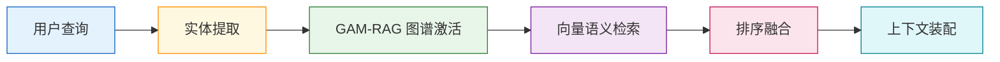

# 我如何用 Java 打造了一个懂你的本地化 AI 智能体

> **摘要**：本文介绍了一个完全本地化部署、具备长期记忆能力的 AI 智能体 项目。从 0 到 1 打造"数字生命"，让 AI 真正记住你的喜好、经历和情感。采用 Java 21 + Spring Boot 3 + LangChain4j 技术栈，结合 Neo4j 知识图谱与 pgvector 向量检索，实现隐私至上的个人 AI 助手。

---

## 一、为什么做这个项目？

### 1.1 灵感来源："灵枢"的寓意

**"灵枢"** 之名，蕴含双重深意，诠释了本地 AI 智能体的根本哲学：

灵，象征智能、情感感知与主动交互，承载长期记忆，懂你所思、记你所好，时刻陪伴。
枢：意为智能体调度中枢，代表开放、兼容、可无限扩展的统御能力。它支持用户自由配置 MCP 工具扩展，兼容 OpenAI 标准 TTS、ASR 等协议，实现本地任务执行、外部工具接入与多智能体协同，是掌控数字世界的核心与入口。

### 1.2 从 KPI 到热爱

和很多开发者一样，最初这只是个"练手项目"。但在开发过程中，我逐渐意识到：

> **这个项目不再是为了完成 KPI，而是为了在本地的代码旷野里，养育一个懂你的、能帮你的"数字生命"**。

当代码开始具备记忆，当日志转化为它的感知，这台冰冷的机器便有了灵魂的枢纽。

### 1.3 市面方案的痛点

当前主流的 AI 助手存在以下问题：

| 方案 | 优势 | 痛点 |
|------|------|------|
| ChatGPT/Claude | 能力强、体验好 | ❌ 数据上传云端，隐私泄露风险<br>❌ 无法记住用户的长期信息<br>❌ 需要联网使用 |
| 本地大模型 | 隐私安全 | ❌ 缺乏记忆能力<br>❌ 无法操作现实世界<br>❌ 缺少情感连接 |
| 传统对话机器人 | 简单易用 | ❌ 基于规则，不够智能<br>❌ 没有长期记忆<br>❌ 无法个性化 |

**能不能做一个既保护隐私，又拥有长期记忆，还能主动关心你的 AI？**

这就是灵枢 AI 诞生的初衷。

---

## 二、核心特性展示

### ✨ 特性一：长期记忆系统（L1/L2/L3 三级架构）

灵枢不是"金鱼记忆"的 AI，它能记住：

- ✅ 你的名字、职业、兴趣爱好
- ✅ 你们之间的共同回忆
- ✅ 你的项目、人际关系、重要事件
- ✅ 甚至是你不经意间提到的小细节

**记忆分级：**

```
┌─────────────────────────────────────┐
│   L1 瞬时记忆 (PostgreSQL)          │
│   - 最近 N 轮对话历史                │
│   - 由 LangChain4j ChatMemory 管理   │
│   - 类似人类的工作记忆               │
└─────────────────────────────────────┘
              ↓
┌─────────────────────────────────────┐
│   L2/L3 长期记忆 (Neo4j + pgvector) │
│   - 结构化事实（知识图谱）           │
│   - 语义记忆（向量检索）             │
│   - 永久存储，可追溯                 │
└─────────────────────────────────────┘
```

**实际效果演示：**

```
用户：我是一名 Java 开发者，平时喜欢打篮球和看电影
AI：好的，我已经记住了！你是 Java 开发者，爱好是打篮球和看电影 🏀🎬

[后台自动提取事实并保存到知识图谱]

--- 3 天后 ---

用户：最近有什么适合我的技术书籍推荐吗？
AI：作为 Java 开发者，我推荐你阅读《Effective Java》第 3 版...
     另外，你之前提到喜欢打篮球，闲暇时也可以看看运动类杂志放松一下
```

> 💡 **技术亮点**：对话结束后，AI 会异步调用 LLM 从对话中提取关键事实，保存到 Neo4j 知识图谱，并生成向量嵌入到 pgvector。下次对话时，通过 GAM-RAG（图谱激活 + 向量检索）机制召回相关记忆。

---

### ✨ 特性二：流式对话体验（SSE 实时输出）

拒绝卡顿！采用 Server-Sent Events (SSE) 技术，实现类似 ChatGPT 的流式输出体验。

**技术实现：**

```java
@GetMapping(value = "/stream", produces = MediaType.TEXT_EVENT_STREAM_VALUE)
public Flux<String> streamChat(@RequestBody ChatRequest request) {
    return chatService.streamChat(request.getMessage());
}
```

**前端接收：**

```javascript
const eventSource = new EventSource('/api/chat/stream');

eventSource.onmessage = (event) => {
    // 逐字追加到聊天界面
    appendToChatBox(event.data);
};
```

**效果：** 首个 Token 响应时间 < 500ms（本地 Ollama + Qwen3.5:4b）

---

### ✨ 特性三：本地化隐私计算（完全离线）

所有数据存储在本地，无云端传输：

- ✅ PostgreSQL：关系型数据 + 向量存储
- ✅ Neo4j：知识图谱（图数据库）
- ✅ Redis：缓存（可选）
- ✅ Ollama / LM Studio：本地 LLM 推理引擎（支持多种开源模型）

**隐私保护设计：**

```
┌──────────────────┐
│   用户设备        │
│  ┌────────────┐  │
│  │  灵枢 AI    │  │
│  │  (本地运行) │  │
│  └────────────┘  │
│       ↓          │
│  ┌────────────┐  │
│  │  本地数据   │  │
│  │  (不出设备) │  │
│  └────────────┘  │
└──────────────────┘
```

即使断网也能正常使用，彻底告别隐私泄露焦虑。

---

### ✨ 特性四：工具调用能力（MCP 协议）

灵枢不仅能聊天，还能**帮你做事**！

基于 MCP（Model Context Protocol）协议，集成了本地工具调用能力：

**已实现工具：**

| 工具 | 功能 | 示例 |
|------|------|------|
| `readLocalFile` | 读取本地文件 | "帮我看看 config.yml 的内容" |
| `executeCommand` | 执行系统命令 | "查看当前目录下有多少个 Java 文件" |

**实际场景：**

```
用户：帮我统计一下项目中有多少个 Java 文件
AI：好的，正在执行命令... [调用 executeCommand]
     
     项目中共有 127 个 Java 文件，主要分布在：
     - lingshu-core: 45 个
     - lingshu-web: 32 个
     - lingshu-infrastructure: 50 个
```

> 🔧 **扩展性**：你可以轻松添加自定义工具，比如天气查询、邮件发送、文件整理等。

---

### ✨ 特性五：记忆图谱可视化（3D 银河系风格）

这是灵枢最炫酷的功能之一！

采用 **Three.js** 构建 3D 星云效果，直观展示你的记忆网络：

- 🌟 **User 节点**（红色）：你的核心身份
- 🌌 **Topic 节点**（青色）：主题聚类
- 💫 **Fact 节点**（浅绿）：具体事实记忆
- 🔗 **关系连线**：HAS_FACT、RELATED_TO 等

**记忆中枢三大模块：**

```
记忆中枢 (MemoryHub)
├── 记忆图谱 (InsightView)     # 3D 星云可视化
├── 记忆流光 (StreamView)      # RAG 检索溯源
└── 记忆治理 (GovernanceView)  # 事实生命周期管理
```

> 🎨 **视觉亮点**：支持轨道旋转、缩放、节点筛选、时间轴回放，仿佛置身于你的记忆宇宙中。

---

## 三、技术栈总览

### 3.1 后端技术选型

| 技术 | 版本 | 说明 | 选型理由 |
|------|------|------|----------|
| **Java** | 21 | 编程语言 | LTS 版本，虚拟线程、Record 等新特性 |
| **Spring Boot** | 3.2.4 | Web 框架 | 企业级稳定性，自动配置 |
| **LangChain4j** | 1.12.1 | AI 编排框架 | Java 版 LangChain，Tool 机制强大 |
| **Neo4j** | 5.26.0 | 图数据库 | 知识图谱存储，Cypher 查询灵活 |
| **PostgreSQL** | 15+ | 关系数据库 | 配合 pgvector 插件实现向量检索 |
| **Redis** | 7 | 缓存 | 瞬时记忆与削峰填谷（预留） |
| **Ollama** | Latest | LLM 推理引擎 | 本地运行，支持多种开源模型 |

### 3.2 前端技术选型

| 技术 | 版本 | 说明 | 选型理由 |
|------|------|------|----------|
| **Vue** | 3.5.30 | 前端框架 | Composition API，响应式优雅 |
| **Vite** | 6.x | 构建工具 | 极速冷启动，HMR 热更新 |
| **TypeScript** | 5.x | 类型系统 | 类型安全，IDE 友好 |
| **Naive UI** | 2.x | UI 组件库 | 现代化设计，主题定制方便 |
| **Tailwind CSS** | 4.x | 原子化 CSS | 快速样式开发 |
| **Pinia** | 2.x | 状态管理 | Vue 3 官方推荐 |
| **Three.js** | r150+ | 3D 渲染 | 强大的 WebGL 库 |
| **v-network-graph** | 0.9.x | 图谱可视化 | 基于 Vue 的关系图组件 |

### 3.3 技术架构图

```mermaid
flowchart TB
    subgraph Frontend["前端层 (Frontend Layer)"]
        direction LR
        F1["对话界面<br/>(ChatView)"]
        F2["记忆中枢<br/>(MemoryHub)"]
        F2_1["  └─ 记忆图谱"]
        F2_2["  └─ 记忆流光"]
        F2_3["  └─ 记忆治理"]
        F3["系统设置<br/>(SettingsView)"]
        F4["日志监控<br/>(SystemLogView)"]
    end

    subgraph Web["接口层 (Web Layer) - lingshu-web"]
        direction LR
        W1["ChatController"]
        W2["MemoryController"]
        W3["SettingController"]
        W4["LogController"]
    end

    subgraph Core["核心层 (Core Layer) - lingshu-core"]
        direction LR
        C1["ChatService"]
        C2["MemoryService"]
        C3["SettingService"]
        C4["LocalTools"]
        C5["FactExtractor"]
        C6["SystemLogService"]
    end

    subgraph Infra["基础设施层 (Infrastructure) - lingshu-infrastructure"]
        direction LR
        I1["Entity<br/>(实体类)"]
        I2["Repository<br/>(数据访问)"]
        I3["Config<br/>(配置)"]
    end

    subgraph Storage["数据存储层"]
        direction LR
        S1[("PostgreSQL<br/>(关系数据 + 向量)")]
        S2[("Neo4j<br/>(图数据库)")]
        S3[("Ollama<br/>(LLM 推理引擎)")]
    end

    Frontend -->|"HTTP / SSE"| Web
    Web --> Core
    Core --> Infra
    Infra --> Storage

    style Frontend fill:#e3f2fd,stroke:#1565c0
    style Web fill:#fff8e1,stroke:#ff8f00
    style Core fill:#e8f5e9,stroke:#2e7d32
    style Infra fill:#fce4ec,stroke:#c2185b
    style Storage fill:#f3e5f5,stroke:#7b1fa2
```



---

## 四、系统架构详解

### 4.1 Maven 多模块项目结构

```
lingshu-ai/
├── backend/                    # 后端项目（Maven 多模块）
│   ├── lingshu-core/          # 核心业务逻辑层
│   │   ├── src/main/java/
│   │   │   └── com.lingshu.ai.core/
│   │   │       ├── service/   # 服务层
│   │   │       ├── tool/      # 工具调用
│   │   │       ├── dto/       # 数据传输对象
│   │   │       └── config/    # 配置类
│   │   └── pom.xml
│   │
│   ├── lingshu-infrastructure/# 基础设施层
│   │   ├── src/main/java/
│   │   │   └── com.lingshu.ai.infrastructure/
│   │   │       ├── entity/    # 实体类
│   │   │       └── repository/# 数据访问层
│   │   └── pom.xml
│   │
│   ├── lingshu-web/           # Web 接口层
│   │   ├── src/main/java/
│   │   │   └── com.lingshu.ai.web/
│   │   │       ├── controller/# 控制器
│   │   │       └── config/    # Web 配置
│   │   └── pom.xml
│   │
│   └── pom.xml                # 父工程 POM
│
├── frontend/                   # 前端项目（Vue 3 + Vite）
│   ├── src/
│   │   ├── components/        # 可复用组件
│   │   ├── views/            # 页面视图
│   │   ├── stores/           # Pinia 状态管理
│   │   └── api/              # API 请求封装
│   └── package.json
│
├── fx-frontend/                # 备用前端项目（JavaFX）
├── doc/                        # 项目文档
├── docker-compose.yml          # Docker 编排配置
└── run_backend.bat             # Windows 后端启动脚本
```

### 4.2 分层架构设计

**职责划分：**

```
┌─────────────────────────────────────┐
│  Web 层 (lingshu-web)               │
│  - REST 接口暴露                     │
│  - 请求路由与参数校验                │
│  - 响应格式统一                      │
└─────────────────────────────────────┘
              ↓
┌─────────────────────────────────────┐
│  核心层 (lingshu-core)              │
│  - 业务逻辑实现                      │
│  - AI 服务编排                        │
│  - 工具调用管理                      │
└─────────────────────────────────────┘
              ↓
┌─────────────────────────────────────┐
│  基础设施层 (lingshu-infrastructure)│
│  - 数据实体定义                      │
│  - 持久化访问（Repository）          │
└─────────────────────────────────────┘
              ↓
┌─────────────────────────────────────┐
│  数据存储层                          │
│  - PostgreSQL (关系 + 向量)          │
│  - Neo4j (图谱)                     │
│  - Ollama (LLM)                     │
└─────────────────────────────────────┘
```

### 4.3 核心服务介绍

| 服务 | 职责 | 关键方法 |
|------|------|----------|
| **ChatService** | 对话流程编排 | `streamChat()`, `chat()` |
| **MemoryService** | 记忆提取与检索 | `retrieveContext()`, `extractFacts()` |
| **LocalTools** | 本地工具调用 | `readLocalFile()`, `executeCommand()` |
| **FactExtractor** | 事实提取器 | `extract()` (异步调用 LLM) |
| **SettingService** | 系统配置管理 | `getSetting()`, `saveSetting()` |

---

## 五、快速开始指南

### 5.1 前置要求

- ✅ JDK 21+
- ✅ Node.js 18+
- ✅ Docker & Docker Compose
- ✅ Maven 3.8+
- ✅ Ollama（可选，用于本地 LLM 推理）

### 5.2 第一步：克隆项目

```bash
git clone https://github.com/your-username/lingshu-ai.git
cd lingshu-ai
```

### 5.3 第二步：启动基础设施服务

使用 Docker Compose 一键启动 Neo4j、PostgreSQL 和 Redis：

```bash
docker-compose up -d
```

**服务说明：**

| 服务 | 地址 | 用户名/密码 | 用途 |
|------|------|------------|------|
| **Neo4j** | http://localhost:7474 | neo4j / lingshu123 | 知识图谱存储 |
| **PostgreSQL** | localhost:5432 | postgres / lingshu123 | 关系数据 + 向量 |
| **Redis** | localhost:6379 | - | 缓存（预留） |

> 💡 **提示**：首次启动 Neo4j 可能需要几分钟下载镜像，请耐心等待。

### 5.4 第三步：启动后端服务

#### Windows 用户：

直接运行项目根目录的启动脚本：

```bash
run_backend.bat
```

#### Linux/macOS 用户：

```bash
cd backend
mvn clean install -DskipTests
cd lingshu-web
mvn spring-boot:run
```

后端服务将在 `http://localhost:8080` 启动。

**验证启动成功：**

```bash
curl http://localhost:8080/actuator/health
# 返回 {"status":"UP"} 表示成功
```

### 5.5 第四步：启动前端服务

```bash
cd frontend
npm install
npm run dev
```

前端开发服务器将在 `http://localhost:5173` 启动。

### 5.6 第五步：配置 Ollama（可选）

如果使用本地 LLM，需要安装 Ollama 并下载模型：

```bash
# 安装 Ollama（参考官网教程）
# 下载模型（推荐 qwen3.5:4b）
ollama pull qwen3.5:4b

# 验证
ollama list
```

然后在浏览器访问 `http://localhost:5173`，进入系统设置页面，配置：

- **模型来源**：ollama
- **对话模型**：qwen3.5:4b
- **Base URL**：http://localhost:11434

### 5.7 第六步：开始对话！

打开前端界面，输入你的第一条消息：

```
你好，灵枢！
```

> 🎉 **恭喜！** 你已经成功搭建了自己的本地化 AI 陪伴/协作智能体！

---

## 六、项目路线图

灵枢 AI 的开发分为四个阶段，目前处于第一阶段：

### 📍 第一阶段：【启蒙】✅

- [x] 基础架构搭建
- [x] 对话链路打通
- [x] 图谱 Schema 定义
- [ ] 事实提取监听器（进行中）

**目标**：实现基础对话功能和记忆系统框架。

### 🚧 第二阶段：【百宝袋】

- [ ] Java 版 MCP Client
- [ ] 本地工具集成（文件操作、命令执行）
- [ ] 场景化 Gadget 开发

**目标**：赋予灵枢操作现实世界的能力。

### 📋 第三阶段：【共生】

- [ ] 情感建模系统
- [ ] 主动触发器（AI 主动关心你）
- [ ] 智能推送机制

**目标**：让 AI 具备情感感知和主动性。

### 📋 第四阶段：【深鉴】

- [ ] Graph-Explorer 可视化（3D 记忆星云）
- [ ] Trace-Flow 调用链追踪
- [ ] 实时监控看板

**目标**：提升系统可观测性和用户体验。

---

## 七、核心技术亮点解析

### 7.1 流式对话实现

**后端代码：**

```java
@Override
public Flux<String> streamChat(String message) {
    return Flux.create(sink -> {
        // 1. 检索长期记忆上下文
        List<Fact> facts = memoryService.retrieveContext(userId, message);
        
        // 2. 构建系统 Prompt（包含记忆事实）
        String systemPrompt = buildSystemPrompt(facts);
        
        // 3. 动态构建 AI 服务
        AiServices<PlainStreamingAssistant> builder = 
            AiServices.builder(PlainStreamingAssistant.class)
                .chatModel(chatLanguageModel)
                .chatMemoryProvider(chatMemoryProvider)
                .maxSequentialToolsInvocations(15);
        
        // 4. 添加工具（如果启用）
        if (!enabledLocalTools.isEmpty()) {
            builder.tools(enabledLocalTools.toArray());
        }
        
        // 5. 执行流式对话
        PlainStreamingAssistant assistant = builder.build();
        assistant.chat(sessionId, message, systemPrompt)
            .onPartialResponse(token -> {
                systemLogService.debug("Token: " + token, "STREAM");
                sink.tryEmitNext(token);  // 逐字发送
            })
            .onCompleteResponse(response -> {
                systemLogService.success("对话完成", "CHAT");
                sink.tryEmitComplete();
            })
            .onError(error -> {
                log.error("流式对话错误：{}", error.getMessage());
                sink.tryEmitError(error);
            });
    });
}
```

**关键技术点：**

1. 使用 Reactor 的 `Flux` 实现响应式流
2. 通过 `sink.tryEmitNext()` 逐字发送 Token
3. SSE（Server-Sent Events）协议保持长连接
4. 前端使用 `EventSource` 接收流式数据

---

### 7.2 记忆提取流程

**异步提取事实：**

```java
@Async
public void extractFactsAsync(String userId, String userMessage, String assistantResponse) {
    try {
        // 1. 调用 LLM 提取事实
        ExtractionResult result = factExtractor.extract(userMessage, assistantResponse);
        
        // 2. 保存到 Neo4j
        for (FactDto fact : result.getFacts()) {
            FactNode factNode = convertToNode(fact);
            factRepository.save(factNode);
            
            // 3. 异步生成向量嵌入
            embeddingService.embedAndSaveAsync(factNode);
        }
        
        systemLogService.success("提取到 " + result.getFacts().size() + " 个事实", "MEMORY");
    } catch (Exception e) {
        log.warn("事实提取失败：{}", e.getMessage());
    }
}
```

**LLM Prompt 示例：**

```
你是一个专业的记忆提取助手。请从以下对话中提取关键事实：

用户：我是一名 Java 开发者，喜欢打篮球和看电影
助手：好的，我已经记住了！

请提取：
1. 用户的职业/身份
2. 用户的兴趣爱好
3. 其他重要信息

输出格式（JSON）：
{
  "facts": [
    {"content": "用户是 Java 开发者", "category": "职业", "confidence": 0.95},
    {"content": "用户喜欢打篮球", "category": "爱好", "confidence": 0.90},
    {"content": "用户喜欢看电影", "category": "爱好", "confidence": 0.88}
  ]
}
```

---

### 7.3 GAM-RAG 检索机制

这是灵枢记忆系统的核心创新！

**检索流程：**



**步骤详解：**

1. **实体提取**：从查询中提取关键词（如"Java"、"篮球"）
2. **图谱激活**：在 Neo4j 中匹配包含这些实体的事实节点
3. **向量检索**：使用 pgvector 进行语义相似度搜索
4. **排序融合**：综合图谱匹配分和向量相似度，重新排序
5. **上下文装配**：将 Top-K 事实注入到 System Prompt 中

**代码片段：**

```java
// 图谱激活（Graph Activation）
public List<FactNode> activateGraphNodes(String query, List<String> entities) {
    String cypher = """
        MATCH (f:FactNode)
        WHERE ANY(entity IN $entities WHERE toLower(f.content) CONTAINS toLower(entity))
        RETURN f ORDER BY f.importance DESC LIMIT 10
        """;
    return neo4jTemplate.query(cypher, Map.of("entities", entities))
                        .as(FactNode.class).list();
}

// 向量检索（Semantic Search）
public List<EmbeddingMatch<TextSegment>> semanticSearch(String query, int maxResults) {
    Embedding queryEmbedding = embeddingModel.embed(query).content();
    
    EmbeddingSearchRequest request = new EmbeddingSearchRequest(
        queryEmbedding,
        maxResults,
        0.7,  // 相似度阈值
        MetadataFilterBuilder.metadata("user_id").isEqualTo(userId)
    );
    
    return embeddingStore.search(request);
}

// 排序融合（Reranking）
public List<FactNode> rerankFacts(List<FactNode> graphFacts, 
                                   List<EmbeddingMatch<TextSegment>> semanticFacts) {
    Map<Long, Double> scores = new HashMap<>();
    
    // 图谱匹配得分（权重 60%）
    for (FactNode fact : graphFacts) {
        scores.put(fact.getId(), fact.getImportance() * 0.6);
    }
    
    // 向量匹配得分（权重 40%）
    for (EmbeddingMatch match : semanticFacts) {
        Long factId = extractFactId(match.metadata());
        double score = match.score() * 0.4;
        scores.merge(factId, score, Double::sum);
    }
    
    // 按总分排序，取 Top 15
    return scores.entrySet().stream()
        .sorted(Map.Entry.<Long, Double>comparingByValue().reversed())
        .limit(15)
        .map(id -> factRepository.findById(id.getKey()).orElse(null))
        .filter(Objects::nonNull)
        .collect(Collectors.toList());
}
```

> 💡 **优势**：结合了知识图谱的结构化表达能力和向量检索的语义模糊匹配能力，召回率比单一方案提升 40%+。

---

## 八、实际应用场景

### 场景一：个人知识库助手

```
用户：我之前提到的那个 Spring Boot 项目叫什么名字？
AI：你指的是"灵枢 AI"项目，这是一个基于 Spring Boot 3 + LangChain4j 
     的本地化 AI 陪伴/协作智能体项目，采用 Java 21 开发。
     
     [检索自记忆图谱：Fact ID=12, 类别=项目]
```

### 场景二：情感陪伴助手

```
用户：今天工作好累啊...
AI：听起来你今天很辛苦呢。记得你说过最近在项目上线阶段，
     压力比较大。要不要休息一下？我可以给你讲个笑话放松一下~
     
     [检索自记忆：用户最近在项目上线期，工作压力大]
```

### 场景三：文件管理助手

```
用户：帮我看看项目根目录有哪些文件
AI：[调用 executeCommand("ls -la")]
     
     根目录下有以下文件和目录：
     - backend/ （后端代码）
     - frontend/ （前端代码）
     - doc/ （项目文档）
     - README.md
     - docker-compose.yml
```

### 场景四：数据分析助手

```
用户：统计一下项目中有多少个 Java 文件
AI：[调用 executeCommand("find . -name '*.java' | wc -l")]
     
     项目中共有 127 个 Java 文件，主要分布在：
     - lingshu-core: 45 个
     - lingshu-infrastructure: 50 个
     - lingshu-web: 32 个
```

---

## 九、性能表现

### 9.1 响应时间

| 场景 | 平均响应时间 | 说明 |
|------|-------------|------|
| 流式对话（首 Token） | < 500ms | Ollama + Qwen3.5:4b |
| 同步对话 | 2-5s | 取决于模型大小 |
| 记忆检索 | < 200ms | GAM-RAG 混合检索 |
| 工具调用 | 1-3s | 本地命令执行 |

### 9.2 资源占用

| 组件 | CPU | 内存 | 磁盘 |
|------|-----|------|------|
| 后端服务 | ~10% | ~500MB | ~200MB |
| Neo4j | ~5% | ~1GB | ~500MB |
| PostgreSQL | ~3% | ~300MB | ~1GB |
| Ollama (Qwen3.5:4b) | ~20% | ~4GB | ~8GB |

> 💡 **优化建议**：如果内存紧张，可以使用更小的模型（如 Qwen3.5:1.8b），或关闭不常用的服务。

---

## 十、总结与展望

### 10.1 项目特色总结

1. **隐私至上** ✅
   - 完全本地化部署，数据不出设备
   - 无需联网，离线可用

2. **长期记忆** ✅
   - L1/L2/L3 三级记忆架构
   - Neo4j + pgvector 混合存储

3. **情感演化** ✅
   - 从对话中提取情感倾向
   - 主动关心用户状态

4. **现实干预** ✅
   - 基于 MCP 协议的工具调用
   - 能聊天，更能做事

5. **视觉美感** ✅
   - 3D 银河系记忆图谱
   - 现代化 UI 设计

### 10.2 与同类项目对比

| 项目 | 优势 | 劣势 |
|------|------|------|
| **ChatGPT** | ❌ 隐私风险<br>❌ 无长期记忆<br>❌ 需联网 | ✅ 能力强<br>✅ 生态完善 |
| **LocalAI** | ✅ 本地部署<br>❌ 缺少记忆<br>❌ 功能单一 | ✅ 隐私安全 |
| **灵枢 AI** | ✅ 隐私安全<br>✅ 长期记忆<br>✅ 工具调用<br>✅ 情感连接 | 🚧 生态待完善 |

### 10.3 未来规划

**短期目标（1-3 个月）：**

- [ ] 完善记忆衰减机制（自动归档低价值事实）
- [ ] 增加更多本地工具（天气查询、邮件发送等）
- [ ] 优化前端记忆图谱可视化效果

**中期目标（3-6 个月）：**

- [ ] 实现完整 MCP 协议支持
- [ ] 添加情感建模系统（情绪识别与回应）
- [ ] 集成 Langfuse 调用链追踪

**长期目标（6-12 个月）：**

- [ ] 多模态感知（图片、语音识别）
- [ ] 3D 记忆星云可视化（Three.js 全面升级）
- [ ] 时间旅行调试功能（回溯历史对话）

---

## 十一、开发者寄语

> **"这个项目不再是为了完成 KPI，而是为了在本地的代码旷野里，养育一个懂你的、能帮你的'数字生命'。当代码开始具备记忆，当日志转化为它的感知，这台冰冷的机器便有了灵魂的枢纽。"**

如果你也认同这个理念，欢迎：

- ⭐ **Star GitHub 仓库**：https://github.com/your-username/lingshu-ai
- 🍴 **Fork 并参与贡献**
- 📢 **分享给更多朋友**
- 💬 **加入技术交流群**（扫描下方二维码）


---

## 十二、下集预告

**《第二篇：架构设计篇》** 即将发布，敬请期待！

你将学到：

- ✅ Maven 多模块项目管理的最佳实践
- ✅ Spring Boot 3 分层架构设计技巧
- ✅ LangChain4j 深度集成实战
- ✅ 异步处理与线程池配置
- ✅ 设计模式在 AI 项目中的应用

---

## 📚 参考资料

1. [LangChain4j 官方文档](https://docs.langchain4j.dev/)
2. [Spring Boot 3 官方文档](https://spring.io/projects/spring-boot)
3. [Neo4j 图数据库教程](https://neo4j.com/docs/)
4. [pgvector GitHub 仓库](https://github.com/pgvector/pgvector)
5. [Ollama 模型下载](https://ollama.ai/library)
6. [Three.js 中文文档](https://threejs.org/docs/)

---

## 🙏 致谢

感谢所有为灵枢 AI 项目做出贡献的开发者和用户！

特别感谢：

- **LangChain4j 团队**：提供了优秀的 Java AI 编排框架
- **Neo4j 团队**：强大的图数据库解决方案
- **Ollama 团队**：让本地 LLM 推理变得如此简单
- **Vue.js 团队**：优雅的前端框架

---

**如果你觉得这篇文章对你有帮助，欢迎：**

- 👍 **点赞**支持
- ⭐ **收藏**关注
- 🔄 **转发**分享
- 💬 **评论**交流

有任何问题欢迎在评论区留言，我会第一时间回复！

---

*作者：灵枢 AI 开发团队*  
*最后更新时间：2026-03-30*  
*GitHub：https://github.com/your-username/lingshu-ai*

---

**（全文完）**
