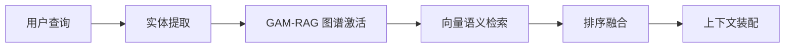

# 灵枢 AI 项目技术分享博客策略

## 📖 文档说明

本文档旨在全面规划灵枢 AI 项目的技术分享博客系列，帮助开发者在 CSDN、掘金、知乎等技术平台发布高质量的技术文章，提升项目影响力和技术品牌价值。

---

## 🎯 整体定位

### 核心定位

**"从 0 到 1 打造具备长期记忆的本地化陪伴/协作智能体"**

### 差异化优势

1. **隐私至上** - 完全本地化部署，数据不出本地
2. **长期记忆** - 区别于普通对话机器人的核心特性
3. **情感演化** - 让 AI 拥有"灵魂"的枢纽
4. **现实干预** - 基于 MCP 协议的工具调用能力
5. **视觉美感** - 3D 银河系记忆图谱可视化

### 目标受众

- Java 开发者（对 AI 感兴趣）
- 全栈开发者（想学习系统架构）
- AI 应用开发者（想落地实际项目）
- 独立开发者（寻找灵感与参考）

---

## 📚 系列文章规划

### 第一篇：项目总览篇（引流爆款）

**预计发布时间：** 第 1 周  
**预计阅读量：** 8000-20000+  
**推荐平台：** CSDN 首页、掘金精选、知乎热榜

#### 标题备选

1. 《我如何用 Java 打造了一个懂你的本地化 AI 陪伴/协作智能体》
2. 《隐私至上！手把手教你构建离线版个人 AI 助手》
3. 《具备长期记忆的 AI 是什么体验？这个项目给出了答案》
4. 《Java 21 + Spring Boot 3 + LangChain4j：从零开始构建 AI 陪伴/协作智能体》

#### 内容大纲

```markdown
## 一、灵感来源
- "灵枢"名称的寓意
- 为什么做这个项目（KPI vs 热爱）
- 项目愿景：养育一个"数字生命"

## 二、核心特性展示
1. 长期记忆系统（L1/L2/L3 三级记忆）
2. 流式对话体验（SSE 实时输出）
3. 本地化隐私计算（完全离线）
4. 工具调用能力（操作现实世界）
5. 记忆图谱可视化（3D 银河系风格）

## 三、技术栈总览
| 模块 | 技术选型 | 版本 | 说明 |
|------|---------|------|------|
| 后端框架 | Spring Boot | 3.2.4 | 企业级稳定性 |
| AI 编排 | LangChain4j | 1.12.1 | Java 版 LangChain |
| 前端框架 | Vue | 3.5.30 | 响应式 UI |
| 图数据库 | Neo4j | 5.26.0 | 知识图谱存储 |
| 向量数据库 | PostgreSQL + pgvector | 15+ | 语义检索 |
| 推理引擎 | Ollama | Latest | 本地 LLM |

## 四、系统架构图解
（插入 Mermaid 架构图）

## 五、快速开始演示
1. Docker Compose 启动基础设施
2. 后端服务启动
3. 前端开发服务器启动
4. 效果展示（截图/GIF）

## 六、项目路线图
- 第一阶段：【启蒙】✅
- 第二阶段：【百宝袋】🚧
- 第三阶段：【共生】📋
- 第四阶段：【深鉴】📋

## 七、结语与展望
- GitHub 仓库地址
- 开发者寄语
- 下集预告：《架构设计篇》
```

#### 配图建议

- 项目 Logo/Banner
- 系统架构图（Mermaid）
- 对话界面截图
- 记忆图谱 3D 效果 GIF
- 技术栈思维导图

#### SEO 关键词

```
Java AI, LangChain4j, 本地化 AI, Spring Boot AI 项目，
Neo4j 知识图谱，pgvector, Ollama, 私人 AI 助手，
AI 陪伴/协作智能体，开源项目推荐
```

---

### 第二篇：架构设计篇（技术深度）

**预计发布时间：** 第 2 周  
**预计阅读量：** 5000-12000  
**推荐平台：** CSDN 技术博客、掘金后端专栏

#### 标题备选

1. 《Spring Boot 3 + LangChain4j 打造企业级 AI 应用架构》
2. 《分层架构实战：从 Controller 到 Storage 的完整链路》
3. 《Java 21 新特性在 AI 项目中的应用实践》
4. 《Maven 多模块项目管理最佳实践》

#### 内容大纲

```markdown
## 一、项目结构概览
lingshu-ai/
├── backend/                    # 后端项目
│   ├── lingshu-core/          # 核心业务逻辑层
│   ├── lingshu-infrastructure/# 基础设施层
│   └── lingshu-web/           # Web 接口层
├── frontend/                   # 前端项目
└── docker-compose.yml          # Docker 编排

## 二、Maven 多模块设计

### 2.1 父 POM 配置
```xml
<properties>
    <java.version>21</java.version>
    <spring-boot.version>3.2.4</spring-boot.version>
    <langchain4j.version>1.12.1</langchain4j.version>
</properties>

<dependencyManagement>
    <!-- Spring Boot BOM -->
    <!-- LangChain4j BOM -->
</dependencyManagement>
```

### 2.2 模块依赖关系
- lingshu-web → lingshu-core → lingshu-infrastructure

## 三、分层架构详解

### 3.1 Web 接口层（lingshu-web）
职责：REST 接口暴露、请求路由、参数校验

关键类：
- ChatController：对话接口
- MemoryController：记忆管理接口
- SettingController：系统设置接口

代码示例：
```java
@RestController
@RequestMapping("/api/chat")
public class ChatController {
    @PostMapping("/stream")
    public Flux<String> streamChat(@RequestBody ChatRequest request) {
        return chatService.streamChat(request.getMessage());
    }
}
```

### 3.2 核心业务层（lingshu-core）
职责：业务逻辑实现、AI 服务编排、工具调用

核心服务：
1. ChatService - 对话流程编排
2. MemoryService - 记忆提取与检索
3. LocalTools - 本地工具调用
4. FactExtractor - 事实提取器

流式对话实现：
```java
public Flux<String> streamChat(String message) {
    // 1. 检索长期记忆上下文
    List<Fact> facts = memoryService.retrieveContext(userId, message);
    
    // 2. 构建系统 Prompt
    String systemPrompt = buildSystemPrompt(facts);
    
    // 3. 动态构建 AI 服务
    AiServices<PlainStreamingAssistant> builder = 
        AiServices.builder(PlainStreamingAssistant.class)
            .chatModel(chatLanguageModel)
            .chatMemoryProvider(chatMemoryProvider)
            .maxSequentialToolsInvocations(15);
    
    // 4. 添加工具
    if (!enabledLocalTools.isEmpty()) {
        builder.tools(enabledLocalTools.toArray());
    }
    
    // 5. 执行流式对话
    return Flux.create(sink -> {
        assistant.chat(sessionId, message, systemPrompt)
            .onPartialResponse(token -> sink.tryEmitNext(token))
            .onCompleteResponse(response -> sink.tryEmitComplete())
            .onError(error -> sink.tryEmitError(error));
    });
}
```

### 3.3 基础设施层（lingshu-infrastructure）
职责：数据实体定义、持久化访问

实体类：
- UserNode（Neo4j 用户节点）
- FactNode（Neo4j 事实节点）
- ChatMessage（PostgreSQL 消息记录）
- SystemSetting（系统配置）

Repository 模式：
```java
@Repository
public interface FactRepository extends Neo4jRepository<FactNode, Long> {
    List<FactNode> findByUserIdAndStatus(Long userId, String status);
    
    @Query("MATCH (f:FactNode)-[:HAS_FACT]->(u:UserNode {id: $userId}) RETURN f")
    List<FactNode> findFactsByUser(Long userId);
}
```

## 四、LangChain4j 深度集成

### 4.1 AiServices 动态构建
- 根据配置动态选择模型（Ollama/OpenAI）
- 支持运行时切换模型和端点

### 4.2 Tool 机制扩展
```java
@Component
public class LocalTools {
    
    @Tool("读取本地文件内容")
    public String readLocalFile(@P("文件路径") String path) {
        // 实现细节
    }
    
    @Tool("执行系统命令")
    public String executeCommand(@P("命令") String command) {
        // 实现细节
    }
}
```

### 4.3 ChatMemory 管理
- MessageWindowChatMemory 控制上下文窗口
- 最大消息数限制（避免超出模型上下文）

## 五、异步处理设计

### 5.1 线程池配置
```java
@Bean(name = "taskExecutor")
public Executor taskExecutor() {
    ThreadPoolTaskExecutor executor = new ThreadPoolTaskExecutor();
    executor.setCorePoolSize(5);
    executor.setMaxPoolSize(10);
    executor.setQueueCapacity(100);
    executor.setThreadNamePrefix("LingShuAsync-");
    executor.initialize();
    return executor;
}
```

### 5.2 异步任务场景
- 记忆提取（不阻塞对话响应）
- 向量嵌入生成
- 日志记录

## 六、设计模式应用

1. **工厂模式** - DynamicEmbeddingModel 动态创建嵌入模型
2. **策略模式** - 根据不同来源（Ollama/OpenAI）选择不同实现
3. **观察者模式** - 记忆提取事件监听
4. **单例模式** - AppConfigService 配置服务

## 七、总结与思考
- 分层架构的优势（解耦、可测试性）
- Maven 多模块的管理技巧
- Java 21 的新特性应用（Record、Pattern Matching）
```

#### 代码展示技巧

- 每个代码片段配注释
- 突出关键逻辑（加粗/高亮）
- 避免大段代码（控制在 30 行内）

---

### 第三篇：记忆系统篇（核心亮点）

**预计发布时间：** 第 3 周  
**预计阅读量：** 6000-15000  
**推荐平台：** 掘金精选、CSDN 专家博客、InfoQ

#### 标题备选

1. 《Neo4j + pgvector 构建多级记忆系统实战》
2. 《让 AI 拥有长期记忆：知识图谱与向量检索的完美结合》
3. 《GAM-RAG 图谱激活检索机制设计与实现》
4. 《从对话中提取事实：AI 记忆系统的核心技术》

#### 内容大纲

```markdown
## 一、记忆系统设计哲学

### 1.1 人类记忆启发
- L1 瞬时记忆（短期工作记忆）
- L2 长期记忆（结构化事实）
- L3 长期记忆（语义记忆）

### 1.2 技术选型对比
| 方案 | 优势 | 劣势 |
|------|------|------|
| 纯向量数据库 | 语义检索强大 | 关系表达能力弱 |
| 纯图数据库 | 关系表达强 | 模糊匹配弱 |
| 混合方案 ✅ | 优势互补 | 实现复杂度高 |

## 二、数据存储架构

### 2.1 PostgreSQL（L1 瞬时记忆）
表结构：
```sql
CREATE TABLE chat_message (
    id BIGSERIAL PRIMARY KEY,
    session_id BIGINT NOT NULL,
    role VARCHAR(50) NOT NULL,
    content TEXT NOT NULL,
    created_at TIMESTAMP DEFAULT CURRENT_TIMESTAMP
);

-- LangChain4j 托管的聊天历史
-- 存储最近 N 轮对话（由 ChatMemory 管理）
```

### 2.2 Neo4j（L2/L3 长期记忆）
节点定义：
```java
@Node("UserNode")
public class UserNode {
    @Id @GeneratedValue
    private Long id;
    private String name;
    private String nickname;
    private LocalDateTime firstEncounter;
    private LocalDateTime lastSeen;
}

@Node("FactNode")
public class FactNode {
    @Id @GeneratedValue
    private Long id;
    private String content;      // 事实内容
    private String category;     // 分类（爱好/职业/关系...）
    private LocalDateTime observedAt;
    private Double importance;   // 重要性评分
    private ConfidenceLevel confidence;  // 置信度
}
```

关系类型：
- `HAS_FACT` - 用户拥有某个事实
- `RELATED_TO` - 事实之间相关

### 2.3 pgvector（语义检索）
表结构：
```sql
CREATE TABLE memory_segments (
    id UUID PRIMARY KEY DEFAULT gen_random_uuid(),
    embedding vector(4096),  -- 4096 维向量
    text TEXT NOT NULL,
    metadata JSONB NOT NULL  -- 包含 fact_id 等元数据
);

-- 创建索引加速检索
CREATE INDEX ON memory_segments USING ivfflat (embedding vector_cosine_ops);
```

## 三、事实提取器（FactExtractor）

### 3.1 核心流程
```
用户消息 → LLM 分析 → 提取候选事实 → 置信度评估 → 过滤去重 → 保存到图谱
```

### 3.2 LLM Prompt 设计
```
你是一个专业的记忆提取助手。请从以下对话中提取关键事实：

用户：我是一名 Java 开发者，喜欢打篮球
助手：...

请提取：
1. 用户的职业/身份
2. 用户的兴趣爱好
3. 其他重要信息

输出格式（JSON）：
{
  "facts": [
    {"content": "用户是 Java 开发者", "category": "职业", "confidence": 0.95},
    {"content": "用户喜欢打篮球", "category": "爱好", "confidence": 0.90}
  ]
}
```

### 3.3 异步提取实现
```java
@Async
public void extractFactsAsync(String userId, String userMessage, String assistantResponse) {
    try {
        // 1. 调用 LLM 提取事实
        ExtractionResult result = factExtractor.extract(userMessage, assistantResponse);
        
        // 2. 保存到新 4j
        for (FactDto fact : result.getFacts()) {
            FactNode factNode = convertToNode(fact);
            factRepository.save(factNode);
            
            // 3. 异步生成向量嵌入
            embeddingService.embedAndSaveAsync(factNode);
        }
        
        systemLogService.success("提取到 " + result.getFacts().size() + " 个事实", "MEMORY");
    } catch (Exception e) {
        log.warn("事实提取失败：{}", e.getMessage());
    }
}
```

## 四、GAM-RAG 检索机制

### 4.1 检索流程


### 4.2 图谱激活（Graph Activation）
```java
public List<FactNode> activateGraphNodes(String query, List<String> entities) {
    // 1. 从查询中提取实体（如"Java"、"篮球"）
    // 2. 在 Neo4j 中匹配相关节点
    String cypher = """
        MATCH (f:FactNode)
        WHERE ANY(entity IN $entities WHERE toLower(f.content) CONTAINS toLower(entity))
        RETURN f ORDER BY f.importance DESC LIMIT 10
        """;
    return neo4jTemplate.query(cypher, Map.of("entities", entities))
                        .as(FactNode.class).list();
}
```

### 4.3 向量检索（Semantic Search）
```java
public List<EmbeddingMatch<TextSegment>> semanticSearch(String query, int maxResults) {
    // 1. 生成查询向量
    Embedding queryEmbedding = embeddingModel.embed(query).content();
    
    // 2. 余弦相似度检索
    EmbeddingSearchRequest request = new EmbeddingSearchRequest(
        queryEmbedding,
        maxResults,
        0.7,  // 相似度阈值
        MetadataFilterBuilder.metadata("user_id").isEqualTo(userId)
    );
    
    return embeddingStore.search(request);
}
```

### 4.4 排序融合算法
```java
public List<FactNode> rerankFacts(List<FactNode> graphFacts, 
                                   List<EmbeddingMatch<TextSegment>> semanticFacts) {
    // 1. 统一打分
    Map<Long, Double> scores = new HashMap<>();
    
    // 图谱匹配得分（基于重要性）
    for (FactNode fact : graphFacts) {
        scores.put(fact.getId(), fact.getImportance() * 0.6);
    }
    
    // 向量匹配得分（基于相似度）
    for (EmbeddingMatch match : semanticFacts) {
        Long factId = extractFactId(match.metadata());
        double score = match.score() * 0.4;
        scores.merge(factId, score, Double::sum);
    }
    
    // 2. 按总分排序
    return scores.entrySet().stream()
        .sorted(Map.Entry.<Long, Double>comparingByValue().reversed())
        .limit(15)
        .map(id -> factRepository.findById(id.getKey()).orElse(null))
        .filter(Objects::nonNull)
        .collect(Collectors.toList());
}
```

## 五、记忆衰减与活跃度管理

### 5.1 活跃度评分算法
```java
public void updateActivityScores() {
    LocalDateTime now = LocalDateTime.now();
    
    // 遍历所有事实节点
    List<FactNode> allFacts = factRepository.findAll();
    for (FactNode fact : allFacts) {
        double score = calculateActivityScore(fact, now);
        fact.setActivityScore(score);
        
        // 自动归档低活跃度事实
        if (score < 0.2 && fact.getStatus() == FactStatus.ACTIVE) {
            fact.setStatus(FactStatus.ARCHIVED);
        }
    }
    
    factRepository.saveAll(allFacts);
}

private double calculateActivityScore(FactNode fact, LocalDateTime now) {
    Duration duration = Duration.between(fact.getLastActivatedAt(), now);
    double daysSinceLastActivation = duration.toDays();
    
    // 指数衰减
    double decayFactor = Math.exp(-daysSinceLastActivation / 30);  // 半衰期 30 天
    
    // 基础分数（基于重要性）
    double baseScore = fact.getImportance() * 0.5;
    
    // 置信度加成
    double confidenceBonus = fact.getConfidence().getValue() * 0.3;
    
    return (baseScore + confidenceBonus) * decayFactor;
}
```

### 5.2 冷库归档机制
- ACTIVE → ARCHIVED：自动衰减或手动归档
- ARCHIVED → DEPRECATED：被新事实取代
- DEPRECATED → 永久删除：系统维护时清理

## 六、性能优化实践

### 6.1 批量操作优化
```java
// ❌ 低效：逐条保存
for (FactNode fact : facts) {
    factRepository.save(fact);
}

// ✅ 高效：批量保存
factRepository.saveAll(facts);
```

### 6.2 索引优化
```cypher
// 为常用查询创建索引
CREATE INDEX FOR (f:FactNode) ON (f.category);
CREATE INDEX FOR (f:FactNode) ON (f.status);
CREATE INDEX FOR (f:FactNode) ON (f.lastActivatedAt);
```

### 6.3 缓存策略
- Redis 缓存热点事实（高频访问）
- 本地缓存（Caffeine）临时检索结果

## 七、总结与展望
- 混合存储架构的优势
- GAM-RAG 的创新点
- 未来优化方向（图神经网络、增量更新）
```

#### 配图建议

- 记忆系统三层架构图
- 事实提取流程图
- GAM-RAG 检索时序图
- Neo4j 图谱可视化截图
- 活跃度衰减曲线图

---

### 第四篇：可视化篇（视觉冲击）

**预计发布时间：** 第 4 周  
**预计阅读量：** 7000-18000  
**推荐平台：** 掘金前端专栏、知乎精选、SegmentFault

#### 标题备选

1. 《Three.js + Vue 3 打造 3D 银河系记忆图谱》
2. 《前端可视化实战：让 AI 记忆像星云一样旋转》
3. 《v-network-graph 与 Three.js 的技术选型思考》
4. 《从 0 到 1 实现记忆中枢：图谱、流光、治理》

#### 内容大纲

```markdown
## 一、记忆中枢三大模块

### 1.1 整体架构
```
记忆中枢 (MemoryHub)
├── 记忆图谱 (InsightView)     # 3D 星云可视化
├── 记忆流光 (StreamView)      # RAG 检索溯源
└── 记忆治理 (GovernanceView)  # 事实生命周期管理
```

## 二、Three.js 渲染引擎

### 2.1 场景搭建
```vue
<script setup lang="ts">
import * as THREE from 'three'
import { OrbitControls } from 'three/examples/jsm/controls/OrbitControls'

const scene = new THREE.Scene()
const camera = new THREE.PerspectiveCamera(75, width / height, 0.1, 1000)
const renderer = new THREE.WebGLRenderer({ antialias: true, alpha: true })

// 粒子系统（星尘背景）
const particlesGeometry = new THREE.BufferGeometry()
const particlesCount = 5000
const posArray = new Float32Array(particlesCount * 3)

for(let i = 0; i < particlesCount * 3; i++) {
    posArray[i] = (Math.random() - 0.5) * 50
}

particlesGeometry.setAttribute('position', new THREE.BufferAttribute(posArray, 3))
const material = new THREE.PointsMaterial({ size: 0.05, color: 0x88ccff })
const particlesMesh = new THREE.Points(particlesGeometry, material)
scene.add(particlesMesh)
</script>
```

### 2.2 节点布局算法
```typescript
// 力导向布局（Force-Directed Layout）
function applyForceDirectedLayout(nodes: GraphNode[], links: GraphLink[]) {
    const simulation = d3.forceSimulation(nodes)
        .force('charge', d3.forceManyBody().strength(-50))
        .force('center', d3.forceCenter(0, 0, 0))
        .force('link', d3.forceLink(links)
            .id((d: any) => d.id)
            .distance(5))
        .force('collide', d3.forceCollide(2))
    
    simulation.on('tick', () => {
        nodes.forEach(node => {
            node.x = node.x ?? 0
            node.y = node.y ?? 0
            node.z = node.z ?? 0
        })
    })
    
    return simulation
}
```

### 2.3 节点类型与样式
```typescript
interface GraphNode {
    id: string
    label: string
    type: 'User' | 'Topic' | 'Fact'
    importance?: number
    confidence?: number
    activityScore?: number
    cluster?: string
    lastActivatedAt?: string
}

// 根据类型设置颜色
const nodeColors = {
    User: '#FF6B6B',      // 红色（核心）
    Topic: '#4ECDC4',     // 青色（主题）
    Fact: '#95E1D3'       // 浅绿（事实）
}

// 根据活跃度设置透明度
const opacityMap = {
    active: 1.0,    // 活跃（完全不透明）
    stable: 0.7,    // 稳定（半透明）
    cool: 0.4       // 冷却（更透明）
}
```

### 2.4 轨道控制器
```typescript
const controls = new OrbitControls(camera, renderer.domElement)
controls.enableDamping = true
controls.dampingFactor = 0.05
controls.minDistance = 5
controls.maxDistance = 50
controls.autoRotate = true
controls.autoRotateSpeed = 0.5
```

## 三、Vue 3 Composition API 实践

### 3.1 状态管理（Pinia）
```typescript
// stores/memory.ts
export const useMemoryStore = defineStore('memory', {
    state: () => ({
        graphData: { nodes: [], links: [] },
        selectedNode: null,
        timeRange: '30d',
        activityFilter: 'all',
        isLoading: false
    }),
    
    actions: {
        async fetchGraphData() {
            this.isLoading = true
            try {
                const response = await api.get('/api/memory/graph')
                this.graphData = response.data
            } finally {
                this.isLoading = false
            }
        },
        
        deleteFact(factId: number) {
            api.delete(`/api/memory/fact/${factId}`)
            this.graphData.nodes = this.graphData.nodes.filter(n => n.id !== factId)
        }
    }
})
```

### 3.2 组件复用
```vue
<!-- GraphNode.vue -->
<template>
  <group ref="nodeGroup">
    <mesh 
      :position="[node.x, node.y, node.z]"
      @click="handleClick"
      @mouseenter="showTooltip"
      @mouseleave="hideTooltip"
    >
      <sphereGeometry :args="[radius, 32, 32]" />
      <meshStandardMaterial :color="nodeColor" />
    </mesh>
    <Text
      :position="[node.x, node.y + radius + 0.5, node.z]"
      :text={node.label}
      fontSize={0.8}
      color="#ffffff"
    />
  </group>
</template>
```

## 四、记忆流光（StreamView）

### 4.1 实时事件流
```typescript
// 每 3 秒轮询最新检索事件
const pollingInterval = ref<NodeJS.Timeout>()

const startPolling = () => {
    pollingInterval.value = setInterval(async () => {
        const response = await api.get('/api/memory/events?limit=10')
        retrievalEvents.value = response.data
        
        // 自动滚动到最新
        nextTick(() => {
            container.value.scrollTop = container.value.scrollHeight
        })
    }, 3000)
}

onUnmounted(() => {
    clearInterval(pollingInterval.value)
})
```

### 4.2 事件卡片组件
```vue
<template>
  <div class="event-card" :class="event.type">
    <div class="event-header">
      <span class="event-time">{{ formatTime(event.timestamp) }}</span>
      <span class="event-type-badge">{{ event.type }}</span>
    </div>
    
    <div class="event-body">
      <div class="query-section">
        <h4>查询</h4>
        <p>{{ event.query }}</p>
      </div>
      
      <div class="entities-section">
        <h4>提取的实体</h4>
        <tag v-for="entity in event.extractedEntities" :key="entity">
          {{ entity }}
        </tag>
      </div>
      
      <div class="matches-section">
        <h4>向量匹配 ({{ event.semanticMatches.length }})</h4>
        <div v-for="match in event.semanticMatches" :key="match.factId" 
             class="match-item">
          <span class="score" :class="getScoreClass(match.score)">
            {{ (match.score * 100).toFixed(1) }}%
          </span>
          <p class="snippet">{{ match.contentSnippet }}</p>
        </div>
      </div>
    </div>
  </div>
</template>
```

## 五、记忆治理（GovernanceView）

### 5.1 表格组件（Naive UI）
```vue
<template>
  <n-data-table
    :columns="columns"
    :data="factList"
    :pagination="pagination"
    :loading="isLoading"
  />
</template>

<script setup lang="ts">
const columns = [
    { title: 'ID', key: 'id', width: 80 },
    { 
        title: '内容', 
        key: 'content',
        ellipsis: { tooltip: true },
        maxWidth: 400
    },
    { 
        title: '分类', 
        key: 'category',
        render: (row) => h(nTag, { type: getCategoryType(row.category) }, row.category)
    },
    { 
        title: '状态', 
        key: 'status',
        render: (row) => h(nTag, { 
            type: getStatusType(row.status),
            bordered: false
        }, row.status)
    },
    {
        title: '操作',
        key: 'actions',
        render: (row) => [
            h(nButton, { 
                size: 'small', 
                onClick: () => archiveFact(row.id) 
            }, { default: () => '归档' }),
            h(nButton, { 
                size: 'small', 
                type: 'error',
                onClick: () => deleteFact(row.id) 
            }, { default: () => '删除' })
        ]
    }
]
</script>
```

## 六、性能优化技巧

### 6.1 实例合并（InstancedMesh）
```typescript
// ❌ 低效：每个节点一个 Mesh
nodes.forEach(node => {
    const mesh = new THREE.Mesh(geometry, material)
    scene.add(mesh)
})

// ✅ 高效：使用 InstancedMesh
const instancedMesh = new THREE.InstancedMesh(geometry, material, nodes.length)
nodes.forEach((node, i) => {
    instancedMesh.setMatrixAt(i, node.matrix)
})
scene.add(instancedMesh)
```

### 6.2 几何体复用
```typescript
// 共享同一个 Geometry 对象
const sharedGeometry = new THREE.SphereGeometry(1, 32, 32)

nodes.forEach(node => {
    const mesh = new THREE.Mesh(sharedGeometry, material)
    // ...
})
```

### 6.3 视锥体剔除
```typescript
// 只渲染视野内的节点
function cullOffscreenNodes() {
    const frustum = new THREE.Frustum()
    const projScreenMatrix = new THREE.Matrix4()
    projScreenMatrix.multiplyMatrices(camera.projectionMatrix, camera.matrixWorldInverse)
    frustum.setFromProjectionMatrix(projScreenMatrix)
    
    visibleNodes.value = nodes.filter(node => 
        frustum.intersectsSphere(new THREE.Sphere(node.position, 1))
    )
}
```

## 七、主题适配

### 7.1 深色模式
```css
:root.dark {
    --bg-color: #0f172a;
    --text-color: #e2e8f0;
    --card-bg: #1e293b;
    --accent-color: #38bdf8;
}
```

### 7.2 响应式设计
```css
@media (max-width: 768px) {
    .graph-container {
        height: 400px;
    }
    
    .node-label {
        font-size: 10px;
    }
}
```

## 八、总结
- Three.js 入门到进阶
- Vue 3 组合式 API 优势
- 性能优化关键点
```

#### 配图建议

- 3D 记忆图谱全景截图
- 节点布局演化 GIF
- 记忆流光界面截图
- 深色模式对比图
- 性能优化前后对比数据

---

### 第五篇：工具调用篇（实用价值）

**预计发布时间：** 第 5 周  
**预计阅读量：** 4000-10000  
**推荐平台：** CSDN、掘金、开源中国

#### 标题备选

1. 《基于 MCP 协议实现 AI 操作本地系统》
2. 《LangChain4j Tool 机制深度解析与扩展》
3. 《让 AI 从对话走向行动：文件读取与命令执行》
4. 《ReAct 模式在 Java 中的实践》

#### 内容大纲

```markdown
## 一、MCP 协议介绍

### 1.1 什么是 MCP
Model Context Protocol（模型上下文协议）是一种标准化协议，用于让 AI 模型与外部系统和工具交互。

### 1.2 核心价值
- 标准化：统一的工具描述与调用规范
- 可扩展：轻松添加自定义工具
- 安全性：权限控制与审计日志

## 二、LocalTools 实现详解

### 2.1 工具定义
```java
@Component
public class LocalTools {
    
    private static final int MAX_OUTPUT_CHARS = 4000;
    private static final int MAX_REPEAT_CALLS = 2;
    
    @Tool("读取本地文件内容。适用于查看配置文件、代码文件等文本内容。")
    public String readLocalFile(@P("文件绝对路径") String path) {
        systemLogService.debug("ReAct 工具：readLocalFile | path=" + path, "TOOL");
        
        try {
            // 安全检查：防止路径遍历攻击
            if (!isSafePath(path)) {
                systemLogService.warn("ReAct 工具拒绝访问不安全路径：" + path, "TOOL");
                return "[错误] 不允许访问该路径";
            }
            
            String content = Files.readString(Paths.get(path));
            systemLogService.success("ReAct 工具成功：readLocalFile | preview=" + 
                safePreview(content), "TOOL");
            return content;
        } catch (Exception e) {
            systemLogService.error("ReAct 工具失败：readLocalFile | error=" + e.getMessage(), "TOOL");
            return "[错误] 无法读取文件：" + e.getMessage();
        }
    }
    
    @Tool("执行系统命令并返回输出。适用于查看系统状态、运行简单脚本等。")
    public String executeCommand(@P("Shell 命令") String command) {
        systemLogService.debug("ReAct 工具：executeCommand | command=" + command, "TOOL");
        
        try {
            // 安全过滤
            if (!isSafeCommand(command)) {
                systemLogService.warn("ReAct 工具拒绝执行危险命令：" + command, "TOOL");
                return "[错误] 不允许执行该命令";
            }
            
            // 自动检测编码（Windows 中文环境）
            Charset charset = detectCharset();
            
            ProcessBuilder pb = new ProcessBuilder("cmd.exe", "/c", command);
            pb.redirectErrorStream(true);
            Process process = pb.start();
            
            StringBuilder output = new StringBuilder();
            boolean truncated = false;
            
            try (BufferedReader reader = new BufferedReader(
                    new InputStreamReader(process.getInputStream(), charset))) {
                String line;
                while ((line = reader.readLine()) != null) {
                    if (output.length() + line.length() + 1 > MAX_OUTPUT_CHARS) {
                        truncated = true;
                        break;
                    }
                    output.append(line).append("\n");
                }
            }
            
            boolean finished = process.waitFor(30, TimeUnit.SECONDS);
            if (!finished) {
                process.destroyForcibly();
                systemLogService.warn("ReAct 工具超时：executeCommand", "TOOL");
                return output.toString() + "\n[⚠️ 命令执行超时（30 秒），已强制终止。]";
            }
            
            String result = output.toString();
            if (truncated) {
                result += "\n\n[⚠️ 命令输出已截断至 " + MAX_OUTPUT_CHARS + " 字符。]";
            }
            
            systemLogService.success("ReAct 工具成功：executeCommand | preview=" + 
                safePreview(result), "TOOL");
            return result;
        } catch (Exception e) {
            systemLogService.error("ReAct 工具失败：executeCommand | error=" + e.getMessage(), "TOOL");
            return "[错误] 命令执行失败：" + e.getMessage();
        }
    }
}
```

### 2.2 安全防护机制

#### 路径安全检查
```java
private boolean isSafePath(String path) {
    // 防止路径遍历攻击（../）
    if (path.contains("..")) {
        return false;
    }
    
    // 只允许访问特定目录
    Path normalized = Paths.get(path).normalize();
    Path allowedBase = Paths.get("/home/user/allowed");
    
    return normalized.startsWith(allowedBase);
}
```

#### 命令安全检查
```java
private boolean isSafeCommand(String command) {
    // 黑名单过滤
    List<String> dangerousCommands = Arrays.asList(
        "rm -rf", "del /f", "format", "mkfs",
        "wget http", "curl http",
        "chmod 777", "chown root"
    );
    
    return dangerousCommands.stream()
        .noneMatch(cmd -> command.contains(cmd));
}
```

#### 编码自动检测
```java
private Charset detectCharset() {
    // Windows 中文环境检测
    try {
        Process chcp = Runtime.getRuntime().exec("cmd.exe /c chcp");
        try (BufferedReader br = new BufferedReader(
                new InputStreamReader(chcp.getInputStream()))) {
            String line = br.readLine();
            if (line != null && line.contains(":")) {
                String cp = line.split(":")[1].trim();
                if ("936".equals(cp))
                    return Charset.forName("GBK");
                else if ("65001".equals(cp))
                    return StandardCharsets.UTF_8;
            }
        }
    } catch (Exception e) {
        log.warn("无法检测 Windows 代码页，回退到 GBK");
    }
    
    return Charset.forName("GBK"); // 默认回退
}
```

## 三、ReAct 模式实现

### 3.1 什么是 ReAct
Reason + Act：AI 先推理下一步该做什么，然后调用工具执行，再根据结果继续推理。

### 3.2 调用流程
```
用户问题 → LLM 分析 → 决定调用工具 → 执行工具 → 返回结果 → LLM 整合答案 → 回复用户
```

### 3.3 工具调用链
```java
// LangChain4j 自动管理工具调用链
AiServices<Assistant> aiServices = AiServices.builder(Assistant.class)
    .chatModel(chatModel)
    .tools(localTools)  // 注入工具集
    .maxSequentialToolsInvocations(15)  // 最多连续调用 15 次
    .build();

// AI 自主决定调用顺序
String response = aiServices.chat(userId, "帮我查看当前目录下的文件列表，并统计 Python 文件数量");
// 可能调用：executeCommand("dir") → 分析结果 → executeCommand("dir *.py | measure") → 整合答案
```

## 四、自定义工具扩展指南

### 4.1 添加新工具
```java
@Component
public class WeatherTool {
    
    @Tool("查询指定城市的天气情况")
    public String getWeather(@P("城市名称") String city) {
        // 调用天气 API
        String apiUrl = "https://api.weather.com/v1/current?city=" + city;
        // ... HTTP 请求
        return weatherData;
    }
}
```

### 4.2 注册工具
```java
@Configuration
public class ToolConfig {
    
    @Bean
    public Object[] enabledTools(LocalTools localTools, WeatherTool weatherTool) {
        return new Object[] { localTools, weatherTool };
    }
}
```

### 4.3 工具描述优化
```java
@Tool(value = "读取文件", 
      description = "适用于查看配置文件、日志文件、代码文件等文本内容。" +
                    "不支持二进制文件（如图片、PDF）。" +
                    "路径必须是绝对路径。")
```

## 五、实际应用场景

### 5.1 文件管理助手
```
用户：帮我看看项目根目录有哪些文件
AI：[调用 executeCommand("ls -la")]
AI：根目录下有以下文件和目录：
     - backend/ （后端代码）
     - frontend/ （前端代码）
     - doc/ （项目文档）
     - README.md
     ...
```

### 5.2 系统监控助手
```
用户：我的 CPU 占用率怎么样？
AI：[调用 executeCommand("top -n 1")]
AI：当前 CPU 使用率为 35%，内存使用率为 62%...
```

### 5.3 数据分析助手
```
用户：统计一下项目中有多少个 Java 文件
AI：[调用 executeCommand("find . -name '*.java' | wc -l")]
AI：项目中共有 127 个 Java 文件。
```

## 六、调试技巧

### 6.1 日志追踪
```yaml
logging:
  level:
    com.lingshu.ai.core.tool: DEBUG
```

### 6.2 工具调用追踪
```java
// 记录每次工具调用的详细信息
systemLogService.info("工具调用开始：readLocalFile | args={path: /home/config.yml}", "TOOL_TRACE");
```

## 七、总结
- Tool 机制的核心原理
- 安全性设计要点
- 自定义工具的最佳实践
```

---

### 第六篇：性能优化篇（工程实践）

**预计发布时间：** 第 6 周  
**预计阅读量：** 3000-8000  
**推荐平台：** CSDN、掘金、InfoQ

#### 标题备选

1. 《AI 应用性能优化全记录：从响应速度到内存管理》
2. 《流式输出 SSE 在 Spring Boot 中的最佳实践》
3. 《上下文长度控制的平衡艺术》
4. 《Java AI 应用调优实战》

#### 内容大纲

```markdown
## 一、流式输出优化

### 1.1 SSE 实现原理
```java
@GetMapping(value = "/stream", produces = MediaType.TEXT_EVENT_STREAM_VALUE)
public Flux<String> streamChat(@RequestBody ChatRequest request) {
    return Flux.create(sink -> {
        // 流式处理
        assistant.chat(message)
            .onPartialResponse(token -> sink.tryEmitNext(token))
            .onCompleteResponse(response -> sink.tryEmitComplete())
            .onError(error -> sink.tryEmitError(error));
    });
}
```

### 1.2 首 Token 时间优化
- 预热模型（避免冷启动）
- 减少 Prompt 长度
- 使用更小的模型（如 Qwen-4B vs Qwen-72B）

### 1.3 网络传输优化
```javascript
// 前端使用 EventSource 接收流
const eventSource = new EventSource('/api/chat/stream');

eventSource.onmessage = (event) => {
    // 逐字追加到界面
    appendToChatBox(event.data);
};
```

## 二、上下文窗口管理

### 2.1 MessageWindowChatMemory
```java
@Bean
public ChatMemoryProvider chatMemoryProvider() {
    return sessionId -> MessageWindowChatMemory.withMaxMessages(10);
}
```

### 2.2 动态调整窗口大小
```java
// 根据对话复杂度调整
int windowSize = estimateComplexity(message) > 0.7 ? 20 : 10;
ChatMemory memory = MessageWindowChatMemory.withMaxMessages(windowSize);
```

### 2.3 上下文压缩
```java
// 摘要压缩历史对话
String compressedHistory = llm.compress(memory.getMessages());
memory.add(SystemMessage.from(compressedHistory));
```

## 三、错误处理与降级

### 3.1 上下文超长友好提示
```java
if (errorMsg.contains("context length") || errorMsg.contains("n_ctx")) {
    return "输入内容过长，超出模型上下文限制。\n" +
           "建议您：\n" +
           "1. 减少图片数量或使用更小的图片\n" +
           "2. 清除对话历史后重试\n" +
           "3. 切换到支持更长上下文的模型";
}
```

### 3.2 模型切换热更新
```java
// 运行时切换模型
@PostMapping("/setting")
public void updateSetting(@RequestBody SystemSetting setting) {
    settingService.save(setting);
    
    // 清空模型缓存，下次请求时重新创建
    modelCache.invalidate(setting.getChatModel());
}
```

## 四、内存管理

### 4.1 弱引用缓存
```java
private final Map<String, WeakReference<ChatMemory>> memoryCache = 
    new ConcurrentHashMap<>();
```

### 4.2 定期清理
```java
@Scheduled(fixedRate = 3600000)  // 每小时清理一次
public void cleanupExpiredMemories() {
    LocalDateTime threshold = LocalDateTime.now().minusHours(24);
    
    memoryCache.entrySet().removeIf(entry -> {
        ChatMemory memory = entry.getValue().get();
        return memory == null || memory.getLastModified().isBefore(threshold);
    });
}
```

## 五、数据库优化

### 5.1 Neo4j 索引优化
```cypher
CREATE INDEX FOR (f:FactNode) ON (f.category);
CREATE INDEX FOR (f:FactNode) ON (f.status);
CREATE INDEX FOR (f:FactNode) ON (f.lastActivatedAt);
```

### 5.2 PostgreSQL 查询优化
```sql
EXPLAIN ANALYZE
SELECT * FROM chat_message 
WHERE session_id = 123 
ORDER BY created_at DESC 
LIMIT 10;
```

## 六、监控与告警

### 6.1 指标收集
```java
@Component
public class MetricsCollector {
    
    private final MeterRegistry meterRegistry;
    
    public void recordChatDuration(Duration duration) {
        meterRegistry.timer("chat.duration").record(duration);
    }
    
    public void recordMemoryRetrievalLatency(Duration latency) {
        meterRegistry.timer("memory.retrieval.latency").record(latency);
    }
}
```

### 6.2 Prometheus + Grafana 监控
```yaml
# application.yml
management:
  endpoints:
    web:
      exposure:
        include: prometheus,health,metrics
  metrics:
    export:
      prometheus:
        enabled: true
```

## 七、总结
- 性能优化的系统性方法
- 监控体系的建立
- 持续优化的文化
```

---

### 第七篇：部署运维篇（落地实践）

**预计发布时间：** 第 7 周  
**预计阅读量：** 3000-7000  
**推荐平台：** CSDN、开源中国、SegmentFault

#### 标题备选

1. 《Docker Compose 一键部署 AI 应用》
2. 《从开发到生产：AI 应用的完整交付流程》
3. 《Ollama 本地推理引擎配置调优指南》
4. 《AI 应用运维手册》

#### 内容大纲

```markdown
## 一、Docker 容器化部署

### 1.1 docker-compose.yml
```yaml
version: '3.8'

services:
  neo4j:
    image: neo4j:5.26.0
    ports:
      - "7474:7474"
      - "7687:7687"
    environment:
      NEO4J_AUTH: neo4j/lingshu123
      NEO4J_PLUGINS: '["apoc"]'
    volumes:
      - ./data/neo4j:/data

  postgres:
    image: pgvector/pgvector:pg15
    ports:
      - "5432:5432"
    environment:
      POSTGRES_DB: lingshu
      POSTGRES_USER: postgres
      POSTGRES_PASSWORD: lingshu123
    volumes:
      - ./data/postgres:/var/lib/postgresql/data

  redis:
    image: redis:7-alpine
    ports:
      - "6379:6379"
    volumes:
      - ./data/redis:/data

  ollama:
    image: ollama/ollama:latest
    ports:
      - "11434:11434"
    volumes:
      - ./data/ollama:/root/.ollama
```

### 1.2 启动命令
```bash
# 一键启动所有服务
docker-compose up -d

# 查看日志
docker-compose logs -f

# 停止服务
docker-compose down
```

## 二、Ollama 模型管理

### 2.1 模型下载
```bash
# 拉取模型
ollama pull qwen3.5:4b

# 查看已下载模型
ollama list

# 删除模型
ollama rm qwen3.5:4b
```

### 2.2 模型配置调优
```bash
# 修改 ModelFile
cat > Modelfile << EOF
FROM qwen3.5:4b
PARAMETER temperature 0.7
PARAMETER top_p 0.9
PARAMETER num_ctx 4096
EOF

# 创建自定义模型
ollama create my-qwen -f Modelfile
```

### 2.3 推理参数说明
- `temperature`: 创造性（0.1-1.0，越高越随机）
- `top_p`: 核采样参数（0.9-0.95）
- `num_ctx`: 上下文窗口大小
- `num_predict`: 最大生成 token 数

## 三、后端服务部署

### 3.1 Maven 打包
```bash
cd backend
mvn clean package -DskipTests
```

### 3.2 运行 JAR
```bash
java -jar lingshu-web/target/lingshu-web-0.0.1-SNAPSHOT.jar \
  --spring.profiles.active=prod
```

### 3.3 systemd 服务配置
```ini
# /etc/systemd/system/lingshu.service
[Unit]
Description=LingShu AI Backend
After=network.target

[Service]
Type=simple
User=ubuntu
WorkingDirectory=/opt/lingshu
ExecStart=/usr/bin/java -jar lingshu-web.jar
Restart=always

[Install]
WantedBy=multi-user.target
```

## 四、前端部署

### 4.1 构建生产版本
```bash
cd frontend
npm install
npm run build
```

### 4.2 Nginx 配置
```nginx
server {
    listen 80;
    server_name lingshu.example.com;
    
    root /var/www/lingshu/dist;
    index index.html;
    
    location / {
        try_files $uri $uri/ /index.html;
    }
    
    location /api {
        proxy_pass http://localhost:8080;
        proxy_set_header Host $host;
        proxy_set_header X-Real-IP $remote_addr;
    }
}
```

## 五、监控与日志

### 5.1 应用监控
```bash
# 查看 Spring Boot Actuator 端点
curl http://localhost:8080/actuator/health
curl http://localhost:8080/actuator/metrics
```

### 5.2 日志收集
```bash
# 实时查看应用日志
tail -f /var/log/lingshu/app.log | grep "ERROR"

# 使用 journalctl
journalctl -u lingshu -f
```

## 六、常见问题排查

### 6.1 Neo4j 连接失败
```bash
# 检查 Neo4j 状态
docker ps | grep neo4j

# 查看 Neo4j 日志
docker logs neo4j

# 重启 Neo4j
docker-compose restart neo4j
```

### 6.2 Ollama 模型加载失败
```bash
# 检查显存/内存
free -h

# 使用更小的模型
ollama pull qwen3.5:1.8b
```

### 6.3 向量检索缓慢
```sql
-- 检查 pgvector 索引
SELECT * FROM pg_indexes WHERE tablename = 'memory_segments';

-- 重建索引
REINDEX INDEX memory_segments_embedding_idx;
```

## 七、备份与恢复

### 7.1 Neo4j 备份
```bash
docker exec neo4j neo4j-admin dump --to=/backups/neo4j.dump
```

### 7.2 PostgreSQL 备份
```bash
pg_dump -U postgres lingshu > backup.sql
```

## 八、总结
- 容器化部署的优势
- 运维自动化的重要性
- 监控体系的建立
```

---

## 💡 写作技巧与运营策略

### 标题党但不过分

**好的标题:**
- ✅ 《我如何用 Java 打造了一个懂你的本地化 AI 陪伴/协作智能体》
- ✅ 《Neo4j + pgvector 构建多级记忆系统实战》

**避免的标题:**
- ❌ 《震惊！90 后程序员竟然做出了这样的 AI》
- ❌ 《月薪 3 万的程序员都在看的 AI 教程》

### 图文并茂原则

1. **架构图必选**: Mermaid 绘制清晰架构图
2. **代码要精简**: 每段代码不超过 30 行，配详细注释
3. **动图吸引眼球**: 录制 GIF 展示功能
4. **数据说话**: 性能优化前后对比数据

### 互动引导

**文末模板:**
```markdown
## 🎁 福利时间

1. **GitHub 仓库**: https://github.com/your-username/lingshu-ai
2. **技术交流群**: 扫描下方二维码（微信群/QQ 群）
3. **下集预告**: 《XXX 篇》即将发布，敬请期待！

如果你觉得这篇文章对你有帮助，欢迎：
- 👍 点赞支持
- ⭐ 收藏关注
- 🔄 转发分享

有任何问题欢迎在评论区留言，我会第一时间回复！
```

### SEO 优化

**关键词布局:**
- 标题包含核心关键词
- 摘要重复关键词
- 正文自然分布关键词
- 标签（Tags）精准匹配

**示例关键词:**
```
Java AI, LangChain4j, Spring Boot AI, Neo4j 知识图谱，
pgvector, 本地化 AI, 开源 AI 项目，AI 陪伴/协作智能体，
记忆系统，RAG 检索
```

---

## 📅 发布节奏与平台运营

### 发布计划表

| 周次 | 文章 | 平台 | 运营动作 |
|------|------|------|----------|
| 第 1 周 | 项目总览篇 | CSDN/掘金/知乎 | 转发到技术社群、朋友圈 |
| 第 2 周 | 架构设计篇 | CSDN | 评论区互动答疑 |
| 第 3 周 | 记忆系统篇 | 掘金 | 联系官方推荐 |
| 第 4 周 | 可视化篇 | 知乎 | 制作短视频引流 |
| 第 5 周 | 工具调用篇 | CSDN | - |
| 第 6 周 | 性能优化篇 | 掘金 | - |
| 第 7 周 | 部署运维篇 | 知乎 | 系列总结回顾 |

### 平台特性分析

**CSDN:**
- 优势：流量大、SEO 权重高
- 适合：技术深度文章
- 技巧：参与博客排名竞争

**掘金:**
- 优势：技术氛围好、推荐机制公平
- 适合：前沿技术实践
- 技巧：争取上精选首页

**知乎:**
- 优势：长尾流量、破圈效应
- 适合：科普向 + 技术向结合
- 技巧：回答相关问题引流

**开源中国:**
- 优势：开源爱好者聚集
- 适合：开源项目推广
- 技巧：投稿到"开源项目"板块

---

## 🎖️ 预期效果与 KPI

### 量化指标

| 指标 | 保守目标 | 挑战目标 |
|------|---------|---------|
| 单篇最高阅读量 | 8,000 | 20,000+ |
| 系列总阅读量 | 30,000 | 100,000+ |
| GitHub Star 增长 | 100 | 500+ |
| 技术社群人数 | 50 | 200+ |
| 文章点赞收藏 | 500 | 2,000+ |

### 质化收益

1. **个人品牌**: 建立"AI 记忆系统"领域专业形象
2. **项目推广**: 吸引贡献者与使用者
3. **技术交流**: 结识同行，获得反馈
4. **机会链接**: 潜在的工作/合作机会

---

## 📞 联系方式与资源

### 项目资源

- **GitHub**: https://github.com/your-username/lingshu-ai
- **在线 Demo**: （如有）
- **文档站点**: （如有）

### 联系方式

- **邮箱**: your-email@example.com
- **微信**: （可选）
- **Twitter/微博**: （可选）

---

## 🙏 致谢

感谢所有为灵枢 AI 项目做出贡献的开发者和用户！

---

*最后更新时间：2026-03-30*  
*文档版本：v1.0*
