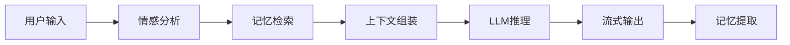
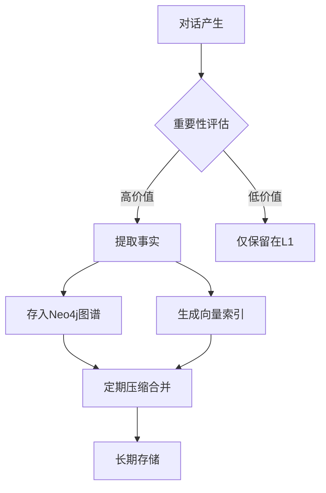

# 核心功能详解 (Core Features)

本文档详细介绍了灵枢 (LingShu-AI) 的核心功能模块、工作流程及技术实现细节。

---

## 1. 💬 智能对话系统

**核心能力**:
- **流式响应**: 基于 SSE 技术的实时流式输出，打字机效果提升交互体验
- **多模型支持**: 兼容 Ollama 本地模型和 OpenAI 兼容 API（DeepSeek、通义千问等）
- **上下文感知**: 自动检索相关记忆，生成个性化回复
- **情感适配**: 根据用户情感状态调整回复语气和风格

**工作流程**:

---

## 2. 🧠 多级记忆系统

**记忆架构**:

| 层级 | 存储引擎 | 容量 | 用途 | 检索速度 |
|------|----------|------|------|----------|
| **L1 瞬时记忆** | PostgreSQL | 最近20轮对话 | 短期上下文 | <10ms |
| **L2 事实记忆** | Neo4j 图数据库 | 无限制 | 结构化知识图谱 | <50ms |
| **L3 语义记忆** | pgvector 向量库 | 无限制 | 语义相似度检索 | <100ms |

**核心特性**:
- **自动提取**: 从对话中自动识别并存储关键事实（姓名、喜好、经历等）
- **智能压缩**: 定期合并相似记忆，避免冗余
- **混合召回**: 结合关键词匹配和向量相似度，提高检索准确率
- **情感标注**: 每条记忆附带情感标签，支持情感演化分析

**记忆生命周期**:

---

## 3. 🌟 主动关怀系统

**功能特点**:
- **状态监测**: 实时追踪用户活跃度和情感状态
- **智能问候**: 根据时间段和用户习惯生成个性化问候语
- **冷却机制**: 避免频繁打扰，可配置问候间隔和冷却时间
- **情感共鸣**: 检测到用户情绪低落时主动提供安慰和支持

**应用场景**:
- 用户长时间未互动时的关怀问候
- 检测到负面情绪时的主动安慰
- 重要日期（生日、纪念日）的祝福提醒

---

## 4. 🔌 MCP 工具扩展

**Model Context Protocol 支持**:
- **即插即用**: 一键挂载符合 MCP 协议的外部工具
- **丰富生态**: 支持 MySQL、PostgreSQL、Web Search、文件系统等多种工具
- **权限控制**: 细粒度的工具调用权限管理
- **沙箱执行**: 安全的工具执行环境，防止恶意操作

**已集成的工具**:
- 文件系统读写
- 终端命令执行
- 数据库查询（MySQL/PostgreSQL）
- 网络搜索
- 自定义 Python 脚本

---

## 5. 🌌 3D 银河记忆图谱

**可视化特性**:
- **交互式探索**: 鼠标拖拽、缩放浏览记忆节点
- **关系连线**: 清晰展示事实之间的关联关系
- **情感着色**: 不同颜色代表不同情感类型
- **时间轴**: 按时间顺序排列记忆，回顾成长历程

**技术实现**: Three.js + WebGL 硬件加速渲染，支持数千个节点的流畅交互。

---

## 6. 🔍 记忆溯源系统

**核心能力**:
- **召回过程可视化**: 每次 AI 回复都会展示记忆检索的完整路径——提取了哪些实体、激活了哪些事实、增益得分多少
- **GAM-RAG 路由决策**: 展示系统如何智能选择图谱优先还是向量补召回策略
- **事实采纳追踪**: 清晰展示最终哪些记忆被组装到 AI 的上下文中
- **实时透明面板**: 聊天界面右侧实时展示记忆召回过程，让 AI 的"思考"完全可见

**溯源数据包含**:
- 提取的实体关键词列表
- 图谱激活的事实节点及内容
- 向量检索的语义匹配结果（含相似度分数）
- 路由决策结果（GRAPH_ONLY / VECTOR_BACKUP / GRAPH_PRIORITIZED）
- 增益得分 (Gain Score) 及计算依据

---

## 7. 📊 全链路日志监控

**核心能力**:
- **实时日志流**: 基于 SSE 的实时日志推送，工作流程一目了然
- **多维度筛选**: 按模块（CHAT/MEMORY/LLM/TOOL）、按级别（INFO/DEBUG/WARN/ERROR）筛选
- **性能计时**: 自动记录 LLM 调用、Embedding 向量化、数据库操作的耗时
- **搜索与导出**: 支持关键词搜索日志内容，一键导出日志文件

**日志分类**:
- `CHAT`: 对话流程日志
- `MEMORY`: 记忆检索与事实提取日志
- `LLM`: 模型调用统计（Token 数、速度）
- `POST_PROCESS`: 回合后处理日志
- `PROACTIVE`: 主动关怀日志
- `TOOL`: MCP 工具调用日志
