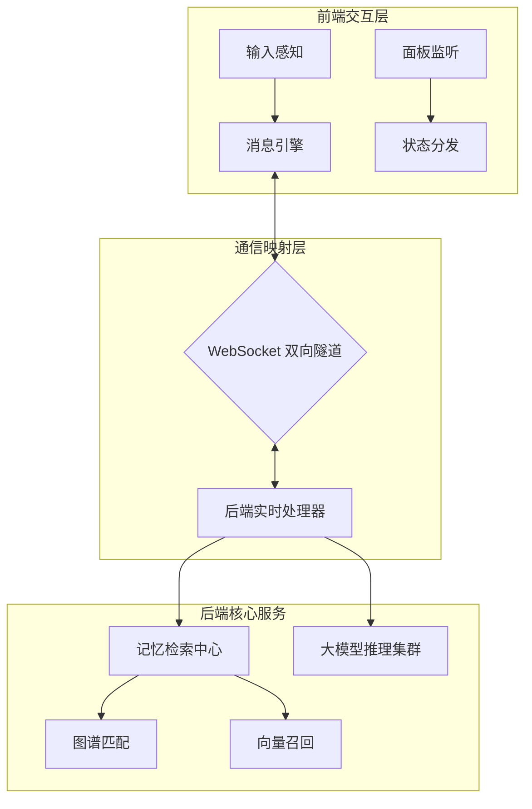
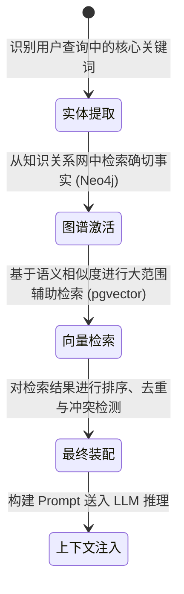

# 灵墟之境 - 共鸣对话页面实施规范

> **状态**: ✅ 核心功能已完成 | 📋 导出功能研讨中 (2026-04)
> 
> 本文档定义了“灵墟之境”（ResonanceView）对话页面的交互设计规范、技术逻辑蓝图及其演进路线，旨在指导开发者与产品团队理解 AI 对话系统的深层运作机制。

---

## 📊 实施状态总览

### 已落地功能概览 (10/11)

| 模块 | 核心能力描述 | 交付时间 |
|------|------------|---------|
| **实时通讯** | 基于 WebSocket 的全双向流式对话，支持秒级响应与中间态反馈。 | 2026-03-15 |
| **视觉核心** | 具备呼吸感与思考脉冲的“灵魂球体”交互重心，强化 AI 生命感。 | 2026-03-01 |
| **感知自动滚动** | 具备阅读保护机制的智能滚动算法，平衡实时追踪与手动阅读。 | 2026-03-12 |
| **记忆流光面板** | GAM-RAG 检索链路全透明展示，揭示 AI 思考背后的记忆流转。 | 2026-04-01 |
| **语音自然交互** | 集成 TTS 合成与 ASR 识别，支持“连续监听”与“按住说话”双模式。 | 2026-04-10 |
| **响应式适配** | 针对移动端触控优化，支持玻璃态 UI 与自适应抽屉布局。 | 2026-03-20 |

### 待实施里程碑 (1/11)

- **多维导出引擎**: 支持将对话流导出为具备排版美感的 Markdown 简报或长图，逻辑已进入阶段评审。

---

## 1. 技术架构蓝图

### 1.1 系统分层结构
系统采用逻辑与视图解耦的模式，确保交互逻辑的复用性：
- **视图层 (View)**: 采用 Vue 3 组合式 API 驱动，处理复杂的毛玻璃效果与自适应布局。
- **逻辑层 (Logic)**: 封装为专用的 Composables（如 `useChat`, `useWebSocket`），管理会话生命周期。
- **通信层 (Transport)**: WebSocket 与 RESTful API 互补，兼顾实时性与持久化数据加载。

### 1.2 交互数据流模型

---

## 2. 核心交互机制逻辑

### 2.1 高可靠通信链路
不同于传统的 HTTP 请求，系统建立了持久化的**全双向通信链路**：
- **生命周期管理**: 页面挂载时初始化，通过“心跳侦测”维持连接活跃，遇到网络波动时采用“指数退避算法”自动尝试重连。
- **多事件路由**: 系统识别并分发以下核心事件：
  - `chatStart/End`: 控制会话的时序边界。
  - `chatChunk`: 处理流式文本片段的实时追加。
  - `reasoningChunk`: 独立解析并呈现 AI 的推理过程（折叠内省区）。
  - `toolCall`: 追踪并反馈 AI 调用外部工具的中间步骤。

### 2.2 智能滚动感知策略
为了解决“自动滚动打断阅读”这一痛点，系统内置了行为识别逻辑：
- **阅读锁定模式**: 当用户向上翻阅消息产生超过 15px 的位移时，系统判定为“主动阅读”，暂停底部强制滚动。
- **触底追踪模式**: 当用户发送新消息或手动将滚动条拉回到底部阈值内时，系统判定为“重新关注”，恢复实时追踪。
- **视觉缓冲区**: 历史消息加载时，采用“相对坐标锚定”，确保加载新内容后原本正在阅读的位置不发生视觉跳变。

### 2.3 记忆流光链路：GAM-RAG 多级溯源
系统将复杂的检索算法拆解为三级可视化管道：

- **透明化反馈**: 每一轮对话都会产生与之关联的“检索事件”，用户可在侧栏查看 AI 是如何从“记忆碎片”中拼凑出答案的，包含相似度分数与知识来源。

---

## 3. 设计美学与感官体验

### 3.1 视觉意图：灵魂球体 (The Soul Orb)
摒弃了传统的静态 Loading 或简单的打字动画。
- **自然呼吸感**: 常态下采用慢频径向渐变背景，配合多层扩散阴影，模拟生命的律动。
- **思考脉冲**: AI 处理数据时切换为高频高亮脉冲， scale 比例在 1.0 到 1.25 之间快速起伏，视觉化呈现“脑电信号”。
- **状态同步**: 与 WebSocket 事件流深度绑定，实现“毫秒级”的状态切换响应。

### 3.2 响应式 UI 体系
- **玻璃态交互 (Glassmorphism)**: 全屏采用 `backdrop-filter` 实现深度毛玻璃感，结合 `0.4` 透明度的光晕，营造轻量且具备科技感的层级。
- **移动端触控优化**: 侧边面板在移动端自动转换为“全屏抽屉”，支持侧滑手势快速关闭记忆溯源。

---

## 4. 技术决策深度分析

### 4.1 方案取舍：为什么是 WebSocket？
| 特性 | WebSocket (当前选择) | SSE (备选) | 结论 |
|------|--------------------|-----------|------|
| **双向交互** | 极高 (支持随时打断) | 无 (仅服务端推送) | 满足用户随时干预 AI 推理的需求。 |
| **协议负载** | 中 (一次握手长连) | 低 (传统 HTTP) | 为了支持复杂的分布式指令下发。 |
| **交互深度** | 支持工具调用双向反馈 | 仅支持单向回复 | 适配 GAM-RAG 的复杂逻辑。 |

### 4.2 记忆流的“异步轮询”策略
- **决策理由**: 记忆检索是由后端多个并行任务（图谱检索 + 向量计算）异步触发的。主对话流必须保持极高纯净度（专注文本流）。
- **实现方案**: 采用 3 秒静默轮询机制监听对应的“事件桶”，既保证了视觉反馈的及时性，又避免了大量底层检索详情对 WebSocket 带宽的消耗。

---

## 5. 性能与系统保障

### 5.1 渲染优化策略
- **DOM 节点管控**: 历史记录采用增量加载（每次 20 条），避免数千条对话导致的长列表渲染卡顿。
- **样式资源优化**: 图标库使用 `Tree-shaking` 导出，仅打包实际用到的组件；核心动画使用硬件加速图形层。

### 5.2 已知边界处理
- **网络恢复响应**: 自动检测网络断开后的状态，并在连接恢复后主动拉取断连期间的消息补全。
- **环境兼容性**: 针对 Safari 的 `backdrop-filter` 差异做了回退背景色处理，确保在主流浏览器中视觉一致性。

---

## 6. 演进路线图

### 6.1 短期规划 (1-3 个月)
- **对话导出引擎**: 支持 Markdown/长 PNG 导出，逻辑需过滤工具调用和推理中间态，仅保留核心对答。
- **富媒体增强**: 引入基于 Markdown 的富文本渲染，支持动态代码高亮。

### 6.2 长期规划 (6-12 个月)
- **多会话云同步**: 支持用户在不同终端间的无缝切换。
- **离线索引**: 实现部分历史数据的前端轻量级缓存，提升即时查看速度。

---
**文档维护者**: AI Assistant  
**最后更新日期**: 2026-04-14
