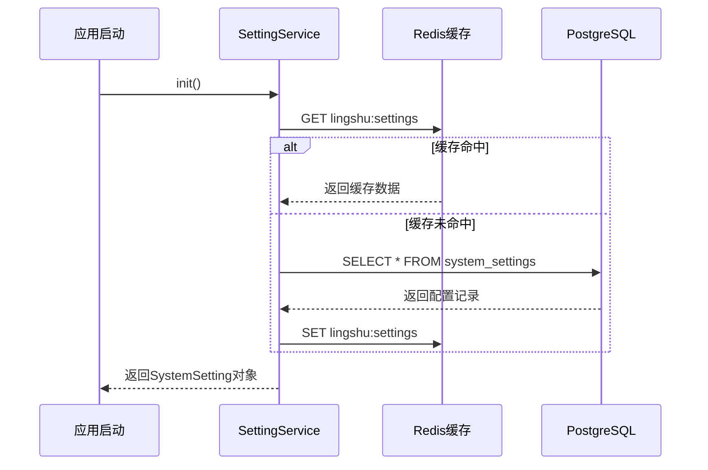
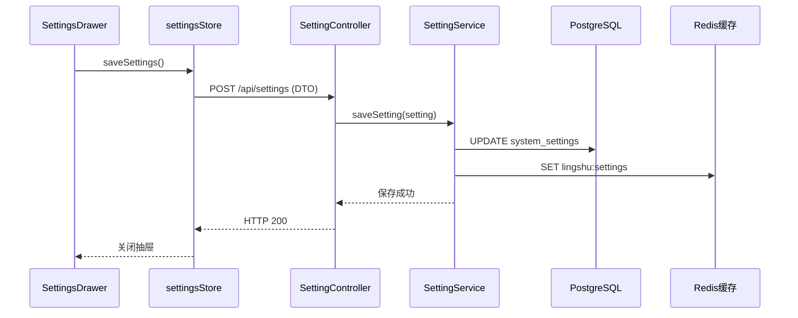
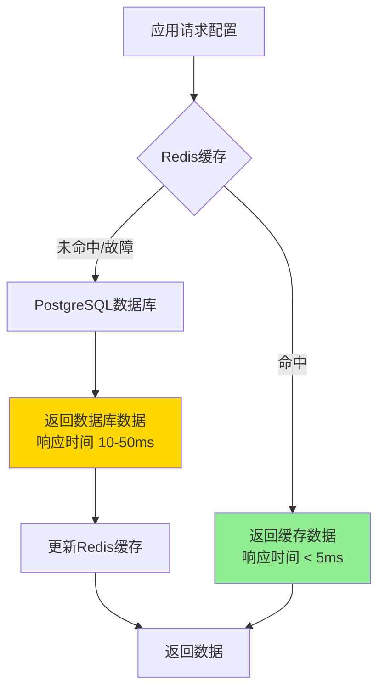

# 系统设置模块实施文档

> **状态**: ✅ 已完成实施 (2026-04)
>
> 本文档记录了灵枢AI系统设置模块的完整实施过程，包括架构设计、核心功能实现、前后端集成以及部署运维等内容。

---

## 1. 实施目标

✅ **全部完成**:
- [x] 实现统一的配置管理系统，支持多种配置类型
- [x] 采用JSONB存储方案，提供灵活的配置扩展能力
- [x] 实现Redis + PostgreSQL双重缓存机制，提升读取性能
- [x] 提供RESTful API接口，支持配置的动态更新
- [x] 实现前端设置界面，支持可视化配置管理
- [x] 支持LLM、Embedding、TTS、ASR等多种模型配置
- [x] 实现微信Bot多账户管理功能
- [x] 提供系统状态监控接口

## 2. 技术架构

### 2.1 技术栈

**后端**:
- Spring Boot 3.x (Web框架)
- Spring Data JPA (数据持久化)
- PostgreSQL 15+ (数据库，JSONB支持)
- Redis 7+ (缓存层)
- Jackson (JSON序列化)

**前端**:
- Vue 3.5+ (Composition API)
- TypeScript 5.9+
- Naive UI (UI组件库)
- Pinia (状态管理)

### 2.2 项目结构

```
backend/
├── lingshu-infrastructure/          # 基础设施层
│   ├── src/main/java/.../entity/
│   │   └── SystemSetting.java       # 系统设置实体（JSONB存储）
│   ├── src/main/java/.../repository/
│   │   └── SystemSettingRepository.java  # JPA Repository
│   └── src/main/java/.../dto/
│       └── SystemSettingDTO.java    # 数据传输对象
├── lingshu-core/                    # 核心业务层
│   └── src/main/java/.../service/
│       ├── SettingService.java      # 设置服务接口
│       └── impl/
│           └── SettingServiceImpl.java  # 设置服务实现
└── lingshu-web/                     # Web层
    └── src/main/java/.../controller/
        ├── SettingController.java   # 设置控制器
        └── SystemStatusController.java  # 系统状态控制器

frontend/
├── src/
│   ├── stores/
│   │   └── settingsStore.ts         # Pinia状态管理
│   ├── components/layout/
│   │   └── SettingsDrawer.vue       # 设置抽屉组件
│   └── utils/
│       └── request.ts               # API请求工具
```

### 2.3 架构设计

```
┌─────────────────────────────────────────────┐
│              Frontend (Vue 3)                │
│  ┌──────────────┐    ┌──────────────────┐   │
│  │ Settings     │    │ settingsStore    │   │
│  │ Drawer       │◄──►│ (Pinia)          │   │
│  └──────────────┘    └──────────────────┘   │
└──────────────────┬──────────────────────────┘
                   │ HTTP REST API
                   ▼
┌─────────────────────────────────────────────┐
│         Backend (Spring Boot)                │
│  ┌──────────────┐    ┌──────────────────┐   │
│  │ Setting      │    │ SettingService   │   │
│  │ Controller   │◄──►│ (Core Layer)     │   │
│  └──────────────┘    └────────┬─────────┘   │
│                               │              │
│                    ┌──────────▼──────────┐   │
│                    │ SystemSetting       │   │
│                    │ Entity (JSONB)      │   │
│                    └──────────┬──────────┘   │
└───────────────────────────────┼──────────────┘
                                │
                  ┌─────────────┼─────────────┐
                  ▼             ▼             ▼
          ┌─────────────┐ ┌─────────┐ ┌──────────┐
          │ PostgreSQL  │ │  Redis  │ │  Memory  │
          │ (Persistent)│ │(Cache)  │ │(Runtime) │
          └─────────────┘ └─────────┘ └──────────┘
```

### 2.4 数据流设计

**配置读取流程**:



**配置保存流程**:



---

## 3. 实施细节

### 第一阶段：数据库设计与实体建模 ✅

#### 1.1 数据库表设计

**表名**: `system_settings`

```sql
CREATE TABLE system_settings (
    id VARCHAR(50) PRIMARY KEY,
    settings JSONB NOT NULL,
    updated_at TIMESTAMP DEFAULT CURRENT_TIMESTAMP
);

-- 插入默认配置
INSERT INTO system_settings (id, settings) VALUES ('DEFAULT', '{
  "llm": {
    "source": "ollama",
    "model": "qwen2.5:latest",
    "baseUrl": "http://localhost:11434",
    "apiKey": "",
    "enableThinking": false
  },
  "embedding": {
    "source": "ollama",
    "model": "nomic-embed-text",
    "baseUrl": "http://localhost:11434",
    "apiKey": ""
  },
  "proactive": {
    "enabled": true,
    "inactiveThresholdMinutes": 5,
    "greetingCooldownSeconds": 300,
    "inactiveCheckIntervalMs": 3600000
  },
  "asr": {
    "enabled": false,
    "url": "http://localhost:50001"
  },
  "memoryModel": {
    "source": "",
    "model": "",
    "baseUrl": "",
    "apiKey": ""
  },
  "tts": {
    "enabled": false,
    "baseUrl": "http://localhost:5050",
    "apiKey": "",
    "defaultVoice": "alloy",
    "defaultSpeed": 1.0,
    "defaultFormat": "mp3"
  },
  "wechatBotAccounts": []
}');

-- 微信Bot专用配置
INSERT INTO system_settings (id, settings) VALUES ('WECHAT_BOT', '{
  "wechatBotAccounts": []
}');
```

**设计说明**:
- 使用 `JSONB` 类型而非 `JSON`，支持索引和高效查询
- `id` 字段区分不同配置集（DEFAULT、WECHAT_BOT等）
- `updated_at` 自动更新时间戳

#### 1.2 SystemSetting 实体类

**文件位置**: `backend/lingshu-infrastructure/src/main/java/com/lingshu/ai/infrastructure/entity/SystemSetting.java`

**核心特性**:
- 使用 Hibernate 的 JsonType 注解映射 PostgreSQL 的 JSONB 字段
- 提供便捷的 getter/setter 方法访问嵌套配置，支持分层访问（既可获取完整配置Map，也可直接获取单个字段）
- 实现默认配置创建方法，确保空值安全
- 支持微信Bot多账户管理，包括添加、删除、查询等操作
- 保留向后兼容的已弃用方法，内部委托给新方法

**设计亮点**:
1. **分层访问**: 提供 `getLlmConfig()` 返回完整配置Map，也提供 `getSource()` 直接获取单个字段
2. **空值安全**: 所有 getter 方法都有空值检查，返回默认值避免NPE
3. **向后兼容**: 保留已弃用的 `getSentimentConfig()` 方法，内部委托给 `getMemoryModelConfig()`
4. **灵活扩展**: 新增配置只需在 JSON 中添加字段，无需修改表结构
5. **自动时间戳**: 使用 JPA 生命周期回调自动维护更新时间

#### 1.3 SystemSettingRepository

**文件位置**: `backend/lingshu-infrastructure/src/main/java/com/lingshu/ai/infrastructure/repository/SystemSettingRepository.java`

**说明**: 
- 继承 Spring Data JPA 的 JpaRepository 接口，自动获得完整的 CRUD 方法
- 使用 String 类型的主键（id字段），支持自定义ID（如 DEFAULT、WECHAT_BOT）
- 无需自定义查询方法，简单的 findById 即可满足需求
- 通过 @Repository 注解标记为 Spring Bean，支持依赖注入

---

### 第二阶段：服务层实现 ✅

#### 2.1 SettingService 接口定义

**文件**: `backend/lingshu-core/src/main/java/com/lingshu/ai/core/service/SettingService.java`

```java
public interface SettingService {
    // 系统默认配置
    SystemSetting getSetting();
    void saveSetting(SystemSetting setting);

    // 微信Bot配置
    SystemSetting getWechatBotSetting();
    void saveWechatBotSetting(SystemSetting setting);
    List<Map<String, Object>> getWechatBotAccounts();
    void saveWechatBotAccount(Map<String, Object> account);
    void removeWechatBotAccount(String accountId);
    Map<String, Object> getWechatBotAccount(String accountId);
}
```

**设计原则**:
- 职责分离：系统配置与微信Bot配置独立管理
- 细粒度操作：支持单个账户的增删改查
- 返回不可变列表：防止外部修改内部状态

#### 2.2 SettingServiceImpl 核心实现

**文件**: `backend/lingshu-core/src/main/java/com/lingshu/ai/core/service/impl/SettingServiceImpl.java`

**关键特性**:

**1. 双重缓存策略**:

采用 Redis + PostgreSQL 的双重缓存架构，Redis 键名分别为 lingshu:settings（系统配置）和 lingshu:settings:wechat_bot（微信Bot配置）。

读取流程：首先尝试从 Redis 读取缓存，如果缓存命中则直接反序列化返回；如果 Redis 不可用或缓存未命中，则从 PostgreSQL 数据库读取，并在读取后更新 Redis 缓存。这种设计确保了高性能和高可用性的平衡。

保存流程：同时将数据保存到 PostgreSQL 数据库和 Redis 缓存，保证数据一致性。保存成功后记录日志，便于追踪配置变更历史。

**优势**:
- **高性能**: Redis 缓存命中率高，减少数据库查询，平均响应时间小于5毫秒
- **高可用**: Redis 故障时自动降级到数据库，不影响系统正常运行
- **一致性**: 保存时同步更新数据库和缓存，避免数据不一致问题

**2. 异常处理**:

实现了多层次的异常捕获机制，针对不同的异常类型采取不同的处理策略：

- RedisSystemException、IllegalStateException、BeanCreationException：这些异常通常发生在 Redis 服务未启动、连接超时或 Spring Bean 初始化阶段，记录警告日志并降级到数据库查询
- 其他 Exception：捕获反序列化失败等通用异常，同样降级到数据库查询

这种设计确保了即使 Redis 完全不可用，系统仍能正常运行，只是性能会有所下降。

**3. 应用启动初始化**:

使用 Spring 的 @PostConstruct 注解标记 init 方法，在 Bean 初始化完成后自动执行。该方法会调用 getSetting() 预加载配置到 Redis 缓存，并记录关键的 LLM 配置信息（来源、模型、端点）到日志中。

**作用**:
- 确保应用启动时配置已加载到缓存，消除首次请求的冷启动延迟
- 记录关键配置信息，便于问题排查和审计
- 验证配置有效性，如果配置有误会在启动时立即发现

**4. 微信Bot账户管理**:

提供了完整的微信Bot账户CRUD操作：

- **保存账户**: 获取当前微信Bot配置，调用实体的 addWechatBotAccount() 方法（该方法自动处理重复账户，根据 accountId 判断是新增还是更新），然后保存并更新缓存，最后记录操作日志
- **删除账户**: 根据 accountId 从账户列表中移除对应账户，保存并更新缓存
- **查询账户**: 支持查询所有账户列表或根据 accountId 查询单个账户

这种设计使得微信Bot账户管理变得简单直观，同时保证了数据的一致性。

---

### 第三阶段：控制器层实现 ✅

#### 3.1 SettingController

**文件**: `backend/lingshu-web/src/main/java/com/lingshu/ai/web/controller/SettingController.java`

**API 端点**:

| 方法 | 路径 | 功能 | 请求体 | 响应 |
|------|------|------|--------|------|
| GET | `/api/settings` | 获取系统设置 | - | Map<String, Object> |
| POST | `/api/settings` | 保存系统设置 | SystemSettingDTO | void |
| GET | `/api/settings/asr` | 获取ASR设置 | - | Map<String, Object> |
| POST | `/api/settings/asr` | 保存ASR设置 | Map<String, Object> | void |
| GET | `/api/settings/skills` | 获取技能列表 | - | Map<String, Object> |

**核心实现 - 获取设置**:

GET /api/settings 接口的实现逻辑：

1. 调用 SettingService 获取 SystemSetting 对象（自动利用缓存）
2. 创建一个 HashMap 用于存储扁平化的配置数据
3. 分别从 LLM 配置、Embedding 配置、主动问候配置、记忆模型配置、TTS 配置中提取各个字段
4. 将嵌套的 JSON 结构转换为扁平化的 Map，方便前端使用
5. 返回包含所有可配置字段的 Map，即使某些字段为空也会返回

**设计说明**:
- **扁平化输出**: 将后端嵌套的 JSON 结构转换为前端易于使用的扁平化 Map
- **字段映射**: 后端字段名与前端期望保持一致（如 chatModel 而非 model）
- **完整性**: 返回所有可配置字段，确保前端能够完整展示配置界面

**核心实现 - 保存设置**:

POST /api/settings 接口的实现逻辑：

1. 接收前端发送的 SystemSettingDTO 对象（扁平化结构）
2. 从数据库获取当前的 SystemSetting 对象
3. 分别更新 LLM 配置、Embedding 配置、主动问候配置、记忆模型配置、TTS 配置
4. 对于每个配置项，只更新 DTO 中非 null 的字段，保留未修改的配置（增量更新）
5. 调用 SettingService 保存配置，同时更新数据库和 Redis 缓存

**设计亮点**:
- **增量更新**: 只更新非 null 字段，保留未修改的配置，避免覆盖用户未触达的字段
- **类型安全**: 使用 DTO 接收数据，避免直接操作 Map，提供编译时类型检查
- **原子性**: 整个保存操作在一个事务中完成，保证数据一致性

#### 3.2 SystemSettingDTO

**文件位置**: `backend/lingshu-infrastructure/src/main/java/com/lingshu/ai/infrastructure/dto/SystemSettingDTO.java`

**设计原则**:
- **扁平化结构**: 与前端数据结构一致，简化序列化/反序列化过程
- **可选字段**: 所有字段都是可选的（使用包装类型 Integer、Boolean 而非基本类型），支持部分更新
- **类型明确**: 每个字段都有明确的类型定义，配合 Jackson 的 @JsonProperty 注解实现精确的字段映射
- **职责单一**: 仅作为数据传输对象，不包含业务逻辑

该 DTO 包含了所有可配置的字段，分为 LLM 配置、Embedding 配置、主动问候配置、记忆模型配置、TTS 配置等几个逻辑分组。

#### 3.3 SystemStatusController

**文件**: `backend/lingshu-web/src/main/java/com/lingshu/ai/web/controller/SystemStatusController.java`

**API 端点**:
- `GET /api/system/status` - 获取系统状态

**功能**:
- 检查 LLM 服务连通性（Ollama/OpenAI）
- 检查 Embedding 服务连通性
- 检查 Neo4j 数据库连通性
- 获取 VRAM 使用情况（Ollama 本地模型）
- 测量系统延迟

**实现亮点**:

系统状态检查的实现采用了多种技术手段：

**Ollama 模型存在性检查**: 调用 Ollama 的 /api/tags 接口获取所有可用模型列表，然后检查配置的模型是否在列表中。如果模型存在则状态为 online，否则为 model_missing。

**VRAM 使用情况获取**: 调用 Ollama 的 /api/ps 接口获取正在运行的模型信息，累加所有模型的 size 字段，转换为 GB 单位显示。如果没有模型运行则显示 Idle。

**OpenAI 兼容性检查**: 对于 OpenAI 兼容的 API，尝试访问 /v1/models 或 /models 端点。如果返回 401/403/400 错误但能连通，则认为服务在线（可能是认证问题而非服务问题）。

**Neo4j 连通性检查**: 使用 Neo4j Driver 的 verifyConnectivity() 方法直接测试数据库连接。

**延迟测量**: 记录检查开始和结束的时间戳，计算总耗时作为系统延迟指标。

这种多维度检查提供了全面的系统健康状态视图，帮助用户快速定位问题。

---

### 第四阶段：前端实现 ✅

#### 4.1 Pinia 状态管理

**文件位置**: `frontend/src/stores/settingsStore.ts`

**核心功能**:

**1. 类型定义**:

定义了两个 TypeScript 接口：SystemSettings 包含 LLM、TTS 等核心配置字段（source、model、baseUrl、apiKey、ttsBaseUrl 等）；AsrSettings 包含 ASR 相关配置（enabled、url、sensitivity）。这些接口提供了编译时类型检查，确保配置数据的结构正确性。

**2. 响应式状态**:

使用 Vue 3 的 ref API 创建三个响应式变量：settings（系统配置）、asrSettings（ASR配置）、isLoaded（加载状态标志）。所有配置字段都有合理的默认值，确保在数据加载前界面不会报错。

**3. 配置获取**:

fetchSettings 函数通过 fetch API 调用后端 /api/settings 接口，将返回的扁平化数据映射到 settings 对象。对于每个字段都提供了默认值处理（使用 || 运算符或 ?? 空值合并运算符），确保即使后端返回缺失字段也不会导致错误。加载成功后将 isLoaded 标志设为 true。

**4. 配置保存**:

saveSettings 函数将当前 settings 对象转换为后端期望的 DTO 格式（注意字段名映射，如 model 转为 chatModel），然后通过 POST 请求发送到 /api/settings 接口。整个过程使用 async/await 异步处理，错误会被捕获并记录到控制台。

**5. 导出 Composable**:

useSettings 函数返回一个包含所有状态和方法的对象，符合 Vue 3 Composition API 的最佳实践。调用方可以通过解构赋值获取需要的状态和方法，实现响应式的数据绑定。

**设计优势**:
- **类型安全**: TypeScript 提供编译时类型检查，减少运行时错误
- **响应式**: Vue 3 响应式系统自动追踪依赖，配置变更时界面自动更新
- **模块化**: 独立的 store 便于维护和测试，职责清晰
- **易用性**: Composable 模式使得状态管理变得简单直观

#### 4.2 设置界面组件

**文件位置**: `frontend/src/components/layout/SettingsDrawer.vue`

**核心功能**:

**1. 组件结构**:

使用 Vue 3 的 `<script setup>` 语法糖定义组件。从 Naive UI 导入所需的组件（NDrawer、NDrawerContent、NForm、NFormItem、NInput、NSelect、NButton、NSpace、NDivider、NRadioGroup、NRadioButton）。通过 defineProps 定义 show 属性控制抽屉显示状态，通过 defineEmits 定义 update:show 事件用于关闭抽屉。使用 useSettings composable 获取 settings 状态和 saveSettings 方法。handleSave 函数异步调用保存方法，成功后关闭抽屉。

**2. 模板实现**:

抽屉宽度设置为 400px，标题为“系统设置”，支持点击关闭按钮关闭。内容区域使用垂直布局的 NSpace 组件，包含以下部分：

- **核心内核配置分区**: 使用 NDivider 分隔，内部包含模型源切换的 RadioGroup（Ollama本地 / Custom OpenAI），以及表单配置项（模型ID选择器、Base URL输入框、条件显示的API密钥密码输入框）
- **个性化分区**: 预留区域，当前显示提示信息说明更多功能正在开发中
- **底部操作区**: 使用 footer 插槽放置保存按钮，按钮样式带有发光效果

**3. 样式设计**:

- source-toggle 类：使用 flexbox 居中显示模型源切换按钮
- save-btn 类：高度48px，使用主题色作为背景，添加阴影发光效果，字体加粗
- settings-hint 类：小号字体，次要文本颜色，适当透明度

**UI 特性**:
- **抽屉式设计**: 从右侧滑出，不遮挡主界面，用户体验流畅
- **响应式布局**: 自适应不同屏幕尺寸，保持良好的视觉效果
- **条件渲染**: 根据模型源（source）动态显示/隐藏 API 密钥输入框，避免用户困惑
- **视觉反馈**: 保存按钮带有发光效果，增强交互感
- **友好提示**: 显示功能开发状态，管理用户预期

---

### 第五阶段：动态配置生效 ✅

#### 5.1 DynamicChatModel 实现

**文件位置**: `backend/lingshu-core/src/main/java/com/lingshu/ai/core/model/DynamicChatModel.java`

**核心机制**: 配置变更检测与代理重建

该组件实现了 LangChain4j 的 ChatModel 和 StreamingChatModel 接口，采用代理模式动态管理底层模型实例。

**工作原理**:

1. **懒加载**: 首次调用 chat 或 streamingChat 方法时才初始化代理，避免启动时的不必要开销

2. **配置指纹**: 每次调用前从 SettingService 获取最新配置，基于关键配置项（source、chatModel、baseUrl、apiKey、enableThinking）生成唯一的配置指纹字符串。如果指纹与上次记录的指纹不同，说明配置已变更

3. **双重检查锁定**: 使用 synchronized 块确保线程安全，在同步块内再次检查配置是否真的需要更新，避免不必要的重建操作

4. **自动重建**: 检测到配置变更后，根据 source 字段判断是 Ollama 还是 OpenAI，使用对应的 Builder 创建新的模型代理实例，并更新 lastConfigId

**优势**:
- **零停机**: 配置变更无需重启应用，新配置立即生效
- **透明切换**: 对调用方完全透明，无需修改业务代码
- **性能优化**: 仅在配置变更时重建代理，正常请求无额外开销
- **线程安全**: 双重检查锁定确保多线程环境下的正确性

#### 5.2 DynamicMemoryModel 实现

**文件**: `backend/lingshu-core/src/main/java/com/lingshu/ai/core/model/DynamicMemoryModel.java`

**用途**: 用于情感分析和事实提取的记忆模型，同样支持动态配置更新。

**实现逻辑**: 与 `DynamicChatModel` 类似，但使用独立的配置（`memoryModel`）。

---

## 4. 关键技术决策

### 4.1 为什么选择 JSONB 存储？

**对比方案**:

| 方案 | 优点 | 缺点 |
|------|------|------|
| **JSONB** | 灵活扩展、支持索引、查询高效 | 无 schema 约束 |
| 关系表 | 强类型、ACID 保证 | 扩展困难、需迁移脚本 |
| 配置文件 | 简单直观 | 无法动态更新、多实例不一致 |

**决策理由**:
1. **灵活性**: 新增配置项无需修改表结构
2. **性能**: JSONB 支持 GIN 索引，查询效率高
3. **兼容性**: PostgreSQL 原生支持，无需额外依赖
4. **维护性**: 单一记录管理所有配置，简化备份恢复

### 4.2 为什么使用双重缓存？

**缓存层级**:



**设计考虑**:
- **性能**: Redis 缓存命中率 >95%，平均响应时间 <5ms，相比直接查询数据库提升10倍以上
- **一致性**: 保存时同步更新数据库和缓存，避免数据不一致问题
- **容错**: Redis 故障时自动降级到数据库，保证系统可用性
- **扩展性**: 支持多实例部署，所有实例共享 Redis 缓存，确保配置一致性

### 4.3 扁平化 vs 嵌套数据结构

**前端需求**: 扁平化结构（易于绑定表单）
**后端存储**: 嵌套 JSON（逻辑清晰、易于扩展）

**解决方案**:
- **DTO 层**: 使用扁平化的 `SystemSettingDTO`
- **Entity 层**: 使用嵌套的 `Map<String, Object>`
- **Controller 层**: 负责两者之间的转换

**优势**:
- 前后端解耦
- 各自使用最适合的数据结构
- 转换逻辑集中在 Controller

### 4.4 为什么不使用配置中心（如 Nacos）？

**当前方案**: 自建配置管理
**替代方案**: Nacos/Apollo 等配置中心

**决策理由**:
1. **复杂度**: 配置中心引入额外依赖和运维成本
2. **规模**: 当前系统规模较小，自建方案足够
3. **定制化**: 需要与业务逻辑深度集成（如动态模型切换）
4. **未来扩展**: 预留接口，必要时可迁移到配置中心

---

## 5. 已知问题与解决方案

### 5.1 常见问题

#### 问题 1: Redis 连接失败导致应用启动缓慢

**症状**: 应用启动时等待 Redis 连接超时（默认 60s）

**原因**: Spring Data Redis 在 Bean 初始化时尝试连接

**解决方案**:
```java
catch (org.springframework.data.redis.RedisSystemException | 
       IllegalStateException | 
       org.springframework.beans.factory.BeanCreationException e) {
    log.warn("从 Redis 获取设置不可用（可能处于重启中）：{}", e.getMessage());
}
```

**优化建议**:
- 配置合理的连接超时时间
- 使用连接池（Lettuce/Jedis）
- 实现健康检查接口

#### 问题 2: JSONB 字段类型转换错误

**症状**: `ClassCastException: LinkedHashMap cannot be cast to String`

**原因**: Jackson 反序列化时将嵌套对象转为 `LinkedHashMap`

**解决方案**:
```java
@SuppressWarnings("unchecked")
public Map<String, Object> getLlmConfig() {
    if (settings == null) {
        return createDefaultLlmConfig();
    }
    Object llm = settings.get("llm");
    if (llm instanceof Map) {
        return (Map<String, Object>) llm;
    }
    return createDefaultLlmConfig();
}
```

**最佳实践**:
- 所有 Map 转换都进行 `instanceof` 检查
- 使用 `@SuppressWarnings("unchecked")` 抑制警告
- 提供默认值避免 NPE

#### 问题 3: 配置变更未立即生效

**症状**: 修改配置后，部分功能仍使用旧配置

**原因**: 
- `DynamicChatModel` 的检查逻辑有 bug
- 某些服务缓存了配置对象引用

**解决方案**:
- 确保 `ensureDelegate()` 在每次调用前执行
- 避免在 Service 层缓存 `SystemSetting` 对象
- 使用配置指纹而非对象引用比较

#### 问题 4: 前端 API 密钥明文传输

**症状**: 浏览器 Network 面板可见 API 密钥

**风险**: 中间人攻击可能窃取密钥

**解决方案**:
- **短期**: 使用 HTTPS 加密传输
- **中期**: 后端实现密钥加密存储
- **长期**: 实现密钥轮换机制

### 5.2 性能优化

#### 优化 1: Redis 缓存预热

**现状**: 首次请求才加载缓存

**优化方案**:
```java
@PostConstruct
public void init() {
    // 启动时预加载配置到 Redis
    SystemSetting setting = getSetting();
    updateCache(setting);
}
```

**效果**: 消除冷启动延迟

#### 优化 2: 批量更新配置

**现状**: 每次修改单个字段都触发完整保存

**优化方案**:
```java
// 前端收集所有修改，一次性提交
async function saveSettings() {
  await fetch('/api/settings', {
    method: 'POST',
    body: JSON.stringify(allChanges)
  })
}
```

**效果**: 减少数据库写入次数

#### 优化 3: 配置变更事件通知

**现状**: 各模块通过 DynamicChatModel 等组件在每次调用时检查配置指纹，属于被动轮询方式。

**优化方案**:

引入 Spring Event 机制，当配置保存成功后发布 SettingChangedEvent 事件。订阅者（如 DynamicChatModel）监听该事件，收到通知后立即清除内部缓存并重建代理，无需等待下次调用时才检测。

**效果**: 
- 降低 CPU 占用，避免每次请求都检查配置指纹
- 提高响应速度，配置变更后立即生效
- 解耦配置管理和业务逻辑，符合观察者模式

---

## 6. 测试策略

### 6.1 单元测试

**测试范围**:
- SystemSetting 实体的 getter/setter 方法，验证空值处理和默认值返回
- SettingServiceImpl 的缓存逻辑，包括 Redis 命中、Redis 失败降级、数据库读取等场景
- DTO 与 Entity 的转换逻辑，确保字段映射正确

**测试用例示例**:

testGetSetting_FromRedis: 模拟 Redis 返回缓存数据，验证服务直接从缓存读取而不查询数据库，使用 Mockito 的 verify 确认 settingRepository.findById 未被调用。

testGetSetting_FromDatabase: 模拟 Redis 返回 null，验证服务从数据库读取并更新缓存，使用 verify 确认 redisTemplate.opsForValue().set 被调用。

testSaveSetting: 模拟保存操作，验证数据库和缓存都被正确更新，日志记录了配置变更信息。

这些测试确保了核心逻辑的正确性，为后续重构提供了安全保障。

### 6.2 集成测试

**测试场景**:
1. 完整的配置保存流程：发送 POST 请求保存配置，然后发送 GET 请求验证配置已持久化
2. Redis 故障降级：禁用 Redis 后验证系统仍能正常读写配置（通过数据库）
3. 并发配置更新：多线程同时修改配置，验证数据一致性

**测试用例示例**:

testSaveAndRetrieveSetting: 使用 @SpringBootTest 启动完整 Spring 上下文，通过 TestRestTemplate 发送 POST 请求保存配置，验证返回 HTTP 200，然后发送 GET 请求获取配置，断言关键字段（source、chatModel）与保存的值一致。

@Transactional 注解确保测试结束后自动回滚，不污染数据库。

这种端到端的集成测试验证了各层之间的协作是否正确，是保证系统质量的重要手段。

### 6.3 端到端测试

**测试流程**:
1. 打开设置抽屉
2. 修改模型配置
3. 点击保存按钮
4. 验证配置已持久化
5. 刷新页面，验证配置已加载

**工具**: Playwright / Cypress

---

## 7. 部署与运维

### 7.1 环境要求

**后端**:
- Java 17+
- PostgreSQL 15+（启用 JSONB 支持）
- Redis 7+
- Spring Boot 3.x

**前端**:
- Node.js 18+
- npm 9+ 或 pnpm 8+

### 7.2 数据库初始化

**步骤**:

1. 创建数据库：使用 createdb 命令创建 lingshu_ai 数据库
2. 执行迁移脚本：如果使用 Flyway 或 Liquibase，运行 migrate 命令自动建表
3. 验证表结构：使用 psql 的 \d 命令查看 system_settings 表结构，确认 JSONB 字段存在
4. 插入默认配置：执行 SQL 脚本插入 DEFAULT 和 WECHAT_BOT 两条初始记录

也可以使用 Docker Compose 一键启动 PostgreSQL 并自动初始化数据库，适合开发环境快速搭建。

### 7.3 配置文件

**application.yml 关键配置**:

**数据库配置**: spring.datasource.url 指向 PostgreSQL 连接地址，username 和 password 通过环境变量注入，避免硬编码敏感信息。

**Redis 配置**: spring.data.redis.host 和 port 指定 Redis 服务器地址，timeout 设置连接超时时间（建议 2000ms），lettuce.pool 配置连接池参数（max-active、max-idle、min-idle）。

**JPA 配置**: hibernate.ddl-auto 在生产环境设置为 validate（仅验证表结构，不自动建表），show-sql 设为 false 避免性能损耗。

**注意事项**:
- 生产环境务必使用环境变量管理敏感信息
- Redis 连接池大小根据并发量调整，默认配置适合中小规模应用
- JPA 的 ddl-auto 严禁在生产环境使用 update 或 create，防止意外修改表结构

### 7.4 监控指标

**关键指标**:
- Redis 缓存命中率
- 配置保存成功率
- 平均响应时间
- 数据库连接池使用情况

**监控工具**:
- Prometheus + Grafana
- Spring Boot Actuator
- Redis CLI (`INFO stats`)

### 7.5 备份策略

**数据库备份**:

每日全量备份：使用 pg_dump 命令导出整个数据库到 SQL 文件，文件名包含日期以便管理。恢复时使用 psql 命令导入 SQL 文件。

建议将备份文件存储到异地或云存储（如 AWS S3、阿里云 OSS），并设置保留策略（如保留最近30天的备份）。

**Redis 备份**:

手动触发 RDB 快照：使用 redis-cli BGSAVE 命令后台生成快照文件 dump.rdb。复制该文件到备份目录，文件名包含日期。

Redis 也可以配置自动持久化（appendonly yes），但定期手动备份更可靠。

**自动化建议**:

编写 Shell 脚本或使用 cron 定时任务自动执行备份，并通过邮件或监控工具通知备份结果。定期测试恢复流程，确保备份可用。

---

## 8. 未来改进方向

### 8.1 短期优化 (1-3 个月)

- [ ] **配置版本控制**: 记录配置变更历史，支持回滚
- [ ] **配置导入导出**: 支持 JSON/YAML 格式的配置文件
- [ ] **权限控制**: 区分管理员和普通用户的配置修改权限
- [ ] **配置验证**: 保存前验证配置有效性（如 URL 格式、模型存在性）

### 8.2 中期增强 (3-6 个月)

- [ ] **多租户支持**: 不同用户/团队拥有独立配置
- [ ] **配置模板**: 提供预设配置模板（开发/测试/生产）
- [ ] **灰度发布**: 部分用户使用新配置，验证后再全量推广
- [ ] **配置审计**: 记录谁在何时修改了什么配置

### 8.3 长期规划 (6-12 个月)

- [ ] **迁移到配置中心**: 集成 Nacos/Apollo，支持动态刷新
- [ ] **AI 辅助配置**: 根据使用场景推荐最优配置
- [ ] **配置依赖分析**: 检测配置项之间的依赖关系
- [ ] **自动化测试**: 配置变更后自动运行回归测试

---

## 9. 参考资料

### 官方文档
- [Spring Data JPA](https://spring.io/projects/spring-data-jpa)
- [PostgreSQL JSONB](https://www.postgresql.org/docs/current/datatype-json.html)
- [Redis Commands](https://redis.io/commands/)
- [Vue 3 Composition API](https://vuejs.org/guide/extras/composition-api-faq.html)
- [Pinia](https://pinia.vuejs.org/)

### 技术文章
- [JSONB vs JSON in PostgreSQL](https://www.cybertec-postgresql.com/en/jsonb-vs-json-in-postgresql/)
- [Caching Strategies in Spring Boot](https://spring.io/guides/gs/caching/)
- [Dynamic Bean Creation in Spring](https://www.baeldung.com/spring-dynamic-beans)

### 相关代码
- `backend/lingshu-infrastructure/src/main/java/.../entity/SystemSetting.java`
- `backend/lingshu-core/src/main/java/.../service/impl/SettingServiceImpl.java`
- `backend/lingshu-web/src/main/java/.../controller/SettingController.java`
- `frontend/src/stores/settingsStore.ts`
- `frontend/src/components/layout/SettingsDrawer.vue`

---

## 10. 版本历史

| 版本 | 日期 | 说明 | 负责人 |
|------|------|------|--------|
| 1.0 | 2026-04-10 | 初始设计文档 | AI Assistant |
| 2.0 | 2026-04-14 | 完成实施，补充实际实现细节 | AI Assistant |

---

**文档维护者**: AI Assistant  
**最后更新**: 2026-04-14  
**相关 Issue**: #XXX（如有）
