# 灵枢 AI 对话调用链路详解

本文描述当前项目里“用户发送一条聊天消息，到 AI 流式回复，再到事实提取写入记忆”的完整链路。

重点覆盖：

- 前端通过 `ws://localhost:8080/ws/chat` 发消息后的路径
- 后端如何做情感分析、关系状态更新、长期记忆检索、System Prompt 构建
- LangChain4j 如何带着 `chatMemory + tools + system prompt` 调模型
- 模型流式输出如何回传给前端
- 对话结束后如何异步做事实提取并写入 Neo4j / pgvector

相关代码入口：

- [ChatWebSocketHandler.java](D:/Project/LingShu-AI/backend/lingshu-web/src/main/java/com/lingshu/ai/web/websocket/ChatWebSocketHandler.java)
- [ChatServiceImpl.java](D:/Project/LingShu-AI/backend/lingshu-core/src/main/java/com/lingshu/ai/core/service/impl/ChatServiceImpl.java)
- [MemoryServiceImpl.java](D:/Project/LingShu-AI/backend/lingshu-core/src/main/java/com/lingshu/ai/core/service/impl/MemoryServiceImpl.java)
- [PromptBuilderServiceImpl.java](D:/Project/LingShu-AI/backend/lingshu-core/src/main/java/com/lingshu/ai/core/service/impl/PromptBuilderServiceImpl.java)
- [DynamicChatModel.java](D:/Project/LingShu-AI/backend/lingshu-core/src/main/java/com/lingshu/ai/core/model/DynamicChatModel.java)
- [DatabaseChatMemoryStore.java](D:/Project/LingShu-AI/backend/lingshu-infrastructure/src/main/java/com/lingshu/ai/infrastructure/memory/DatabaseChatMemoryStore.java)

## 总览

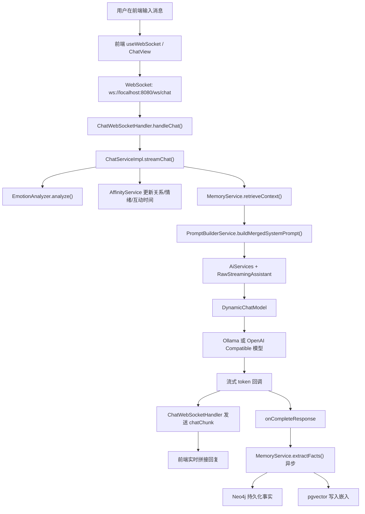

## 1. 主时序图

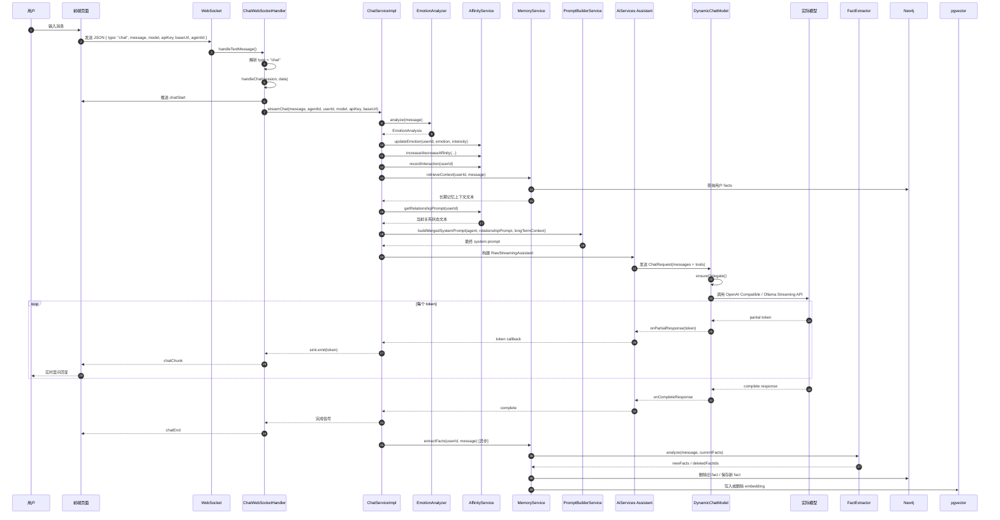

## 2. WebSocket 入口层

入口文件：[ChatWebSocketHandler.java](D:/Project/LingShu-AI/backend/lingshu-web/src/main/java/com/lingshu/ai/web/websocket/ChatWebSocketHandler.java)

当前聊天消息从这里进入，不走 REST `/api/chat/stream`。

### 2.1 收到消息后的分发

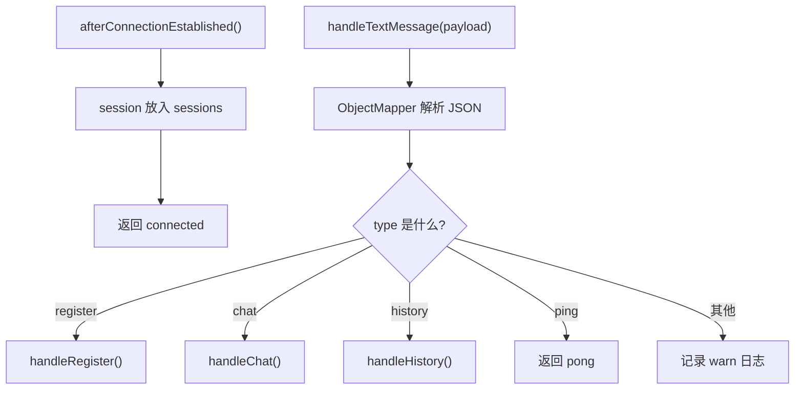

### 2.2 `chat` 消息格式

后端期待的 WebSocket 负载大致是：

```json
{
  "type": "chat",
  "message": "我是谁",
  "agentId": null,
  "model": "Qwen/Qwen3-8B",
  "apiKey": "xxx",
  "baseUrl": "http://xxx/v1"
}
```

处理逻辑：

- 从 `sessionUserMap` 里取 `userId`
- 先给前端发 `chatStart`
- 调用 `chatService.streamChat(...)`
- 对每个输出片段发 `chatChunk`
- 完成时发 `chatEnd`
- 出错时发 `error`

## 3. ChatService 主链路

核心文件：[ChatServiceImpl.java](D:/Project/LingShu-AI/backend/lingshu-core/src/main/java/com/lingshu/ai/core/service/impl/ChatServiceImpl.java)

聊天主入口是：

- `streamChat(String message, Long agentId, String userId, String model, String apiKey, String baseUrl)`

### 3.1 内部执行顺序

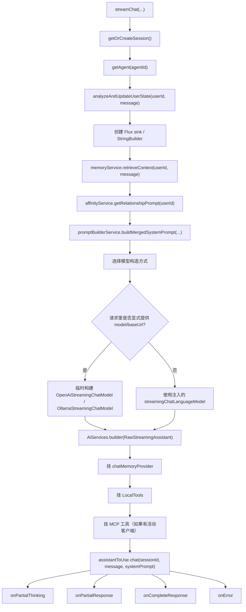

### 3.2 情感分析和关系状态更新

在真正调模型前，会先跑：

- `emotionAnalyzer.analyze(message)`
- `affinityService.updateEmotion(...)`
- `affinityService.increaseAffinity(...)` 或 `decreaseAffinity(...)`
- `affinityService.recordInteraction(userId)`

这一步的作用不是生成回复，而是更新“当前关系状态”，后面 `getRelationshipPrompt(userId)` 会把这些状态转换成 prompt 里的“关系文本”。

## 4. 长期记忆检索链路

核心文件：[MemoryServiceImpl.java](D:/Project/LingShu-AI/backend/lingshu-core/src/main/java/com/lingshu/ai/core/service/impl/MemoryServiceImpl.java)

### 4.1 `retrieveContext()` 细分

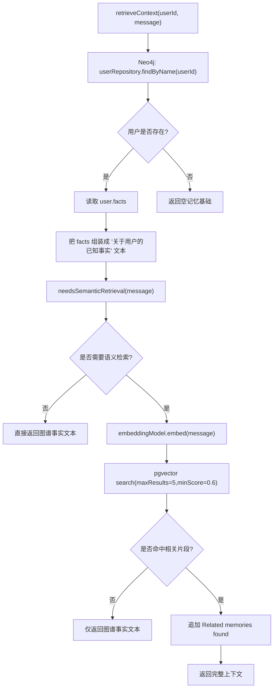

### 4.2 `needsSemanticRetrieval()` 判断逻辑

它不是所有消息都查向量库，而是先做一层 GAM-RAG 风格的判断：

1. 从当前消息里抽取实体/关键词
2. 用这些词去 Neo4j facts 做关键词命中
3. 计算一个 `gain`
4. 只有 `gain >= 0.3` 才继续做语义检索

这样做的目的是减少无效的向量查询。

### 4.3 对“我是谁”这类消息的特殊点

`retrieveContext()` 对身份类问题有特殊分支：

- 如果消息包含“我是谁”“我的名字”“叫什么”
- 即使没触发复杂语义检索
- 也会直接把图谱里已有 facts 返回给上层用于回答

## 5. Prompt 构建链路

核心文件：[PromptBuilderServiceImpl.java](D:/Project/LingShu-AI/backend/lingshu-core/src/main/java/com/lingshu/ai/core/service/impl/PromptBuilderServiceImpl.java)

### 5.1 System Prompt 的组成

`buildMergedSystemPrompt()` 的最终结果由两部分组成：

1. `buildSystemPrompt(config)` 生成基础人格与规则
2. 追加运行时上下文

运行时上下文包括：

- `# 当前关系状态`
- `# 感官记忆 (长期事实)`

然后再追加一段“回复准则”，例如：

- 用户问自己信息时优先引用记忆
- 用户显式让你回忆时要引用记忆
- 没有记忆时不要瞎编
- 根据关系状态调整语气

### 5.2 Prompt 结构图

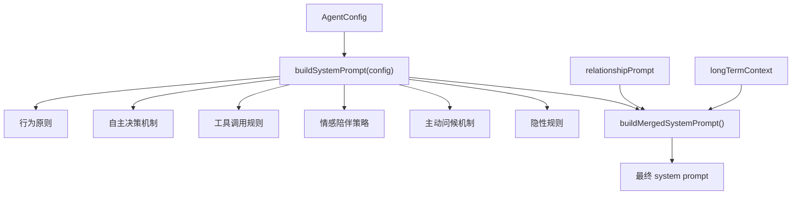

## 6. ChatMemory 与历史消息链路

核心文件：

- [AiConfig.java](D:/Project/LingShu-AI/backend/lingshu-core/src/main/java/com/lingshu/ai/core/config/AiConfig.java)
- [DatabaseChatMemoryStore.java](D:/Project/LingShu-AI/backend/lingshu-infrastructure/src/main/java/com/lingshu/ai/infrastructure/memory/DatabaseChatMemoryStore.java)

### 6.1 ChatMemoryProvider 是怎么创建的

`AiConfig.chatMemoryProvider()` 每次按 `sessionId` 创建：

- `MessageWindowChatMemory`
- `maxMessages = 20`
- 底层 store = `DatabaseChatMemoryStore`

### 6.2 当前消息列表是怎么来的

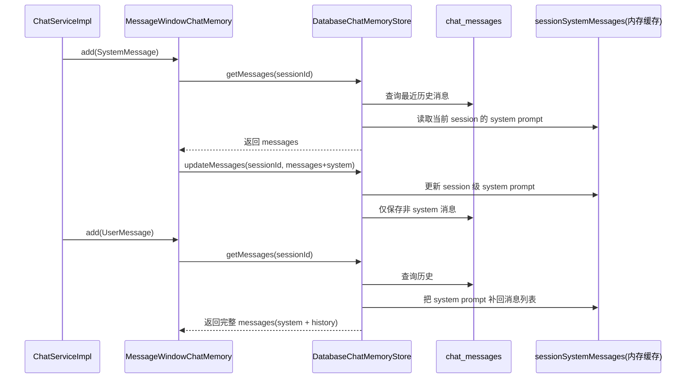

### 6.3 为什么这里容易出问题

聊天链路和事实提取/情感分析最大的不同是：

- 聊天走 `AiServices + chatMemoryProvider + tools`
- 分析类调用通常是一次性 prompt，不依赖对话历史窗口

所以如果 `ChatMemoryStore` 把 `SystemMessage` 丢掉，聊天请求就会表现成：

- 历史 user/assistant 还在
- tools 还在
- 但 `system` 统计为 0

这也是这次排查里最关键的 bug 点。

## 7. 模型选择与实际下发链路

核心文件：[DynamicChatModel.java](D:/Project/LingShu-AI/backend/lingshu-core/src/main/java/com/lingshu/ai/core/model/DynamicChatModel.java)

### 7.1 模型适配层

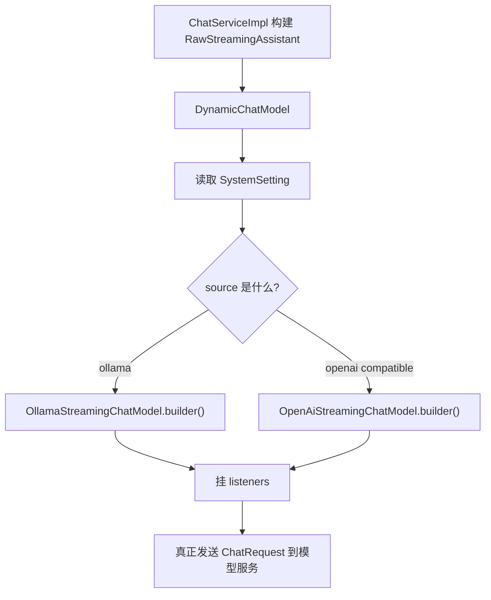

### 7.2 监听器做了什么

`AiConfig.chatModelListener()` 会在请求发出前记录：

- `LLM Request Messages (Count: n)`
- `LLM Request Role Summary => system/user/assistant/tool`
- 每条 message 的 role 和内容

这个日志就是排查 prompt 丢失最直接的观测点。

## 8. 流式回复回传链路

### 8.1 模型输出如何回前端

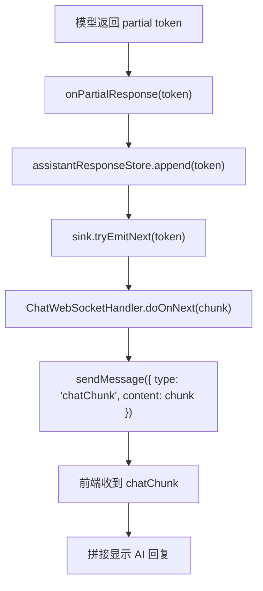

### 8.2 完成时会发生什么

- `onCompleteResponse` 被触发
- 统计 token 数
- 发 `chatEnd`
- 异步触发 `memoryService.extractFacts(userId, message)`

注意：

- 事实提取分析的是“用户刚才发的话”
- 不是 AI 的回复

## 9. 事实提取异步尾链

### 9.1 主流程

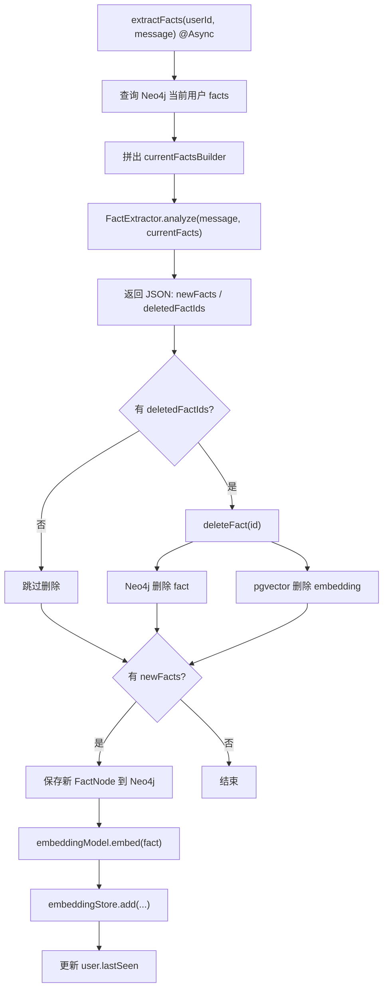

### 9.2 为什么这条链不会丢 system prompt

因为 `FactExtractor` 是单独的 `AiServices.builder(FactExtractor.class).chatModel(chatLanguageModel).build()`：

- 没挂 `chatMemoryProvider`
- 没挂聊天工具
- 没走历史窗口回放
- 用的是独立 `@SystemMessage`

所以它天然不受聊天记忆窗口那层问题影响。

## 10. 一次完整对话里实际发生了什么

把所有步骤串起来，可以理解成下面这个“完整生命历程”：

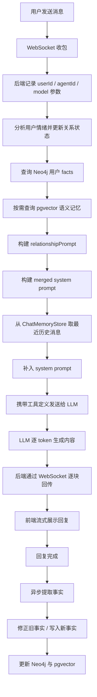

## 11. 你现在排查这条链最该看哪几个点

如果以后再遇到“普通对话没带 system prompt”，优先看这几个位置：

1. `ChatWebSocketHandler.handleChat()` 是否真的调用了 `chatService.streamChat(...)`
2. `ChatServiceImpl.streamChat()` 是否把 `systemPrompt` 传给了 `assistantToUse.chat(...)`
3. `AiConfig.chatModelListener()` 里 `LLM Request Role Summary` 的 `system` 计数
4. `DatabaseChatMemoryStore.getMessages()/updateMessages()` 是否正确保留当前 session 的 `SystemMessage`
5. `DynamicChatModel` 最终走的是 Ollama 还是 OpenAI Compatible 路径

## 12. 结论

当前对话链路可以概括成一句话：

> WebSocket 聊天消息先经过“状态更新 + 长期记忆检索 + prompt 合成”，再带着“历史消息 + system prompt + tools”发给动态模型适配层，模型流式返回 token，最后在回复完成后异步抽取用户事实并回写长期记忆。

这条链路里最容易出错的地方，不是前端，也不一定是网关，而是：

- `chatMemoryProvider`
- `ChatMemoryStore`
- `SystemMessage`
- `tools`

这四者组合在一起时，对 `system` 的保留和重放是否正确。
