# 【灵枢】AI 智能体系统架构设计文档

**项目名称**:【灵枢】(Project LingShu-AI)\
**文档版本**:v1.2\
**创建日期**:2026 年 3 月 30 日\
**最后更新**:2026 年 4 月 15 日

***

## 目录

1. [系统总体架构](#1-系统总体架构)
2. [分层架构设计](#2-分层架构设计)
3. [技术栈选型](#3-技术栈选型)
4. [模块划分与职责](#4-模块划分与职责)
5. [接口设计](#5-接口设计)
6. [核心流程设计](#6-核心流程设计)
7. [数据库概要设计](#7-数据库概要设计)
8. [运行环境设计](#8-运行环境设计)
9. [安全、性能与扩展性设计](#9-安全性能与扩展性设计)
10. [新增核心特性](#10-新增核心特性)

***

## 1. 系统总体架构

### 1.1 架构全景图

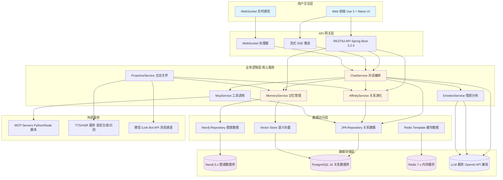

### 1.2 架构设计理念

本系统采用 **电子生命隐喻架构**，将 AI 智能体视为一个具有生理系统的数字生命体：

| 隐喻维度        | 技术实现                                                    | 生物学对应       |
| :---------- | :------------------------------------------------------ | :---------- |
| **大脑皮层**    | LangChain4j + OpenAI API 兼容 LLM(Ollama/LM Studio/GPT 等) | 思考、决策、语言生成  |
| **海马体**     | Redis + EmotionContextCache                             | 短期记忆、情感状态缓存 |
| **大脑皮层记忆区** | Neo4j + pgvector                                        | 长期记忆存储与检索   |
| **神经系统**    | WebSocket + SSE                                         | 感知输入、实时推送   |
| **运动系统**    | MCP Client + Skills + Tools                                      | 执行外部任务、工具调用 |
| **内分泌系统**   | AffinityService + EmotionAnalyzer                        | 好感度、情感状态调节  |
| **免疫系统**    | TurnPostProcessingService + FactRelationshipEvaluator   | 事实去重、冲突检测、记忆维护 |

***

## 2. 分层架构设计

### 2.1 三层架构 + MVC 混合模式

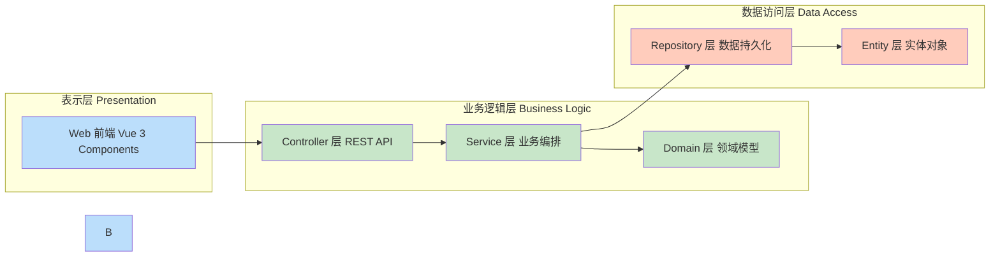

### 2.2 B/S + C/S 混合架构

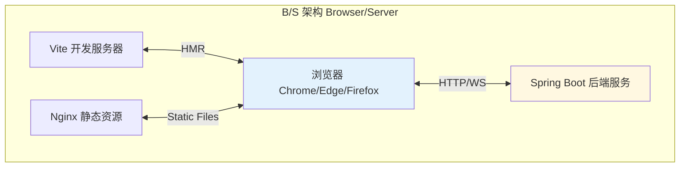

### 2.3 数据流向架构

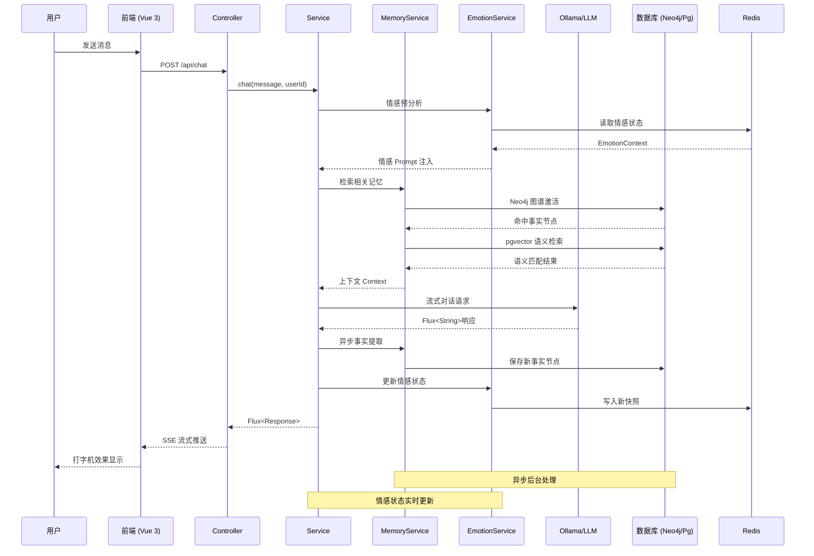

***

## 3. 技术栈选型

### 3.1 完整技术栈矩阵

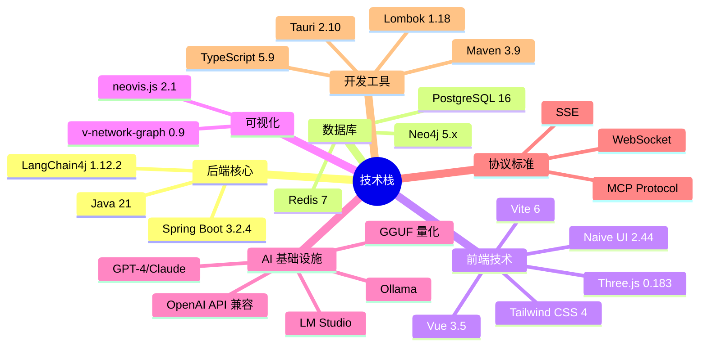

### 3.2 技术选型理由

| 技术领域       | 选型                                             | 关键理由                                         |
| :--------- | :--------------------------------------------- | :------------------------------------------- |
| **后端框架**   | Spring Boot 3.2.4                              | 企业级稳定性、依赖注入、AOP 支持                           |
| **AI 框架**  | LangChain4j 1.12.2                             | Java 原生 LLM 集成、Tool Calling 支持、OpenAI API 兼容 |
| **图谱数据库**  | Neo4j 5.x                                      | Cypher 查询语言、Spring Data 集成、关系推理              |
| **关系数据库**  | PostgreSQL 16                                  | JSONB 支持、pgvector 插件、事务保证                    |
| **缓存中间件**  | Redis 7                                        | 高性能 K-V 存储、Pub/Sub、SSE 日志推送                  |
| **前端框架**   | Vue 3 + Composition API                        | 响应式编程、组件复用、生态丰富                              |
| **UI 组件库** | Naive UI                                       | TypeScript 友好、主题定制、性能优秀                      |
| **3D 可视化** | Three.js + v-network-graph + neovis.js         | WebGL 渲染、力导向布局、银河系效果                         |
| **LLM 引擎** | OpenAI API 兼容服务(Ollama/LM Studio/GPT-4/Claude) | 灵活部署、支持本地/云端、GGUF 量化、统一接口                    |
| **桌面应用** | Tauri 2.10                                     | Rust 内核、轻量级、跨平台打包                              |

### 3.3 LLM 集成说明

系统通过 LangChain4j 的 OpenAI API 兼容接口，支持多种 LLM 部署方案：

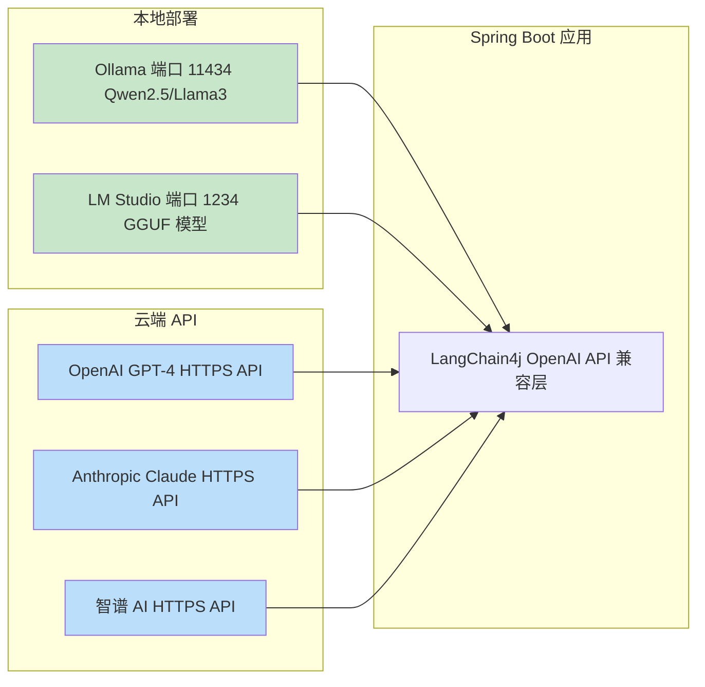

**配置示例**：

```yaml
# application.yml
lingshu:
  ai:
    # 本地 Ollama
    base-url: http://localhost:11434/v1
    model-name: qwen2.5:7b-instruct-q4_K_M
    api-key: ollama
    
    # 或 LM Studio
    # base-url: http://localhost:1234/v1
    # model-name: local-model
    # api-key: not-needed
    
    # 或 OpenAI GPT-4
    # base-url: https://api.openai.com/v1
    # model-name: gpt-4-turbo
    # api-key: ${OPENAI_API_KEY}
```

**优势**：

- ✅ **灵活性**：可在隐私优先（本地）和性能优先（云端）间切换
- ✅ **统一接口**：所有 LLM 使用相同的 API 抽象层
- ✅ **成本可控**：开发测试用本地，生产可用云端
- ✅ **渐进增强**：从本地开始，按需升级到商业 API

***

## 4. 模块划分与职责

### 4.1 系统模块全景图

```mermaid
graph TB
    subgraph ui_mod[用户交互模块]
        M1[Web 聊天界面 ChatView]
        M2[记忆图谱可视化 MemoryGraphView]
        M3[系统设置面板 SettingsView]
    end
    
    subgraph chat_mod[对话核心模块]
        M5[对话服务 ChatService]
        M6[Prompt 构建 PromptBuilderService]
        M7[ToolCall 执行 ToolEventListener]
        M8[流式响应 Reactor Flux]
    end
    
    subgraph mem_mod[记忆管理模块]
        M9[事实提取 EmotionAwareFactExtractor]
        M10[GAM-RAG 检索 MemoryService]
        M11[图谱维护 FactRepository]
        M12[向量存储 EmbeddingStore]
    end
    
    subgraph emotion_mod[情感计算模块]
        M13[情感分析 EmotionAnalyzer]
        M14[好感度管理 AffinityService]
        M15[关系阶段演化 UserState]
        M16[情感片段记忆 EmotionalEpisodeService]
    end
    
    subgraph tool_mod[工具扩展模块]
        M17[MCP Client McpService]
        M18[本地工具 LocalTools]
        M19[脚本执行器 StdioTransport]
    end
    
    subgraph proactive_mod[主动服务模块]
        M20[定时问候 ProactiveService]
        M21[消极情绪检测 EmotionMonitor]
        M22[事件触发器 ApplicationEventPublisher]
    end
    
    subgraph sys_mod[系统支撑模块]
        M23[日志追踪 SystemLogService]
        M24[配置管理 SettingService]
        M25[健康检查 SystemStatusController]
        M26[Agent 管理 AgentConfigService]
    end
    
    M1 --> M5
    M5 --> M6
    M5 --> M7
    M5 --> M9
    M5 --> M10
    M10 --> M11
    M10 --> M12
    M5 --> M13
    M5 --> M14
    M13 --> M16
    M14 --> M15
    M5 --> M17
    M17 --> M18
    M17 --> M19
    M20 --> M9
    M20 --> M13
    M20 --> M14
    M23 --> M5
    M23 --> M9
    M23 --> M10
    M24 --> M5
    M24 --> M17
    M25 --> M11
    M25 --> M17
    M5 --> M8
    
    style M5 fill:#ffcc80
    style M9 fill:#ffcc80
    style M10 fill:#ffcc80
    style M13 fill:#ffcc80
    style M14 fill:#ffcc80
    style M17 fill:#ffcc80
```

### 4.2 模块详细职责表

| 模块名称         | 核心类                  | 主要职责                              | 依赖数据库                         |
| :----------- | :------------------- | :-------------------------------- | :---------------------------- |
| **对话核心**     | `ChatServiceImpl`        | 对话流程编排、Prompt 组装、ToolCall 路由、流式响应、回合后处理决策 | PostgreSQL (ChatSession, ChatTurn)      |
| **记忆管理**     | `MemoryServiceImpl`      | 事实提取、GAM-RAG 检索、图谱节点去重、向量嵌入、语义分类、记忆治理       | Neo4j + PostgreSQL (pgvector) |
| **情感计算**     | `AffinityServiceImpl`    | 好感度增减、关系阶段升级、情感 Prompt 注入、用户状态管理         | PostgreSQL (UserState)        |
| **情感分析**     | `EmotionAnalyzer`    | 文本情绪识别、强度计算、关键词提取                 | LLM (动态模型)                  |
| **情感预处理**   | `EmotionPreAnalysisService` | 对话前情感分析、上下文感知、情感门控               | Redis + PostgreSQL            |
| **情感片段**     | `EmotionalEpisodeService` | 情感事件提取、存储、检索                     | Neo4j (EmotionalEpisode)      |
| **工具扩展**     | `McpServiceImpl`         | MCP Client 生命周期、工具调用代理、配置管理       | PostgreSQL (McpServerConfig)  |
| **主动服务**     | `ProactiveServiceImpl`   | 定时任务调度、问候语生成、消极情绪干预               | PostgreSQL (UserState)        |
| **日志追踪**     | `SystemLogServiceImpl`   | 全链路日志记录、Redis 实时推送、性能统计           | Redis (StringRedisTemplate)   |
| **配置管理**     | `SettingServiceImpl`     | 系统参数 CRUD、TTS/ASR 地址、冷却时间配置       | PostgreSQL (SystemSetting)    |
| **Agent 管理** | `AgentConfigServiceImpl` | 人格配置管理、Prompt 模板切换、默认 Agent 设置    | PostgreSQL (AgentConfig)      |
| **回合时间线**   | `TurnTimelineServiceImpl` | 对话回合记录、事件追踪、工件管理                | PostgreSQL (ChatTurn, ChatTurnEvent, ChatTurnArtifact) |
| **提示词构建**   | `PromptBuilderServiceImpl` | System Prompt 组装、情感注入、记忆上下文整合      | -                             |
| **事实关系评估** | `FactRelationshipEvaluator` | 事实冲突检测、替代关系判断                   | Neo4j                         |
| **工具结果摘要** | `ToolResultSummarizer` | MCP 工具返回结果压缩、摘要生成                 | LLM                           |
| **TTS 服务**   | `TtsController`          | 文本转语音 API、OpenAI 兼容接口             | PostgreSQL (SystemSetting.ttsConfig) |
| **ASR 服务**   | `AsrService`             | 语音识别、VAD 检测、音频格式转换              | PostgreSQL (SystemSetting.asrConfig) |
| **微信 Bot**   | `WechatBotAuthService`<br>`WechatBotMessageService` | 微信账户认证、消息轮询、自动回复 | PostgreSQL (SystemSetting.wechatBotAccounts) |

### 4.3 模块间调用关系

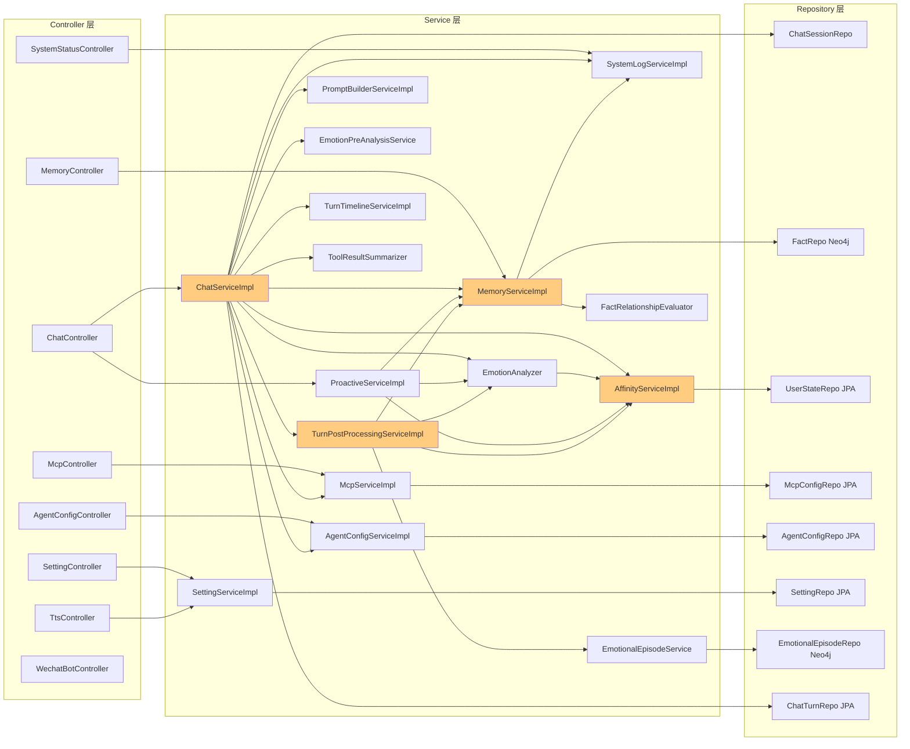

***

## 5. 接口设计

### 5.1 RESTful API 总览

```mermaid
graph TB
    subgraph chat_api[对话相关 API]
        A1[POST /api/chat 文本对话]
        A2[POST /api/chat/stream 流式对话]
        A3[GET /api/chat/sessions 会话列表]
        A4[DELETE /api/chat/sessions/{id} 删除会话]
        A5[POST /api/chat/proactive/trigger 触发问候]
    end
    
    subgraph mem_api[记忆管理 API]
        B1[GET /api/memory/graph 图谱数据]
        B2[GET /api/memory/facts 事实列表]
        B3[POST /api/memory/maintenance 记忆维护]
        B4[GET /api/memory/governance 记忆治理]
        B5[POST /api/memory/archive/{id} 归档记忆]
        B6[POST /api/memory/restore/{id} 恢复记忆]
    end
    
    subgraph cfg_api[配置管理 API]
        C1[GET /api/settings 获取设置]
        C2[PUT /api/settings 更新设置]
        C3[GET /api/agents Agent 列表]
        C4[PUT /api/agents/{id}/default 设默认 Agent]
        C5[GET /api/mcp MCP 配置]
        C6[POST /api/mcp 添加 MCP]
    end
    
    subgraph sys_api[系统监控 API]
        D1[GET /api/system/status 服务状态]
        D2[GET /api/logs 日志 SSE]
        D3[DELETE /api/logs 清理日志]
    end
    
    subgraph voice_api[语音服务 API]
        E1[POST /api/tts/speak TTS 合成]
        E2[POST /api/asr/transcribe ASR 识别]
    end
    
    subgraph wechat_api[微信机器人 API]
        F1[GET /api/settings/wechat-bot/accounts 账户列表]
        F2[DELETE /api/settings/wechat-bot/accounts/{id} 删除账户]
        F3[POST /api/settings/wechat-bot/qrcode 获取二维码]
        F4[GET /api/settings/wechat-bot/status 检查状态]
    end
    
    style A1 fill:#c8e6c9
    style A2 fill:#c8e6c9
    style B1 fill:#bbdefb
    style C1 fill:#fff9c4
    style D1 fill:#ffccbc
```

### 5.2 WebSocket 接口

| 端点         | 用途        | 消息格式                                               |
| :--------- | :-------- | :------------------------------------------------- |
| `/ws/chat` | 实时双向对话    | `{type: "message", content: "...", userId: "..."}` |
| `/ws/logs` | 日志实时推送    | `{type: "log", level: "INFO", message: "..."}`     |
| `/ws/tts`  | TTS 音频流传输 | Binary AAC/PCM 数据帧                                 |

**ASR 语音识别消息** (通过 `/ws/chat`):
```json
// 客户端发送
{
  "type": "asrRequest",
  "audioData": "base64_encoded_audio",
  "mimeType": "audio/webm"
}

// 服务端响应
{
  "type": "asrResult",
  "text": "识别出的文本"
}
```

### 5.3 核心接口示例

#### 5.3.1 流式对话接口

```java
// Controller 层
@PostMapping(value = "/stream", produces = MediaType.TEXT_EVENT_STREAM_VALUE)
public Flux<String> streamChat(
    @RequestBody ChatRequest request,
    @RequestHeader(value = "X-User-Id", defaultValue = "User") String userId
) {
    return chatService.streamChat(
        request.getMessage(),
        request.getAgentId(),
        userId,
        request.getModel(),
        request.getApiKey(),
        request.getBaseUrl()
    );
}

// Service 层
public Flux<String> streamChat(String message, Long agentId, String userId, ...) {
    // 1. 情感预分析
    EmotionAnalysis preAnalyzedEmotion = emotionPreAnalysisService.analyzeBeforeResponse(userId, message);
    
    // 2. 记忆检索
    String longTermContext = memoryService.retrieveContext(userId, message);
    
    // 3. Prompt 构建
    String systemPrompt = promptBuilderService.buildMergedSystemPrompt(...);
    
    // 4. 创建回合记录
    Long turnId = turnTimelineService.createTurn(sessionId, message);
    
    // 5. 流式调用 LLM
    return statelessStreamingAssistant.chatFlux(systemPrompt, userPrompt, ...)
        .doOnComplete(() -> {
            // 6. 回合后处理决策
            turnPostProcessingService.postProcessTurn(userId, message, assistantResponse, preAnalyzedEmotion, turnId);
        });
}
```

***

## 6. 核心流程设计

### 6.1 对话处理全流程

```mermaid
flowchart TD
    Start([收到用户消息]) --> PreAnalysis[情感预分析 EmotionPreAnalysisService]
    PreAnalysis --> GetEmotion[从 Redis/DB 读取情感状态]
    GetEmotion --> InjectEmotion[情感 Prompt 注入]
    
    InjectEmotion --> MemoryRetrieval[记忆检索 GAM-RAG]
    MemoryRetrieval --> GraphActivate[Neo4j 图谱激活]
    GraphActivate --> CalcGain{增益 >= 0.3?}
    CalcGain -->|Yes| VectorSearch[pgvector 语义检索]
    CalcGain -->|No| SkipVector[跳过语义检索]
    VectorSearch --> RankFacts[事实排序]
    SkipVector --> RankFacts
    
    RankFacts --> BuildPrompt[构建 System Prompt]
    BuildPrompt --> CreateTurn[创建回合记录 ChatTurn]
    CreateTurn --> CallLLM[调用 LLM 服务 OpenAI API 兼容]
    CallLLM --> StreamResponse[流式返回给用户]
    
    StreamResponse --> PostProcess[回合后处理 TurnPostProcessingService]
    PostProcess --> DecideAction[LLM 决策是否处理]
    
    DecideAction --> AnalyzeEmotion{分析情感？}
    AnalyzeEmotion -->|Yes| UpdateEmotion[更新 UserState + 提取情感片段]
    AnalyzeEmotion -->|No| ExtractFacts{提取事实？}
    
    ExtractFacts -->|Yes| EmotionAwareExtract[情感感知事实提取]
    ExtractFacts -->|No| RecordInteraction{记录互动？}
    
    EmotionAwareExtract --> SaveToNeo4j[保存事实到 Neo4j]
    SaveToNeo4j --> StoreEmbedding[存储向量到 pgvector]
    StoreEmbedding --> ClassifyFact[语义分类 FactSemanticClassifier]
    ClassifyFact --> EvaluateRelations[关系评估 FactRelationshipEvaluator]
    EvaluateRelations --> RecordInteraction
    
    RecordInteraction -->|Yes| UpdateAffinity[更新好感度]
    RecordInteraction -->|No| End([流程结束])
    UpdateAffinity --> End
    UpdateEmotion --> ExtractFacts
    
    style PreAnalysis fill:#ffcc80
    style MemoryRetrieval fill:#ffcc80
    style CallLLM fill:#ffcc80
    style EmotionAwareExtract fill:#ffcc80
    style PostProcess fill:#ffcc80
    style SaveToNeo4j fill:#ffe0b2
    style UpdateAffinity fill:#ffe0b2
```

### 6.2 情感感知事实提取流程

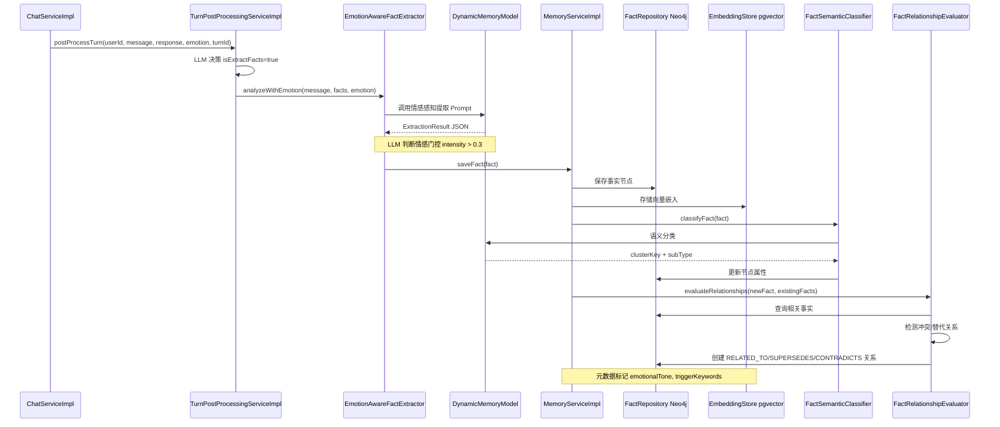

### 6.3 主动问候触发流程

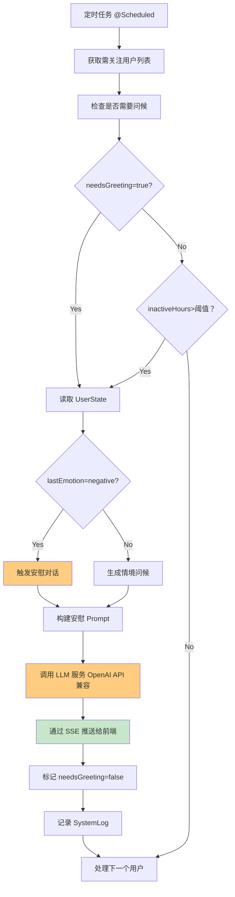

***

## 7. 数据库概要设计

### 7.1 数据库选型总览

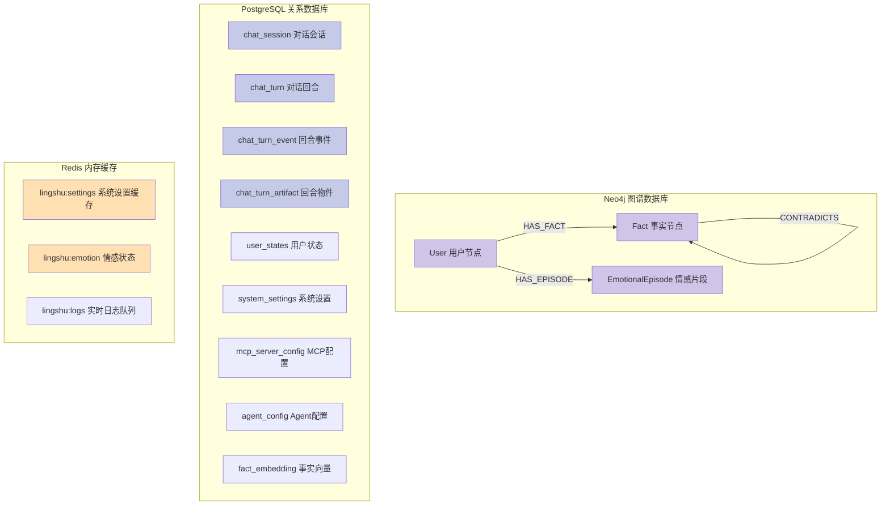

### 7.2 Neo4j 数据模型

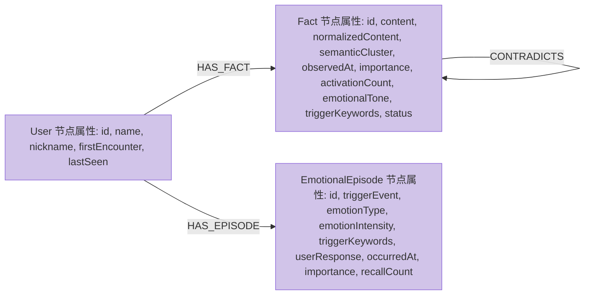

### 7.3 PostgreSQL 核心表结构

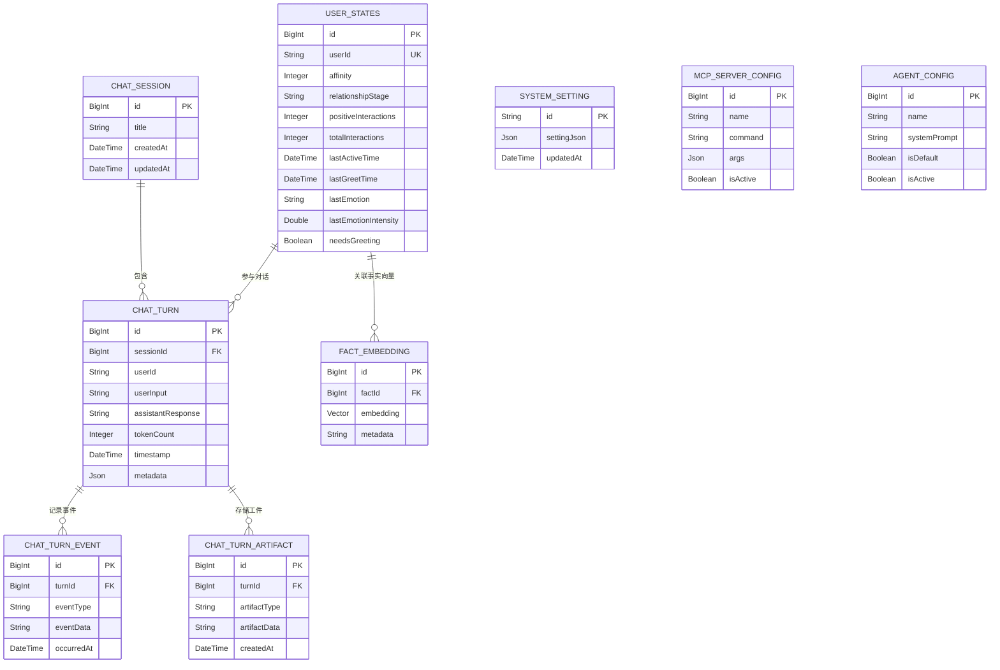

### 7.4 表关系详解

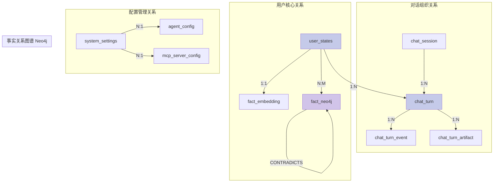

***

## 8. 运行环境设计

### 8.1 部署架构图

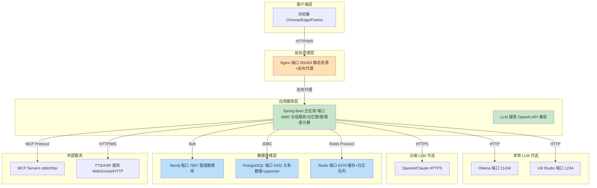

#### 8.2 硬件资源配置

| 组件      | 最低配置                     | 推荐配置              | 备注                                        |
| :------ | :----------------------- | :---------------- | :---------------------------------------- |
| **CPU** | 4 核                      | 8 核+              | 本地 LLM 需要 AVX2 指令集                        |
| **内存**  | 8GB                      | 16GB+             | Neo4j 堆内存建议 4GB                           |
| **显存**  | 6GB (本地 LLM)0GB (云端 API) | 8GB+ (本地)无要求 (云端) | Ollama 7B q4\_K\_M 约 6GB使用 GPT-4 无需本地 GPU |
| **硬盘**  | 50GB SSD                 | 100GB NVMe SSD    | Neo4j/PostgreSQL IO 密集                    |
| **网络**  | 千兆以太网                    | 万兆                | 内部服务通信，云端 API 需要公网                        |

### 8.3 中间件配置要点

#### 8.3.1 Neo4j 配置

```properties
# neo4j.conf
server.memory.heap.initial_size=2G
server.memory.heap.max_size=4G
server.memory.pagecache.size=2G
dbms.security.auth_enabled=true
```

#### 8.3.2 PostgreSQL 配置

```postgresql
# postgresql.conf
shared_buffers = 256MB
effective_cache_size = 1GB
maintenance_work_mem = 128MB
work_mem = 4MB
# pgvector 插件
shared_preload_libraries = 'vector'
```

#### 8.3.3 Redis 配置

```redis
# redis.conf
maxmemory 512mb
maxmemory-policy allkeys-lru
appendonly yes
appendfsync everysec
```

***

## 9. 安全、性能与扩展性设计

### 9.1 安全架构设计

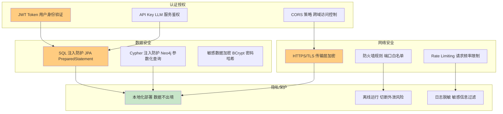

### 9.2 并发控制设计

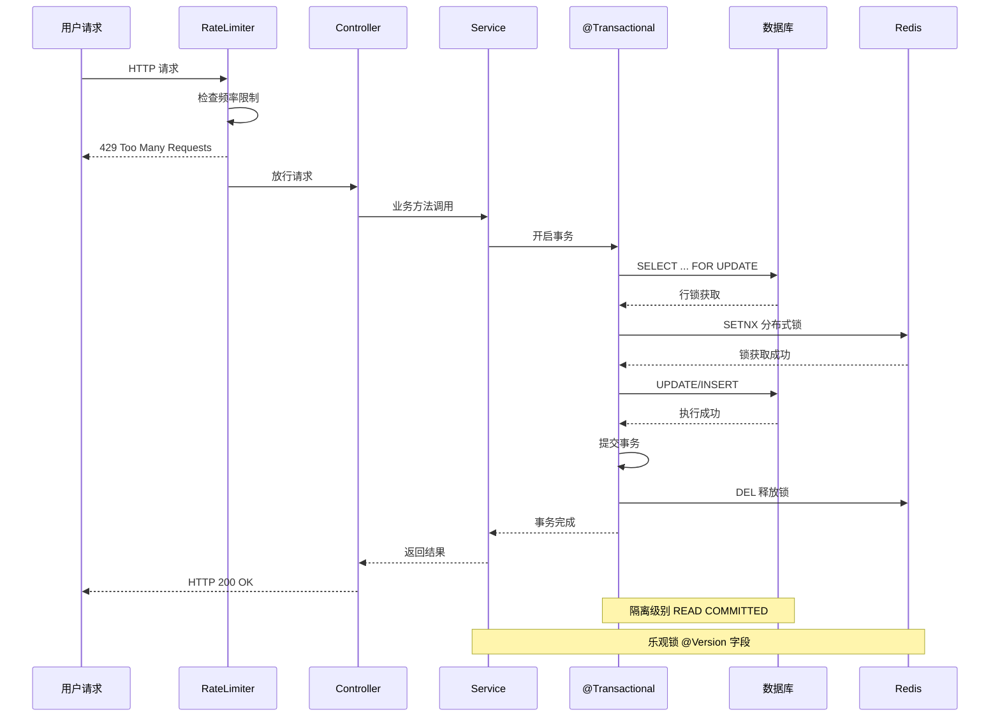

### 9.3 性能优化策略

```mermaid
mindmap
  root((性能优化))
    数据库优化
      Neo4j 索引
        全文索引
        复合索引
      pgvector 优化
        HNSW 索引
        相似度阈值过滤
      连接池
        HikariCP
        最大连接数 50
    缓存策略
      Redis 缓存
        系统设置
        情感状态
        日志队列
      本地缓存
        EmotionContextCache
        ConcurrentHashMap
    异步处理
      事实提取
        @Async 注解
        独立线程池
      SSE 推送
        Reactor Flux
        非阻塞 IO
    批量操作
      批量保存
        saveAll()
      批量删除
        DELETE IN
      批量更新
        UNWIND Cypher
```

### 9.4 扩展性设计方案

```mermaid
graph TB
    subgraph scale_up[垂直扩展 Scale Up]
        A1[增加 CPU 核心 提升 LLM 推理速度]
        A2[增加内存 扩大 Neo4j 堆内存]
        A3[升级 GPU 支持更大模型]
    end
    
    subgraph scale_out[水平扩展 Scale Out]
        B1[多实例部署 Spring Boot 集群]
        B2[Redis Cluster 分布式缓存]
        B3[Neo4j Causal Cluster 高可用图谱]
    end
    
    subgraph func_ext[功能扩展]
        C1[MCP 插件机制 热插拔工具]
        C2[Agent 配置化 多角色切换]
        C3[Prompt 模板化 动态风格调整]
    end
    
    subgraph data_ext[数据扩展]
        D1[分库分表 按用户 ID 分片]
        D2[读写分离 主从复制]
        D3[归档策略 冷数据迁移]
    end
    
    A1 --> B1
    A2 --> B2
    A3 --> B3
    B1 --> C1
    B2 --> C2
    B3 --> C3
    C1 --> D1
    C2 --> D2
    C3 --> D3
    
    style B1 fill:#c8e6c9
    style B2 fill:#c8e6c9
    style B3 fill:#c8e6c9
    style C1 fill:#ffcc80
    style C2 fill:#ffcc80
    style C3 fill:#ffcc80
```

### 9.5 权限控制设计

```mermaid
graph LR
    subgraph roles[角色定义]
        R1[Admin 系统管理员]
        R2[User 普通用户]
        R3[System 内部服务]
    end
    
    subgraph perms[权限矩阵]
        P1[对话管理 读/写]
        P2[记忆管理 读/写/删除]
        P3[配置管理 读/写]
        P4[MCP 管理 读/写/执行]
        P5[日志查看 读]
    end
    
    R1 --> P1
    R1 --> P2
    R1 --> P3
    R1 --> P4
    R1 --> P5
    
    R2 --> P1
    R2 --> P2
    R2 -.->|仅自己 | P5
    
    R3 --> P1
    R3 --> P2
    R3 --> P3
    R3 --> P4
    
    style R1 fill:#ffcc80
    style R2 fill:#ffe0b2
    style R3 fill:#c8e6c9
```

### 9.6 容错与降级策略

```mermaid
flowchart TD
    Start[请求进入] --> Validate{参数校验}
    Validate -->|失败| ReturnError[返回 400 Bad Request]
    Validate -->|成功| TryDB{数据库可用？}
    
    TryDB -->|否 | FallbackCache[降级到 Redis 缓存]
    FallbackCache --> CacheHit{缓存命中？}
    CacheHit -->|Yes| ReturnCache[返回缓存数据]
    CacheHit -->|No| ReturnError2[返回 503 Service Unavailable]
    
    TryDB -->|是 | ExecuteDB[执行数据库操作]
    ExecuteDB --> Success{执行成功？}
    Success -->|Yes| ReturnSuccess[返回 200 OK]
    Success -->|No| Retry{重试次数<3?}
    
    Retry -->|Yes| Wait[等待 100ms]
    Wait --> ExecuteDB
    Retry -->|No| CircuitBreaker[熔断器打开]
    CircuitBreaker --> LogError[记录错误日志]
    LogError --> ReturnError3[返回 500 Internal Error]
    
    style FallbackCache fill:#fff9c4
    style CircuitBreaker fill:#ffcc80
    style ReturnSuccess fill:#c8e6c9
```

***

## 附录

### A. 术语表

| 术语                    | 全称                               | 解释                            |
| :-------------------- | :------------------------------- | :---------------------------- |
| GAM-RAG               | Graph-Activated Memory Retrieval | 图谱激活 + 语义检索的混合记忆检索            |
| MCP                   | Model Context Protocol           | 模型上下文协议，工具调用标准                |
| GGUF                  | GPT-Generated Unified Format     | LLM 量化格式，降低显存占用               |
| SSE                   | Server-Sent Events               | 服务端推送技术，单向实时通信                |
| OpenAI API Compatible | OpenAI API 兼容协议                  | 支持 Ollama/LM Studio/GPT 等统一接口 |
| TTS                   | Text-To-Speech                   | 文本转语音，Edge-TTS/DouBao-TTS      |
| ASR                   | Automatic Speech Recognition     | 自动语音识别                         |

### B. 参考文档

- [Spring Boot 官方文档](https://spring.io/projects/spring-boot)
- [LangChain4j 官方文档](https://docs.langchain4j.dev/)
- [Neo4j Cypher 查询语言](https://neo4j.com/docs/cypher-manual/current/)
- [pgvector GitHub 仓库](https://github.com/pgvector/pgvector)
- [Vue 3 官方文档](https://vuejs.org/)
- [Tauri 官方文档](https://tauri.app/)
- [Naive UI 组件库](https://www.naiveui.com/)
- [v-network-graph 图库](https://github.com/hayatooyama/v-network-graph)

***

## 10. 新增核心特性

### 10.1 回合后处理决策机制 (Turn Post-Processing)

系统引入了智能的回合后处理决策机制,通过 LLM 动态判断每轮对话后需要执行的操作:

```mermaid
flowchart TD
    Start([对话完成]) --> Decision[TurnPostProcessingService]
    Decision --> LLM_Decide[LLM 决策分类器]
    
    LLM_Decide --> CheckEmotion{分析情感?}
    CheckEmotion -->|Yes| AnalyzeEmotion[EmotionAnalyzer]
    CheckEmotion -->|No| CheckFacts{提取事实?}
    
    AnalyzeEmotion --> UpdateState[更新 UserState]
    AnalyzeEmotion --> ExtractEpisode[提取 EmotionalEpisode]
    UpdateState --> CheckFacts
    
    CheckFacts -->|Yes| ExtractFacts[EmotionAwareFactExtractor]
    CheckFacts -->|No| CheckInteraction{记录互动?}
    
    ExtractFacts --> SaveFact[保存至 Neo4j]
    SaveFact --> Classify[语义分类]
    Classify --> Evaluate[关系评估]
    Evaluate --> CheckInteraction
    
    CheckInteraction -->|Yes| UpdateAffinity[更新好感度]
    CheckInteraction -->|No| End([结束])
    UpdateAffinity --> End
    
    style LLM_Decide fill:#ffcc80
    style AnalyzeEmotion fill:#ffcc80
    style ExtractFacts fill:#ffcc80
```

**优势**:
- ✅ **按需处理**:避免不必要的 LLM 调用,提升性能
- ✅ **灵活扩展**:可轻松添加新的后处理任务
- ✅ **上下文感知**:基于完整对话历史做出决策

### 10.2 情感片段记忆 (Emotional Episode Memory)

系统不仅存储事实,还专门记录高情感强度的事件:

**EmotionalEpisode 节点属性**:
- `triggerEvent`: 触发事件描述
- `emotionType`: 情感类型 (joy/sadness/anger/fear等)
- `emotionIntensity`: 情感强度 (0.0-1.0)
- `triggerKeywords`: 触发关键词列表
- `userResponse`: 用户响应内容
- `occurredAt`: 发生时间
- `importance`: 重要性评分
- `recallCount`: 被回忆次数

**应用场景**:
- 情感回溯:当用户提到"上次那件事"时,检索相关情感片段
- 情绪趋势分析:追踪用户长期情绪变化
- 个性化关怀:基于历史情感事件提供针对性安慰

### 10.3 事实关系评估与去重

系统实现了智能的事实冲突检测和关系建立:

```mermaid
graph LR
    A[新事实] --> B{查询相关事实}
    B --> C[检测冲突 CONTRADICTS]
    B --> D[检测替代 SUPERSEDES]
    B --> E[检测关联 RELATED_TO]
    
    C --> F[标记旧事实为过时]
    D --> G[建立替代关系]
    E --> H[创建关联边]
    
    F --> I[更新图谱]
    G --> I
    H --> I
    
    style A fill:#ffcc80
    style C fill:#ffe0b2
    style D fill:#ffe0b2
    style E fill:#ffe0b2
```

**评估维度**:
1. **时间戳对比**:较新的事实可能替代旧事实
2. **语义相似度**:使用向量相似度判断是否指向同一事物
3. **逻辑冲突**:检测互斥陈述(如"我喜欢猫" vs "我讨厌猫")
4. **激活次数**:高频激活的事实优先级更高

### 10.4 回合时间线追踪 (Turn Timeline)

系统详细记录每次对话的完整生命周期:

**ChatTurn 表结构**:
- 用户输入、AI 响应、Token 数量
- JSON 元数据(模型信息、耗时等)

**ChatTurnEvent 事件类型**:
- `TOOL_START`: 工具调用开始
- `TOOL_END`: 工具调用结束
- `REASONING`: 推理过程
- `EMOTION_ANALYSIS`: 情感分析结果
- `MEMORY_RETRIEVAL`: 记忆检索事件

**ChatTurnArtifact 工件类型**:
- MCP 工具返回的结构化数据
- 生成的文件、图片等资源引用
- 中间处理结果

**价值**:
- 📊 **对话审计**:完整追溯每次交互
- 🔍 **问题诊断**:快速定位异常环节
- 📈 **性能分析**:统计各环节耗时
- 🎯 **用户体验优化**:基于数据改进流程

### 10.5 TTS/ASR 语音交互服务

系统集成了完整的语音交互能力,支持文本转语音(TTS)和语音识别(ASR):

#### 10.5.1 TTS (Text-To-Speech) 文本转语音

**后端实现**:
- **控制器**: `TtsController` (`/api/tts/speak`)
- **服务**: OpenAI API 兼容接口
- **配置**: 存储在 `SystemSetting.ttsConfig`
  - `baseUrl`: TTS 服务地址 (默认: http://localhost:5050)
  - `apiKey`: API 密钥 (可选)
  - `defaultVoice`: 默认语音 (如: alloy, echo, fable)
  - `defaultSpeed`: 语速 (0.5-2.0)
  - `defaultFormat`: 音频格式 (mp3/aac)
  - `enabled`: 是否启用

**前端集成**:
- **Vue Composable**: `useTts.ts`
- **功能**:
  - Markdown 清理:自动移除图片、链接、代码块等不适合朗读的内容
  - 流式播放:通过 HTML5 Audio API 播放音频流
  - 状态管理:跟踪播放状态、当前消息 ID
  - 中断控制:支持停止当前播放

**桌面应用增强 (fx-frontend)**:
- **AudioStreamService**: WebSocket 流式音频传输
- **支持的协议**:
  - OpenAI 兼容 TTS (HTTP REST)
  - 豆包 TTS (WebSocket 流式)
- **配置管理**: SQLite 本地存储,支持实时切换
- **托盘菜单**:快速开关 TTS 功能

**应用场景**:
- 聊天消息朗读:点击消息旁的喇叭图标
- 主动问候语音播报
- 无障碍辅助:视障用户友好

#### 10.5.2 ASR (Automatic Speech Recognition) 语音识别

**后端实现**:
- **服务**: `AsrService`
- **协议**: multipart/form-data 上传音频
- **音频格式**: WAV (16kHz, 16bit, mono)
- **VAD (Voice Activity Detection)**: 自动检测语音起止
- **配置**: 存储在 `SystemSetting.asrConfig`
  - `baseUrl`: ASR 服务地址 (默认: http://localhost:50001)
  - `enabled`: 是否启用
  - `sensitivity`: VAD 灵敏度 (0.0-1.0)

**前端集成**:
- **Vue Composable**: `useAsr.ts`
- **功能**:
  - 麦克风权限管理
  - 实时音频采集 (MediaRecorder API)
  - VAD 语音活动检测
  - 静默超时自动提交 (800ms)
  - 最小语音时长限制 (300ms)
  - 两种模式:
    - `auto`: 自动检测语音并发送
    - `push-to-talk`: 按住说话

**WebSocket 集成**:
- **端点**: `/ws/chat`
- **消息类型**: 
  - `asrRequest`: 发送 Base64 编码的音频数据
  - `asrResult`: 接收识别结果文本
  - `asrError`: 错误通知

**桌面应用增强 (fx-frontend)**:
- **AsrService**: 持续监听模式
- **特性**:
  - 后台音频捕获
  - 自适应噪声校准
  - RMS (Root Mean Square) 能量检测
  - 可调节灵敏度滑块
  - 托盘菜单快速开关

**应用场景**:
- 语音输入:代替键盘打字
- 移动端便捷交互
- 驾驶场景安全操作
- 多语言支持 (依赖 ASR 服务)

#### 10.5.3 技术架构图

```mermaid
graph TB
    subgraph client[客户端层]
        A1[Web 前端 useTts/useAsr]
        A2[桌面应用 AudioStreamService/AsrService]
    end
    
    subgraph backend[后端服务层]
        B1[TtsController /api/tts/speak]
        B2[AsrService]
        B3[ChatWebSocketHandler]
    end
    
    subgraph external_tts[外部 TTS 服务]
        C1[OpenAI 兼容 TTS HTTP]
        C2[豆包 TTS WebSocket]
        C3[Edge-TTS]
    end
    
    subgraph external_asr[外部 ASR 服务]
        D1[SenseVoice ASR HTTP]
        D2[Whisper API]
        D3[科大讯飞 ASR]
    end
    
    A1 -->|HTTP POST| B1
    A1 -->|WebSocket| B3
    A2 -->|HTTP POST| B1
    A2 -->|WebSocket| B3
    
    B1 -->|HTTP| C1
    B1 -->|HTTP| C2
    B1 -->|HTTP| C3
    
    B2 -->|multipart| D1
    B2 -->|HTTP| D2
    B2 -->|HTTP| D3
    
    B3 -->|asrResult| A1
    B3 -->|asrResult| A2
    
    style B1 fill:#c8e6c9
    style B2 fill:#c8e6c9
    style B3 fill:#c8e6c9
    style C1 fill:#bbdefb
    style D1 fill:#bbdefb
```

**优势**:
- ✅ **多模态交互**:文本 + 语音双通道
- ✅ **灵活部署**:支持本地/云端多种服务
- ✅ **实时性**:WebSocket 流式传输,低延迟
- ✅ **跨平台**:Web 端和桌面端统一接口
- ✅ **可扩展**:易于接入新的 TTS/ASR 提供商

### 10.6 微信机器人集成

系统支持微信 bot 接入,扩展交互渠道:

#### 10.6.1 核心组件

**后端服务**:
- **WechatBotAuthService**: 微信 Bot 认证服务
  - 获取登录二维码 (`/ilink/bot/get_bot_qrcode`)
  - 检查登录状态 (`/ilink/bot/get_qrcode_status`)
  - 账户管理 (添加/删除/更新)
  
- **WechatBotMessageService**: 微信消息轮询服务
  - 定时拉取消息 (`/ilink/bot/getupdates`)
  - 消息解析与分发
  - 自动回复 AI 生成内容
  - 会话状态管理

- **WechatBotController**: REST API 控制器
  - `GET /api/settings/wechat-bot/accounts`: 获取账户列表
  - `DELETE /api/settings/wechat-bot/accounts/{id}`: 删除账户
  - `POST /api/settings/wechat-bot/qrcode`: 获取登录二维码
  - `GET /api/settings/wechat-bot/status?qrcode=xxx`: 检查登录状态

**数据存储**:
- **SystemSetting**: 微信 Bot 配置
  - `wechatBotAccounts`: 账户列表 (JSONB)
  - 每个账户包含:
    - `accountId`: 唯一标识
    - `botToken`: Bot Token (加密存储)
    - `baseUrl`: API 地址 (默认: https://ilinkai.weixin.qq.com)
    - `status`: 连接状态 (wait/confirmed/session_timeout)
    - `lastUserId`: 最后活跃用户 ID
    - `lastContextToken`: 上下文令牌

**前端界面**:
- **SettingsView.vue**: 微信 Bot 管理面板
  - 账户列表展示 (网格布局)
  - 二维码扫描登录
  - 状态实时监控
  - 账户删除功能

#### 10.6.2 消息处理流程

```mermaid
sequenceDiagram
    participant User as 微信用户
    participant WeChat as 微信平台
    participant Bot as WechatBotMessageService
    participant Chat as ChatService
    participant LLM as LLM 服务
    participant DB as 数据库
    
    User->>WeChat: 发送消息
    WeChat->>Bot: 轮询获取消息 (getupdates)
    Bot->>Bot: 解析消息内容
    Bot->>Chat: 转发到 ChatService
    Chat->>DB: 读取用户记忆/状态
    Chat->>LLM: 生成 AI 回复
    LLM-->>Chat: 返回回复文本
    Chat-->>Bot: 返回 AI 回复
    Bot->>WeChat: 发送回复 (sendmessage)
    WeChat-->>User: 显示 AI 回复
    
    Note over Bot,WeChat: 支持文本/图片/语音等多媒体
    Note over Chat,DB: 复用现有记忆和情感系统
```

#### 10.6.3 协议细节

**iLink Bot API**:
- **基础 URL**: `https://ilinkai.weixin.qq.com`
- **认证方式**: 
  - Header: `Authorization: Bearer {botToken}`
  - Header: `AuthorizationType: ilink_bot_token`
  - Header: `X-WECHAT-UIN: {base64_encoded_uin}`

**关键接口**:
1. **获取二维码**: `GET /ilink/bot/get_bot_qrcode?bot_type=3`
2. **检查状态**: `GET /ilink/bot/get_qrcode_status?qrcode={qrcode}`
3. **拉取消息**: `POST /ilink/bot/getupdates`
   ```json
   {
     "get_updates_buf": "...",
     "base_info": {"channel_version": "2.1.3"}
   }
   ```
4. **发送消息**: `POST /ilink/bot/sendmessage`
   ```json
   {
     "msg": {
       "from_user_id": "",
       "to_user_id": "{user_id}",
       "client_id": "openclaw-weixin-{random}",
       "message_type": 2,
       "message_state": 2,
       "context_token": "{token}",
       "item_list": [{"type": 1, "content": "回复文本"}]
     },
     "base_info": {"channel_version": "2.1.3"}
   }
   ```

#### 10.6.4 应用场景

- **移动端随时对话**:无需打开 Web 界面
- **朋友圈互动监控**:被动响应用户动态
- **群聊智能助手**:群组内提供 AI 服务
- **企业微信集成**:扩展到工作场景
- **多渠道统一**:Web/桌面/微信共享同一 AI 大脑

**优势**:
- ✅ **用户习惯**:利用微信高频使用场景
- ✅ **无缝体验**:消息实时同步,上下文连续
- ✅ **多媒体支持**:文本/图片/语音/文件
- ✅ **低成本**:基于官方 iLink Bot API
- ✅ **可扩展**:易于接入其他 IM 平台

***

***

## 文档更新记录

### v1.2 (2026-04-15)

**基于代码实现优化的内容**:

1. **新增 TTS/ASR 语音交互服务章节 (10.5)**:
   - 详细记录 TTS 后端实现 (`TtsController`)
   - 前端集成方案 (`useTts.ts`, Markdown 清理)
   - 桌面应用增强 (`AudioStreamService`, WebSocket 流式)
   - ASR 服务实现 (`AsrService`, VAD 检测)
   - 前端语音识别 (`useAsr.ts`, MediaRecorder API)
   - WebSocket 集成 (`ChatWebSocketHandler`)
   - 技术架构图和协议说明

2. **完善微信机器人集成章节 (10.6)**:
   - 核心组件详解 (`WechatBotAuthService`, `WechatBotMessageService`)
   - 消息处理流程图 (Sequence Diagram)
   - iLink Bot API 协议细节
   - 关键接口文档 (二维码/状态/消息收发)
   - 数据存储结构 (`wechatBotAccounts` JSONB)
   - 应用场景和优势分析

3. **模块职责表更新**:
   - 新增 TTS 服务模块
   - 新增 ASR 服务模块
   - 新增微信 Bot 模块

4. **电子生命隐喻扩展**:
   - 新增"感官系统": TTS/ASR 语音输入输出
   - 新增"社交系统": 微信 Bot 多渠道交互

### v1.1 (2026-04-14)

**基于代码实现优化的内容**:

1. **技术栈更新**:
   - LangChain4j: 1.12.1 → 1.12.2
   - 新增 Tauri 2.10 桌面应用框架
   - 可视化: 移除 D3.js/ECharts, 新增 neovis.js 2.1

2. **模块细化**:
   - 新增 EmotionPreAnalysisService (情感预处理)
   - 新增 EmotionalEpisodeService (情感片段管理)
   - 新增 TurnPostProcessingServiceImpl (回合后处理决策)
   - 新增 TurnTimelineServiceImpl (回合时间线追踪)
   - 新增 FactRelationshipEvaluator (事实关系评估)
   - 新增 ToolResultSummarizer (工具结果摘要)
   - 新增 PromptBuilderServiceImpl (提示词构建)

3. **数据库模型优化**:
   - 移除 chat_message 表, 改为 chat_turn/turn_event/turn_artifact 三层结构
   - 新增 EmotionalEpisode Neo4j 节点
   - 完善表关系图和 ER 图

4. **API 接口扩展**:
   - 新增记忆治理 API (archive/restore)
   - 新增 ASR 语音识别接口
   - 新增微信机器人接口
   - 会话管理从 history 改为 sessions

5. **核心流程增强**:
   - 对话流程增加回合记录创建环节
   - 事实提取增加语义分类和关系评估步骤
   - 增益阈值从 0.65 调整为 0.3
   - 情感分析增加情感片段提取

6. **新增特性章节**:
   - 回合后处理决策机制
   - 情感片段记忆
   - 事实关系评估与去重
   - 回合时间线追踪
   - 微信机器人集成
   - TTS/ASR 语音服务

7. **电子生命隐喻扩展**:
   - 新增“免疫系统”: TurnPostProcessingService + FactRelationshipEvaluator

### v1.0 (2026-03-30)

- 初始版本创建

***
