# 【灵枢】AI 智能体系统架构设计文档

**项目名称**：【灵枢】(Project LingShu-AI)\
**文档版本**：v1.0\
**创建日期**：2026 年 3 月 30 日\
**最后更新**：2026 年 3 月 30 日

***

## 目录

1. [系统总体架构](#1-系统总体架构)
2. [分层架构设计](#2-分层架构设计)
3. [技术栈选型](#3-技术栈选型)
4. [模块划分与职责](#4-模块划分与职责)
5. [接口设计](#5-接口设计)
6. [核心流程设计](#6-核心流程设计)
7. [数据库概要设计](#7-数据库概要设计)
8. [运行环境设计](#8-运行环境设计)
9. [安全、性能与扩展性设计](#9-安全性能与扩展性设计)

***

## 1. 系统总体架构

### 1.1 架构全景图

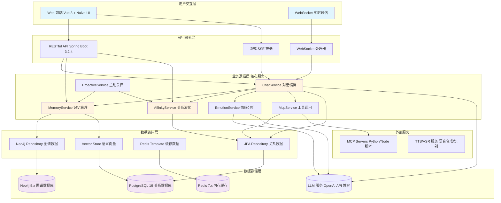

### 1.2 架构设计理念

本系统采用 **电子生命隐喻架构**，将 AI 智能体视为一个具有生理系统的数字生命体：

| 隐喻维度        | 技术实现                                                    | 生物学对应       |
| :---------- | :------------------------------------------------------ | :---------- |
| **大脑皮层**    | LangChain4j + OpenAI API 兼容 LLM(Ollama/LM Studio/GPT 等) | 思考、决策、语言生成  |
| **海马体**     | Redis + EmotionContextCache                             | 短期记忆、情感状态缓存 |
| **大脑皮层记忆区** | Neo4j + pgvector                                        | 长期记忆存储与检索   |
| **神经系统**    | WebSocket + SSE                                         | 感知输入、实时推送   |
| **运动系统**    | MCP Client + Tools                                      | 执行外部任务、工具调用 |
| **内分泌系统**   | AffinityService + EmotionService                        | 好感度、情感状态调节  |

***

## 2. 分层架构设计

### 2.1 三层架构 + MVC 混合模式

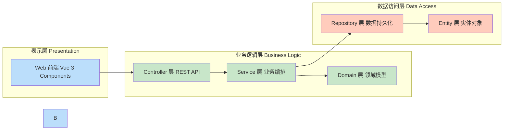

### 2.2 B/S + C/S 混合架构

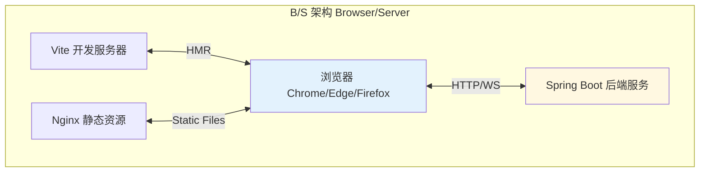

### 2.3 数据流向架构

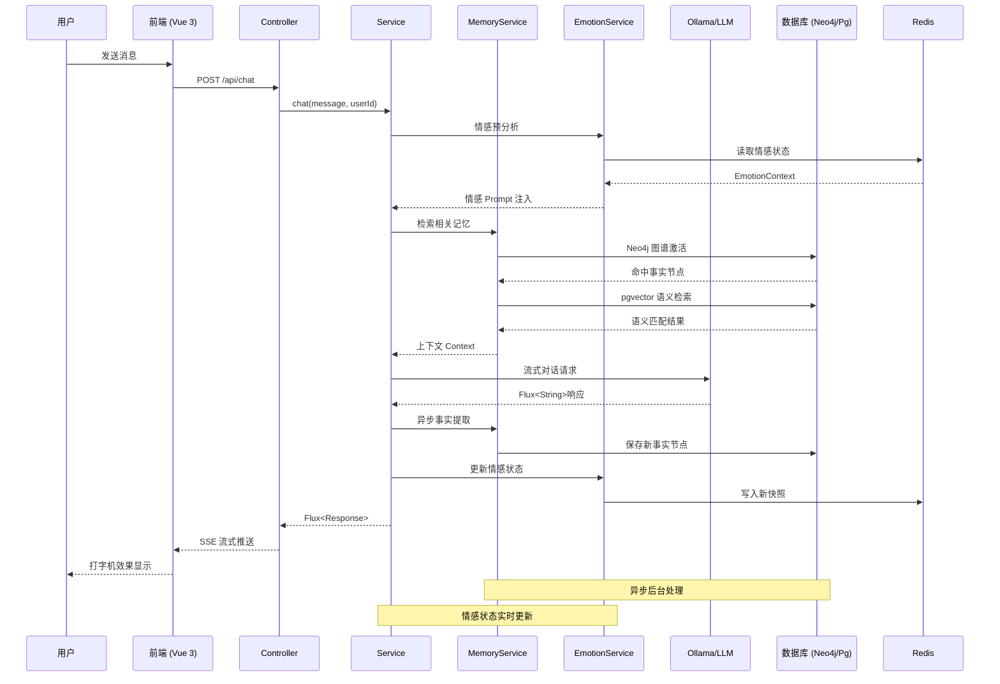

***

## 3. 技术栈选型

### 3.1 完整技术栈矩阵

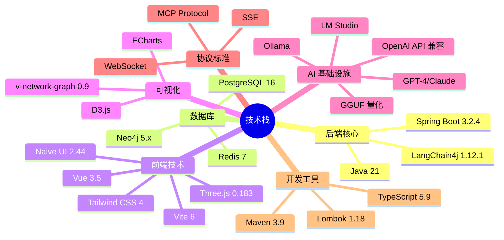

### 3.2 技术选型理由

| 技术领域       | 选型                                             | 关键理由                                         |
| :--------- | :--------------------------------------------- | :------------------------------------------- |
| **后端框架**   | Spring Boot 3.2.4                              | 企业级稳定性、依赖注入、AOP 支持                           |
| **AI 框架**  | LangChain4j 1.12.1                             | Java 原生 LLM 集成、Tool Calling 支持、OpenAI API 兼容 |
| **图谱数据库**  | Neo4j 5.x                                      | Cypher 查询语言、Spring Data 集成、关系推理              |
| **关系数据库**  | PostgreSQL 16                                  | JSONB 支持、pgvector 插件、事务保证                    |
| **缓存中间件**  | Redis 7                                        | 高性能 K-V 存储、Pub/Sub、SSE 日志推送                  |
| **前端框架**   | Vue 3 + Composition API                        | 响应式编程、组件复用、生态丰富                              |
| **UI 组件库** | Naive UI                                       | TypeScript 友好、主题定制、性能优秀                      |
| **3D 可视化** | Three.js + v-network-graph                     | WebGL 渲染、力导向布局、银河系效果                         |
| **LLM 引擎** | OpenAI API 兼容服务(Ollama/LM Studio/GPT-4/Claude) | 灵活部署、支持本地/云端、GGUF 量化、统一接口                    |

### 3.3 LLM 集成说明

系统通过 LangChain4j 的 OpenAI API 兼容接口，支持多种 LLM 部署方案：

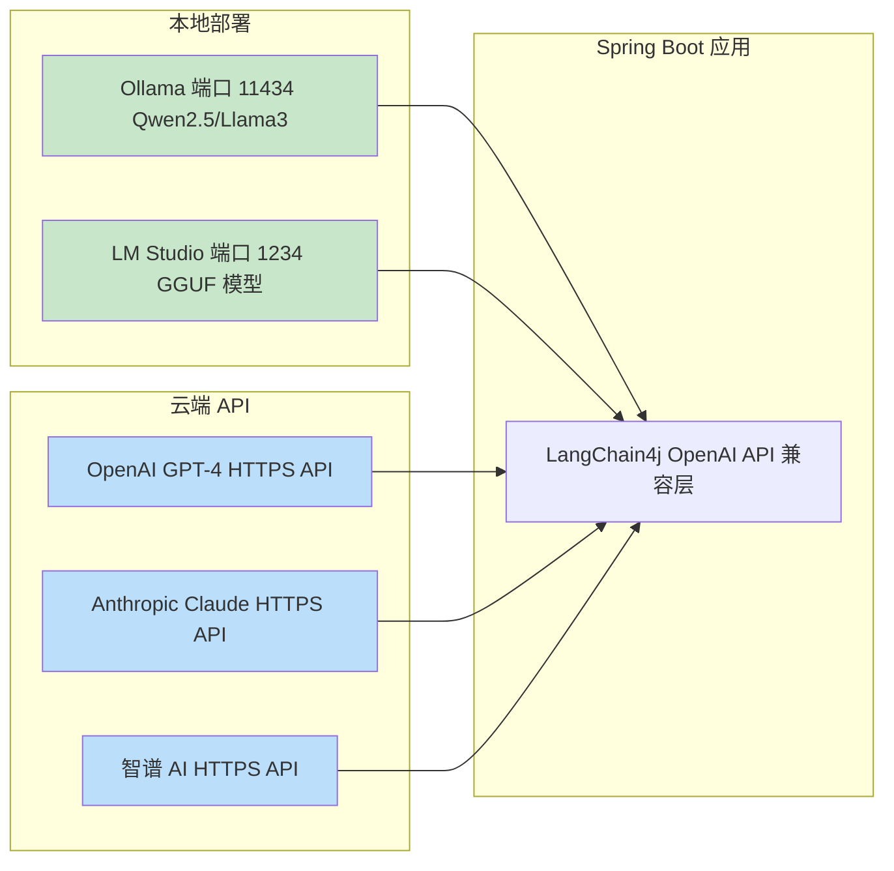

**配置示例**：

```yaml
# application.yml
lingshu:
  ai:
    # 本地 Ollama
    base-url: http://localhost:11434/v1
    model-name: qwen2.5:7b-instruct-q4_K_M
    api-key: ollama
    
    # 或 LM Studio
    # base-url: http://localhost:1234/v1
    # model-name: local-model
    # api-key: not-needed
    
    # 或 OpenAI GPT-4
    # base-url: https://api.openai.com/v1
    # model-name: gpt-4-turbo
    # api-key: ${OPENAI_API_KEY}
```

**优势**：

- ✅ **灵活性**：可在隐私优先（本地）和性能优先（云端）间切换
- ✅ **统一接口**：所有 LLM 使用相同的 API 抽象层
- ✅ **成本可控**：开发测试用本地，生产可用云端
- ✅ **渐进增强**：从本地开始，按需升级到商业 API

***

## 4. 模块划分与职责

### 4.1 系统模块全景图

```mermaid
graph TB
    subgraph ui_mod[用户交互模块]
        M1[Web 聊天界面 ChatView]
        M2[记忆图谱可视化 MemoryGraphView]
        M3[系统设置面板 SettingsView]
    end
    
    subgraph chat_mod[对话核心模块]
        M5[对话服务 ChatService]
        M6[Prompt 构建 PromptBuilderService]
        M7[ToolCall 执行 ToolEventListener]
        M8[流式响应 Reactor Flux]
    end
    
    subgraph mem_mod[记忆管理模块]
        M9[事实提取 EmotionAwareFactExtractor]
        M10[GAM-RAG 检索 MemoryService]
        M11[图谱维护 FactRepository]
        M12[向量存储 EmbeddingStore]
    end
    
    subgraph emotion_mod[情感计算模块]
        M13[情感分析 EmotionAnalyzer]
        M14[好感度管理 AffinityService]
        M15[关系阶段演化 UserState]
        M16[情感片段记忆 EmotionalEpisodeService]
    end
    
    subgraph tool_mod[工具扩展模块]
        M17[MCP Client McpService]
        M18[本地工具 LocalTools]
        M19[脚本执行器 StdioTransport]
    end
    
    subgraph proactive_mod[主动服务模块]
        M20[定时问候 ProactiveService]
        M21[消极情绪检测 EmotionMonitor]
        M22[事件触发器 ApplicationEventPublisher]
    end
    
    subgraph sys_mod[系统支撑模块]
        M23[日志追踪 SystemLogService]
        M24[配置管理 SettingService]
        M25[健康检查 SystemStatusController]
        M26[Agent 管理 AgentConfigService]
    end
    
    M1 --> M5
    M5 --> M6
    M5 --> M7
    M5 --> M9
    M5 --> M10
    M10 --> M11
    M10 --> M12
    M5 --> M13
    M5 --> M14
    M13 --> M16
    M14 --> M15
    M5 --> M17
    M17 --> M18
    M17 --> M19
    M20 --> M9
    M20 --> M13
    M20 --> M14
    M23 --> M5
    M23 --> M9
    M23 --> M10
    M24 --> M5
    M24 --> M17
    M25 --> M11
    M25 --> M17
    M5 --> M8
    
    style M5 fill:#ffcc80
    style M9 fill:#ffcc80
    style M10 fill:#ffcc80
    style M13 fill:#ffcc80
    style M14 fill:#ffcc80
    style M17 fill:#ffcc80
```

### 4.2 模块详细职责表

| 模块名称         | 核心类                  | 主要职责                              | 依赖数据库                         |
| :----------- | :------------------- | :-------------------------------- | :---------------------------- |
| **对话核心**     | `ChatService`        | 对话流程编排、Prompt 组装、ToolCall 路由、流式响应 | PostgreSQL (ChatMessage)      |
| **记忆管理**     | `MemoryService`      | 事实提取、GAM-RAG 检索、图谱节点去重、向量嵌入       | Neo4j + PostgreSQL (pgvector) |
| **情感计算**     | `AffinityService`    | 好感度增减、关系阶段升级、情感 Prompt 注入         | PostgreSQL (UserState)        |
| **情感分析**     | `EmotionAnalyzer`    | 文本情绪识别、强度计算、关键词提取                 | Ollama (LLM)                  |
| **工具扩展**     | `McpService`         | MCP Client 生命周期、工具调用代理、配置管理       | PostgreSQL (McpServerConfig)  |
| **主动服务**     | `ProactiveService`   | 定时任务调度、问候语生成、消极情绪干预               | PostgreSQL (UserState)        |
| **日志追踪**     | `SystemLogService`   | 全链路日志记录、Redis 实时推送、性能统计           | Redis (StringRedisTemplate)   |
| **配置管理**     | `SettingService`     | 系统参数 CRUD、TTS/ASR 地址、冷却时间配置       | PostgreSQL (SystemSetting)    |
| **Agent 管理** | `AgentConfigService` | 人格配置管理、Prompt 模板切换、默认 Agent 设置    | PostgreSQL (AgentConfig)      |

### 4.3 模块间调用关系

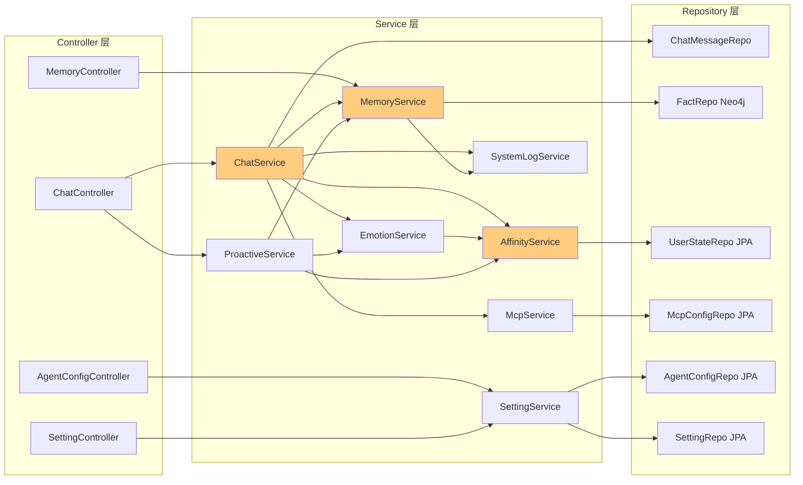

***

## 5. 接口设计

### 5.1 RESTful API 总览

```mermaid
graph TB
    subgraph chat_api[对话相关 API]
        A1[POST /api/chat 文本对话]
        A2[POST /api/chat/stream 流式对话]
        A3[GET /api/chat/history 历史消息]
        A4[DELETE /api/chat/history 清空历史]
        A5[POST /api/chat/proactive/trigger 触发问候]
    end
    
    subgraph mem_api[记忆管理 API]
        B1[GET /api/memory/graph 图谱数据]
        B2[GET /api/memory/facts 事实列表]
        B3[POST /api/memory/maintenance 记忆维护]
    end
    
    subgraph cfg_api[配置管理 API]
        C1[GET /api/settings 获取设置]
        C2[PUT /api/settings 更新设置]
        C3[GET /api/agents Agent 列表]
        C4[PUT /api/agents/{id}/default 设默认 Agent]
        C5[GET /api/mcp MCP 配置]
        C6[POST /api/mcp 添加 MCP]
    end
    
    subgraph sys_api[系统监控 API]
        D1[GET /api/system/status 服务状态]
        D2[GET /api/logs 日志 SSE]
        D3[DELETE /api/logs 清理日志]
    end
    
    subgraph voice_api[语音服务 API]
        E1[POST /api/tts/speak TTS 合成]
    end
    
    style A1 fill:#c8e6c9
    style A2 fill:#c8e6c9
    style B1 fill:#bbdefb
    style C1 fill:#fff9c4
    style D1 fill:#ffccbc
```

### 5.2 WebSocket 接口

| 端点         | 用途        | 消息格式                                               |
| :--------- | :-------- | :------------------------------------------------- |
| `/ws/chat` | 实时双向对话    | `{type: "message", content: "...", userId: "..."}` |
| `/ws/logs` | 日志实时推送    | `{type: "log", level: "INFO", message: "..."}`     |
| `/ws/tts`  | TTS 音频流传输 | Binary AAC/PCM 数据帧                                 |

### 5.3 核心接口示例

#### 5.3.1 流式对话接口

```java
// Controller 层
@PostMapping(value = "/stream", produces = MediaType.TEXT_EVENT_STREAM_VALUE)
public Flux<String> streamChat(
    @RequestBody ChatRequest request,
    @RequestHeader(value = "X-User-Id", defaultValue = "User") String userId
) {
    return chatService.streamChat(
        request.getMessage(),
        request.getAgentId(),
        userId,
        request.getModel(),
        request.getApiKey(),
        request.getBaseUrl()
    );
}

// Service 层
public Flux<String> streamChat(String message, Long agentId, String userId, ...) {
    // 1. 情感预分析
    EmotionContextResult emotionResult = emotionPreAnalysisService.analyzeBeforeResponse(...);
    
    // 2. 记忆检索
    String longTermContext = memoryService.retrieveContext(userId, message);
    
    // 3. Prompt 构建
    String systemPrompt = promptBuilderService.buildMergedSystemPrompt(...);
    
    // 4. 流式调用 LLM
    return statelessStreamingAssistant.chatFlux(systemPrompt, userPrompt, ...);
}
```

***

## 6. 核心流程设计

### 6.1 对话处理全流程

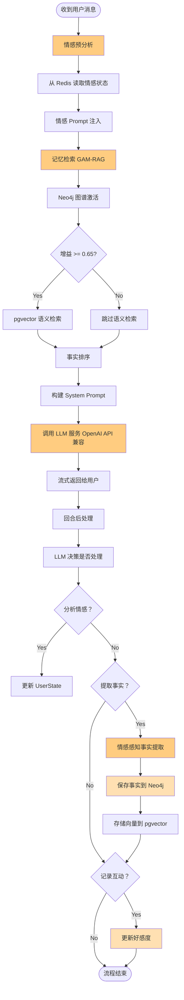

### 6.2 情感感知事实提取流程

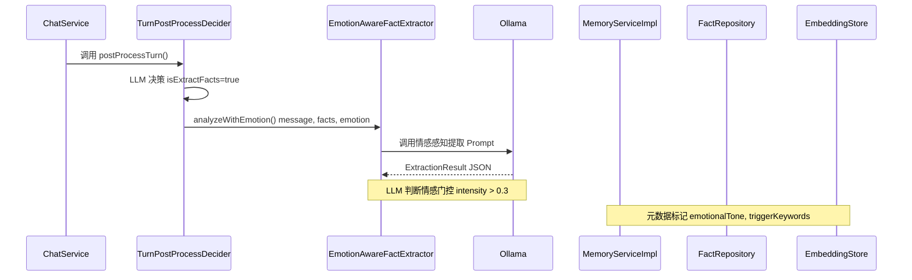

### 6.3 主动问候触发流程

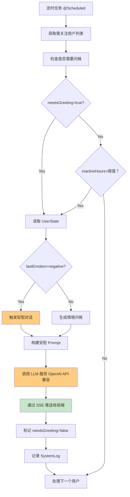

***

## 7. 数据库概要设计

### 7.1 数据库选型总览

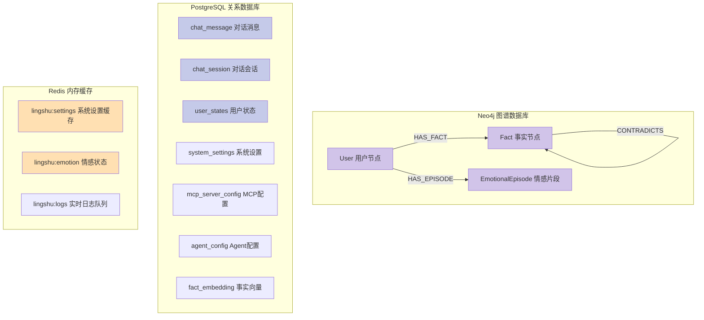

### 7.2 Neo4j 数据模型

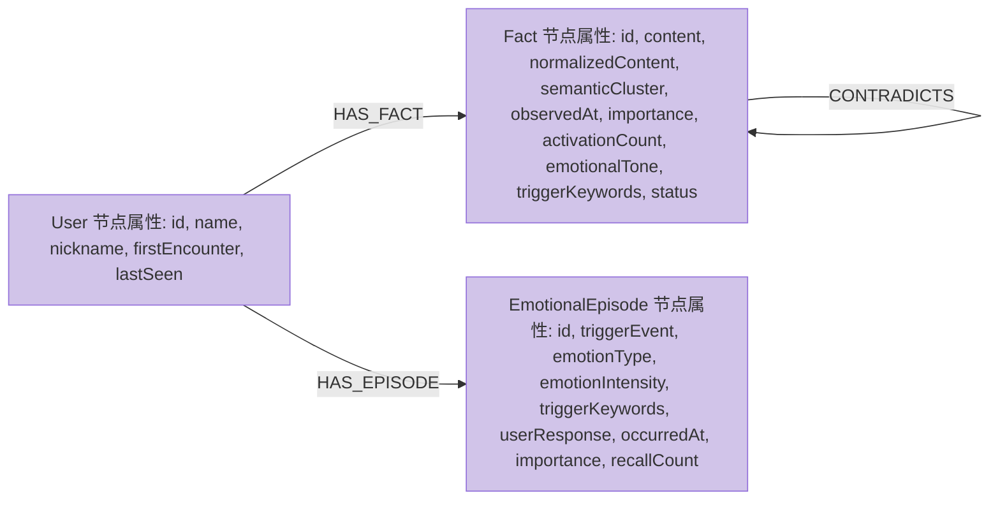

### 7.3 PostgreSQL 核心表结构

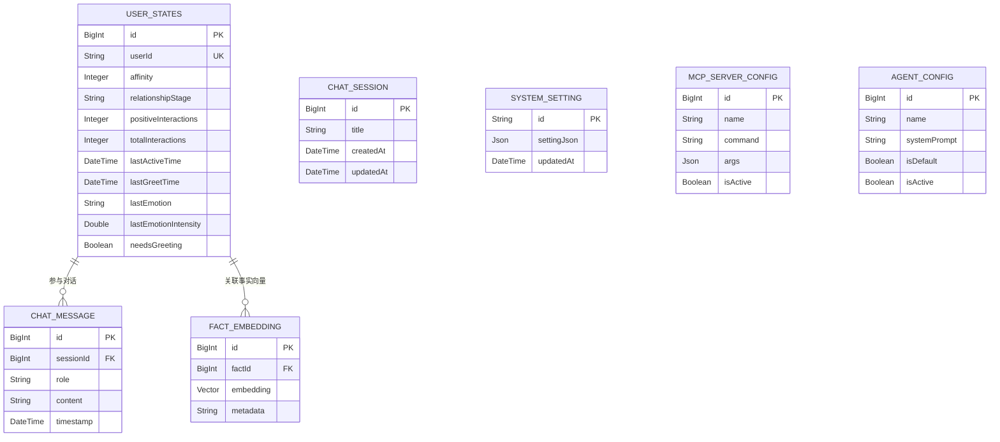

### 7.4 表关系详解

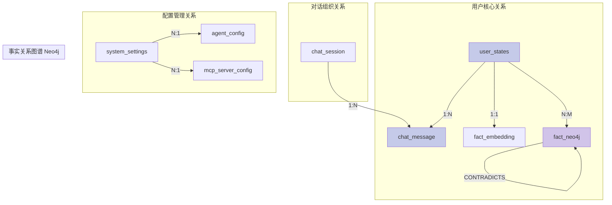

***

## 8. 运行环境设计

### 8.1 部署架构图

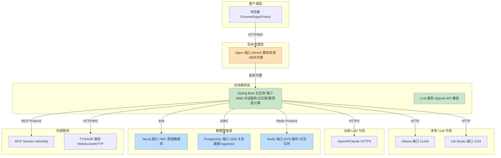

#### 8.2 硬件资源配置

| 组件      | 最低配置                     | 推荐配置              | 备注                                        |
| :------ | :----------------------- | :---------------- | :---------------------------------------- |
| **CPU** | 4 核                      | 8 核+              | 本地 LLM 需要 AVX2 指令集                        |
| **内存**  | 8GB                      | 16GB+             | Neo4j 堆内存建议 4GB                           |
| **显存**  | 6GB (本地 LLM)0GB (云端 API) | 8GB+ (本地)无要求 (云端) | Ollama 7B q4\_K\_M 约 6GB使用 GPT-4 无需本地 GPU |
| **硬盘**  | 50GB SSD                 | 100GB NVMe SSD    | Neo4j/PostgreSQL IO 密集                    |
| **网络**  | 千兆以太网                    | 万兆                | 内部服务通信，云端 API 需要公网                        |

### 8.3 中间件配置要点

#### 8.3.1 Neo4j 配置

```properties
# neo4j.conf
server.memory.heap.initial_size=2G
server.memory.heap.max_size=4G
server.memory.pagecache.size=2G
dbms.security.auth_enabled=true
```

#### 8.3.2 PostgreSQL 配置

```postgresql
# postgresql.conf
shared_buffers = 256MB
effective_cache_size = 1GB
maintenance_work_mem = 128MB
work_mem = 4MB
# pgvector 插件
shared_preload_libraries = 'vector'
```

#### 8.3.3 Redis 配置

```redis
# redis.conf
maxmemory 512mb
maxmemory-policy allkeys-lru
appendonly yes
appendfsync everysec
```

***

## 9. 安全、性能与扩展性设计

### 9.1 安全架构设计

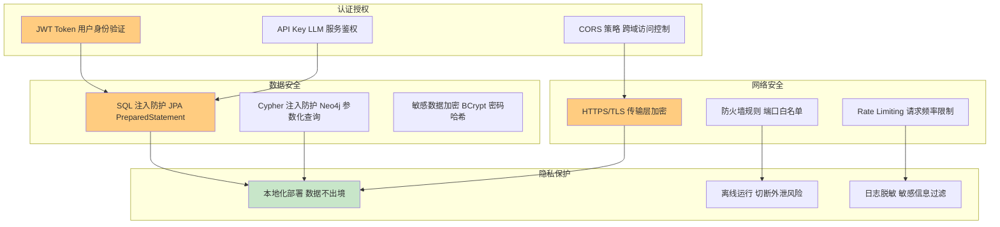

### 9.2 并发控制设计

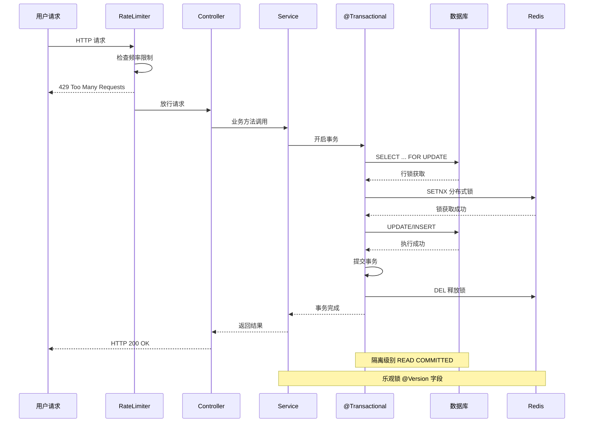

### 9.3 性能优化策略

```mermaid
mindmap
  root((性能优化))
    数据库优化
      Neo4j 索引
        全文索引
        复合索引
      pgvector 优化
        HNSW 索引
        相似度阈值过滤
      连接池
        HikariCP
        最大连接数 50
    缓存策略
      Redis 缓存
        系统设置
        情感状态
        日志队列
      本地缓存
        EmotionContextCache
        ConcurrentHashMap
    异步处理
      事实提取
        @Async 注解
        独立线程池
      SSE 推送
        Reactor Flux
        非阻塞 IO
    批量操作
      批量保存
        saveAll()
      批量删除
        DELETE IN
      批量更新
        UNWIND Cypher
```

### 9.4 扩展性设计方案

```mermaid
graph TB
    subgraph scale_up[垂直扩展 Scale Up]
        A1[增加 CPU 核心 提升 LLM 推理速度]
        A2[增加内存 扩大 Neo4j 堆内存]
        A3[升级 GPU 支持更大模型]
    end
    
    subgraph scale_out[水平扩展 Scale Out]
        B1[多实例部署 Spring Boot 集群]
        B2[Redis Cluster 分布式缓存]
        B3[Neo4j Causal Cluster 高可用图谱]
    end
    
    subgraph func_ext[功能扩展]
        C1[MCP 插件机制 热插拔工具]
        C2[Agent 配置化 多角色切换]
        C3[Prompt 模板化 动态风格调整]
    end
    
    subgraph data_ext[数据扩展]
        D1[分库分表 按用户 ID 分片]
        D2[读写分离 主从复制]
        D3[归档策略 冷数据迁移]
    end
    
    A1 --> B1
    A2 --> B2
    A3 --> B3
    B1 --> C1
    B2 --> C2
    B3 --> C3
    C1 --> D1
    C2 --> D2
    C3 --> D3
    
    style B1 fill:#c8e6c9
    style B2 fill:#c8e6c9
    style B3 fill:#c8e6c9
    style C1 fill:#ffcc80
    style C2 fill:#ffcc80
    style C3 fill:#ffcc80
```

### 9.5 权限控制设计

```mermaid
graph LR
    subgraph roles[角色定义]
        R1[Admin 系统管理员]
        R2[User 普通用户]
        R3[System 内部服务]
    end
    
    subgraph perms[权限矩阵]
        P1[对话管理 读/写]
        P2[记忆管理 读/写/删除]
        P3[配置管理 读/写]
        P4[MCP 管理 读/写/执行]
        P5[日志查看 读]
    end
    
    R1 --> P1
    R1 --> P2
    R1 --> P3
    R1 --> P4
    R1 --> P5
    
    R2 --> P1
    R2 --> P2
    R2 -.->|仅自己 | P5
    
    R3 --> P1
    R3 --> P2
    R3 --> P3
    R3 --> P4
    
    style R1 fill:#ffcc80
    style R2 fill:#ffe0b2
    style R3 fill:#c8e6c9
```

### 9.6 容错与降级策略

```mermaid
flowchart TD
    Start[请求进入] --> Validate{参数校验}
    Validate -->|失败| ReturnError[返回 400 Bad Request]
    Validate -->|成功| TryDB{数据库可用？}
    
    TryDB -->|否 | FallbackCache[降级到 Redis 缓存]
    FallbackCache --> CacheHit{缓存命中？}
    CacheHit -->|Yes| ReturnCache[返回缓存数据]
    CacheHit -->|No| ReturnError2[返回 503 Service Unavailable]
    
    TryDB -->|是 | ExecuteDB[执行数据库操作]
    ExecuteDB --> Success{执行成功？}
    Success -->|Yes| ReturnSuccess[返回 200 OK]
    Success -->|No| Retry{重试次数<3?}
    
    Retry -->|Yes| Wait[等待 100ms]
    Wait --> ExecuteDB
    Retry -->|No| CircuitBreaker[熔断器打开]
    CircuitBreaker --> LogError[记录错误日志]
    LogError --> ReturnError3[返回 500 Internal Error]
    
    style FallbackCache fill:#fff9c4
    style CircuitBreaker fill:#ffcc80
    style ReturnSuccess fill:#c8e6c9
```

***

## 附录

### A. 术语表

| 术语                    | 全称                               | 解释                            |
| :-------------------- | :------------------------------- | :---------------------------- |
| GAM-RAG               | Graph-Activated Memory Retrieval | 图谱激活 + 语义检索的混合记忆检索            |
| MCP                   | Model Context Protocol           | 模型上下文协议，工具调用标准                |
| GGUF                  | GPT-Generated Unified Format     | LLM 量化格式，降低显存占用               |
| SSE                   | Server-Sent Events               | 服务端推送技术，单向实时通信                |
| OpenAI API Compatible | OpenAI API 兼容协议                  | 支持 Ollama/LM Studio/GPT 等统一接口 |

### B. 参考文档

- [Spring Boot 官方文档](https://spring.io/projects/spring-boot)
- [LangChain4j 官方文档](https://docs.langchain4j.dev/)
- [Neo4j Cypher 查询语言](https://neo4j.com/docs/cypher-manual/current/)
- [pgvector GitHub 仓库](https://github.com/pgvector/pgvector)
- [Vue 3 官方文档](https://vuejs.org/)

***

**文档结束**
