# 灵枢 (LingShu-AI) 系统概要设计文档

## 1. 文档概述

### 1.1 文档目的

本文档旨在全面描述灵枢系统的整体架构设计、模块划分、核心功能实现及技术选型，为开发团队提供统一的技术参考。

### 1.2 项目背景

**灵枢** 取自中医经典《灵枢经》，意为"灵魂的枢纽"。项目愿景是从 0 到 1 打造一个具备长期记忆、情感演化与现实干预能力的本地化电子伴侣。

### 1.3 核心特性

- **长期记忆**：通过 Neo4j + pgvector 构建多级记忆系统
- **流式对话**：支持 SSE 流式输出，提升用户体验
- **本地化部署**：完全离线运行，保护数据隐私
- **工具调用**：集成本地工具，实现现实世界干预

---

## 2. 系统架构

### 2.1 整体架构图

```mermaid
flowchart TB
    subgraph Frontend["前端层 (Frontend)"]
        direction LR
        F1["对话界面<br/>(ResonanceView)"]
        F2["记忆中枢<br/>(MemoryHub)"]
        F2_1["  └─ 记忆图谱"]
        F2_2["  └─ 记忆流光"]
        F2_3["  └─ 记忆治理"]
        F3["系统设置<br/>(SettingsView)"]
        F4["日志监控<br/>(SystemLogView)"]
    end

    subgraph Web["接口层 (Web Layer) - lingshu-web"]
        direction LR
        W1["ChatController"]
        W2["MemoryController"]
        W3["SettingController"]
        W4["LogController"]
    end

    subgraph Core["核心层 (Core Layer) - lingshu-core"]
        direction LR
        C1["ChatService"]
        C2["MemoryService"]
        C3["SettingService"]
        C4["LocalTools"]
        C5["FactExtractor"]
        C6["SystemLogService"]
    end

    subgraph Infra["基础设施层 (Infrastructure) - lingshu-infrastructure"]
        direction LR
        I1["Entity<br/>(实体类)"]
        I2["Repository<br/>(数据访问)"]
        I3["Config<br/>(配置)"]
    end

    subgraph Storage["数据存储层"]
        direction LR
        S1[("PostgreSQL<br/>(关系数据 + 向量)")]
        S2[("Neo4j<br/>(图数据库)")]
        S3[("Ollama<br/>(LLM 推理引擎)")]
    end

    Frontend -->|"HTTP / SSE"| Web
    Web --> Core
    Core --> Infra
    Infra --> Storage

    style Frontend fill:#e3f2fd,stroke:#1565c0
    style Web fill:#fff8e1,stroke:#ff8f00
    style Core fill:#e8f5e9,stroke:#2e7d32
    style Infra fill:#fce4ec,stroke:#c2185b
    style Storage fill:#f3e5f5,stroke:#7b1fa2
```

### 2.2 技术栈总览

| 层级 | 技术选型 | 说明 |
|------|----------|------|
| **前端** | Vue 3 + Vite + Naive UI + Tailwind CSS | 响应式 UI，支持深色模式 |
| **接口层** | Spring Boot 3 + REST API | 提供 HTTP 接口与 SSE 流式响应 |
| **核心层** | LangChain4j + Java 21 | AI 服务编排，工具调用 |
| **瞬时记忆 (L1)** | PostgreSQL (ChatMessage表) | LangChain4j 托管，持久化历史窗口 |
| **长期记忆 (L2/L3)** | Neo4j + pgvector | 结构化事实与语义检索 |
| **推理引擎** | Ollama | 本地 LLM 推理 |

---

## 3. 模块划分

### 3.1 后端模块结构

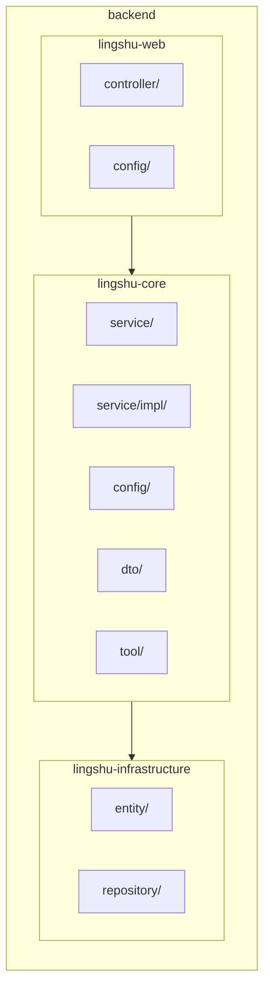

### 3.2 模块职责

| 模块 | 职责 | 关键类 |
|------|------|--------|
| **lingshu-web** | REST 接口暴露、请求路由 | ChatController, MemoryController |
| **lingshu-core** | 业务逻辑、AI 服务编排 | ChatService, MemoryService, LocalTools |
| **lingshu-infrastructure** | 数据实体、持久化访问 | UserNode, FactNode, ChatMessage |

---

## 4. 核心功能设计

### 4.1 对话系统

#### 4.1.1 功能描述

提供用户与灵枢的交互入口，支持同步和流式两种响应模式。

#### 4.1.2 流程图

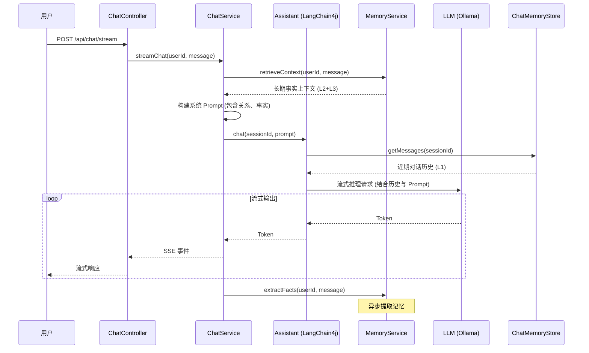

#### 4.1.3 接口定义

| 接口 | 方法 | 说明 |
|------|------|------|
| `/api/chat/send` | POST | 同步对话 |
| `/api/chat/stream` | POST | 流式对话 (SSE) |
| `/api/chat/welcome` | GET | 获取欢迎语 |
| `/api/chat/models` | GET | 获取可用模型列表 |

### 4.2 记忆系统

详见 [记忆系统设计文档](./记忆系统设计文档.md)。

### 4.3 记忆中枢

记忆中枢是灵枢系统的核心功能模块，整合了记忆图谱、记忆流光、记忆治理三大子功能，为用户提供全方位的记忆管理与可视化能力。

#### 4.3.1 功能架构

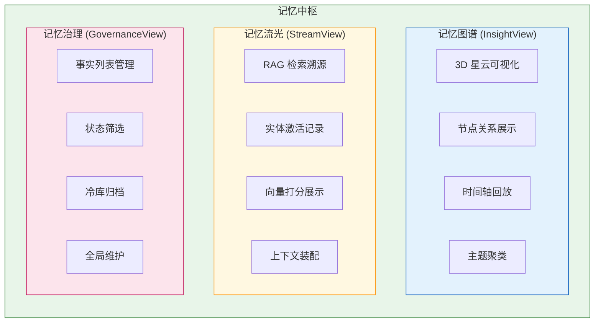

#### 4.3.2 记忆图谱 (InsightView)

**功能描述**

记忆图谱是灵枢记忆系统的可视化核心，采用 Three.js 构建 3D 星云效果，直观展示用户与 AI 之间的记忆关联网络。

**核心能力**

| 功能 | 说明 |
|------|------|
| 3D 可视化 | 使用 Three.js 渲染记忆节点，支持轨道控制与缩放 |
| 节点类型 | User（用户核心）、Topic（主题）、Fact（事实）三种节点 |
| 关系展示 | 通过连线展示 HAS_FACT、RELATED_TO 等关系 |
| 时间回放 | 支持按时间轴回放记忆形成过程 |
| 主题聚类 | 自动聚类相关事实，形成知识主题 |
| 活跃度筛选 | 按活跃度（active/stable/cool）过滤节点 |
| 时间筛选 | 支持 24h/7d/30d 时间范围筛选 |

**数据结构**

```typescript
interface GraphNode {
  id: string
  label: string
  type: 'User' | 'Topic' | 'Fact'
  importance?: number
  confidence?: number
  activityScore?: number
  cluster?: string
  lastActivatedAt?: string
}

interface GraphLink {
  source: string
  target: string
  type: string
  weight?: number
}
```

**接口定义**

| 接口 | 方法 | 说明 |
|------|------|------|
| `/api/memory/graph` | GET | 获取完整图谱数据 |
| `/api/memory/fact/{id}` | DELETE | 删除指定事实节点 |

#### 4.3.3 记忆流光 (StreamView)

**功能描述**

记忆流光是 RAG 检索过程的实时溯源面板，记录每一次记忆检索的完整链路，帮助用户理解 AI 如何从记忆库中召回相关信息。

**核心能力**

| 功能 | 说明 |
|------|------|
| 实时事件流 | 每 3 秒轮询最新检索事件 |
| GAM-RAG 图谱激活 | 展示实体提取与图谱节点激活 |
| 向量检索展示 | 显示语义匹配的分数与片段 |
| 上下文装配 | 展示最终注入对话的事实 ID |

**检索流程可视化**

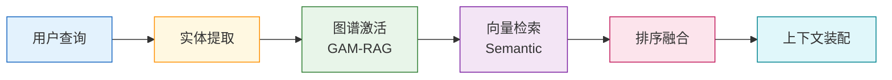

**数据结构**

```typescript
interface MemoryRetrievalEvent {
  query: string                    // 原始查询
  extractedEntities: string[]      // 提取的实体
  graphMatchedIds: number[]        // 图谱匹配的节点 ID
  semanticMatches: SemanticMatch[] // 向量匹配结果
  finalRankedIds: number[]         // 最终采纳的事实 ID
  timestamp: string                // 事件时间戳
}

interface SemanticMatch {
  factId: number | null
  score: number           // 相似度分数 0-1
  contentSnippet: string  // 内容片段
}
```

**接口定义**

| 接口 | 方法 | 说明 |
|------|------|------|
| `/api/memory/events` | GET | 获取检索事件列表 |

#### 4.3.4 记忆治理 (GovernanceView)

**功能描述**

记忆治理是记忆管理的后台面板，允许用户手动管理记忆实体的生命周期，包括查看、归档、删除等操作。

**核心能力**

| 功能 | 说明 |
|------|------|
| 事实列表 | 分页展示所有记忆事实 |
| 状态筛选 | 按状态（active/archived/deprecated）筛选 |
| 冷库归档 | 将低价值事实移入冷存储 |
| 全局维护 | 触发系统级记忆清理与优化 |

**事实状态流转**

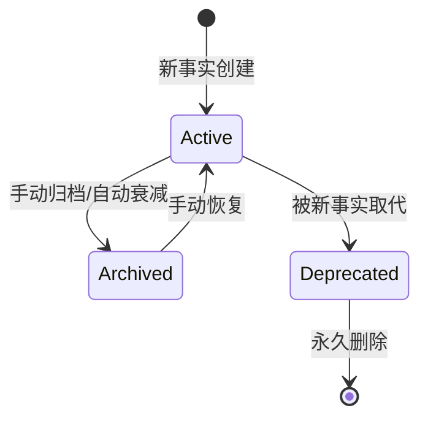

**数据结构**

```typescript
interface FactRecord {
  id: number
  content: string
  category: string
  status: 'active' | 'archived' | 'deprecated'
  importance: number
  confidence: number
  createdAt: string
  lastActivatedAt: string
}
```

**接口定义**

| 接口 | 方法 | 说明 |
|------|------|------|
| `/api/memory/facts` | GET | 分页获取事实列表 |
| `/api/memory/fact/{id}/archive` | PUT | 归档指定事实 |
| `/api/memory/maintenance` | POST | 触发全局维护 |

### 4.4 系统设置

#### 4.4.1 功能描述

管理 LLM 配置参数，支持动态切换模型和推理端点。

#### 4.4.2 配置项

| 配置项 | 类型 | 说明 |
|--------|------|------|
| `chatModel` | String | 对话模型名称 |
| `embeddingModel` | String | 嵌入模型名称 |
| `baseUrl` | String | 推理端点 URL |
| `apiKey` | String | API 密钥 (可选) |
| `source` | String | 来源 (ollama/openai) |

### 4.5 本地工具

#### 4.5.1 功能描述

通过 LangChain4j 的 Tool 机制，赋予灵枢操作本地系统的能力。

#### 4.5.2 已实现工具

| 工具名 | 功能 | 参数 |
|--------|------|------|
| `readLocalFile` | 读取本地文件 | `path`: 文件路径 |
| `executeCommand` | 执行终端命令 | `command`: 命令字符串 |

---

## 5. 数据模型设计

### 5.1 关系型数据

#### 5.1.1 ER 图

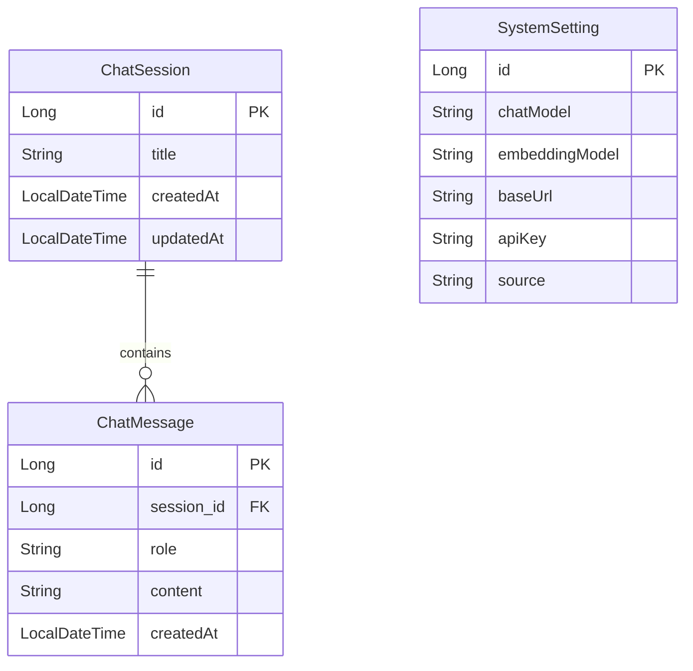

### 5.2 图数据 (Neo4j)

#### 5.2.1 节点关系图

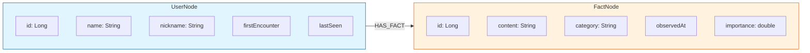

### 5.3 向量数据 (pgvector)

#### 5.3.1 memory_segments 表

| 字段 | 类型 | 说明 |
|------|------|------|
| `id` | UUID | 主键 |
| `embedding` | vector(4096) | 嵌入向量 |
| `text` | TEXT | 原始文本 |
| `metadata` | JSONB | 元数据 (含 fact_id) |

---

## 6. 接口设计

### 6.1 REST API 规范

#### 6.1.1 通用响应格式

```json
{
  "code": 200,
  "message": "success",
  "data": { ... }
}
```

#### 6.1.2 错误响应格式

```json
{
  "code": 500,
  "message": "Internal Server Error",
  "data": null
}
```

### 6.2 API 列表

#### 6.2.1 对话接口

**POST /api/chat/stream**

请求：
```json
{
  "message": "你好，灵枢"
}
```

响应：SSE 流式输出
```
data: 你好

data: ！

data: 我是

data: 灵枢

data: [DONE]
```

#### 6.2.2 记忆接口

**GET /api/memory/graph**

响应：
```json
{
  "nodes": [
    { "id": "user_User", "label": "User", "type": "User" },
    { "id": "fact_1", "label": "用户是 Java 开发者", "type": "Fact" }
  ],
  "links": [
    { "source": "user_User", "target": "fact_1", "type": "HAS_FACT" }
  ]
}
```

**DELETE /api/memory/fact/{id}**

删除指定事实节点。

#### 6.2.3 设置接口

**GET /api/setting**

获取当前系统设置。

**POST /api/setting**

保存系统设置。

---

## 7. 异步处理设计

### 7.1 线程池配置

```java
@Bean(name = "taskExecutor")
public Executor taskExecutor() {
    ThreadPoolTaskExecutor executor = new ThreadPoolTaskExecutor();
    executor.setCorePoolSize(5);
    executor.setMaxPoolSize(10);
    executor.setQueueCapacity(100);
    executor.setThreadNamePrefix("LingShuAsync-");
    executor.initialize();
    return executor;
}
```

### 7.2 异步任务

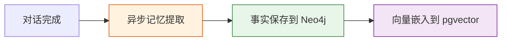

| 任务 | 触发时机 | 说明 |
|------|----------|------|
| 记忆提取 | 对话完成后 | 异步提取事实，不阻塞响应 |
| 向量嵌入 | 事实保存后 | 异步生成嵌入向量 |

---

## 8. 系统日志设计

### 8.1 日志类型

| 类型 | 标识 | 说明 |
|------|------|------|
| 对话日志 | CHAT | 对话相关操作 |
| 记忆日志 | MEMORY | 记忆提取/检索 |
| LLM 日志 | LLM | 模型调用 |
| 系统日志 | SYSTEM | 系统级操作 |
| 事实日志 | FACT | 事实提取 |

### 8.2 日志级别

- `info`: 常规操作信息
- `debug`: 调试信息
- `warn`: 警告信息
- `error`: 错误信息
- `success`: 成功信息

---

## 9. 部署架构

### 9.1 本地开发环境

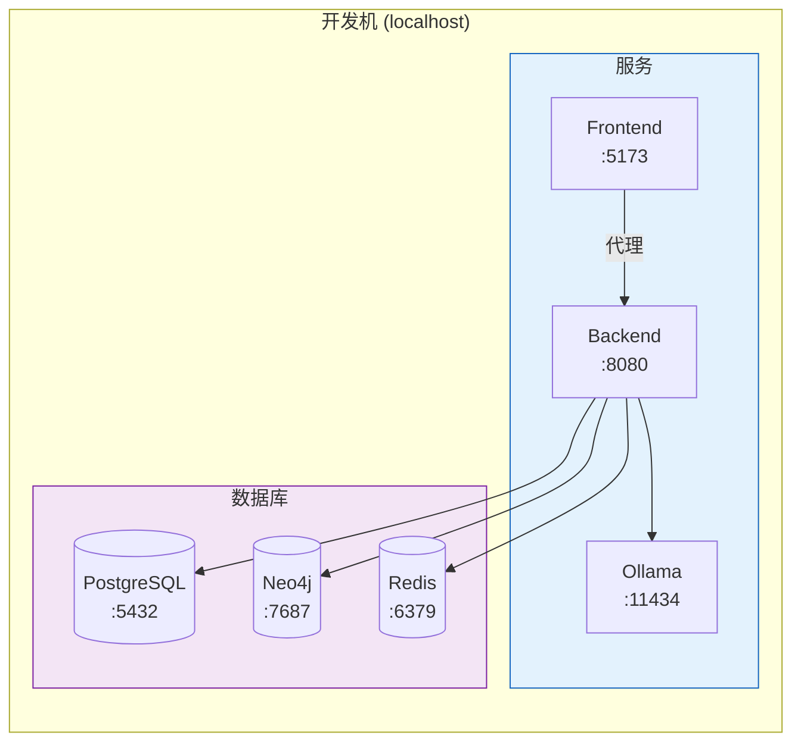

### 9.2 服务依赖

| 服务 | 端口 | 用途 |
|------|------|------|
| PostgreSQL | 5432 | 关系数据 + 向量存储 |
| Neo4j | 7687 | 图数据库 |
| Redis | 6379 | 缓存 (预留) |
| Ollama | 11434 | LLM 推理 |
| Backend | 8080 | 后端服务 |
| Frontend | 5173 | 前端开发服务器 |

---

## 10. 安全设计

### 10.1 本地化隐私

- 所有数据存储在本地，无云端传输
- LLM 推理完全离线运行
- 敏感配置 (API Key) 不记录日志

### 10.2 CORS 配置

```java
@CrossOrigin(origins = "*") // 开发环境允许所有来源
```

---

## 11. 扩展性设计

### 11.1 模型热切换

支持运行时切换 LLM 模型和推理端点：

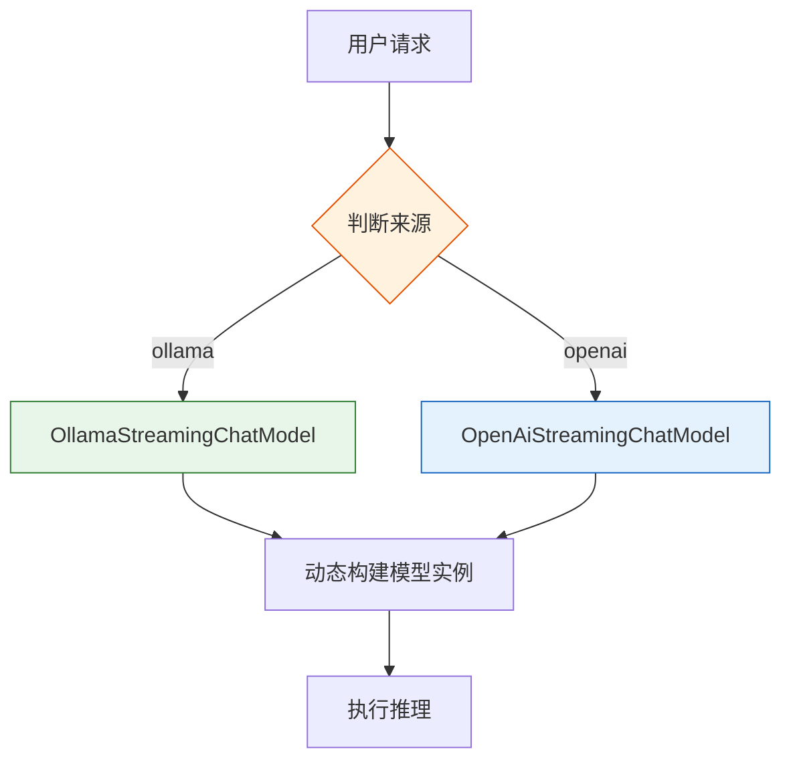

### 11.2 工具扩展

通过 LangChain4j 的 `@Tool` 注解可快速添加新工具：

```java
@Tool("Description of the tool")
public String newTool(String param) {
    // 工具实现
}
```

---

## 12. 未来规划

### 12.1 短期目标

- [ ] 完善记忆衰减机制
- [ ] 增加更多本地工具
- [ ] 优化前端记忆图谱可视化

### 12.2 中期目标

- [ ] 实现 MCP 协议支持
- [ ] 添加情感建模
- [ ] 集成 Langfuse 调用链追踪

### 12.3 长期目标

- [ ] 多模态感知接入
- [ ] 3D 记忆星云可视化
- [ ] 时间旅行调试功能

---

## 附录

### A. 配置文件示例

```yaml
# application.yml
spring:
  datasource:
    url: jdbc:postgresql://localhost:5432/lingshu
    username: postgres
    password: lingshu123
  neo4j:
    uri: bolt://localhost:7687
    authentication:
      username: neo4j
      password: lingshu123

lingshu:
  ollama:
    base-url: http://localhost:11434
    model: qwen3.5:4b
    embedding-model: qwen3-embedding:latest
```

### B. 依赖版本

| 依赖 | 版本 |
|------|------|
| Java | 21 |
| Spring Boot | 3.x |
| LangChain4j | Latest |
| Neo4j | 5.x |
| PostgreSQL | 15+ |
| Vue | 3.x |
