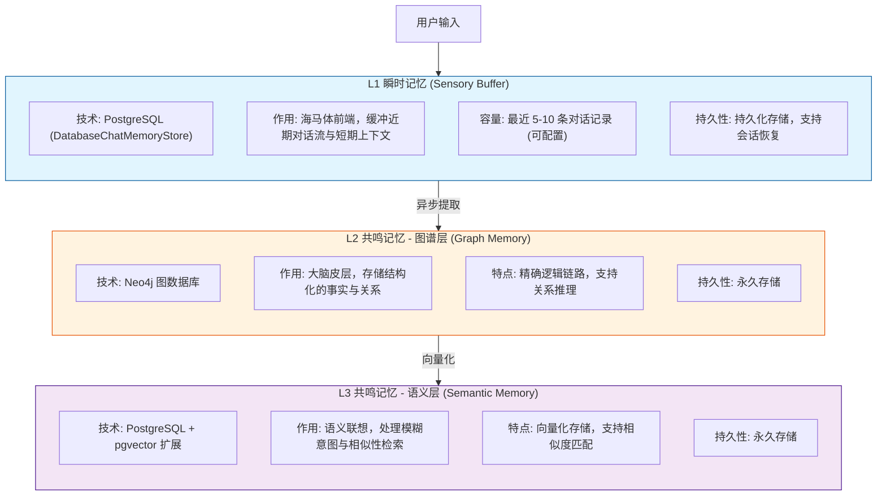
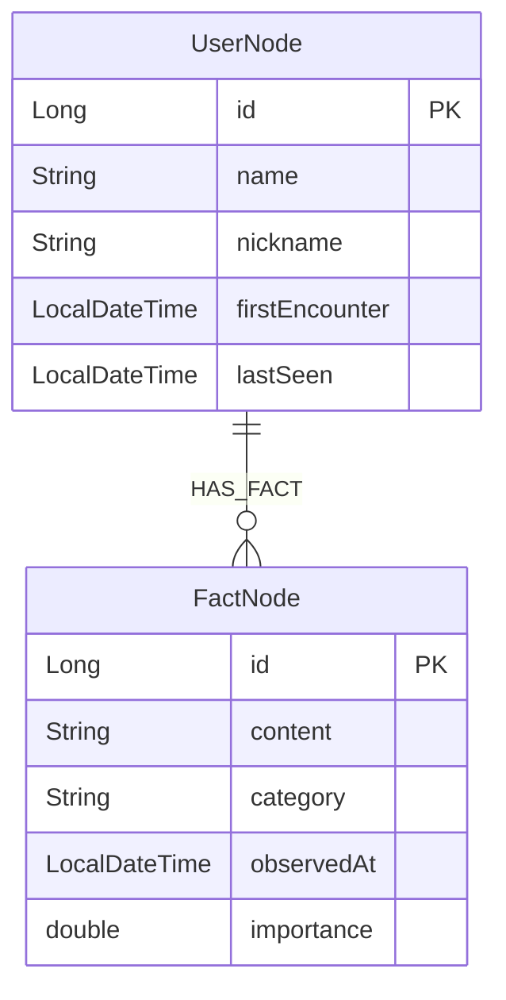
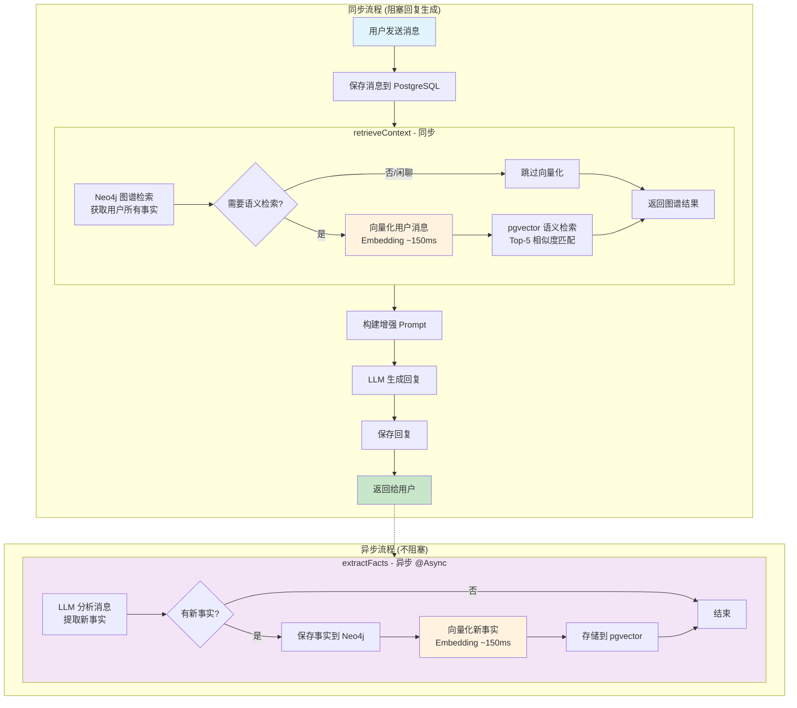
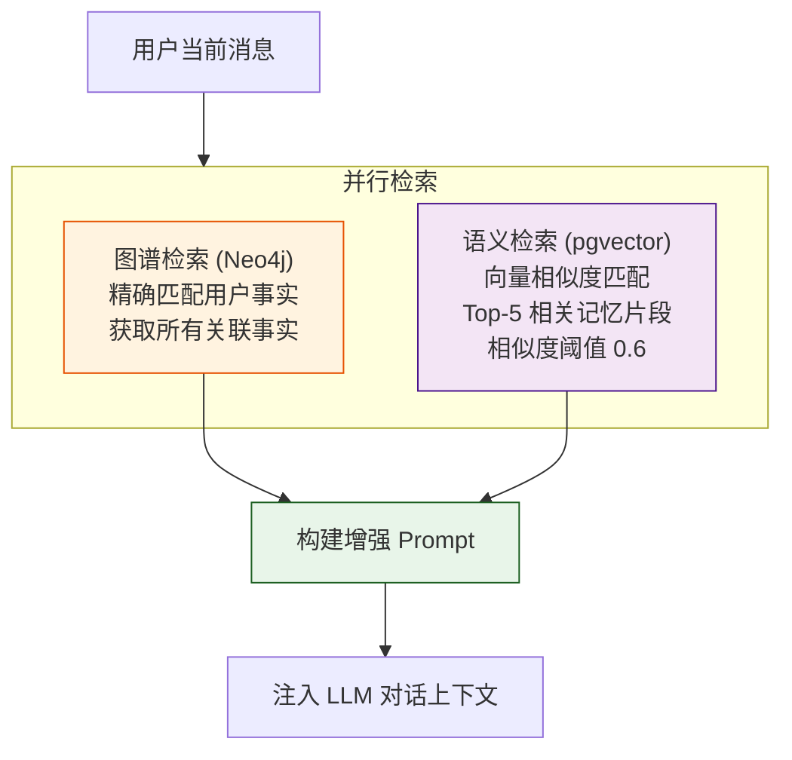

# 灵枢 (LingShu-AI) 记忆系统设计文档

## 1. 概述

### 1.1 设计理念

灵枢的记忆系统借鉴了人类大脑的记忆机制，构建了一套多层级、多模态的记忆架构。系统通过"感官记忆"感知用户，建立对用户的认知画像，实现真正的"认识你"而非简单的"记住你"。

### 1.2 核心概念：感官记忆

**感官记忆 (Sensory Memory)** 是灵枢对用户的认知总和。它不仅包含用户说过的话，更包含从对话中提取的事实、偏好、习惯、情感状态等结构化信息。

在代码实现中，感官记忆通过以下 Prompt 模板注入到对话上下文：

```
【感官记忆 - 长期 facts】
{longTermContext}

【近期对话流水】
{shortTermContext}

【当前指令】
{message}
```

---

## 2. 记忆层级架构

灵枢采用三级记忆架构，模拟人类大脑的信息处理流程：



### 2.1 L1 瞬时记忆

| 属性 | 说明 |
|------|------|
| **技术实现** | PostgreSQL + LangChain4j ChatMemory |
| **存储内容** | 近期对话流水 (基于 @MemoryId 分离) |
| **生命周期** | 持久化存储，支持跨会话/页面刷新恢复 |
| **检索方式** | 自动加载，由 LangChain4j 托管 |
| **代码位置** | `DatabaseChatMemoryStore.java` |

**关键实现**：
```java
// AiConfig.java 中定义的 ChatMemoryProvider
return (sessionId) -> MessageWindowChatMemory.builder()
        .id(sessionId)
        .maxMessages(10)
        .chatMemoryStore(chatMemoryStore)
        .build();
```

### 2.2 L2 图谱记忆

| 属性 | 说明 |
|------|------|
| **技术实现** | Neo4j 图数据库 |
| **存储内容** | 结构化事实节点 (FactNode) |
| **生命周期** | 永久存储，支持手动删除 |
| **检索方式** | 图遍历，按用户关联查询 |
| **代码位置** | `MemoryServiceImpl.java` - `retrieveContext()` |

**数据模型**：



### 2.3 L3 语义记忆

| 属性 | 说明 |
|------|------|
| **技术实现** | PostgreSQL + pgvector 扩展 |
| **存储内容** | 事实的向量嵌入 (Embedding) |
| **向量维度** | 4096 维 (适配 Qwen/Llama 模型) |
| **检索方式** | 余弦相似度匹配，Top-K 检索 |
| **相似度阈值** | 0.6 |
| **代码位置** | `MemoryServiceImpl.java` - `embeddingStore` |

**检索参数**：
```java
List<EmbeddingMatch<TextSegment>> matches = embeddingStore.findRelevant(queryEmbedding, 5, 0.6);
```

---

## 3. 记忆操作流程

### 3.1 记忆提取 (Fact Extraction)

当用户发送消息时，系统异步执行记忆提取流程：



**代码实现** (`MemoryServiceImpl.java`)：

```java
@Async("taskExecutor")
@Override
public void extractFacts(String userId, String message) {
    UserNode user = userRepository.findByName(userId).orElse(null);
    MemoryUpdate report = factExtractor.analyze(message, currentFactsBuilder.toString());
    
    for (Long id : report.getDeletedFactIds()) {
        this.deleteFact(id);
    }
    
    for (String fact : report.getNewFacts()) {
        FactNode factNode = FactNode.builder()
            .content(fact)
            .category("Memory")
            .observedAt(LocalDateTime.now())
            .importance(0.8)
            .build();
        user.addFact(factNode);
        userRepository.save(user);
        
        Embedding embedding = embeddingModel.embed(segment).content();
        embeddingStore.add(embedding, segment);
    }
}
```

### 3.2 记忆检索 (Context Retrieval)

记忆检索采用 **混合检索 (Hybrid RAG)** 策略：



**代码实现** (`MemoryServiceImpl.java`)：

```java
@Override
public String retrieveContext(String userId, String message) {
    StringBuilder contextBuilder = new StringBuilder();
    
    userRepository.findByName(userId).ifPresent(user -> {
        contextBuilder.append("Known facts from your profile: ");
        user.getFacts().forEach(f -> contextBuilder.append(f.getContent()).append("; "));
    });
    
    Embedding queryEmbedding = embeddingModel.embed(message).content();
    List<EmbeddingMatch<TextSegment>> matches = embeddingStore.findRelevant(queryEmbedding, 5, 0.6);
    
    if (!matches.isEmpty()) {
        contextBuilder.append("Related memories found: ");
        matches.forEach(match -> {
            contextBuilder.append(match.embedded().text()).append(" (relevant); ");
        });
    }
    
    return contextBuilder.toString();
}
```

### 3.3 记忆修正 (Memory Correction)

系统支持动态修正过时或错误的事实：

```java
@Override
public void deleteFact(Long factId) {
    factRepository.deleteById(factId);
    embeddingStore.removeAll(MetadataFilterBuilder.metadataKey("fact_id").isEqualTo(factId.toString()));
}
```

---

## 4. 记忆类型分类

### 4.1 按内容分类

| 类型 | 说明 | 示例 |
|------|------|------|
| **身份信息** | 用户的姓名、职业、身份 | "用户是一名 Java 开发者" |
| **偏好信息** | 用户的喜好、习惯 | "用户喜欢使用 IntelliJ IDEA" |
| **项目信息** | 用户参与的项目 | "用户正在开发 BIO-CLOUD 项目" |
| **情感状态** | 用户的情绪记录 | "用户今天感到疲惫" |
| **技术背景** | 用户的技术栈 | "用户熟悉 Spring Boot 和 Neo4j" |

### 4.2 按时效性分类

| 类型 | 存储位置 | 生命周期 |
|------|----------|----------|
| **瞬时记忆** | 内存/Redis | 会话级别 |
| **短期记忆** | PostgreSQL (ChatMessage) | 持久化，可清理 |
| **长期记忆** | Neo4j + pgvector | 永久存储 |

---

## 5. 技术实现细节

### 5.1 核心接口

```java
public interface MemoryService {
    void extractFacts(String userId, String message);
    String retrieveContext(String userId, String message);
    Object getGraphData(String userId);
    void deleteFact(Long factId);
}
```

### 5.2 事实提取器

使用 LangChain4j 的 AiServices 构建：

```java
interface FactExtractor {
    @SystemMessage("""
        你是一个认知事实提取器。分析用户输入，提取关于用户的持久化事实。
        同时检测与已有事实的冲突，如果发现矛盾，标记需要删除的旧事实。
        """)
    MemoryUpdate analyze(@UserMessage String message, @UserMessage String existingFacts);
}
```

### 5.3 向量存储配置

```yaml
lingshu:
  ollama:
    base-url: http://localhost:11434
    model: qwen3.5:4b
    embedding-model: qwen3-embedding:latest
```

```java
@Bean
public EmbeddingStore<TextSegment> embeddingStore() {
    return PgVectorEmbeddingStore.builder()
        .host("localhost")
        .port(5432)
        .database("lingshu")
        .table("memory_segments")
        .dimension(4096)
        .build();
}
```

---

## 6. 记忆可视化

### 6.1 图谱数据接口

```java
@Override
public Object getGraphData(String userId) {
    Map<String, Object> graph = new HashMap<>();
    List<Map<String, Object>> nodes = new ArrayList<>();
    List<Map<String, Object>> links = new ArrayList<>();
    
    userRepository.findAll().forEach(user -> {
        nodes.add(Map.of("id", "user_" + user.getName(), "label", user.getName(), "type", "User"));
        
        user.getFacts().forEach(fact -> {
            nodes.add(Map.of("id", "fact_" + fact.getId(), "label", fact.getContent(), "type", "Fact"));
            links.add(Map.of("source", "user_" + user.getName(), "target", "fact_" + fact.getId()));
        });
    });
    
    return graph;
}
```

### 6.2 前端可视化

前端使用 D3.js 或 Vis-network 渲染力导向图，展示记忆拓扑结构。

---

## 7. 未来扩展

### 7.1 记忆衰减机制

计划引入基于时间的记忆衰减算法，自动降低长期未访问事实的重要性权重。

### 7.2 情感记忆建模

扩展 FactNode 的 category 字段，增加情感维度，记录用户的情绪变化轨迹。

### 7.3 记忆压缩与摘要

对于大量相似事实，实现自动聚类与摘要，减少存储冗余。

---

## 8. 总结

灵枢的记忆系统通过"感官记忆"这一核心概念，将用户认知建模为多层级、多模态的记忆网络。L1 瞬时记忆保证对话连贯性，L2 图谱记忆提供精确的事实关联，L3 语义记忆支持模糊意图匹配。这种混合检索架构 (Hybrid RAG) 是当前解决大模型"幻觉"问题的核心方案。
