# LingShu-AI 项目架构文档

> 灵枢 (LingShu-AI) - 一个具备长期记忆能力的本地化电子伴侣系统

---

## 一、系统整体架构

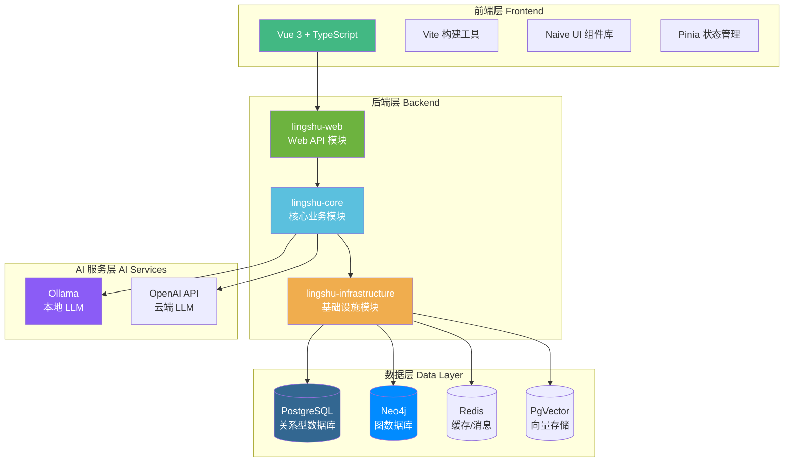

---

## 二、后端模块依赖关系

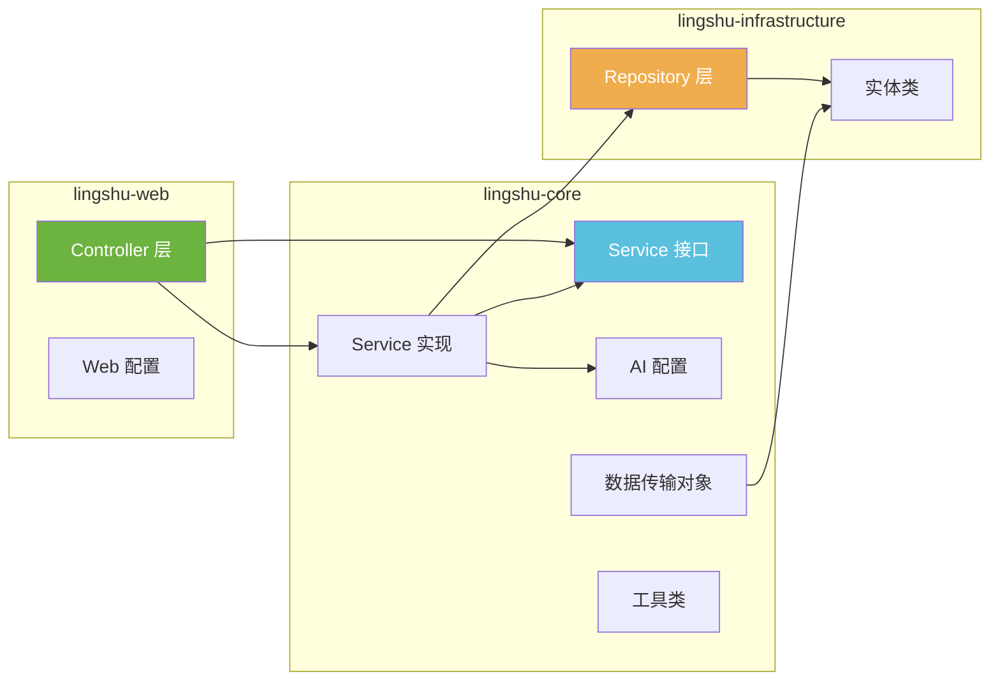

---

## 三、核心服务架构

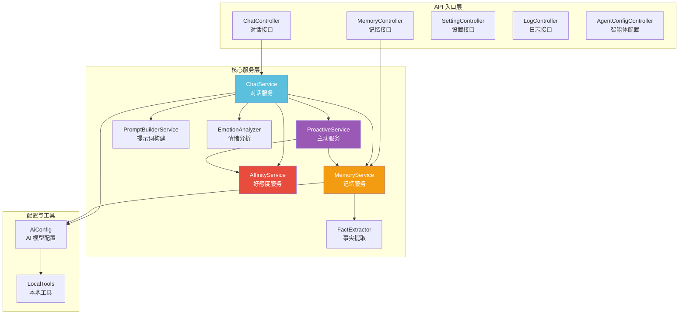

---

## 四、对话处理流程

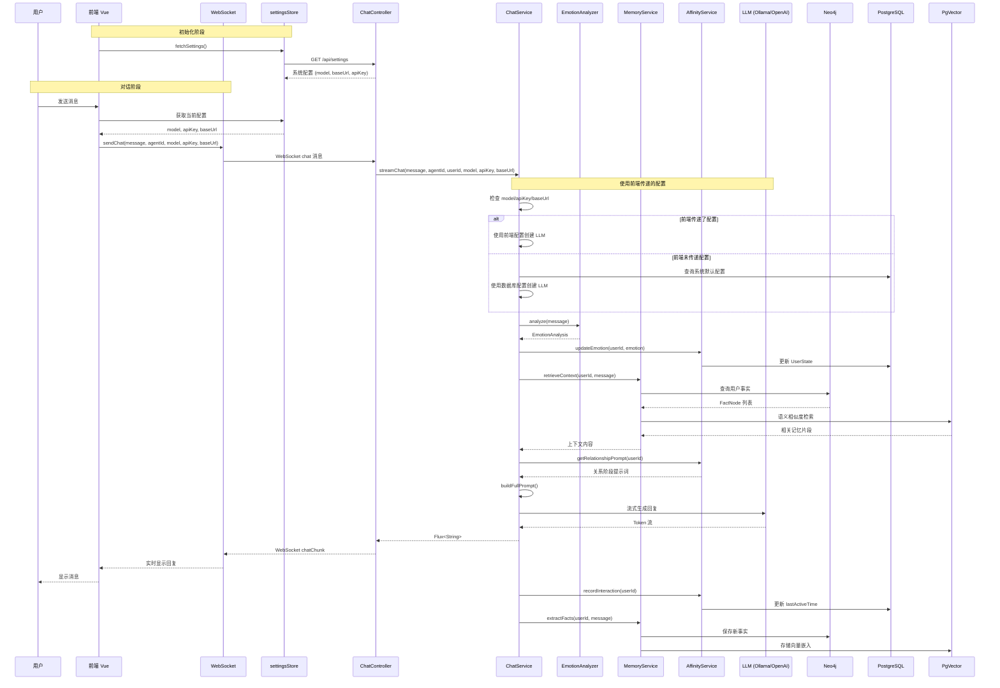

---

## 五、记忆系统架构 (GAM-RAG)

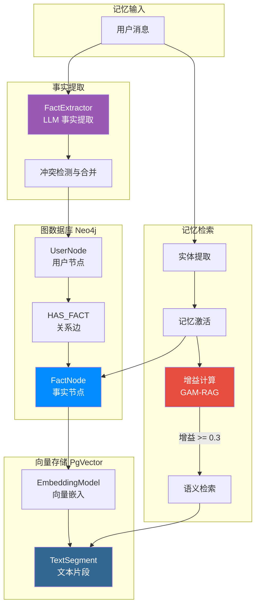

---

## 六、好感度与关系系统

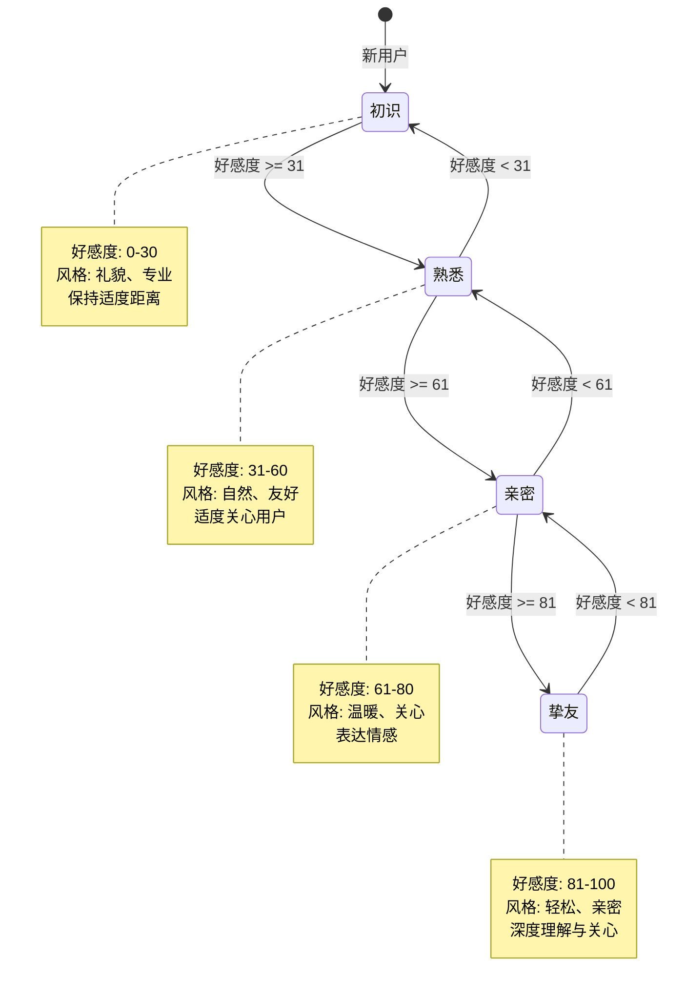

---

## 七、主动服务系统

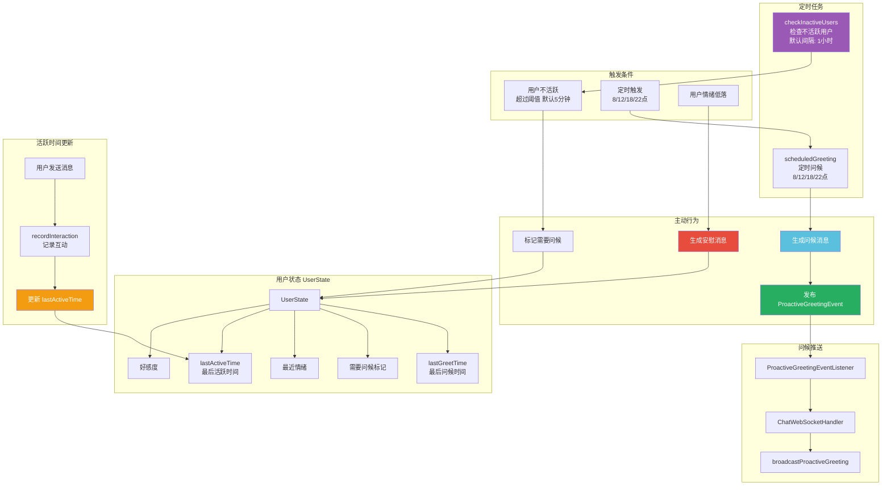

### 7.1 用户活跃时间更新机制

| 触发点 | 方法 | 说明 |
|--------|------|------|
| 用户发送聊天消息 | `ChatService.streamChat()` | 调用 `recordInteraction()` |
| 好感度增加 | `AffinityService.increaseAffinity()` | 更新 `lastActiveTime` |
| 好感度减少 | `AffinityService.decreaseAffinity()` | 更新 `lastActiveTime` |
| 记录互动 | `AffinityService.recordInteraction()` | 更新 `lastActiveTime` 并重置 `inactiveHours` |

### 7.2 主动问候触发流程

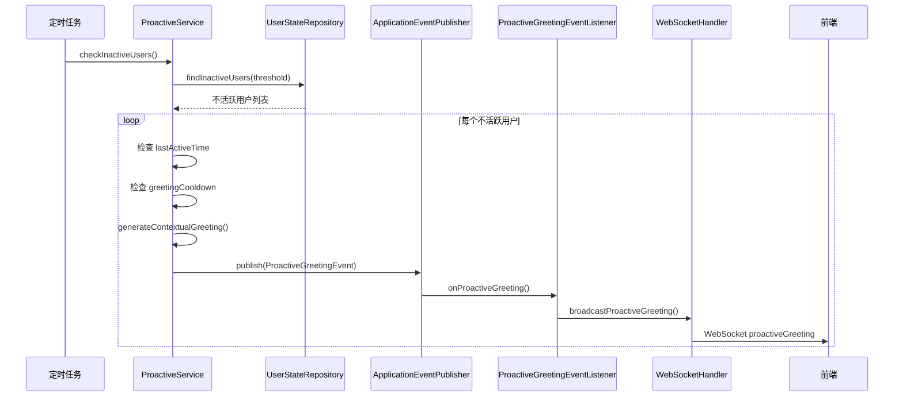

---

## 八、前端架构

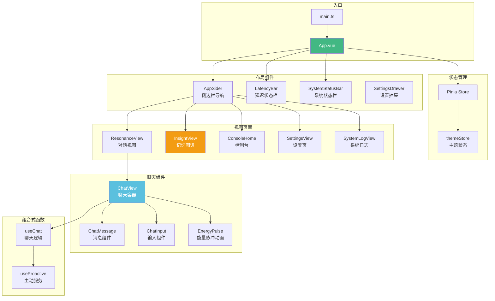

---

## 九、数据库设计

### 9.1 PostgreSQL 表结构

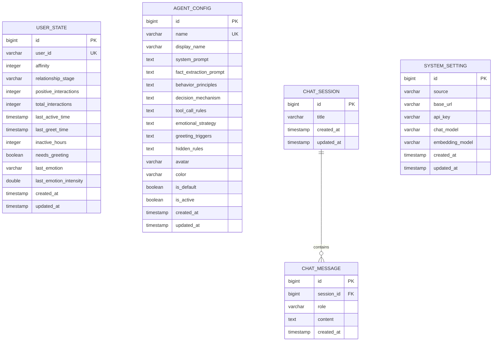

### 9.2 Neo4j 图数据库

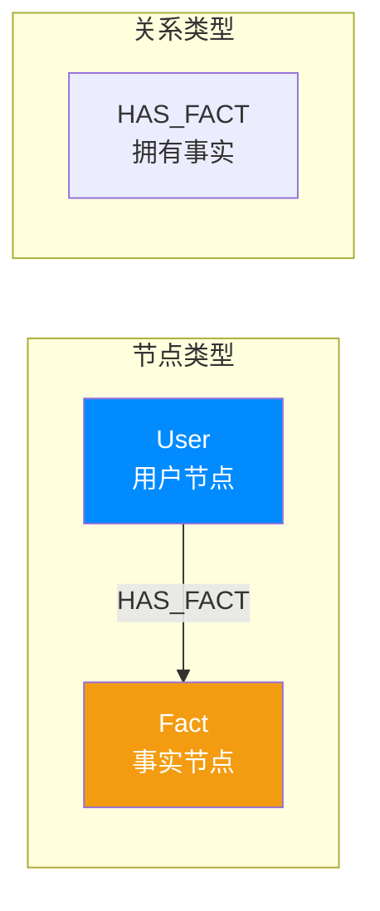

**User 节点属性:**
| 属性 | 类型 | 说明 |
|------|------|------|
| id | Long | 节点ID |
| name | String | 用户标识 |
| nickname | String | 用户昵称 |
| firstEncounter | LocalDateTime | 首次相遇时间 |
| lastSeen | LocalDateTime | 最后活跃时间 |

**Fact 节点属性:**
| 属性 | 类型 | 说明 |
|------|------|------|
| id | Long | 节点ID |
| content | String | 事实内容 |
| category | String | 分类 (Memory/Work/Preference 等) |
| observedAt | LocalDateTime | 观察时间 |
| importance | double | 重要程度 (0.0-1.0) |

---

## 十、技术栈总览

### 后端技术栈

| 技术 | 版本 | 用途 |
|------|------|------|
| Java | 21 | 编程语言 (虚拟线程支持) |
| Spring Boot | 3.2.4 | 应用框架 |
| LangChain4j | 0.35.0 | LLM 应用框架 |
| Spring Data JPA | - | 关系型数据访问 |
| Spring Data Neo4j | - | 图数据库访问 |
| PostgreSQL | - | 主数据库 |
| Neo4j | - | 图数据库 (记忆存储) |
| PgVector | - | 向量存储 (语义检索) |
| Redis | - | 缓存/消息队列 |
| Lombok | 1.18.30 | 代码简化 |

### 前端技术栈

| 技术 | 版本 | 用途 |
|------|------|------|
| Vue | 3.5.30 | 前端框架 |
| TypeScript | 5.9.3 | 类型安全 |
| Vite | 6.0.0 | 构建工具 |
| Pinia | 3.0.4 | 状态管理 |
| Naive UI | 2.44.1 | UI 组件库 |
| Tailwind CSS | 4.2.2 | 样式框架 |
| Axios | 1.13.6 | HTTP 客户端 |
| Neovis.js | 2.1.0 | Neo4j 可视化 |
| Lucide Vue | 0.577.0 | 图标库 |
| Markdown-it | 14.1.1 | Markdown 渲染 |

### AI/LLM 支持

| 提供商 | 用途 |
|--------|------|
| Ollama | 本地 LLM (默认 qwen3.5:4b) |
| OpenAI API | 云端 LLM (兼容端点) |
| 本地 Embedding | 向量嵌入 (qwen3-embedding) |

---

## 十一、API 接口概览

### 对话接口

| 方法 | 路径 | 说明 |
|------|------|------|
| POST | /api/chat/send | 同步对话 |
| POST | /api/chat/stream | 流式对话 (SSE) |
| GET | /api/chat/welcome | 欢迎消息 (SSE) |
| GET | /api/chat/history | 历史消息 |
| GET | /api/chat/models | 获取可用模型 |

### 记忆接口

| 方法 | 路径 | 说明 |
|------|------|------|
| GET | /api/memory/graph | 获取记忆图谱 |
| DELETE | /api/memory/fact/{id} | 删除事实节点 |

### 主动服务接口

| 方法 | 路径 | 说明 |
|------|------|------|
| GET | /api/chat/proactive/greeting | 生成问候 (SSE) |
| GET | /api/chat/proactive/comfort | 生成安慰 (SSE) |
| GET | /api/chat/proactive/attention | 需关注的用户 |
| POST | /api/chat/proactive/mark | 标记问候 |
| POST | /api/chat/proactive/trigger | 触发主动问候 |

### 设置接口

| 方法 | 路径 | 说明 |
|------|------|------|
| GET | /api/settings | 获取系统设置 |
| PUT | /api/settings | 更新系统设置 |

---

## 十二、核心设计理念

### 1. 多级记忆系统
- **短期记忆**: PostgreSQL 存储对话历史
- **长期记忆**: Neo4j 图数据库存储用户事实
- **语义记忆**: PgVector 向量存储实现语义检索

### 2. GAM-RAG (增益自适应记忆检索)
通过实体激活和增益计算，智能决定是否进行语义检索，避免不必要的向量查询开销。

### 3. 关系演进系统
基于好感度的四阶段关系模型，影响 AI 的交流风格和行为模式。

### 4. 主动服务机制
定时任务检测用户状态，主动发起问候或安慰，增强陪伴感。

### 5. 模块化智能体配置
支持多智能体配置，每个智能体拥有独立的系统提示词、行为原则和情感策略。

---

## 十三、部署架构

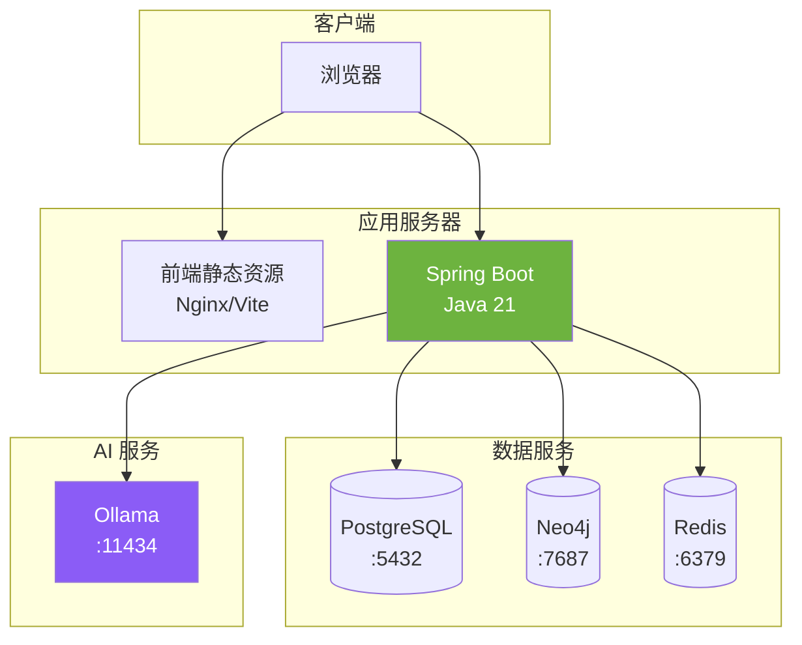

---

*文档生成时间: 2025-03-21*
*项目版本: 0.0.1-SNAPSHOT*
