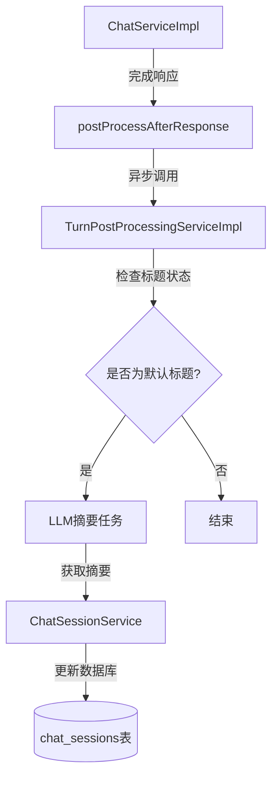

# Design: 聊天对话标题异步摘要设计

## 1. 系统架构

本功能采用异步处理模式，集成在现有的回合后处理流水线中。

### 数据流图

## 2. 接口变动

### 后端方法签名更新
- `ChatService.streamChat`: 增加 `sessionId` 可选参数传递给后处理方法。
- `TurnPostProcessingService.processCompletedTurn`:
  - 增加 `Long sessionId` 参数。

## 3. 详细设计

### 3.1 触发点 (Trigger)
在 `TurnPostProcessingServiceImpl` 中，通过检查 `ChatSession` 实体。
如果 `title` 匹配正则表达式 `^新对话 \d+$` 且该会话的消息总数为 2（1个用户消息 + 1个助手响应），则判定为需要摘要。

### 3.2 摘要逻辑 (Summarization)
使用一个专门的 `AiService` 或复用现有的轻量级模型调用：
- **Prompt**: `请根据以下用户的第一条对话内容，生成一个极其简短（2-5个中文汉字）的标题，用于对话列表展示。直接输出标题内容，不要包含标点符号或额外解释。用户内容：{{userMessage}}`
- **模型**: 优先使用 `gpt-3.5-turbo` 或同等级的小模型。

### 3.3 并发与容错
- 使用现有的 `@Async("taskExecutor")` 线程池。
- 若摘要失败，保持原有标题，不中断程序，记录错误日志。

## 4. UI 联动
前端侧边栏在检测到会话列表刷新时，将展示更新后的标题。
